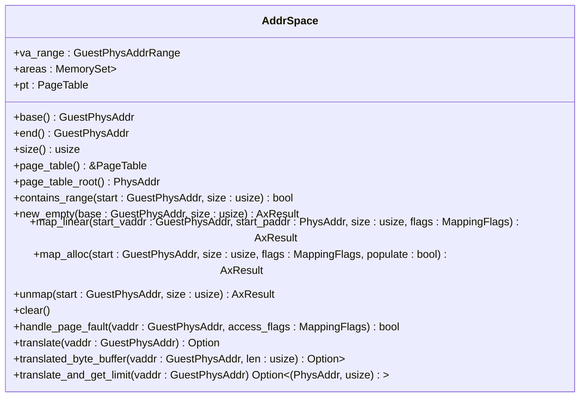
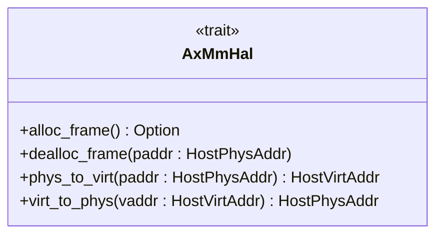
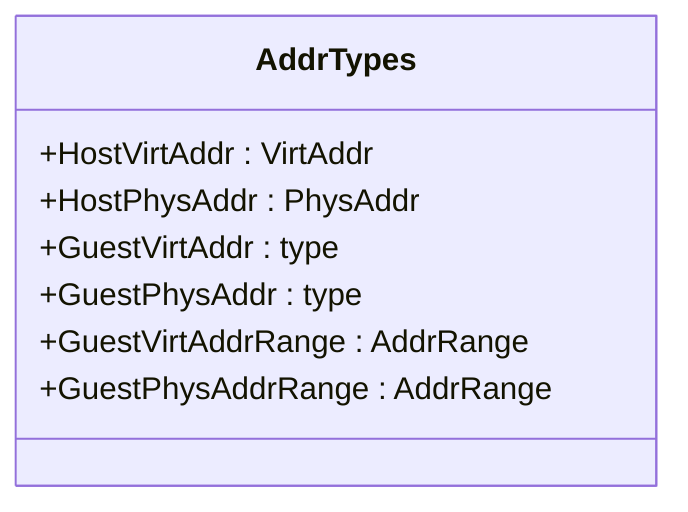
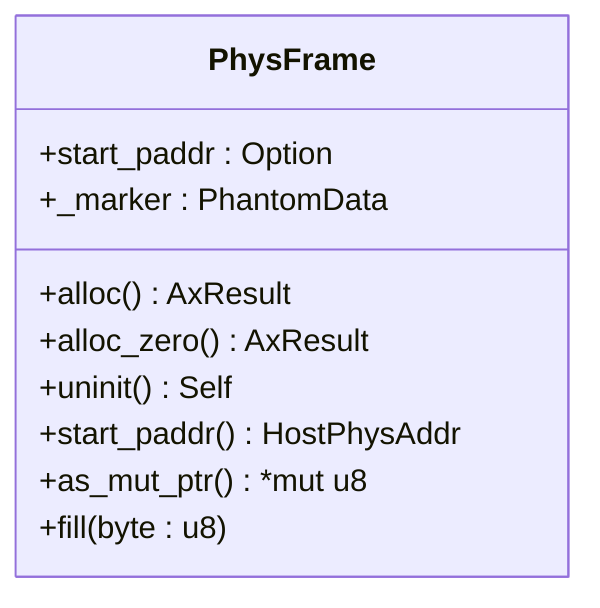
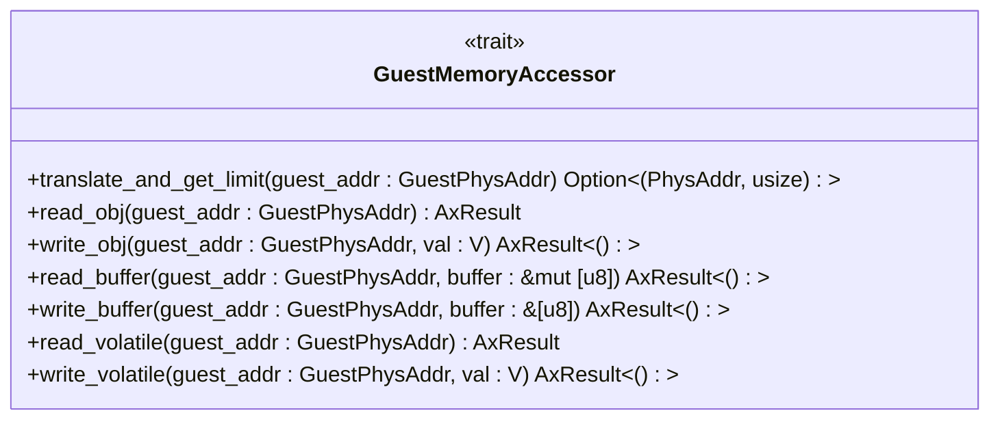

# API参考

<cite>
**本文档中引用的文件**  
- [lib.rs](file://src/lib.rs)
- [address_space/mod.rs](file://src/address_space/mod.rs)
- [address_space/backend/mod.rs](file://src/address_space/backend/mod.rs)
- [address_space/backend/linear.rs](file://src/address_space/backend/linear.rs)
- [address_space/backend/alloc.rs](file://src/address_space/backend/alloc.rs)
- [npt/mod.rs](file://src/npt/mod.rs)
- [hal.rs](file://src/hal.rs)
- [addr.rs](file://src/addr.rs)
- [frame.rs](file://src/frame.rs)
- [memory_accessor.rs](file://src/memory_accessor.rs)
</cite>

## 目录
1. [简介](#简介)
2. [核心类型](#核心类型)
3. [地址空间模块](#地址空间模块)
4. [后端模块](#后端模块)
5. [嵌套页表模块](#嵌套页表模块)
6. [硬件抽象层](#硬件抽象层)
7. [地址类型](#地址类型)
8. [物理帧管理](#物理帧管理)
9. [内存访问器](#内存访问器)

## 简介
`axaddrspace` 是 ArceOS-Hypervisor 的虚拟机地址空间管理模块，提供对虚拟机内存的映射、翻译和访问控制功能。该模块支持线性映射和按需分配映射两种模式，并通过嵌套页表实现高效的地址转换。本API参考文档系统性地记录了所有公共结构体、枚举、trait和函数接口，为开发者提供权威的日常查询参考。

## 核心类型
本模块的核心类型包括 `AddrSpace`、`NestedPageTable` 和 `AxMmHal`，分别用于管理虚拟地址空间、处理页表操作和提供内存管理的硬件抽象。

**Section sources**
- [lib.rs](file://src/lib.rs#L1-L48)

## 地址空间模块

### AddrSpace 结构体
表示虚拟内存地址空间，封装了内存区域集合和页表。



**Diagram sources**
- [address_space/mod.rs](file://src/address_space/mod.rs#L15-L588)

**Section sources**
- [address_space/mod.rs](file://src/address_space/mod.rs#L15-L588)

### AddrSpace 方法说明

#### base
返回地址空间的起始地址。

**Section sources**
- [address_space/mod.rs](file://src/address_space/mod.rs#L23-L26)

#### end
返回地址空间的结束地址。

**Section sources**
- [address_space/mod.rs](file://src/address_space/mod.rs#L29-L32)

#### size
返回地址空间的大小。

**Section sources**
- [address_space/mod.rs](file://src/address_space/mod.rs#L35-L38)

#### page_table
返回内部页表的引用。

**Section sources**
- [address_space/mod.rs](file://src/address_space/mod.rs#L41-L44)

#### page_table_root
返回内部页表的根物理地址。

**Section sources**
- [address_space/mod.rs](file://src/address_space/mod.rs#L47-L50)

#### contains_range
检查地址空间是否包含指定的地址范围。

**Section sources**
- [address_space/mod.rs](file://src/address_space/mod.rs#L53-L59)

#### new_empty
创建一个新的空地址空间。

**Section sources**
- [address_space/mod.rs](file://src/address_space/mod.rs#L62-L73)

#### map_linear
添加新的线性映射。

参数：
- `start_vaddr`: 虚拟地址起始
- `start_paddr`: 物理地址起始
- `size`: 映射大小
- `flags`: 映射权限和属性

错误条件：
- 地址超出范围时返回 `InvalidInput`
- 地址未按4K对齐时返回 `InvalidInput`

使用约束：
- 所有地址和大小必须按4K对齐

**Section sources**
- [address_space/mod.rs](file://src/address_space/mod.rs#L76-L104)

#### map_alloc
添加新的分配映射。

参数：
- `start`: 虚拟地址起始
- `size`: 映射大小
- `flags`: 映射权限和属性
- `populate`: 是否立即分配物理帧

错误条件：
- 地址超出范围时返回 `InvalidInput`
- 地址未按4K对齐时返回 `InvalidInput`

使用约束：
- 虚拟地址和大小必须按4K对齐

**Section sources**
- [address_space/mod.rs](file://src/address_space/mod.rs#L107-L135)

#### unmap
移除指定虚拟地址范围内的映射。

**Section sources**
- [address_space/mod.rs](file://src/address_space/mod.rs#L138-L160)

#### clear
移除地址空间中的所有映射。

**Section sources**
- [address_space/mod.rs](file://src/address_space/mod.rs#L163-L167)

#### handle_page_fault
处理指定地址的页错误。

参数：
- `vaddr`: 触发页错误的虚拟地址
- `access_flags`: 导致页错误的访问类型

返回值：
- 成功处理页错误时返回 `true`
- 实际错误时返回 `false`

**Section sources**
- [address_space/mod.rs](file://src/address_space/mod.rs#L170-L195)

#### translate
将给定的虚拟地址转换为物理地址。

返回值：
- 虚拟地址超出范围或未映射时返回 `None`
- 成功转换时返回对应的物理地址

**Section sources**
- [address_space/mod.rs](file://src/address_space/mod.rs#L198-L214)

#### translated_byte_buffer
通过页表将指定虚拟地址转换为可变的u8向量。

返回值：
- 虚拟地址超出范围或未映射时返回 `None`
- 成功转换时返回字节缓冲区

**Section sources**
- [address_space/mod.rs](file://src/address_space/mod.rs#L217-L265)

#### translate_and_get_limit
将虚拟地址转换为物理地址，并返回对应内存区域的大小。

返回值：
- 虚拟地址超出范围或未映射时返回 `None`
- 成功转换时返回（物理地址，区域大小）

**Section sources**
- [address_space/mod.rs](file://src/address_space/mod.rs#L268-L292)

## 后端模块

### Backend 枚举
统一的不同内存映射后端的枚举类型。

```mermaid
classDiagram
class Backend {
<<enumeration>>
+Linear{pa_va_offset : usize}
+Alloc{populate : bool, _phantom : PhantomData<H>}
}
```

**Diagram sources**
- [address_space/backend/mod.rs](file://src/address_space/backend/mod.rs#L20-L54)

**Section sources**
- [address_space/backend/mod.rs](file://src/address_space/backend/mod.rs#L20-L54)

### Backend 实现

#### new_linear
创建新的线性映射后端。

参数：
- `pa_va_offset`: 虚拟地址与物理地址之间的偏移量

**Section sources**
- [address_space/backend/linear.rs](file://src/address_space/backend/linear.rs#L10-L13)

#### new_alloc
创建新的分配映射后端。

参数：
- `populate`: 是否在创建映射时填充物理帧

**Section sources**
- [address_space/backend/alloc.rs](file://src/address_space/backend/alloc.rs#L10-L14)

#### handle_page_fault
处理页错误。

**Section sources**
- [address_space/backend/mod.rs](file://src/address_space/backend/mod.rs#L99-L110)

## 嵌套页表模块

### NestedPageTable 类型别名
架构特定的嵌套页表类型，根据目标架构进行条件编译。

**Section sources**
- [npt/mod.rs](file://src/npt/mod.rs#L2-L14)

## 硬件抽象层

### AxMmHal Trait
内存管理的硬件抽象层。



**Diagram sources**
- [hal.rs](file://src/hal.rs#L5-L40)

**Section sources**
- [hal.rs](file://src/hal.rs#L5-L40)

### AxMmHal 方法说明

#### alloc_frame
分配一个物理帧并返回其主机物理地址。

返回值：
- 分配成功时返回 `Some(HostPhysAddr)`
- 分配失败时返回 `None`

**Section sources**
- [hal.rs](file://src/hal.rs#L10-L15)

#### dealloc_frame
释放指定物理地址的物理帧。

**Section sources**
- [hal.rs](file://src/hal.rs#L20-L24)

#### phys_to_virt
将主机物理地址转换为主机虚拟地址。

**Section sources**
- [hal.rs](file://src/hal.rs#L29-L34)

#### virt_to_phys
将主机虚拟地址转换为主机物理地址。

**Section sources**
- [hal.rs](file://src/hal.rs#L39-L43)

## 地址类型

### 地址类型定义
定义了主机和客户机的虚拟地址和物理地址类型。



**Diagram sources**
- [addr.rs](file://src/addr.rs#L8-L36)

**Section sources**
- [addr.rs](file://src/addr.rs#L8-L36)

## 物理帧管理

### PhysFrame 结构体
表示一个物理帧，将在被丢弃时自动释放。



**Diagram sources**
- [frame.rs](file://src/frame.rs#L18-L163)

**Section sources**
- [frame.rs](file://src/frame.rs#L18-L163)

### PhysFrame 方法说明

#### alloc
分配一个物理帧。

**Section sources**
- [frame.rs](file://src/frame.rs#L28-L36)

#### alloc_zero
分配一个物理帧并用零填充。

**Section sources**
- [frame.rs](file://src/frame.rs#L39-L44)

#### uninit
创建一个未初始化的物理帧。

**Section sources**
- [frame.rs](file://src/frame.rs#L47-L53)

#### start_paddr
获取帧的起始物理地址。

**Section sources**
- [frame.rs](file://src/frame.rs#L56-L59)

#### as_mut_ptr
获取指向帧的可变指针。

**Section sources**
- [frame.rs](file://src/frame.rs#L62-L65)

#### fill
用指定字节填充帧。

**Section sources**
- [frame.rs](file://src/frame.rs#L68-L71)

## 内存访问器

### GuestMemoryAccessor Trait
客户机内存空间的统一访问接口。



**Diagram sources**
- [memory_accessor.rs](file://src/memory_accessor.rs#L10-L449)

**Section sources**
- [memory_accessor.rs](file://src/memory_accessor.rs#L10-L449)

### GuestMemoryAccessor 方法说明

#### translate_and_get_limit
将客户机物理地址转换为主机物理地址并获取访问限制。

**Section sources**
- [memory_accessor.rs](file://src/memory_accessor.rs#L15-L22)

#### read_obj
从客户机内存读取值。

**Section sources**
- [memory_accessor.rs](file://src/memory_accessor.rs#L25-L44)

#### write_obj
向客户机内存写入值。

**Section sources**
- [memory_accessor.rs](file://src/memory_accessor.rs#L47-L66)

#### read_buffer
从客户机内存读取缓冲区。

**Section sources**
- [memory_accessor.rs](file://src/memory_accessor.rs#L69-L115)

#### write_buffer
向客户机内存写入缓冲区。

**Section sources**
- [memory_accessor.rs](file://src/memory_accessor.rs#L118-L164)

#### read_volatile
从客户机内存读取易失性值（用于设备寄存器）。

**Section sources**
- [memory_accessor.rs](file://src/memory_accessor.rs#L167-L170)

#### write_volatile
向客户机内存写入易失性值（用于设备寄存器）。

**Section sources**
- [memory_accessor.rs](file://src/memory_accessor.rs#L173-L176)