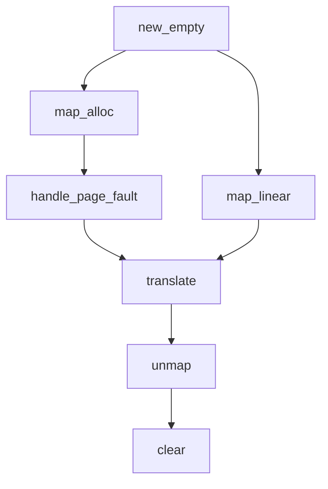

# 地址空间API

<cite>
**本文档引用的文件**  
- [src/address_space/mod.rs](file://src/address_space/mod.rs#L0-L588)
- [src/address_space/backend/mod.rs](file://src/address_space/backend/mod.rs#L0-L110)
- [src/address_space/backend/linear.rs](file://src/address_space/backend/linear.rs#L0-L51)
- [src/address_space/backend/alloc.rs](file://src/address_space/backend/alloc.rs#L0-L97)
- [src/addr.rs](file://src/addr.rs#L0-L36)
- [src/lib.rs](file://src/lib.rs#L0-L48)
</cite>

## 目录
1. [简介](#简介)
2. [核心结构体 AddrSpace](#核心结构体-addrspace)
3. [关键方法详解](#关键方法详解)
   - [new_empty](#new_empty)
   - [map_linear](#map_linear)
   - [map_alloc](#map_alloc)
   - [handle_page_fault](#handle_page_fault)
   - [translate](#translate)
   - [unmap](#unmap)
   - [clear](#clear)
4. [关联类型说明](#关联类型说明)
   - [MappingFlags](#mappingflags)
   - [GuestPhysAddr 与 PhysAddr](#guestphysaddr-与-physaddr)
   - [Backend](#backend)
5. [API 使用示例](#api-使用示例)
6. [调用时机与线程安全性](#调用时机与线程安全性)
7. [内部状态管理与方法调用关系](#内部状态管理与方法调用关系)
8. [错误处理机制](#错误处理机制)

## 简介
`axaddrspace` 模块提供了虚拟机中地址空间的管理功能，核心为 `AddrSpace` 结构体。该结构体封装了虚拟地址空间的范围、内存区域集合（`MemorySet`）以及嵌套页表（`NestedPageTable`），支持线性映射、动态分配映射、页错误处理和地址转换等关键操作。本文档详细说明其公共API，帮助开发者理解如何在虚拟机生命周期中正确使用这些接口。

## 核心结构体 AddrSpace
`AddrSpace<H: PagingHandler>` 是地址空间的核心管理结构，包含以下字段：
- `va_range`: 当前地址空间的虚拟地址范围（`GuestPhysAddrRange`）
- `areas`: 内存区域集合（`MemorySet<Backend<H>>`），管理不同映射区域
- `pt`: 嵌套页表实例（`PageTable<H>`），负责底层页表操作

该结构体通过组合模式将高层语义（如线性/动态映射）与底层页表操作解耦，通过 `Backend` 枚举支持多种映射后端。

**Section sources**
- [src/address_space/mod.rs](file://src/address_space/mod.rs#L15-L22)

## 关键方法详解

### new_empty
创建一个空的地址空间。

**参数：**
- `base`: 虚拟地址空间起始地址（`GuestPhysAddr`）
- `size`: 地址空间大小（`usize`）

**返回值：**
- 成功时返回 `AxResult<Self>`，失败时返回 `AxError::NoMemory`

**错误条件：**
- 无法分配页表根帧时返回 `NoMemory`

**调用约束：**
- `base` 和 `size` 无需对齐，但后续映射操作需满足4KB对齐要求

**Section sources**
- [src/address_space/mod.rs](file://src/address_space/mod.rs#L50-L63)

### map_linear
添加一个线性映射，将虚拟地址连续映射到已知的物理地址。

**参数：**
- `start_vaddr`: 起始虚拟地址（`GuestPhysAddr`）
- `start_paddr`: 起始物理地址（`PhysAddr`）
- `size`: 映射大小（`usize`）
- `flags`: 映射权限与属性（`MappingFlags`）

**返回值：**
- `AxResult`，成功为 `Ok(())`，失败为对应错误

**错误条件：**
- 地址超出地址空间范围 → `InvalidInput`
- 虚拟/物理地址或大小未4KB对齐 → `InvalidInput`

**调用约束：**
- 必须确保物理地址连续且有效
- 不能与已有映射重叠（由底层 `MemorySet` 检查）

**Section sources**
- [src/address_space/mod.rs](file://src/address_space/mod.rs#L65-L88)
- [src/address_space/backend/linear.rs](file://src/address_space/backend/linear.rs#L10-L25)

### map_alloc
添加一个动态分配映射，物理页帧由全局分配器按需分配。

**参数：**
- `start`: 起始虚拟地址（`GuestPhysAddr`）
- `size`: 映射大小（`usize`）
- `flags`: 映射权限与属性（`MappingFlags`）
- `populate`: 是否立即分配所有物理帧（`bool`）

**返回值：**
- `AxResult`，成功为 `Ok(())`，失败为对应错误

**错误条件：**
- 地址超出范围 → `InvalidInput`
- 未对齐 → `InvalidInput`
- 分配物理帧失败 → `NoMemory`（通过 `mapping_err_to_ax_err` 转换）

**调用约束：**
- 若 `populate = true`，则立即分配所有物理帧
- 若 `populate = false`，则延迟分配，需配合 `handle_page_fault` 使用

**Section sources**
- [src/address_space/mod.rs](file://src/address_space/mod.rs#L90-L113)
- [src/address_space/backend/alloc.rs](file://src/address_space/backend/alloc.rs#L10-L38)

### handle_page_fault
处理指定虚拟地址的页错误。

**参数：**
- `vaddr`: 触发页错误的虚拟地址（`GuestPhysAddr`）
- `access_flags`: 访问类型（读/写/执行等，`MappingFlags`）

**返回值：**
- `bool`，成功处理返回 `true`，否则返回 `false`

**行为说明：**
- 若地址不在地址空间范围内，返回 `false`
- 查找对应内存区域，若权限不足返回 `false`
- 仅当后端为 `Alloc` 且 `populate = false` 时，才会分配物理帧并建立映射

**调用约束：**
- 仅对延迟分配（lazy）的映射有效
- 线性映射不应触发页错误

**Section sources**
- [src/address_space/mod.rs](file://src/address_space/mod.rs#L146-L168)
- [src/address_space/backend/alloc.rs](file://src/address_space/backend/alloc.rs#L66-L82)

### translate
将虚拟地址转换为物理地址。

**参数：**
- `vaddr`: 待转换的虚拟地址（`GuestPhysAddr`）

**返回值：**
- `Option<PhysAddr>`，成功返回 `Some(phys_addr)`，失败返回 `None`

**失败条件：**
- 地址超出范围
- 未建立映射（包括延迟映射未触发页错误）

**调用约束：**
- 仅查询已建立的映射，不触发页错误处理

**Section sources**
- [src/address_space/mod.rs](file://src/address_space/mod.rs#L170-L182)

### unmap
移除指定虚拟地址范围内的映射。

**参数：**
- `start`: 起始虚拟地址（`GuestPhysAddr`）
- `size`: 大小（`usize`）

**返回值：**
- `AxResult`，成功为 `Ok(())`

**错误条件：**
- 地址超出范围或未对齐 → `InvalidInput`

**行为：**
- 对于 `Alloc` 类型，会释放对应的物理帧
- 对于 `Linear` 类型，仅解除页表映射

**Section sources**
- [src/address_space/mod.rs](file://src/address_space/mod.rs#L115-L130)

### clear
移除地址空间中的所有映射。

**行为：**
- 调用 `areas.clear()` 清除所有区域
- 在 `Drop` 实现中自动调用，确保资源释放

**调用时机：**
- 虚拟机关闭或地址空间销毁前

**Section sources**
- [src/address_space/mod.rs](file://src/address_space/mod.rs#L132-L138)

## 关联类型说明

### MappingFlags
表示内存映射的权限与属性，如 `READ`、`WRITE`、`EXECUTE` 等。用于控制页表项的访问权限位，在映射和页错误处理时进行权限检查。

**Section sources**
- [src/address_space/mod.rs](file://src/address_space/mod.rs#L12)

### GuestPhysAddr 与 PhysAddr
- `GuestPhysAddr`: 客户机物理地址，用于虚拟机内部的地址空间管理
- `PhysAddr`: 主机物理地址，用于实际内存访问

两者通过 `Backend` 中的偏移或分配机制进行转换。

**Section sources**
- [src/addr.rs](file://src/addr.rs#L10-L18)

### Backend
映射后端的统一枚举，定义了两种映射方式：
- `Linear`: 线性映射，使用固定偏移
- `Alloc`: 动态分配，支持立即或延迟分配

实现了 `MappingBackend` trait，与 `MemorySet` 协同工作。

**Section sources**
- [src/address_space/backend/mod.rs](file://src/address_space/backend/mod.rs#L15-L45)

## API 使用示例
```rust
// 创建地址空间
let mut addr_space = AddrSpace::new_empty(GuestPhysAddr::from_usize(0x10000), 0x10000).unwrap();

// 添加线性映射
let vaddr_linear = GuestPhysAddr::from_usize(0x18000);
let paddr_linear = PhysAddr::from_usize(0x10000);
addr_space.map_linear(vaddr_linear, paddr_linear, 0x8000, MappingFlags::READ | MappingFlags::WRITE).unwrap();

// 添加延迟分配映射
let vaddr_alloc = GuestPhysAddr::from_usize(0x14000);
addr_space.map_alloc(vaddr_alloc, 0x1000, MappingFlags::READ | MappingFlags::WRITE, false).unwrap();

// 触发页错误（模拟访问）
let handled = addr_space.handle_page_fault(vaddr_alloc, MappingFlags::READ);
assert!(handled);

// 地址转换
let paddr = addr_space.translate(vaddr_alloc).unwrap();
```

**Section sources**
- [src/address_space/mod.rs](file://src/address_space/mod.rs#L250-L350)

## 调用时机与线程安全性
- **创建 (`new_empty`)**: 虚拟机初始化阶段
- **映射 (`map_linear`, `map_alloc`)**: 内存设备初始化或运行时动态分配
- **页错误处理 (`handle_page_fault`)**: 运行时由异常处理流程调用
- **转换 (`translate`)**: 设备模拟或内存访问时
- **解映射 (`unmap`, `clear`)**: 资源释放或虚拟机关机

**线程安全性：**
- 所有方法均要求 `&mut self`，非线程安全
- 多线程环境下需外部同步机制保护

**Section sources**
- [src/address_space/mod.rs](file://src/address_space/mod.rs#L50-L182)

## 内部状态管理与方法调用关系


**Diagram sources**
- [src/address_space/mod.rs](file://src/address_space/mod.rs#L50-L182)

**Section sources**
- [src/address_space/mod.rs](file://src/address_space/mod.rs#L50-L182)

## 错误处理机制
所有错误通过 `AxResult` 和 `AxError` 统一处理：
- `InvalidInput`: 参数无效（范围、对齐）
- `AlreadyExists`: 映射已存在（由 `MemorySet` 返回）
- `NoMemory`: 分配物理帧失败
- `BadState`: 内部状态异常

错误码通过 `mapping_err_to_ax_err` 函数从 `MappingError` 转换而来。

**Section sources**
- [src/lib.rs](file://src/lib.rs#L40-L48)
- [src/address_space/mod.rs](file://src/address_space/mod.rs#L85-L87)