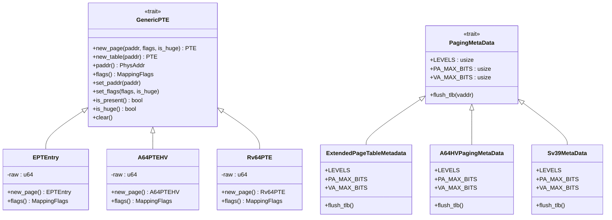

# 嵌套页表API

<cite>
**本文档引用文件**  
- [src/npt/mod.rs](file://src/npt/mod.rs)
- [src/npt/arch/mod.rs](file://src/npt/arch/mod.rs)
- [src/npt/arch/x86_64.rs](file://src/npt/arch/x86_64.rs)
- [src/npt/arch/riscv.rs](file://src/npt/arch/riscv.rs)
- [src/npt/arch/aarch64.rs](file://src/npt/arch/aarch64.rs)
</cite>

## 目录
1. [简介](#简介)
2. [核心结构体与类型定义](#核心结构体与类型定义)
3. [公共API接口](#公共api接口)
4. [多架构抽象机制](#多架构抽象机制)
5. [页错误处理](#页错误处理)
6. [地址转换流程](#地址转换流程)
7. [典型使用场景](#典型使用场景)
8. [生命周期与并发访问注意事项](#生命周期与并发访问注意事项)

## 简介
嵌套页表模块（`NestedPageTable`）为虚拟机监控器（Hypervisor）提供两阶段地址转换能力，支持x86_64、RISC-V和AArch64三种主流架构。该模块通过统一的公共API抽象底层差异，实现对客户物理地址（GPA）到宿主物理地址（HPA）的高效映射与转换。本文档系统性地记录其公共接口、核心逻辑及跨平台实现机制。

## 核心结构体与类型定义

`NestedPageTable<H>` 是一个泛型类型，根据目标架构被别名为不同的具体页表实现：

- 在 x86_64 上，它被定义为 `arch::ExtendedPageTable<H>`，基于EPT（Extended Page Tables）机制。
- 在 RISC-V 和 AArch64 上，它被定义为 `arch::NestedPageTable<H>`，分别基于Sv39和VMSAv8-64的嵌套页表机制。

所有架构共享 `PageTable64` 作为基础页表容器，参数化为特定的元数据类型（`PagingMetaData`）和页表项类型（如 `EPTEntry`、`A64PTEHV`、`Rv64PTE`）。这些页表项实现了 `GenericPTE` trait，统一了页表操作接口。

**Section sources**
- [src/npt/mod.rs](file://src/npt/mod.rs#L1-L14)
- [src/npt/arch/x86_64.rs](file://src/npt/arch/x86_64.rs#L150-L190)
- [src/npt/arch/riscv.rs](file://src/npt/arch/riscv.rs#L1-L7)
- [src/npt/arch/aarch64.rs](file://src/npt/arch/aarch64.rs#L260-L262)

## 公共API接口

### 初始化
`NestedPageTable::new()` 方法用于创建一个新的嵌套页表实例。它接受一个宿主物理内存分配器（`H`），用于在需要时分配新的页表页面。该方法返回一个可管理的页表根对象。

### 映射操作
`map()` 方法用于建立客户物理地址范围到宿主物理地址的映射。主要参数包括：
- `gpa`: 要映射的客户物理地址。
- `hpa`: 对应的宿主物理地址。
- `size`: 映射的大小。
- `flags`: 映射权限标志（`MappingFlags`），如读、写、执行、设备内存等。

该方法会递归地遍历或创建页表项，并最终设置叶节点的权限和物理地址。

### 地址转换
`translate()` 方法执行单次地址转换查询。给定一个客户物理地址（GPA），它返回对应的宿主物理地址（HPA）以及该映射的访问权限（`MappingFlags`）。此操作不修改页表结构，仅进行查询。

### 页错误处理
`handle_page_fault()` 方法是处理嵌套页表页错误的核心入口。它接收一个 `NestedPageFaultInfo` 结构体，该结构体包含触发页错误的客户物理地址、访问类型（读/写/执行）等信息。该方法分析错误原因，并尝试通过分配新页或更新现有映射来解决错误。

**Section sources**
- [src/npt/arch/x86_64.rs](file://src/npt/arch/x86_64.rs#L100-L149)
- [src/npt/arch/aarch64.rs](file://src/npt/arch/aarch64.rs#L100-L259)
- [src/npt/arch/riscv.rs](file://src/npt/arch/riscv.rs#L5-L7)

## 多架构抽象机制

嵌套页表模块通过条件编译（`cfg_if!`）和统一的 trait 接口实现了对多架构的支持。



**Diagram sources**
- [src/npt/arch/x86_64.rs](file://src/npt/arch/x86_64.rs#L1-L190)
- [src/npt/arch/aarch64.rs](file://src/npt/arch/aarch64.rs#L1-L262)
- [src/npt/arch/riscv.rs](file://src/npt/arch/riscv.rs#L1-L7)

**Section sources**
- [src/npt/arch/mod.rs](file://src/npt/arch/mod.rs#L1-L14)

## 页错误处理

`handle_page_fault` 函数的处理逻辑如下：

1. **解析错误信息**：从 `NestedPageFaultInfo` 中提取出错的客户物理地址（GPA）和访问类型。
2. **查找页表项**：调用内部的 `walk()` 方法遍历页表，定位到对应的页表项（PTE）。
3. **错误分类**：
   - **未映射（Unmapped）**：若PTE为空，则需要分配新的宿主物理页并建立映射。
   - **权限不足（Permission Denied）**：若PTE存在但权限不足（如写访问但只读映射），则更新PTE的权限标志。
   - **其他错误**：如访问无效的块映射等，返回错误。
4. **访问标志（access_flags）处理**：在更新PTE时，会根据 `MappingFlags` 和架构特定的标志（如 `EPTFlags`、`DescriptorAttr`）进行转换。例如，在AArch64上，`WRITE` 标志会设置 `S2AP_WO` 位，而 `EXECUTE` 标志会清除 `XN` 位。
5. **错误传播**：如果无法处理该页错误（例如，无法分配内存或权限更新被拒绝），函数会返回一个错误码，由上层调用者决定如何处理（如注入虚拟中断）。

**Section sources**
- [src/npt/arch/aarch64.rs](file://src/npt/arch/aarch64.rs#L150-L259)
- [src/npt/arch/x86_64.rs](file://src/npt/arch/x86_64.rs#L100-L149)

## 地址转换流程

`translate` 函数的执行流程是一个标准的页表遍历过程：


**Diagram sources**
- [src/npt/arch/x86_64.rs](file://src/npt/arch/x86_64.rs#L60-L99)
- [src/npt/arch/aarch64.rs](file://src/npt/arch/aarch64.rs#L100-L149)

**Section sources**
- [src/npt/arch/x86_64.rs](file://src/npt/arch/x86_64.rs#L60-L99)
- [src/npt/arch/aarch64.rs](file://src/npt/arch/aarch64.rs#L100-L149)

## 典型使用场景

### 创建嵌套页表项
```rust
let mut npt = NestedPageTable::new(&mut host_memory_allocator);
npt.map(gpa, hpa, size, MappingFlags::READ | MappingFlags::WRITE)?;
```
此代码片段创建了一个从 `gpa` 到 `hpa` 的可读写映射。`map` 方法会自动处理页表的分配和链接。

### 更新映射权限
当客户机操作系统修改页表权限时，Hypervisor 需要同步更新嵌套页表。这通常通过 `handle_page_fault` 或直接调用 `set_flags` 方法完成。
```rust
// 假设已获取到PTE的可变引用
pte.set_flags(MappingFlags::READ | MappingFlags::EXECUTE, false);
```
此操作将页的权限从可读写更新为可读可执行。

## 生命周期与并发访问注意事项

- **生命周期**：`NestedPageTable<H>` 的生命周期依赖于其泛型参数 `H`（宿主内存分配器）。确保 `H` 的生命周期长于 `NestedPageTable` 实例。
- **并发访问**：该模块本身不提供内部同步机制。在多线程环境中并发访问同一个 `NestedPageTable` 实例时，必须由调用者确保外部同步（例如，使用 `Mutex` 或 `RwLock` 包裹）。
- **内存安全**：所有物理地址操作都通过 `GuestPhysAddr` 和 `HostPhysAddr` 类型进行封装，防止地址混淆。页表项的修改遵循原子性原则，通常通过原子写操作或在临界区内完成。

**Section sources**
- [src/npt/arch/x86_64.rs](file://src/npt/arch/x86_64.rs#L1-L190)
- [src/npt/arch/aarch64.rs](file://src/npt/arch/aarch64.rs#L1-L262)