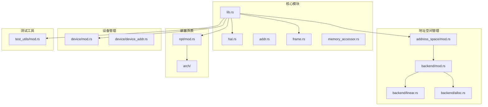
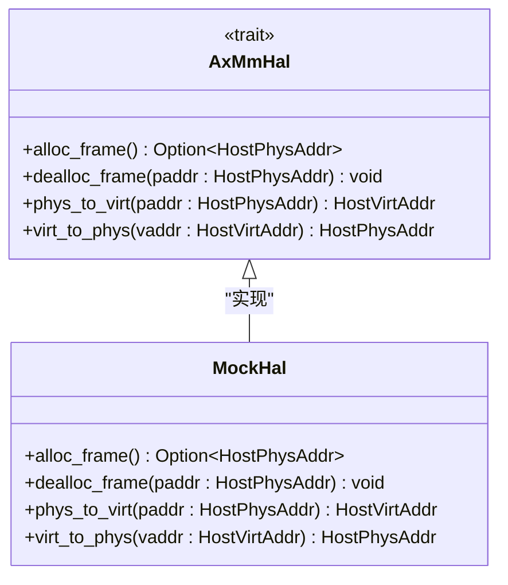
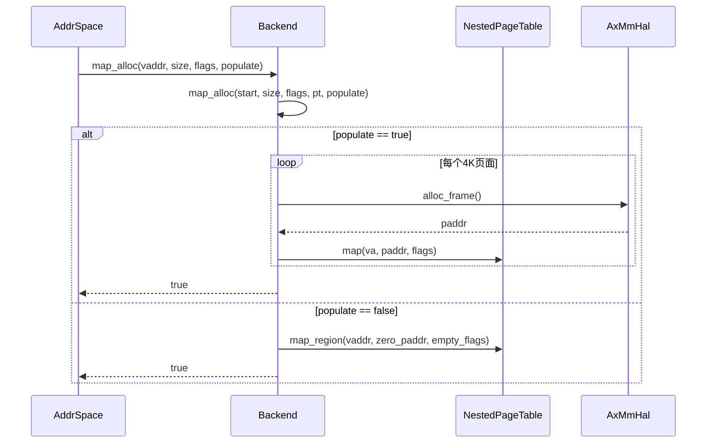
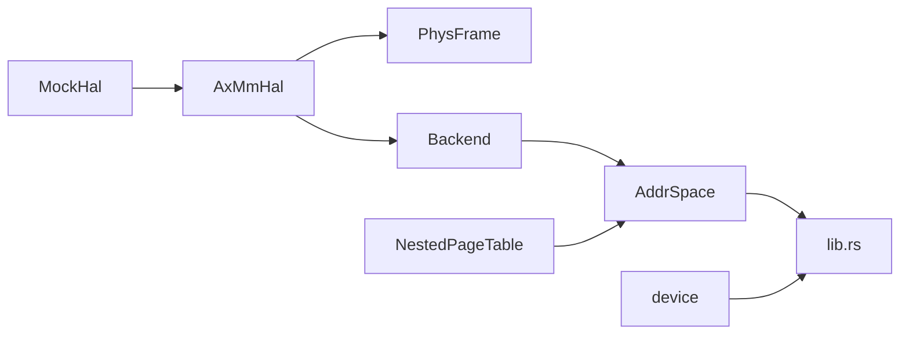

# 硬件抽象层接口

<cite>
**本文档引用的文件**  
- [hal.rs](file://src/hal.rs)
- [lib.rs](file://src/lib.rs)
- [address_space/mod.rs](file://src/address_space/mod.rs)
- [address_space/backend/mod.rs](file://src/address_space/backend/mod.rs)
- [address_space/backend/alloc.rs](file://src/address_space/backend/alloc.rs)
- [address_space/backend/linear.rs](file://src/address_space/backend/linear.rs)
- [frame.rs](file://src/frame.rs)
- [npt/mod.rs](file://src/npt/mod.rs)
- [test_utils/mod.rs](file://src/test_utils/mod.rs)
</cite>

## 目录
1. [引言](#引言)
2. [项目结构](#项目结构)
3. [核心组件](#核心组件)
4. [架构概述](#架构概述)
5. [详细组件分析](#详细组件分析)
6. [依赖分析](#依赖分析)
7. [性能考虑](#性能考虑)
8. [故障排除指南](#故障排除指南)
9. [结论](#结论)

## 引言
本文档详细记录了硬件抽象层（HAL）接口 `AxMmHal` 的定义与实现要求，作为底层内存操作的抽象契约。该接口在 `no-std` 环境下为 ArceOS 虚拟机监控器提供与底层硬件交互的关键能力。文档说明了 `AxMmHal` trait 中每个方法的语义、参数约束和预期行为，解释其在不同硬件平台上的适配方式，并提供符合该 trait 的典型实现示例。同时，本文档强调了 `AxMmHal` 与 `address_space` 和 `npt` 模块的依赖关系，涵盖生命周期管理、线程安全假设和性能敏感操作的注意事项，以帮助集成者正确实现和使用该接口。

## 项目结构
本项目为 ArceOS 虚拟机监控器的地址空间管理模块，主要负责虚拟机的内存管理。其结构围绕硬件抽象、地址空间管理和页表操作进行组织。



**Diagram sources**  
- [lib.rs](file://src/lib.rs#L1-L49)
- [address_space/mod.rs](file://src/address_space/mod.rs#L1-L589)
- [npt/mod.rs](file://src/npt/mod.rs#L1-L15)

**Section sources**  
- [lib.rs](file://src/lib.rs#L1-L49)
- [address_space/mod.rs](file://src/address_space/mod.rs#L1-L589)

## 核心组件
`AxMmHal` 是本模块的核心抽象接口，定义了内存管理所需的基本硬件操作。它被 `PhysFrame` 结构体和 `Backend` 映射后端直接使用，以实现物理帧的分配、释放以及物理地址与虚拟地址之间的转换。该 trait 的实现是平台相关的，允许在不同架构（如 x86_64, RISC-V, AArch64）上进行适配。

**Section sources**  
- [hal.rs](file://src/hal.rs#L1-L40)
- [frame.rs](file://src/frame.rs#L1-L163)

## 架构概述
本模块的架构围绕 `AddrSpace` 结构体构建，它代表一个虚拟机的地址空间。`AddrSpace` 内部包含一个由 `NestedPageTable` 实现的页表和一个 `MemorySet`，用于管理内存区域。内存映射通过 `Backend` 枚举实现，支持线性映射和分配映射两种模式。整个系统依赖于 `AxMmHal` 提供的底层硬件服务。

```mermaid
graph TB
subgraph "硬件抽象层"
AxMmHal[AxMmHal Trait]
end
subgraph "地址空间"
AddrSpace[AddrSpace<H>]
PageTable[NestedPageTable<H>]
MemorySet[MemorySet<Backend<H>>]
end
subgraph "映射后端"
Backend[Backend<H>]
Linear[Linear]
Alloc[Alloc]
end
subgraph "物理帧管理"
PhysFrame[PhysFrame<H>]
end
AxMmHal --> PhysFrame : "实现"
AxMmHal --> Backend : "调用"
PhysFrame --> AxMmHal : "使用"
Backend --> AddrSpace : "组成"
Linear --> Backend
Alloc --> Backend
AddrSpace --> PageTable
AddrSpace --> MemorySet
MemorySet --> Backend
```

**Diagram sources**  
- [hal.rs](file://src/hal.rs#L1-L40)
- [address_space/mod.rs](file://src/address_space/mod.rs#L1-L589)
- [address_space/backend/mod.rs](file://src/address_space/backend/mod.rs#L1-L110)
- [frame.rs](file://src/frame.rs#L1-L163)

## 详细组件分析

### AxMmHal 接口分析
`AxMmHal` 是一个 trait，定义了内存管理硬件抽象层的契约。其实现必须提供物理帧分配、释放以及地址转换的功能。



**Diagram sources**  
- [hal.rs](file://src/hal.rs#L1-L40)
- [test_utils/mod.rs](file://src/test_utils/mod.rs#L1-L170)

**Section sources**  
- [hal.rs](file://src/hal.rs#L1-L40)
- [test_utils/mod.rs](file://src/test_utils/mod.rs#L1-L170)

### 地址空间与后端分析
`AddrSpace` 结构体是地址空间管理的核心，它使用 `Backend` 来处理不同类型的内存映射。`Backend` 枚举包含 `Linear` 和 `Alloc` 两种模式，分别用于线性映射和按需分配。



**Diagram sources**  
- [address_space/mod.rs](file://src/address_space/mod.rs#L1-L589)
- [address_space/backend/alloc.rs](file://src/address_space/backend/alloc.rs#L1-L97)

**Section sources**  
- [address_space/mod.rs](file://src/address_space/mod.rs#L1-L589)
- [address_space/backend/mod.rs](file://src/address_space/backend/mod.rs#L1-L110)
- [address_space/backend/alloc.rs](file://src/address_space/backend/alloc.rs#L1-L97)
- [address_space/backend/linear.rs](file://src/address_space/backend/linear.rs#L1-L51)

### 物理帧管理分析
`PhysFrame` 结构体封装了一个物理帧，实现了 `Drop` trait 以确保在作用域结束时自动释放物理内存。它完全依赖于 `AxMmHal` 的实现来完成底层操作。

```mermaid
flowchart TD
Start([PhysFrame::alloc()]) --> CallAlloc["调用 H::alloc_frame()"]
CallAlloc --> CheckResult{"分配成功?"}
CheckResult --> |是| CreateFrame["创建 PhysFrame 实例"]
CheckResult --> |否| ReturnError["返回 AxResult::Err(NoMemory)"]
CreateFrame --> End([返回 Ok(PhysFrame)])
ReturnError --> End
End --> OnDrop["Drop 时调用 H::dealloc_frame()"]
```

**Diagram sources**  
- [frame.rs](file://src/frame.rs#L1-L163)

**Section sources**  
- [frame.rs](file://src/frame.rs#L1-L163)

## 依赖分析
本模块的依赖关系清晰，`AxMmHal` 作为最底层的抽象，被上层组件广泛依赖。`AddrSpace` 依赖于 `npt` 模块提供的页表实现和 `address_space` 模块中的后端逻辑。



**Diagram sources**  
- [lib.rs](file://src/lib.rs#L1-L49)
- [hal.rs](file://src/hal.rs#L1-L40)
- [frame.rs](file://src/frame.rs#L1-L163)
- [address_space/mod.rs](file://src/address_space/mod.rs#L1-L589)
- [npt/mod.rs](file://src/npt/mod.rs#L1-L15)

**Section sources**  
- [lib.rs](file://src/lib.rs#L1-L49)
- [npt/mod.rs](file://src/npt/mod.rs#L1-L15)

## 性能考虑
`AxMmHal` 的实现对系统性能有直接影响。`alloc_frame` 和 `dealloc_frame` 应尽可能高效，因为它们在内存分配和释放路径上被频繁调用。`phys_to_virt` 和 `virt_to_phys` 的转换应避免复杂的计算或查找。在 `Backend::Alloc` 模式下，`populate` 参数的选择对启动时间和内存使用有重要影响：立即分配（`populate=true`）会增加启动开销但减少运行时页错误，而延迟分配（`populate=false`）则相反。

## 故障排除指南
当遇到内存管理问题时，应首先检查 `AxMmHal` 的实现是否正确。确保 `alloc_frame` 在内存不足时返回 `None`，且 `dealloc_frame` 不会重复释放同一物理地址。测试中使用的 `MockHal` 提供了验证实现正确性的框架。此外，应检查 `PhysFrame` 的 `Drop` 实现是否被正确调用，以及 `AddrSpace::clear` 是否能正确清理所有映射。

**Section sources**  
- [test_utils/mod.rs](file://src/test_utils/mod.rs#L1-L170)
- [frame.rs](file://src/frame.rs#L1-L163)
- [address_space/mod.rs](file://src/address_space/mod.rs#L1-L589)

## 结论
`AxMmHal` 接口为 ArceOS 虚拟机监控器的内存管理提供了坚实且灵活的硬件抽象层。通过定义清晰的契约，它使得上层逻辑与底层硬件解耦，便于在不同平台上进行移植。正确实现该接口是确保系统稳定性和性能的关键。集成者应仔细遵循本文档中的要求，利用提供的测试工具验证其实现的正确性。