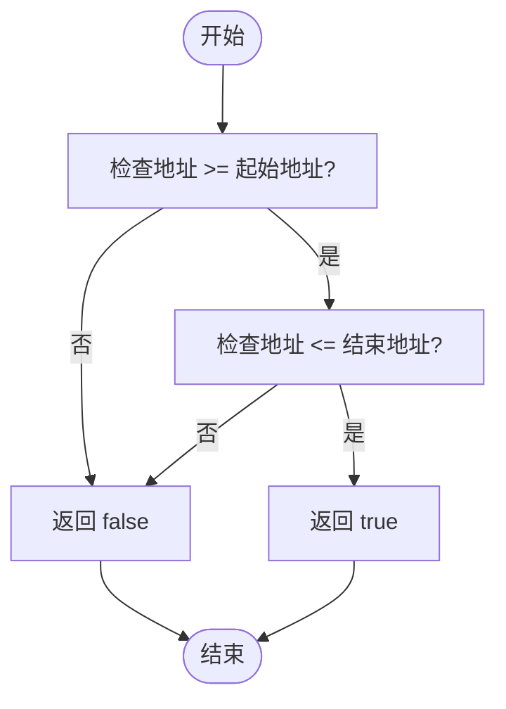
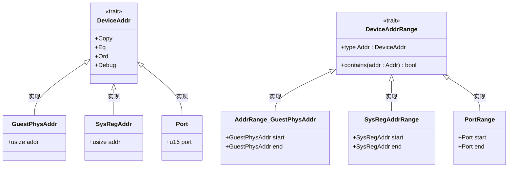
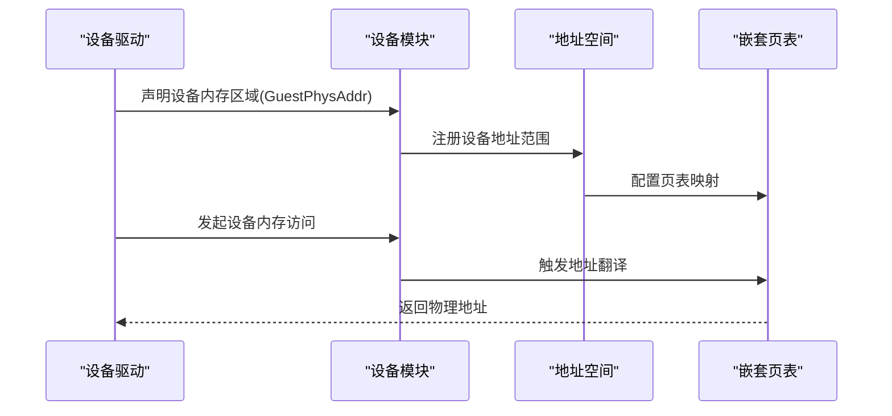

# 设备管理API

<cite>
**本文档引用的文件**   
- [device/mod.rs](file://src/device/mod.rs)
- [device/device_addr.rs](file://src/device/device_addr.rs)
- [addr.rs](file://src/addr.rs)
- [lib.rs](file://src/lib.rs)
</cite>

## 目录
1. [简介](#简介)
2. [设备地址表示方式](#设备地址表示方式)
3. [设备内存映射接口](#设备内存映射接口)
4. [地址空间集成机制](#地址空间集成机制)
5. [I/O内存区域管理策略](#io内存区域管理策略)
6. [安全边界控制机制](#安全边界控制机制)
7. [设备地址转换流程](#设备地址转换流程)
8. [配置示例](#配置示例)
9. [错误处理与资源释放](#错误处理与资源释放)
10. [结论](#结论)

## 简介
本文档详细描述了`device`模块中与设备内存映射相关的公共接口，重点阐述设备物理地址（DevicePhysAddr）的表示方式、映射函数的调用规范以及与地址空间的集成方式。结合`device/mod.rs`和`device/device_addr.rs`的实现，说明设备I/O内存区域的管理策略和安全边界控制机制，涵盖设备地址与客户机物理地址之间的映射关系及转换流程。

**Section sources**
- [device/mod.rs](file://src/device/mod.rs#L1-L132)
- [device/device_addr.rs](file://src/device/device_addr.rs#L1-L97)

## 设备地址表示方式
设备地址通过`DeviceAddr` trait进行抽象，支持多种地址类型，包括客户机物理地址（GuestPhysAddr）、系统寄存器地址（SysRegAddr）和端口地址（Port）。这些类型均实现了`Copy`、`Eq`、`Ord`和`Debug`等基本特性。

### 客户机物理地址
`GuestPhysAddr`是设备地址的一种具体实现，定义于`addr.rs`中，用于表示客户机视角下的物理内存地址。该类型通过`def_usize_addr!`宏生成，具备地址运算和格式化输出能力。

### 系统寄存器地址
`SysRegAddr`结构体封装了系统寄存器的地址，其内部存储为`usize`类型以保证架构通用性。可通过`new()`构造函数创建实例，并通过`addr()`方法获取原始地址值。

### 端口地址
`Port`结构体表示I/O端口编号，内部存储为`u16`类型。提供`new()`用于创建实例，`number()`用于获取端口号。

**Section sources**
- [device/device_addr.rs](file://src/device/device_addr.rs#L5-L10)
- [device/device_addr.rs](file://src/device/device_addr.rs#L40-L45)
- [device/device_addr.rs](file://src/device/device_addr.rs#L70-L75)
- [addr.rs](file://src/addr.rs#L11-L12)

## 设备内存映射接口
设备内存映射通过`DeviceAddrRange` trait定义地址范围的包含关系，支持连续或非连续的地址区间判断。

### 地址范围类型
- `AddrRange<GuestPhysAddr>`：基于`memory_addr`库的地址范围，适用于客户机物理内存区域。
- `SysRegAddrRange`：系统寄存器地址的闭区间范围，包含起始和结束地址。
- `PortRange`：I/O端口的闭区间范围，同样包含边界端口。

### 区间包含判断
所有范围类型均实现`contains()`方法，用于判断指定设备地址是否落在该范围内。例如，`SysRegAddrRange`通过比较地址值是否在`start`和`end`之间来确定包含关系。



**Diagram sources**
- [device/device_addr.rs](file://src/device/device_addr.rs#L58-L64)
- [device/device_addr.rs](file://src/device/device_addr.rs#L85-L91)

**Section sources**
- [device/device_addr.rs](file://src/device/device_addr.rs#L13-L20)
- [device/device_addr.rs](file://src/device/device_addr.rs#L28-L32)
- [device/device_addr.rs](file://src/device/device_addr.rs#L57-L96)

## 地址空间集成机制
设备地址空间与客户机物理地址空间通过统一的`GuestPhysAddr`类型进行集成。`device`模块中的`DeviceAddr` trait允许将`GuestPhysAddr`作为设备内存映射的目标地址，从而实现设备内存区域与客户机物理内存的直接关联。

在地址空间管理模块中，`GuestPhysAddrRange`被广泛用于描述内存映射区域的范围，确保设备内存分配与客户机内存布局的一致性。



**Diagram sources**
- [device/device_addr.rs](file://src/device/device_addr.rs#L5-L20)
- [device/device_addr.rs](file://src/device/device_addr.rs#L28-L32)
- [device/device_addr.rs](file://src/device/device_addr.rs#L57-L96)

**Section sources**
- [device/device_addr.rs](file://src/device/device_addr.rs#L22-L32)
- [addr.rs](file://src/addr.rs#L22-L23)
- [address_space/mod.rs](file://src/address_space/mod.rs#L18-L30)

## I/O内存区域管理策略
设备I/O内存区域通过`AccessWidth`枚举类型定义访问粒度，支持字节（Byte）、字（Word）、双字（Dword）和四字（Qword）四种访问宽度。该枚举实现了`TryFrom<usize>`和`From<AccessWidth>`的转换，便于在运行时根据访问大小动态解析访问模式。

### 访问宽度定义
| 访问宽度 | 字节数 | 位范围 |
|---------|--------|--------|
| Byte    | 1      | 0..8   |
| Word    | 2      | 0..16  |
| Dword   | 4      | 0..32  |
| Qword   | 8      | 0..64  |

每种访问宽度可通过`size()`方法获取对应字节数，通过`bits_range()`方法获取覆盖的位范围。

**Section sources**
- [device/mod.rs](file://src/device/mod.rs#L16-L45)
- [device/mod.rs](file://src/device/mod.rs#L47-L63)

## 安全边界控制机制
设备地址的安全边界通过`DeviceAddrRange`的`contains()`方法实现。所有地址范围类型均提供精确的区间包含判断，防止越界访问。例如：
- `SysRegAddrRange`确保系统寄存器访问在合法范围内
- `PortRange`限制I/O端口操作在预定义端口段内
- `AddrRange<GuestPhysAddr>`保证设备内存映射不超出客户机物理内存边界

此外，`GuestPhysAddr`本身具备地址合法性检查能力，结合`def_usize_addr_formatter!`宏提供的格式化输出，有助于调试和日志记录中的地址验证。

**Section sources**
- [device/device_addr.rs](file://src/device/device_addr.rs#L58-L64)
- [device/device_addr.rs](file://src/device/device_addr.rs#L85-L91)
- [addr.rs](file://src/addr.rs#L16-L17)

## 设备地址转换流程
设备地址与客户机物理地址之间的转换通过类型系统和trait实现自动映射。当设备使用`GuestPhysAddr`作为其内存映射地址时，无需额外转换即可直接参与客户机内存管理。

转换流程如下：
1. 设备驱动声明其内存区域使用`GuestPhysAddr`
2. 通过`DeviceAddrRange`实现定义可访问的地址范围
3. 在地址空间初始化时，将设备内存区域注册到客户机物理地址空间
4. 访问发生时，硬件或虚拟化层根据NPT（Nested Page Table）机制进行地址翻译



**Diagram sources**
- [device/device_addr.rs](file://src/device/device_addr.rs#L22-L32)
- [lib.rs](file://src/lib.rs#L25-L26)
- [address_space/backend/mod.rs](file://src/address_space/backend/mod.rs#L5-L10)

**Section sources**
- [device/device_addr.rs](file://src/device/device_addr.rs#L22-L32)
- [lib.rs](file://src/lib.rs#L25-L26)
- [address_space/backend/mod.rs](file://src/address_space/backend/mod.rs#L5-L10)

## 配置示例
以下代码展示了如何安全地将设备内存区域暴露给虚拟机：

```rust
// 定义设备内存区域
let device_range = GuestPhysAddrRange::from_start_size(
    GuestPhysAddr::from(0x1000_0000), 
    0x1000
);

// 创建设备地址范围
let sys_reg_range = SysRegAddrRange::new(
    SysRegAddr::new(0x1000),
    SysRegAddr::new(0x10FF)
);

// 验证地址是否在范围内
if device_range.contains(addr) {
    // 执行安全的设备访问
    perform_device_access(addr);
}
```

**Section sources**
- [device/device_addr.rs](file://src/device/device_addr.rs#L28-L32)
- [device/device_addr.rs](file://src/device/device_addr.rs#L57-L64)
- [addr.rs](file://src/addr.rs#L22-L23)

## 错误处理与资源释放
设备管理API的错误处理主要通过返回类型和日志机制实现。当发生映射错误时，`mapping_err_to_ax_err`函数将底层错误转换为`AxError`枚举类型，并输出警告日志。

资源释放行为由Rust的所有权系统自动管理。所有设备地址范围类型均实现`Copy`和`Clone`，确保在传递过程中不会意外释放资源。当设备模块被销毁时，相关地址映射会自动从地址空间中移除。

**Section sources**
- [lib.rs](file://src/lib.rs#L37-L48)
- [device/device_addr.rs](file://src/device/device_addr.rs#L5-L10)

## 结论
本文档全面介绍了设备地址管理模块的API设计与实现机制。通过`DeviceAddr`和`DeviceAddrRange` trait的抽象，实现了对多种设备地址类型的统一管理。结合客户机物理地址空间，提供了安全、高效的设备内存映射方案。开发者应遵循地址范围检查和类型安全原则，确保设备内存访问的正确性和安全性。