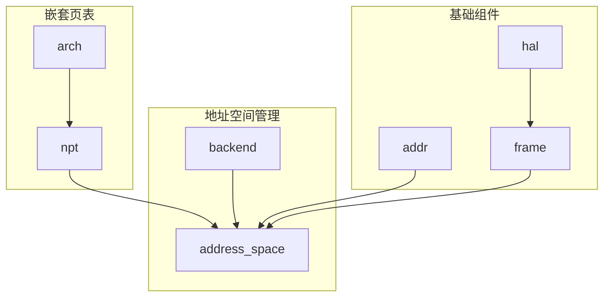
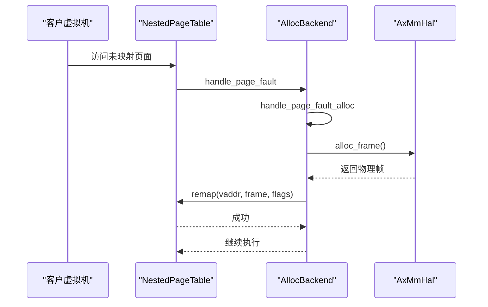
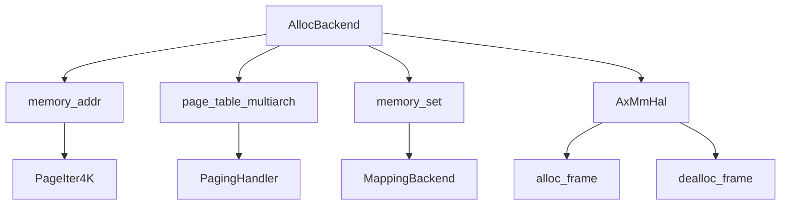

# 动态分配映射

<cite>
**本文档引用的文件**  
- [alloc.rs](file://src/address_space/backend/alloc.rs)
- [mod.rs](file://src/address_space/backend/mod.rs)
- [linear.rs](file://src/address_space/backend/linear.rs)
- [mod.rs](file://src/npt/mod.rs)
- [x86_64.rs](file://src/npt/arch/x86_64.rs)
- [riscv.rs](file://src/npt/arch/riscv.rs)
- [aarch64.rs](file://src/npt/arch/aarch64.rs)
- [addr.rs](file://src/addr.rs)
- [frame.rs](file://src/frame.rs)
</cite>

## 目录
1. [引言](#引言)
2. [项目结构](#项目结构)
3. [核心组件](#核心组件)
4. [架构概述](#架构概述)
5. [详细组件分析](#详细组件分析)
6. [依赖分析](#依赖分析)
7. [性能考虑](#性能考虑)
8. [故障排除指南](#故障排除指南)
9. [结论](#结论)

## 引言
本文档详细阐述了 `axaddrspace` 模块中动态分配映射功能的设计与实现，重点聚焦于 `map_alloc` 接口。该机制支持按需分配虚拟内存并建立页表映射，适用于堆内存或运行时大小可变的内存区域。文档将深入剖析 `AllocBackend` 的内存管理策略，包括虚拟地址空间的分配逻辑、页表项的动态更新机制以及与底层 `NestedPageTable` 的交互流程。同时，还将说明内存释放、映射撤销（unmap）和缺页异常处理等关键操作，并讨论碎片化问题、性能开销及优化建议。

## 项目结构
`axaddrspace` 模块采用分层设计，主要分为地址空间管理、设备地址映射、嵌套页表实现和辅助工具四个部分。其中，`address_space/backend` 目录实现了两种核心的内存映射后端：线性映射（linear）和分配映射（alloc），分别适用于连续物理内存和按需分配的场景。`npt` 目录则封装了跨架构的嵌套页表抽象，支持 x86_64、RISC-V 和 AArch64 架构。

**图示来源**  
- [mod.rs](file://src/address_space/backend/mod.rs#L1-L110)
- [mod.rs](file://src/npt/mod.rs#L1-L14)
- [addr.rs](file://src/addr.rs#L1-L36)
- [frame.rs](file://src/frame.rs#L1-L163)

**本节来源**  
- [src/address_space](file://src/address_space)
- [src/npt](file://src/npt)

## 核心组件
`AllocBackend` 是实现动态内存分配的核心组件，通过 `map_alloc` 接口提供两种映射模式：预分配（populate=true）和按需分配（populate=false）。在预分配模式下，系统会在创建映射时立即为整个区域分配物理页帧；而在按需分配模式下，系统仅在页表中创建占位符，待发生缺页异常时再动态分配物理内存。该设计有效支持了堆内存等运行时可变大小的内存区域。

**本节来源**  
- [alloc.rs](file://src/address_space/backend/alloc.rs#L1-L97)
- [mod.rs](file://src/address_space/backend/mod.rs#L1-L110)

## 架构概述
`axaddrspace` 的动态分配映射架构基于 `MappingBackend` 抽象，通过 `Backend` 枚举统一管理 `Linear` 和 `Alloc` 两种后端。`AllocBackend` 与 `NestedPageTable` 交互，利用 `PagingHandler` 提供的 `alloc_frame` 和 `dealloc_frame` 接口进行物理内存管理。当客户虚拟机访问未映射的页面时，会触发缺页异常，由 `handle_page_fault_alloc` 处理，实现惰性内存分配。

**图示来源**  
- [alloc.rs](file://src/address_space/backend/alloc.rs#L1-L97)
- [mod.rs](file://src/address_space/backend/mod.rs#L1-L110)
- [frame.rs](file://src/frame.rs#L1-L163)

## 详细组件分析

### AllocBackend 分析
`AllocBackend` 实现了动态内存分配的核心逻辑，其行为由 `populate` 标志控制。在预分配模式下，`map_alloc` 会遍历整个地址范围，为每个 4KB 页面调用 `H::alloc_frame` 分配物理帧，并通过 `pt.map` 建立映射。在按需分配模式下，`map_alloc` 调用 `pt.map_region` 创建一个空的映射区域，延迟物理内存的分配。

#### 映射与解除映射流程

**图示来源**  
- [alloc.rs](file://src/address_space/backend/alloc.rs#L1-L97)

#### 缺页异常处理

**图示来源**  
- [alloc.rs](file://src/address_space/backend/alloc.rs#L1-L97)
- [frame.rs](file://src/frame.rs#L1-L163)

**本节来源**  
- [alloc.rs](file://src/address_space/backend/alloc.rs#L1-L97)
- [mod.rs](file://src/address_space/backend/mod.rs#L1-L110)

### NestedPageTable 架构适配分析
`NestedPageTable` 通过 `npt/arch` 模块为不同架构提供统一接口。在 x86_64 上，使用 `ExtendedPageTable` 实现 EPT（扩展页表），其 `EPTEntry` 将 `MappingFlags` 转换为 EPT 标志位。在 AArch64 上，`A64PTEHV` 将 `MappingFlags` 映射到 VMSAv8-64 页表项的访问权限和执行禁止位。RISC-V 架构则通过 `Rv64PTE` 实现 Sv39 页表格式。

**本节来源**  
- [x86_64.rs](file://src/npt/arch/x86_64.rs#L1-L190)
- [aarch64.rs](file://src/npt/arch/aarch64.rs#L1-L261)
- [riscv.rs](file://src/npt/arch/riscv.rs#L1-L6)
- [mod.rs](file://src/npt/mod.rs#L1-L14)

## 依赖分析
`AllocBackend` 的实现依赖于多个核心组件：`memory_addr` 提供地址类型和页迭代器，`page_table_multiarch` 定义分页操作接口，`memory_set::MappingBackend` 提供映射后端抽象，`AxMmHal` 则负责物理内存的分配与释放。这些依赖关系确保了 `axaddrspace` 模块的可移植性和模块化。

**图示来源**  
- [alloc.rs](file://src/address_space/backend/alloc.rs#L1-L97)
- [frame.rs](file://src/frame.rs#L1-L163)

**本节来源**  
- [alloc.rs](file://src/address_space/backend/alloc.rs#L1-L97)
- [frame.rs](file://src/frame.rs#L1-L163)
- [mod.rs](file://src/address_space/backend/mod.rs#L1-L110)

## 性能考虑
动态分配映射在性能上存在权衡。预分配模式避免了运行时缺页异常开销，但可能导致内存浪费；按需分配模式节省内存，但每次缺页异常都会引入额外的处理延迟。此外，频繁的 `alloc_frame` 和 `dealloc_frame` 调用可能成为性能瓶颈。建议在内存充足且访问模式可预测的场景使用预分配，在内存受限或稀疏访问的场景使用按需分配。

## 故障排除指南
常见问题包括物理内存不足导致 `alloc_frame` 失败、映射区域重叠引发 `AlreadyExists` 错误、以及大页映射与 `unmap_alloc` 的不兼容。调试时应检查 `debug!` 日志输出，确认 `populate` 标志设置正确，并验证 `MappingFlags` 权限是否符合预期。对于缺页异常处理失败，需确保 `PagingHandler` 实现正确且物理内存池未耗尽。

**本节来源**  
- [alloc.rs](file://src/address_space/backend/alloc.rs#L1-L97)
- [frame.rs](file://src/frame.rs#L1-L163)
- [lib.rs](file://src/lib.rs#L1-L48)

## 结论
`axaddrspace` 模块通过 `AllocBackend` 和 `map_alloc` 接口，为虚拟机提供了灵活高效的动态内存分配能力。其设计充分考虑了不同架构的特性，通过统一的抽象层实现了良好的可移植性。开发者可根据具体应用场景选择合适的映射模式，并结合 `MappingFlags` 进行精细的权限控制。未来优化方向包括引入更高级的内存分配策略以减少碎片化，以及优化缺页异常处理路径以降低性能开销。