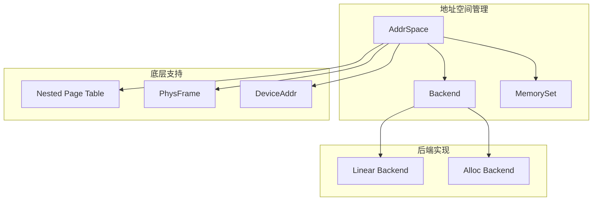
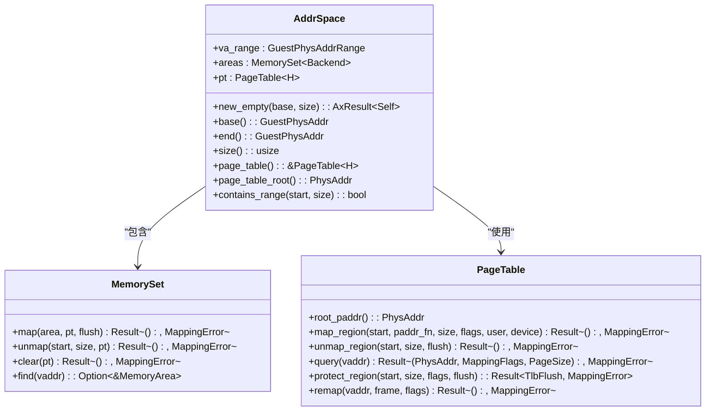
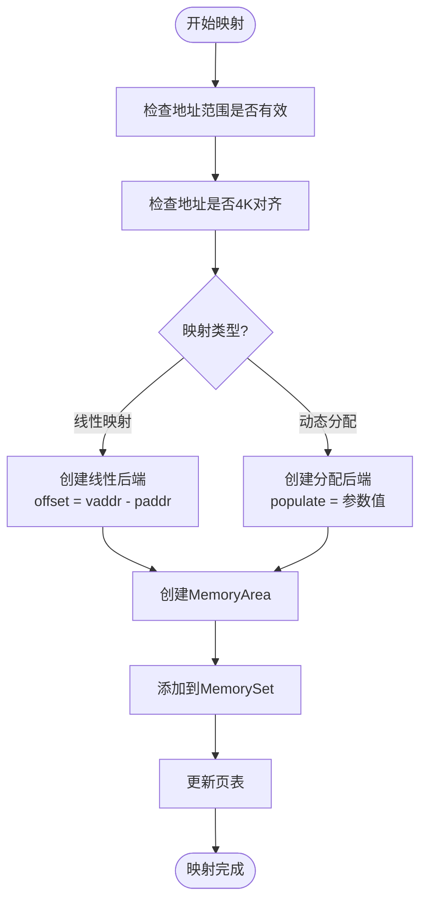
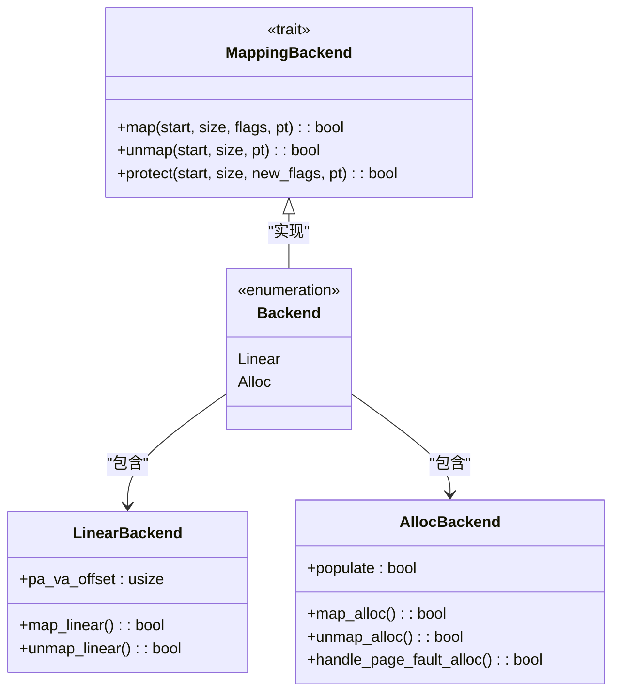
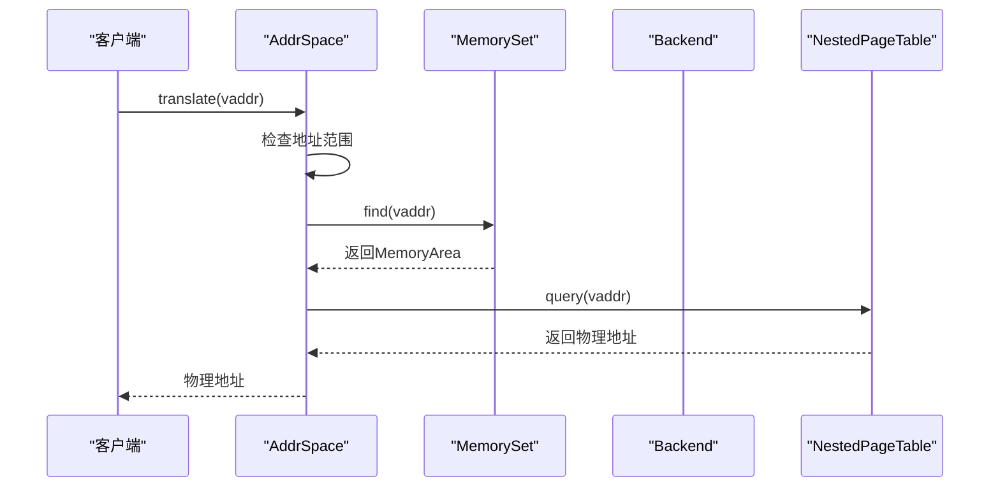

# 地址空间管理

<cite>
**本文档中引用的文件**  
- [lib.rs](file://src/lib.rs)
- [address_space/mod.rs](file://src/address_space/mod.rs)
- [address_space/backend/mod.rs](file://src/address_space/backend/mod.rs)
- [address_space/backend/linear.rs](file://src/address_space/backend/linear.rs)
- [address_space/backend/alloc.rs](file://src/address_space/backend/alloc.rs)
- [npt/mod.rs](file://src/npt/mod.rs)
- [addr.rs](file://src/addr.rs)
- [device/device_addr.rs](file://src/device/device_addr.rs)
- [device/mod.rs](file://src/device/mod.rs)
- [frame.rs](file://src/frame.rs)
</cite>

## 目录
1. [简介](#简介)
2. [项目结构](#项目结构)
3. [核心组件](#核心组件)
4. [地址空间设计与实现](#地址空间设计与实现)
5. [内存映射模式](#内存映射模式)
6. [Backend trait 抽象机制](#backend-trait-抽象机制)
7. [内存映射生命周期与权限控制](#内存映射生命周期与权限控制)
8. [错误处理机制](#错误处理机制)
9. [实际应用示例](#实际应用示例)
10. [地址转换路径协调机制](#地址转换路径协调机制)
11. [结论](#结论)

## 简介
`axaddrspace` 模块是 ArceOS-Hypervisor 项目中用于管理客户虚拟机地址空间的核心组件。它提供了一套完整的虚拟内存管理机制，支持创建空的地址空间、进行线性与动态内存映射、处理页错误以及实现安全的地址转换。该模块通过 `AddrSpace` 结构体封装了虚拟地址空间的管理逻辑，并结合 `Backend` trait 实现了灵活的映射策略。本文档将深入剖析其设计与实现，帮助开发者理解如何在客户虚拟机中添加设备内存或堆内存映射。

## 项目结构
`axaddrspace` 模块采用分层架构设计，主要由以下几个子模块组成：
- `address_space`：核心地址空间管理模块，包含 `AddrSpace` 结构体和 `Backend` 枚举。
- `backend`：实现不同内存映射策略的后端模块，包括线性和动态分配两种模式。
- `npt`：嵌套页表模块，负责底层的地址转换。
- `device`：设备地址相关定义，支持对设备内存的访问。
- `frame`：物理帧管理模块，提供物理内存的分配与释放功能。
- `addr`：地址类型定义，区分主机与客户机的虚拟和物理地址。



**Diagram sources**
- [address_space/mod.rs](file://src/address_space/mod.rs#L1-L588)
- [address_space/backend/mod.rs](file://src/address_space/backend/mod.rs#L1-L110)

**Section sources**
- [address_space/mod.rs](file://src/address_space/mod.rs#L1-L588)
- [address_space/backend/mod.rs](file://src/address_space/backend/mod.rs#L1-L110)

## 核心组件
`axaddrspace` 模块的核心组件包括 `AddrSpace` 结构体、`Backend` trait 和 `NestedPageTable` 类型。`AddrSpace` 是地址空间的主控结构，负责管理虚拟地址范围、内存区域和页表。`Backend` trait 定义了内存映射的后端行为，允许不同的映射策略共存。`NestedPageTable` 则是架构相关的嵌套页表实现，负责实际的地址转换操作。

**Section sources**
- [address_space/mod.rs](file://src/address_space/mod.rs#L1-L588)
- [npt/mod.rs](file://src/npt/mod.rs#L1-L14)

## 地址空间设计与实现
`AddrSpace` 结构体是地址空间管理的核心，它封装了虚拟地址范围、内存区域集合和嵌套页表。通过 `new_empty` 方法可以创建一个空的地址空间，指定其基地址和大小。该方法会初始化一个空的内存区域集合和一个新的页表实例。



**Diagram sources**
- [address_space/mod.rs](file://src/address_space/mod.rs#L1-L588)

**Section sources**
- [address_space/mod.rs](file://src/address_space/mod.rs#L1-L588)

## 内存映射模式
`axaddrspace` 模块支持两种主要的内存映射模式：线性映射和动态分配映射。

### 线性映射
线性映射通过 `map_linear` 方法实现，适用于已知物理地址的连续内存区域。该方法将虚拟地址与物理地址建立固定的偏移关系，即 `vaddr = paddr + offset`。这种映射方式常用于设备内存或预分配的内存区域。

### 动态分配映射
动态分配映射通过 `map_alloc` 方法实现，适用于需要按需分配物理内存的场景。该方法支持两种模式：立即分配（`populate = true`）和延迟分配（`populate = false`）。延迟分配模式下，物理帧在发生页错误时才进行分配，从而实现惰性内存分配。



**Diagram sources**
- [address_space/mod.rs](file://src/address_space/mod.rs#L1-L588)
- [address_space/backend/linear.rs](file://src/address_space/backend/linear.rs#L1-L51)
- [address_space/backend/alloc.rs](file://src/address_space/backend/alloc.rs#L1-L97)

**Section sources**
- [address_space/mod.rs](file://src/address_space/mod.rs#L1-L588)
- [address_space/backend/linear.rs](file://src/address_space/backend/linear.rs#L1-L51)
- [address_space/backend/alloc.rs](file://src/address_space/backend/alloc.rs#L1-L97)

## Backend trait 抽象机制
`Backend` trait 是内存映射策略的抽象接口，定义了 `map`、`unmap` 和 `protect` 三个核心方法。通过 `Backend` 枚举，模块实现了线性和动态分配两种后端。线性后端适用于固定偏移的映射，而分配后端则支持按需分配物理内存。这种设计使得地址空间管理模块能够灵活应对不同的内存映射需求。



**Diagram sources**
- [address_space/backend/mod.rs](file://src/address_space/backend/mod.rs#L1-L110)
- [address_space/backend/linear.rs](file://src/address_space/backend/linear.rs#L1-L51)
- [address_space/backend/alloc.rs](file://src/address_space/backend/alloc.rs#L1-L97)

**Section sources**
- [address_space/backend/mod.rs](file://src/address_space/backend/mod.rs#L1-L110)
- [address_space/backend/linear.rs](file://src/address_space/backend/linear.rs#L1-L51)
- [address_space/backend/alloc.rs](file://src/address_space/backend/alloc.rs#L1-L97)

## 内存映射生命周期与权限控制
内存映射的生命周期由 `map`、`unmap` 和 `clear` 方法管理。`map` 方法用于创建新的映射，`unmap` 方法用于移除指定范围的映射，而 `clear` 方法则用于清除整个地址空间的所有映射。权限控制通过 `MappingFlags` 实现，支持读、写、执行等权限位的组合。`protect` 方法可用于修改现有映射的权限。

**Section sources**
- [address_space/mod.rs](file://src/address_space/mod.rs#L1-L588)

## 错误处理机制
模块使用 `AxError` 类型进行错误处理，将底层的 `MappingError` 转换为更通用的错误类型。常见的错误包括 `InvalidInput`（无效参数）、`AlreadyExists`（映射已存在）和 `BadState`（状态错误）。在发生错误时，模块会记录警告日志，便于调试和问题定位。

**Section sources**
- [lib.rs](file://src/lib.rs#L1-L48)
- [address_space/mod.rs](file://src/address_space/mod.rs#L1-L588)

## 实际应用示例
以下代码示例展示了如何在客户虚拟机中添加设备内存或堆内存映射：

```rust
// 创建空的地址空间
let mut addr_space = AddrSpace::new_empty(GuestPhysAddr::from_usize(0x10000), 0x10000)?;

// 添加设备内存的线性映射
addr_space.map_linear(
    GuestPhysAddr::from_usize(0x18000),
    PhysAddr::from_usize(0x10000),
    0x8000,
    MappingFlags::READ | MappingFlags::WRITE,
)?;

// 添加堆内存的动态分配映射（立即分配）
addr_space.map_alloc(
    GuestPhysAddr::from_usize(0x10000),
    0x2000,
    MappingFlags::READ | MappingFlags::WRITE,
    true,
)?;
```

**Section sources**
- [address_space/mod.rs](file://src/address_space/mod.rs#L1-L588)

## 地址转换路径协调机制
地址转换路径由 `AddrSpace` 模块协调 `Backend` 实现与嵌套页表共同完成。当发生地址转换请求时，`AddrSpace` 首先检查虚拟地址是否在有效范围内，然后通过 `MemorySet` 查找对应的内存区域。如果存在映射，则调用 `NestedPageTable` 的 `query` 方法进行实际的地址转换。对于延迟分配的映射，页错误处理机制会触发物理帧的分配和映射更新。



**Diagram sources**
- [address_space/mod.rs](file://src/address_space/mod.rs#L1-L588)
- [npt/mod.rs](file://src/npt/mod.rs#L1-L14)

**Section sources**
- [address_space/mod.rs](file://src/address_space/mod.rs#L1-L588)
- [npt/mod.rs](file://src/npt/mod.rs#L1-L14)

## 结论
`axaddrspace` 模块通过 `AddrSpace` 结构体和 `Backend` trait 的设计，实现了灵活且高效的地址空间管理机制。它支持线性和动态分配两种内存映射模式，能够满足不同场景下的需求。模块的错误处理机制和权限控制确保了内存操作的安全性，而与嵌套页表的协调机制则保证了地址转换的正确性和高效性。该模块的设计既适合初学者理解基本操作，也为专家提供了深入研究实现细节的可能性。