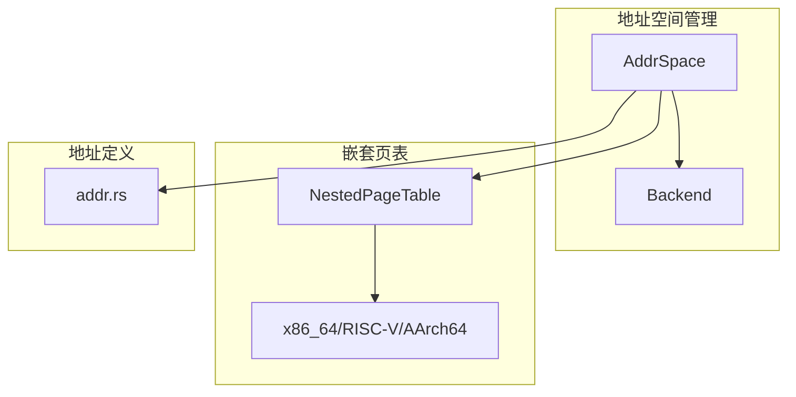
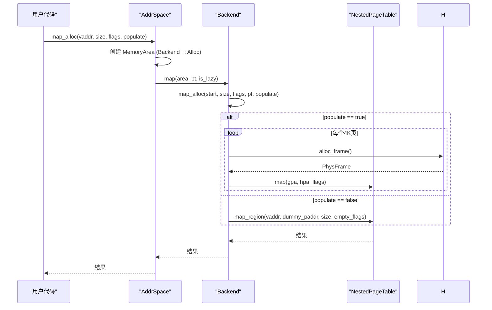

# 地址转换与查询

<cite>
**本文档引用的文件**  
- [src/lib.rs](file://src/lib.rs)
- [src/address_space/mod.rs](file://src/address_space/mod.rs)
- [src/address_space/backend/mod.rs](file://src/address_space/backend/mod.rs)
- [src/address_space/backend/alloc.rs](file://src/address_space/backend/alloc.rs)
- [src/address_space/backend/linear.rs](file://src/address_space/backend/linear.rs)
- [src/npt/mod.rs](file://src/npt/mod.rs)
- [src/npt/arch/x86_64.rs](file://src/npt/arch/x86_64.rs)
- [src/npt/arch/riscv.rs](file://src/npt/arch/riscv.rs)
- [src/npt/arch/aarch64.rs](file://src/npt/arch/aarch64.rs)
- [src/addr.rs](file://src/addr.rs)
</cite>

## 目录
1. [简介](#简介)
2. [项目结构](#项目结构)
3. [核心组件](#核心组件)
4. [地址转换机制](#地址转换机制)
5. [查询接口与映射信息](#查询接口与映射信息)
6. [两级映射架构](#两级映射架构)
7. [跨区域映射与边界处理](#跨区域映射与边界处理)
8. [性能分析与缓存优化](#性能分析与缓存优化)
9. [示例代码与调用流程](#示例代码与调用流程)
10. [结论](#结论)

## 简介
本文档详细阐述了 ArceOS-Hypervisor 中 `axaddrspace` 模块的地址转换与查询功能，重点分析 `translate` 和 `translate_virt` 接口的实现机制。文档解释了客户虚拟机的虚拟地址（Guest Virtual Address）如何通过两级页表机制转换为宿主机物理地址（Host Physical Address），并深入探讨 `AddrSpace` 如何协调 `Backend` 与 `NestedPageTable` 完成地址解析。同时，文档还说明了查询接口返回的映射信息结构及其在页错误处理和内存访问审计中的应用，并分析其性能特性与优化潜力。

## 项目结构
`axaddrspace` 模块采用分层架构，核心功能分布在多个子模块中：

- `address_space`：提供地址空间管理，包括 `AddrSpace` 结构体和 `Backend` 映射后端。
- `npt`：实现嵌套页表（Nested Page Table），支持多架构（x86_64, RISC-V, AArch64）。
- `backend`：定义线性映射和分配映射两种后端实现。
- `addr`：定义地址类型，如 `GuestPhysAddr` 和 `HostPhysAddr`。
- `device`：处理设备地址映射。



**Diagram sources**
- [src/address_space/mod.rs](file://src/address_space/mod.rs#L1-L589)
- [src/npt/mod.rs](file://src/npt/mod.rs#L1-L15)
- [src/addr.rs](file://src/addr.rs#L1-L37)

**Section sources**
- [src/address_space/mod.rs](file://src/address_space/mod.rs#L1-L589)
- [src/npt/mod.rs](file://src/npt/mod.rs#L1-L15)

## 核心组件
本模块的核心组件包括：

- `AddrSpace<H>`：代表客户虚拟机的虚拟地址空间，封装了内存区域（`MemorySet`）和嵌套页表（`NestedPageTable`）。
- `Backend<H>`：内存映射后端，分为 `Linear` 和 `Alloc` 两种类型，决定物理帧的分配策略。
- `NestedPageTable<H>`：架构相关的嵌套页表实现，负责实际的地址查询与转换。
- `GuestPhysAddr`：客户物理地址类型，用于在客户机视角下进行寻址。

**Section sources**
- [src/address_space/mod.rs](file://src/address_space/mod.rs#L1-L589)
- [src/address_space/backend/mod.rs](file://src/address_space/backend/mod.rs#L1-L111)
- [src/addr.rs](file://src/addr.rs#L1-L37)

## 地址转换机制
地址转换的核心是 `AddrSpace` 提供的 `translate` 接口，它将客户虚拟地址（GVA）转换为宿主机物理地址（HPA）。

### 转换流程
1. **范围检查**：首先检查输入的虚拟地址是否在 `AddrSpace` 的有效范围内。
2. **页表查询**：调用 `NestedPageTable::query` 方法，在嵌套页表中查找该地址对应的页表项（PTE）。
3. **物理地址提取**：从 PTE 中提取出宿主机物理地址（HPA）。
4. **返回结果**：若映射存在，返回 HPA；否则返回 `None`。

```mermaid
flowchart TD
Start([开始 translate(vaddr)]) --> RangeCheck["检查 vaddr 是否在范围内"]
RangeCheck --> |否| ReturnNone["返回 None"]
RangeCheck --> |是| QueryNPT["调用 NestedPageTable::query(vaddr)"]
QueryNPT --> |成功| ExtractPAddr["从 PTE 提取 HPA"]
ExtractPAddr --> ReturnHPA["返回 HPA"]
QueryNPT --> |失败| ReturnNone
ReturnHPA --> End([结束])
ReturnNone --> End
```

**Diagram sources**
- [src/address_space/mod.rs](file://src/address_space/mod.rs#L200-L215)
- [src/npt/arch/x86_64.rs](file://src/npt/arch/x86_64.rs#L1-L191)

**Section sources**
- [src/address_space/mod.rs](file://src/address_space/mod.rs#L200-L215)

### 两级映射机制
该转换过程本质上是两级映射：
1. **第一级（客户机）**：客户操作系统使用客户页表将 GVA 映射为 GPA（客户物理地址）。
2. **第二级（虚拟机监控器）**：Hypervisor 使用嵌套页表（NPT）将 GPA 映射为 HPA。

`AddrSpace::translate` 实现的是第二级映射，它假设输入的 `vaddr` 已经是 GPA（在客户机上下文中称为“虚拟地址”），并将其转换为最终的 HPA。

## 查询接口与映射信息
除了基本的地址转换，模块还提供了更丰富的查询接口。

### translate 接口
`translate` 是最基础的查询接口，定义如下：
```rust
pub fn translate(&self, vaddr: GuestPhysAddr) -> Option<PhysAddr>
```
它返回一个 `Option<PhysAddr>`，其中 `PhysAddr` 是宿主机物理地址。

### translate_and_get_limit 接口
此接口不仅返回物理地址，还返回该地址所在内存区域的大小：
```rust
pub fn translate_and_get_limit(&self, vaddr: GuestPhysAddr) -> Option<(PhysAddr, usize)>
```
这对于内存访问审计非常有用，可以确定一次访问是否跨越了内存区域边界。

### 返回的映射信息
查询成功时，返回的信息包括：
- **物理地址 (HPA)**：宿主机上的实际物理地址。
- **权限标志 (MappingFlags)**：从 PTE 中解析出的读、写、执行权限。
- **内存类型**：通过架构特定的 PTE（如 x86 EPTEntry 或 AArch64 A64PTEHV）的属性字段确定，例如普通内存或设备内存。

这些信息在以下场景中至关重要：
- **页错误处理**：当发生嵌套页错误时，`NestedPageFaultInfo` 结构体记录了错误的访问类型和 GPA，用于动态分配物理帧。
- **内存访问审计**：在虚拟机监控器中，可以拦截内存访问，检查其权限和目标区域，实现安全策略。

**Section sources**
- [src/address_space/mod.rs](file://src/address_space/mod.rs#L200-L215)
- [src/address_space/mod.rs](file://src/address_space/mod.rs#L250-L275)
- [src/lib.rs](file://src/lib.rs#L20-L25)

## 两级映射架构
`AddrSpace` 是协调两级映射的核心，它通过组合 `Backend` 和 `NestedPageTable` 来实现。

### 组件协作
- `AddrSpace`：作为高层管理器，负责维护内存区域（`MemorySet`）和调用底层组件。
- `Backend`：决定物理帧的来源。`Linear` 后端用于已知物理地址的直接映射，`Alloc` 后端用于从全局分配器动态分配。
- `NestedPageTable`：作为底层硬件抽象，直接操作页表结构，执行映射、解映射和查询操作。

### 协调流程
当调用 `map_alloc` 创建一个映射时：
1. `AddrSpace` 创建一个 `MemoryArea`，指定其 `Backend` 为 `Alloc`。
2. `AddrSpace` 调用 `MemorySet::map`，后者通过 `Backend::map` 委托给 `Backend`。
3. `Backend::map_alloc` 根据 `populate` 参数决定是立即分配所有物理帧，还是仅创建一个空的页表项。
4. 对于立即分配，`Backend` 会循环调用 `H::alloc_frame` 获取物理帧，并通过 `NestedPageTable::map` 将其映射到 GPA。
5. 对于延迟分配，`Backend` 调用 `NestedPageTable::map_region` 创建一个权限为空的页表项，触发页错误。



**Diagram sources**
- [src/address_space/mod.rs](file://src/address_space/mod.rs#L100-L150)
- [src/address_space/backend/mod.rs](file://src/address_space/backend/mod.rs#L50-L80)
- [src/address_space/backend/alloc.rs](file://src/address_space/backend/alloc.rs#L10-L50)

**Section sources**
- [src/address_space/mod.rs](file://src/address_space/mod.rs#L100-L150)
- [src/address_space/backend/mod.rs](file://src/address_space/backend/mod.rs#L1-L111)

## 跨区域映射与边界处理
`AddrSpace` 通过 `MemorySet` 管理多个不连续的 `MemoryArea`，每个区域可以有不同的 `Backend` 和权限。

### 边界检查
- **范围检查**：`contains_range` 方法确保任何映射、解映射或查询操作都在 `AddrSpace` 的 `va_range` 内。
- **对齐检查**：所有操作都要求地址和大小按 4KB 对齐，这是页表的基本单位。

### 跨区域访问
`translated_byte_buffer` 接口专门处理可能跨越多个页表项的缓冲区访问：
1. 它首先在 `MemorySet` 中找到包含起始地址的 `MemoryArea`。
2. 然后从起始地址开始，逐页进行页表查询（`query`）。
3. 对于每一页，它计算该页在宿主机上的虚拟地址（通过 `H::phys_to_virt`），并创建一个指向该内存的 `&mut [u8]` 切片。
4. 所有切片被收集到一个 `Vec` 中返回，允许用户像操作连续内存一样操作分散的物理帧。

这种设计优雅地处理了跨页、跨区域甚至跨物理帧的访问，是实现高效 I/O 操作的基础。

**Section sources**
- [src/address_space/mod.rs](file://src/address_space/mod.rs#L217-L250)
- [src/address_space/mod.rs](file://src/address_space/mod.rs#L60-L75)

## 性能分析与缓存优化
地址转换是虚拟化中的性能敏感路径，其延迟直接影响客户机性能。

### 延迟特性
- **TLB 命中**：如果转换结果在 TLB（转换后备缓冲）中，延迟极低（几个 CPU 周期）。
- **TLB 未命中**：需要遍历多级页表（通常 3-4 级），涉及多次内存访问，延迟较高（数百周期）。
- **页错误处理**：延迟最高，涉及调用 `H::alloc_frame` 分配物理帧，然后更新页表，最后刷新 TLB。

### 缓存优化可能性
- **TLB 预取**：在创建大块映射时，可以考虑预热 TLB，但这通常由硬件自动处理。
- **大页映射 (Huge Page)**：使用 2MB 或 1GB 的大页可以减少页表级数和 TLB 项数量，显著降低 TLB 未命中率。代码中 `EPTEntry` 和 `A64PTEHV` 都支持 `HUGE_PAGE` 标志。
- **批量操作**：`map_region` 和 `unmap_region` 等接口允许批量操作，减少函数调用开销。
- **惰性分配**：对于不常访问的内存，使用 `map_alloc` 并设置 `populate=false`，可以节省物理内存并避免不必要的分配开销。

**Section sources**
- [src/npt/arch/x86_64.rs](file://src/npt/arch/x86_64.rs#L1-L191)
- [src/npt/arch/aarch64.rs](file://src/npt/arch/aarch64.rs#L1-L262)

## 示例代码与调用流程
以下代码展示了如何使用 `AddrSpace` 进行地址转换：

```rust
// 1. 创建地址空间
let mut addr_space = AddrSpace::<MockHal>::new_empty(GuestPhysAddr::from_usize(0x10000), 0x10000)?;

// 2. 创建一个立即分配的映射
let vaddr = GuestPhysAddr::from_usize(0x18000);
let flags = MappingFlags::READ | MappingFlags::WRITE;
addr_space.map_alloc(vaddr, 0x2000, flags, true)?; // 映射8KB，立即分配

// 3. 执行地址转换
let paddr = addr_space.translate(vaddr).expect("转换失败");
println!("GPA {:#x} 转换为 HPA {:#x}", vaddr, paddr);

// 4. 处理页错误（惰性分配场景）
// addr_space.handle_page_fault(fault_gpa, fault_flags); // 在页错误处理程序中调用
```

**Section sources**
- [src/address_space/mod.rs](file://src/address_space/mod.rs#L300-L400)
- [src/address_space/mod.rs](file://src/address_space/mod.rs#L500-L550)

## 结论
`axaddrspace` 模块通过 `AddrSpace`、`Backend` 和 `NestedPageTable` 的协同工作，实现了高效且灵活的客户机地址到宿主机物理地址的转换。`translate` 和 `translate_and_get_limit` 接口提供了基础的查询能力，而 `Backend` 的设计支持线性映射和惰性分配等多种策略。该架构不仅满足了基本的地址转换需求，还为页错误处理、内存审计和性能优化提供了坚实的基础。通过利用大页和合理的映射策略，可以进一步优化其在性能敏感场景下的表现。