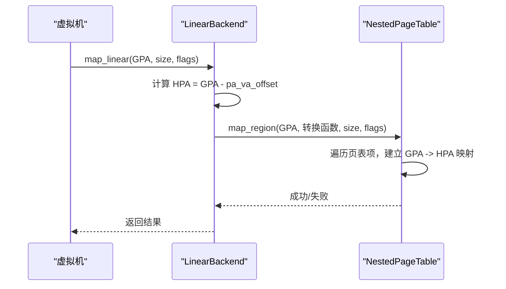
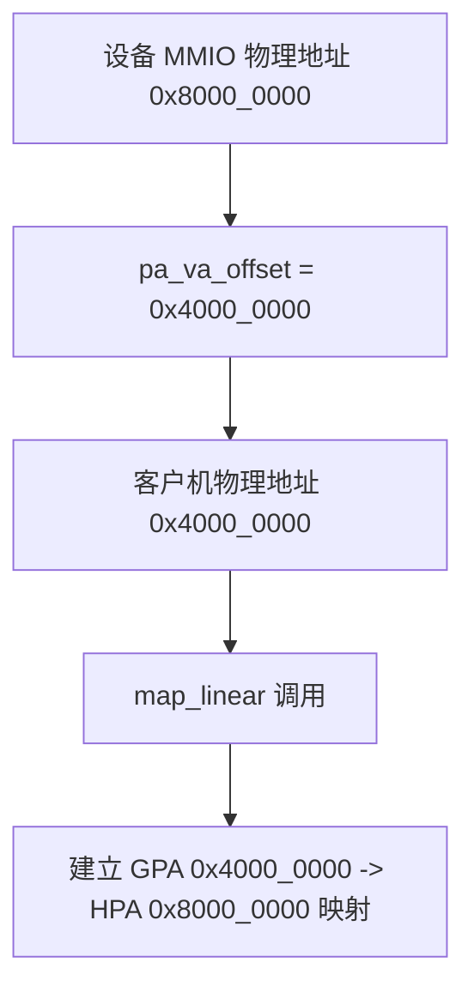
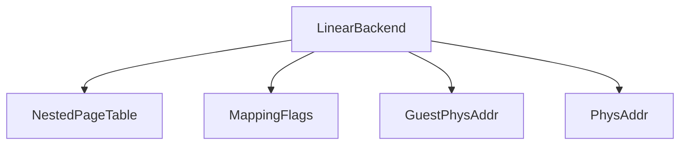

# 线性映射

<cite>
**本文档引用文件**  
- [linear.rs](file://src/address_space/backend/linear.rs)
- [mod.rs](file://src/address_space/backend/mod.rs)
- [alloc.rs](file://src/address_space/backend/alloc.rs)
- [mod.rs](file://src/npt/mod.rs)
- [lib.rs](file://src/lib.rs)
- [addr.rs](file://src/addr.rs)
- [device_addr.rs](file://src/device/device_addr.rs)
</cite>

## 目录
1. [引言](#引言)
2. [项目结构](#项目结构)
3. [核心组件](#核心组件)
4. [架构概述](#架构概述)
5. [详细组件分析](#详细组件分析)
6. [依赖分析](#依赖分析)
7. [性能考量](#性能考量)
8. [故障排除指南](#故障排除指南)
9. [结论](#结论)

## 引言
本文档深入探讨了 `axaddrspace` 模块中线性映射功能的实现机制，重点分析 `map_linear` 接口如何将虚拟地址区间连续、直接地映射到物理地址空间。该机制适用于设备内存（如 MMIO 区域）或固定物理区域的映射场景。文档详细解释了 `LinearBackend` 的内部结构、地址对齐处理、内存权限控制（`MappingFlags`）以及与嵌套页表的协作方式，并说明其在虚拟化环境中的典型应用、错误处理路径和安全边界。

## 项目结构
`axaddrspace` 是 ArceOS-Hypervisor 中用于管理客户机虚拟机地址空间的核心模块。其主要功能包括地址空间的创建、映射管理、页表操作和设备内存访问支持。模块采用分层设计，核心组件位于 `src/address_space/backend` 目录下，支持线性映射和动态分配映射两种后端。

```mermaid
graph TB
subgraph "核心模块"
Backend[backend]
NPT[Nested Page Table]
Addr[地址类型]
Device[设备地址]
end
Backend --> NPT : "操作页表"
Backend --> Addr : "使用地址类型"
Device --> Addr : "实现设备地址"
```

**Diagram sources**
- [mod.rs](file://src/address_space/backend/mod.rs#L1-L110)
- [addr.rs](file://src/addr.rs#L1-L36)

**Section sources**
- [mod.rs](file://src/address_space/backend/mod.rs#L1-L110)
- [addr.rs](file://src/addr.rs#L1-L36)

## 核心组件
本模块的核心是 `Backend<H>` 枚举，它统一了不同的内存映射后端。`Linear` 后端用于已知物理地址的连续映射，而 `Alloc` 后端用于需要从全局分配器获取物理帧的通用或延迟映射场景。`LinearBackend` 的核心是通过一个固定的偏移量（`pa_va_offset`）将虚拟地址转换为物理地址。

**Section sources**
- [mod.rs](file://src/address_space/backend/mod.rs#L1-L110)
- [linear.rs](file://src/address_space/backend/linear.rs#L1-L51)

## 架构概述
线性映射的架构基于一个简单的数学关系：物理地址 = 虚拟地址 - 偏移量。该偏移量在创建 `Linear` 后端时指定。映射操作通过调用嵌套页表（`NestedPageTable`）的 `map_region` 方法完成，该方法由 `map_linear` 函数封装。整个流程不涉及物理内存的动态分配，因此性能开销极低。


**Diagram sources**
- [linear.rs](file://src/address_space/backend/linear.rs#L15-L30)
- [mod.rs](file://src/npt/mod.rs#L1-L14)

## 详细组件分析

### LinearBackend 分析
`LinearBackend` 并非一个独立的结构体，而是 `Backend<H>` 枚举的一个变体 `Linear { pa_va_offset: usize }`。其工作原理是利用一个预设的 `pa_va_offset` 值，将客户机物理地址（GPA）直接转换为宿主机物理地址（HPA）。

#### 地址转换与映射流程
当调用 `map_linear` 时，系统首先将起始的客户机物理地址（`start`）减去 `pa_va_offset`，得到目标宿主机物理地址的起始点。然后，它使用 `NestedPageTable` 的 `map_region` 方法，将从 `start` 开始的 `size` 大小的虚拟地址区域，通过一个闭包函数 `|va| PhysAddr::from(va.as_usize() - pa_va_offset)` 映射到连续的物理地址空间。



**Diagram sources**
- [linear.rs](file://src/address_space/backend/linear.rs#L15-L30)
- [mod.rs](file://src/address_space/backend/mod.rs#L70-L80)

#### 内存权限与安全边界
映射的内存权限由 `MappingFlags` 参数控制，该参数在调用 `map_linear` 时传入。`MappingFlags` 定义了页面的可读、可写、可执行等属性。由于线性映射是直接且静态的，其安全边界依赖于 `pa_va_offset` 的正确配置和 `MappingFlags` 的严格设置。错误的偏移量可能导致映射到错误的物理内存区域，构成安全风险。

**Section sources**
- [linear.rs](file://src/address_space/backend/linear.rs#L15-L51)
- [mod.rs](file://src/address_space/backend/mod.rs#L70-L80)

### 设备内存映射示例
为设备 MMIO 区域建立线性映射是一个典型用例。假设设备的 MMIO 物理地址从 `0x8000_0000` 开始，我们希望将其映射到客户机物理地址 `0x4000_0000`。此时，`pa_va_offset` 应设置为 `0x4000_0000`。调用 `new_linear(0x4000_0000)` 创建后端，然后调用 `map` 方法即可完成映射。



**Diagram sources**
- [device_addr.rs](file://src/device/device_addr.rs#L1-L97)
- [linear.rs](file://src/address_space/backend/linear.rs#L15-L30)

### 映射生命周期管理
线性映射的生命周期由 `map_linear` 和 `unmap_linear` 函数管理。`unmap_linear` 函数通过调用 `NestedPageTable` 的 `unmap_region` 方法来移除指定区域的映射。由于线性映射不涉及物理内存的分配，因此 `unmap` 操作仅更新页表，不会释放物理内存。

**Section sources**
- [linear.rs](file://src/address_space/backend/linear.rs#L32-L51)

## 依赖分析
`LinearBackend` 的实现依赖于多个关键组件：
- `NestedPageTable`: 提供底层的页表操作接口，如 `map_region` 和 `unmap_region`。
- `MappingFlags`: 定义内存映射的权限和属性。
- `GuestPhysAddr` 和 `PhysAddr`: 分别表示客户机物理地址和宿主机物理地址，是地址转换的基础。



**Diagram sources**
- [mod.rs](file://src/address_space/backend/mod.rs#L1-L110)
- [lib.rs](file://src/lib.rs#L1-L48)

## 性能考量
线性映射模式具有极高的性能优势：
- **低开销**: 映射过程是纯计算和页表更新，无需内存分配或复杂的查找。
- **无缺页中断**: 由于映射是预先建立的，访问映射区域不会触发缺页中断（`handle_page_fault` 对 `Linear` 返回 `false`）。
- **确定性**: 映射关系是固定的，访问延迟可预测。

然而，其灵活性较低，仅适用于物理地址已知且连续的场景。

## 故障排除指南
线性映射的主要错误处理路径包括：
- **重叠映射检测**: 由底层 `NestedPageTable` 的 `map_region` 方法处理。如果目标区域已存在映射，操作会失败并返回错误。
- **权限冲突**: 如果新映射的权限与现有权限冲突，`map_region` 或 `protect_region` 会返回错误。
- **无效参数**: 如地址或大小未对齐，也会导致映射失败。

**Section sources**
- [linear.rs](file://src/address_space/backend/linear.rs#L15-L51)
- [mod.rs](file://src/address_space/backend/mod.rs#L70-L80)

## 结论
`LinearBackend` 提供了一种高效、直接的内存映射机制，特别适用于设备 MMIO 和固定内存区域的虚拟化场景。其核心在于利用固定的地址偏移量，通过嵌套页表实现虚拟地址到物理地址的连续映射。该设计简单、性能优越，但要求物理地址在映射时已知。开发者在使用时需确保 `pa_va_offset` 的正确性，并合理设置 `MappingFlags` 以保障系统安全。