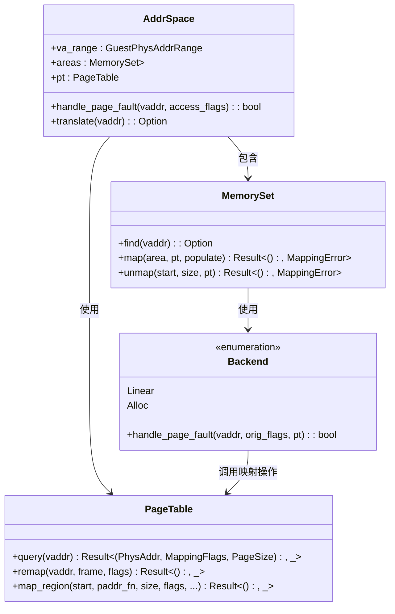
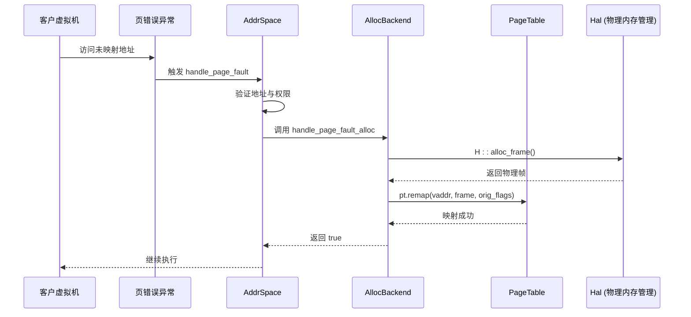

# 页错误处理

<cite>
**本文档中引用的文件**   
- [mod.rs](file://src/address_space/mod.rs)
- [alloc.rs](file://src/address_space/backend/alloc.rs)
- [mod.rs](file://src/address_space/backend/mod.rs)
- [mod.rs](file://src/npt/mod.rs)
- [lib.rs](file://src/lib.rs)
- [test_utils/mod.rs](file://src/test_utils/mod.rs)
</cite>

## 目录
1. [简介](#简介)
2. [核心机制概述](#核心机制概述)
3. [页错误处理流程](#页错误处理流程)
4. [动态分配后端协同机制](#动态分配后端协同机制)
5. [写时复制支持](#写时复制支持)
6. [实际场景与代码路径分析](#实际场景与代码路径分析)
7. [常见故障点与调试方法](#常见故障点与调试方法)
8. [性能影响与中断延迟优化](#性能影响与中断延迟优化)
9. [结论](#结论)

## 简介
本文档深入分析虚拟机监控器中客户虚拟机访问未映射或权限不足的虚拟地址时触发的页错误处理机制。重点解析 `handle_page_fault` 方法的实现逻辑，阐述系统如何捕获页错误并交由 `AddrSpace` 进行处理。详细说明地址合法性验证、映射策略触发（如缺页分配）、权限校验及异常注入等关键步骤，并探讨该机制如何与动态分配后端（`AllocBackend`）协作实现按需分页和写时复制（COW）等高级特性。

## 核心机制概述

`AddrSpace` 结构体是虚拟内存地址空间的核心管理单元，包含虚拟地址范围、内存区域集合和嵌套页表。当客户虚拟机发生页错误时，`handle_page_fault` 方法被调用，负责判断是否为合法访问并尝试处理。



**Diagram sources**  
- [mod.rs](file://src/address_space/mod.rs#L47-L280)
- [backend/mod.rs](file://src/address_space/backend/mod.rs#L1-L110)

**Section sources**
- [mod.rs](file://src/address_space/mod.rs#L47-L280)

## 页错误处理流程

页错误处理流程始于 `handle_page_fault` 方法的调用。该方法首先验证虚拟地址是否在地址空间范围内，然后查找对应的内存区域。若区域存在且访问权限符合原始映射标志，则调用后端的页错误处理函数。

```mermaid
flowchart TD
A[开始 handle_page_fault] --> B{vaddr 在 va_range 内？}
B --> |否| C[返回 false]
B --> |是| D[查找 MemoryArea]
D --> E{区域存在？}
E --> |否| C
E --> |是| F{access_flags ⊆ orig_flags？}
F --> |否| C
F --> |是| G[调用 area.backend().handle_page_fault]
G --> H[返回处理结果]
```

**Diagram sources**  
- [mod.rs](file://src/address_space/mod.rs#L120-L160)

**Section sources**
- [mod.rs](file://src/address_space/mod.rs#L120-L160)

### 地址合法性验证
系统通过 `va_range.contains(vaddr)` 检查虚拟地址是否在预定义的地址空间范围内。此步骤确保所有访问均在合法边界内进行。

### 权限校验
通过比较 `access_flags` 与 `orig_flags`，系统验证当前访问类型（读/写/执行）是否被允许。若访问超出原始映射权限，页错误将不被处理。

### 映射策略触发
对于使用 `Alloc` 后端的懒加载映射（`populate = false`），页错误将触发物理帧的动态分配与映射。这一过程由 `handle_page_fault_alloc` 实现。

## 动态分配后端协同机制

`AllocBackend` 是实现按需分页的关键组件。当创建映射时，若 `populate` 参数为 `false`，系统仅在页表中建立空条目，不立即分配物理内存。



**Diagram sources**  
- [alloc.rs](file://src/address_space/backend/alloc.rs#L55-L96)
- [mod.rs](file://src/address_space/backend/mod.rs#L1-L110)

**Section sources**
- [alloc.rs](file://src/address_space/backend/alloc.rs#L55-L96)

## 写时复制支持

虽然当前代码未直接展示写时复制（COW）的完整实现，但其架构已为COW提供基础支持。通过将 `MappingFlags` 设置为只读并在写操作时触发页错误，可在 `handle_page_fault` 中实现COW逻辑：检测到写操作后，复制物理页并更新映射为可写。

## 实际场景与代码路径分析

### 懒加载映射触发页错误
1. 调用 `map_alloc(vaddr, size, flags, false)` 创建懒加载映射。
2. 客户虚拟机访问该地址，触发页错误。
3. 调用 `handle_page_fault(vaddr, access_flags)`。
4. 查找区域并验证权限。
5. 调用 `AllocBackend::handle_page_fault_alloc`。
6. 分配物理帧并通过 `pt.remap` 建立映射。

**Section sources**
- [mod.rs](file://src/address_space/mod.rs#L382-L416)
- [alloc.rs](file://src/address_space/backend/alloc.rs#L55-L96)

## 常见故障点与调试方法

### 常见故障点
- **地址越界**：访问超出 `va_range` 的地址。
- **权限不足**：尝试写入只读映射区域。
- **物理内存耗尽**：`H::alloc_frame()` 返回 `None`。
- **页表结构损坏**：`pt.remap` 失败。

### 调试方法
- 启用日志输出，观察 `debug!` 和 `warn!` 信息。
- 使用测试框架验证各功能路径，如 `test_page_fault_handling`。
- 检查 `ALLOC_COUNT` 和 `DEALLOC_COUNT` 原子计数器，确保内存分配/释放平衡。

**Section sources**
- [test_utils/mod.rs](file://src/test_utils/mod.rs#L122-L152)
- [mod.rs](file://src/address_space/mod.rs#L382-L416)

## 性能影响与中断延迟优化

页错误处理涉及内存分配和页表更新，可能引入显著延迟。优化策略包括：
- **预分配中间页表页**：减少 `pt.remap` 时的分配开销。
- **批量映射**：对连续访问模式采用预取策略。
- **TLB 刷新优化**：延迟刷新以减少上下文切换开销。

**Section sources**
- [mod.rs](file://src/address_space/mod.rs#L120-L160)
- [alloc.rs](file://src/address_space/backend/alloc.rs#L55-L96)

## 结论
`handle_page_fault` 机制通过与 `AllocBackend` 协同工作，实现了高效的按需分页。该设计不仅支持基本的缺页处理，还为写时复制等高级内存管理特性提供了扩展基础。通过合理的权限校验与错误处理流程，系统能够在保证安全性的前提下提供灵活的内存映射服务。