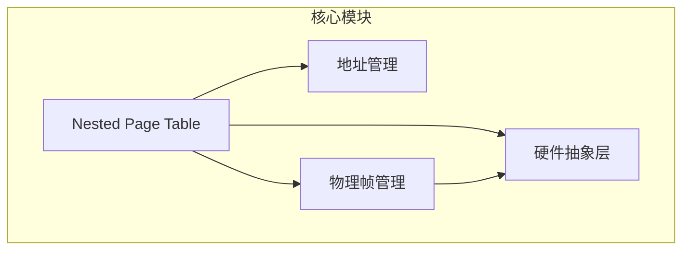
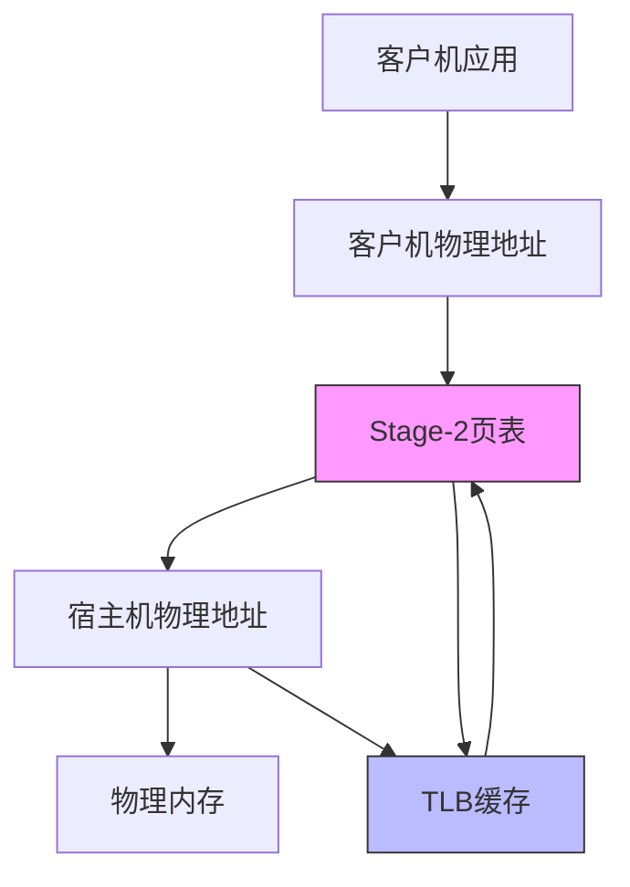
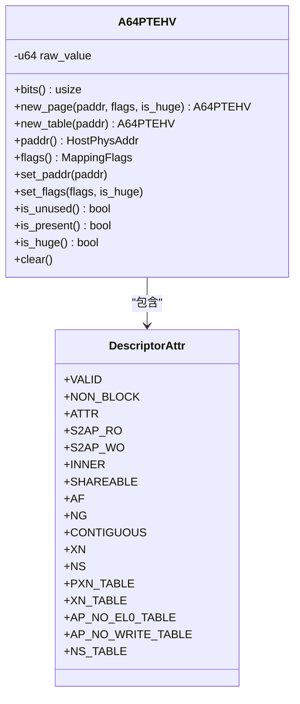
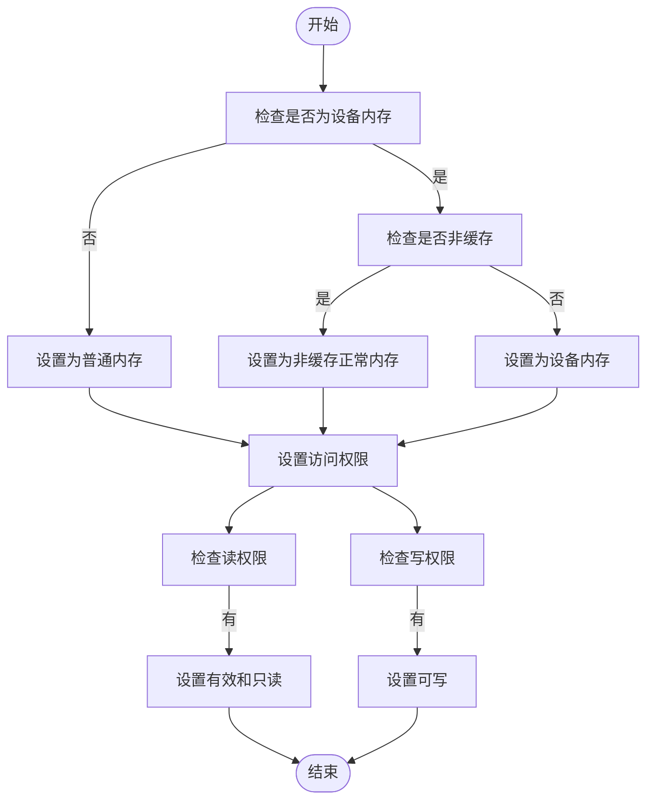
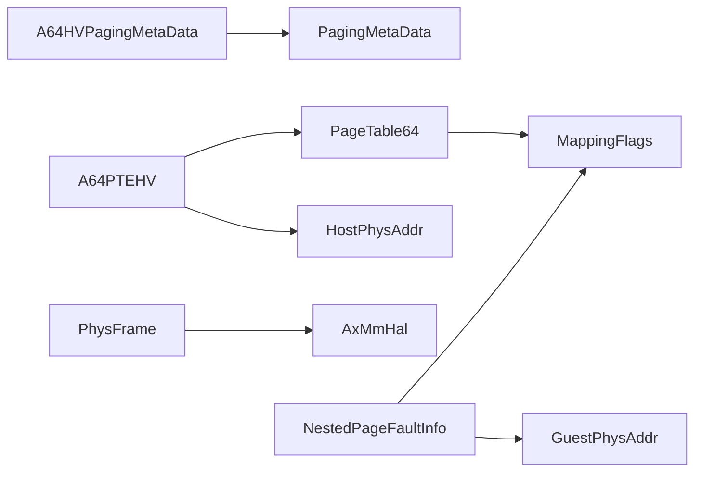

# AArch64架构下的嵌套页表实现

<cite>
**本文档引用的文件**
- [aarch64.rs](file://src/npt/arch/aarch64.rs)
- [mod.rs](file://src/npt/mod.rs)
- [lib.rs](file://src/lib.rs)
- [addr.rs](file://src/addr.rs)
- [frame.rs](file://src/frame.rs)
- [hal.rs](file://src/hal.rs)
</cite>

## 目录
1. [引言](#引言)
2. [项目结构](#项目结构)
3. [核心组件](#核心组件)
4. [架构概述](#架构概述)
5. [详细组件分析](#详细组件分析)
6. [依赖分析](#依赖分析)
7. [性能考虑](#性能考虑)
8. [故障排除指南](#故障排除指南)
9. [结论](#结论)

## 引言
本文档全面解析AArch64平台上嵌套页表的实现，聚焦ARM的Stage-2地址转换机制。深入讲解`aarch64.rs`中如何配置和管理虚拟化页表（Stage-2 PT），包括MMU控制寄存器设置、内存属性转换和粒度控制。分析HCR_EL2、VTCR_EL2等系统寄存器的配置策略及其对地址转换的影响。说明Stage-2页表项的构造、权限映射规则以及与EL2异常处理的联动机制。结合实例展示从客户机页错误到宿主机处理的完整流程，并讨论TLB一致性维护和性能调优建议。

## 项目结构
本项目实现了AArch64架构下的嵌套页表管理机制，主要结构如下：
- `src/npt/arch/aarch64.rs`：AArch64架构特定的嵌套页表实现
- `src/npt/mod.rs`：嵌套页表的架构抽象层
- `src/addr.rs`：地址类型定义
- `src/frame.rs`：物理帧管理
- `src/hal.rs`：内存管理硬件抽象层



**图示来源**
- [aarch64.rs](file://src/npt/arch/aarch64.rs)
- [addr.rs](file://src/addr.rs)
- [frame.rs](file://src/frame.rs)
- [hal.rs](file://src/hal.rs)

**本节来源**
- [aarch64.rs](file://src/npt/arch/aarch64.rs)
- [mod.rs](file://src/npt/mod.rs)

## 核心组件
文档的核心组件包括AArch64架构下的Stage-2页表实现，主要涉及页表项（PTE）的构造、内存属性转换、TLB刷新机制等。这些组件共同实现了虚拟机监控器中的地址转换功能。

**本节来源**
- [aarch64.rs](file://src/npt/arch/aarch64.rs#L1-L261)
- [lib.rs](file://src/lib.rs#L1-L48)

## 架构概述
AArch64的嵌套页表架构基于Stage-2地址转换机制，实现了从客户机物理地址（GPA）到宿主机物理地址（HPA）的映射。该架构通过VMSAv8-64转换表格式描述符实现两级地址转换。



**图示来源**
- [aarch64.rs](file://src/npt/arch/aarch64.rs#L1-L261)
- [addr.rs](file://src/addr.rs#L1-L36)

## 详细组件分析

### Stage-2页表项分析
AArch64的Stage-2页表项（A64PTEHV）实现了VMSAv8-64转换表描述符，包含有效的位、内存属性、访问权限等关键字段。



**图示来源**
- [aarch64.rs](file://src/npt/arch/aarch64.rs#L13-L72)
- [aarch64.rs](file://src/npt/arch/aarch64.rs#L117-L154)

**本节来源**
- [aarch64.rs](file://src/npt/arch/aarch64.rs#L1-L261)

### 内存属性转换分析
内存属性转换机制将通用的映射标志（MappingFlags）转换为AArch64特定的描述符属性（DescriptorAttr），支持设备内存、普通内存和非缓存内存类型的区分。



**图示来源**
- [aarch64.rs](file://src/npt/arch/aarch64.rs#L117-L154)
- [aarch64.rs](file://src/npt/arch/aarch64.rs#L43-L72)

**本节来源**
- [aarch64.rs](file://src/npt/arch/aarch64.rs#L72-L117)

### TLB刷新机制分析
TLB刷新机制实现了针对特定虚拟地址或整个TLB的刷新操作，确保地址转换的一致性。

```mermaid
sequenceDiagram
participant VM as "虚拟机"
participant Hypervisor as "虚拟机监控器"
participant Hardware as "硬件"
VM->>Hypervisor : 触发页错误
Hypervisor->>Hypervisor : 更新页表
Hypervisor->>Hardware : 执行TLB刷新指令
alt 刷新特定地址
Hardware->>Hardware : tlbi vae2is, {vaddr}
else 刷新全部
Hardware->>Hardware : tlbi alle2is
end
Hardware->>Hardware : dsb sy; isb
Hardware-->>Hypervisor : 刷新完成
Hypervisor-->>VM : 恢复执行
```

**图示来源**
- [aarch64.rs](file://src/npt/arch/aarch64.rs#L154-L225)
- [addr.rs](file://src/addr.rs#L25-L36)

**本节来源**
- [aarch64.rs](file://src/npt/arch/aarch64.rs#L154-L261)

## 依赖分析
嵌套页表实现依赖于多个核心组件，包括地址管理、物理帧管理和硬件抽象层。



**图示来源**
- [aarch64.rs](file://src/npt/arch/aarch64.rs)
- [frame.rs](file://src/frame.rs)
- [hal.rs](file://src/hal.rs)
- [lib.rs](file://src/lib.rs)

**本节来源**
- [aarch64.rs](file://src/npt/arch/aarch64.rs)
- [frame.rs](file://src/frame.rs)
- [hal.rs](file://src/hal.rs)

## 性能考虑
在AArch64嵌套页表实现中，性能优化主要集中在以下几个方面：
1. TLB刷新的粒度控制：尽量使用特定地址刷新而非全局刷新
2. 页表项的连续性标记：利用CONTIGUOUS位提示硬件优化
3. 内存属性的合理配置：避免不必要的缓存一致性开销
4. 大页映射的使用：减少页表层级和TLB压力

**本节来源**
- [aarch64.rs](file://src/npt/arch/aarch64.rs)
- [frame.rs](file://src/frame.rs)

## 故障排除指南
当遇到嵌套页表相关问题时，可参考以下排查步骤：

1. **检查页表项有效性**：确认页表项的VALID位是否正确设置
2. **验证地址对齐**：确保物理地址按页对齐
3. **检查内存属性**：确认内存类型（设备/普通）配置正确
4. **审查访问权限**：检查读、写、执行权限是否符合预期
5. **确认TLB状态**：在修改页表后执行适当的TLB刷新
6. **验证系统寄存器**：确保VTCR_EL2等寄存器配置正确

**本节来源**
- [aarch64.rs](file://src/npt/arch/aarch64.rs#L1-L261)
- [lib.rs](file://src/lib.rs#L30-L48)

## 结论
本文档详细分析了AArch64平台上嵌套页表的实现机制，重点介绍了Stage-2地址转换的核心组件。通过`aarch64.rs`中的实现，系统能够高效地管理客户机物理地址到宿主机物理地址的映射，支持虚拟化环境下的内存隔离和保护。该实现充分利用了AArch64架构的硬件特性，如TLB刷新指令、内存属性寄存器等，为虚拟机监控器提供了可靠的内存管理基础。