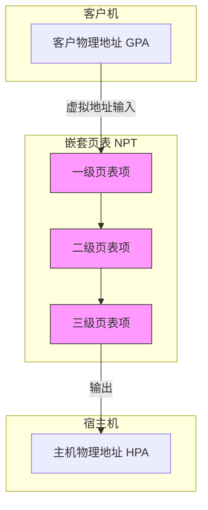
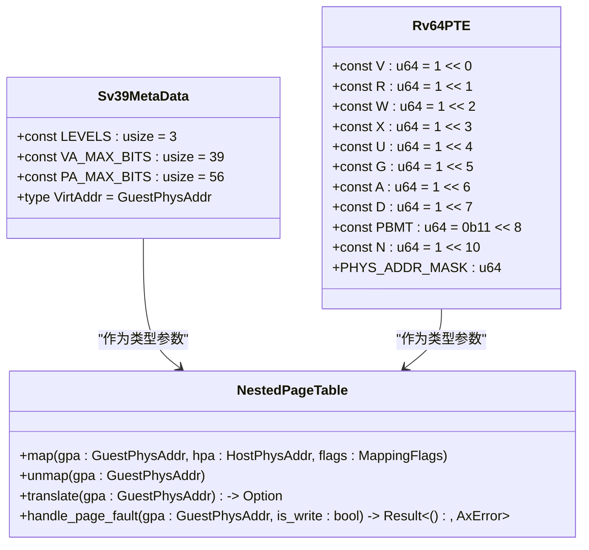
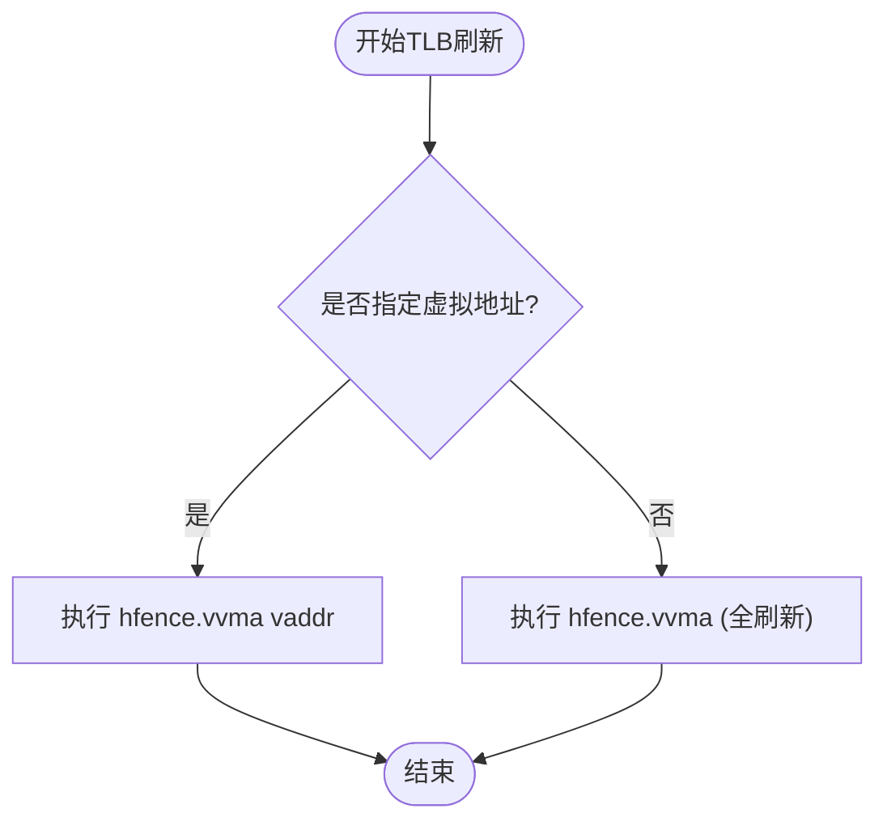
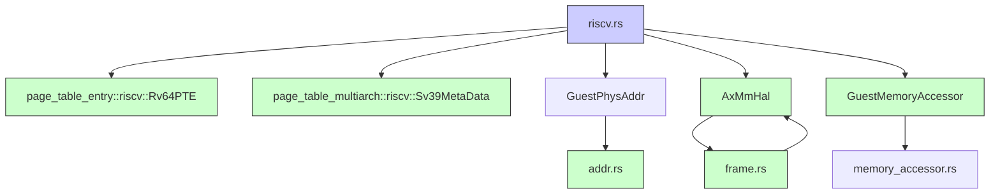

# RISC-V架构下的嵌套页表实现

<cite>
**本文档引用的文件**
- [riscv.rs](file://src/npt/arch/riscv.rs)
- [mod.rs](file://src/npt/mod.rs)
- [arch/mod.rs](file://src/npt/arch/mod.rs)
- [addr.rs](file://src/addr.rs)
- [hal.rs](file://src/hal.rs)
- [frame.rs](file://src/frame.rs)
- [memory_accessor.rs](file://src/memory_accessor.rs)
- [device_addr.rs](file://src/device/device_addr.rs)
</cite>

## 目录
1. [引言](#引言)
2. [项目结构](#项目结构)
3. [核心组件](#核心组件)
4. [架构概述](#架构概述)
5. [详细组件分析](#详细组件分析)
6. [依赖分析](#依赖分析)
7. [性能考虑](#性能考虑)
8. [故障排除指南](#故障排除指南)
9. [结论](#结论)

## 引言
本文档详细描述了RISC-V架构中嵌套页表（Nested Page Table, NPT）的实现机制，重点解析其基于Sv39x4或类似扩展的二级地址转换设计。分析riscv.rs中如何模拟或利用硬件支持实现客户物理地址到主机物理地址的映射。说明页表项格式、ASID管理、TLB刷新策略以及与RISC-V H扩展的交互逻辑。探讨在缺乏原生NPT硬件支持时的软件辅助方案及其性能开销。提供映射创建、页错误处理和地址翻译的代码路径分析，并说明其与通用NPT接口的适配方式。

## 项目结构
本项目采用模块化设计，主要分为地址空间管理、设备地址处理、嵌套页表实现、内存访问接口等核心模块。嵌套页表的架构相关实现位于`src/npt/arch/`目录下，通过条件编译支持RISC-V、x86_64和AArch64三种架构。`src/addr.rs`定义了各类地址类型，`src/hal.rs`提供了硬件抽象层接口，`src/frame.rs`实现了物理帧的分配与管理。

**Section sources**
- [riscv.rs](file://src/npt/arch/riscv.rs#L1-L6)
- [mod.rs](file://src/npt/mod.rs#L1-L14)
- [arch/mod.rs](file://src/npt/arch/mod.rs#L1-L14)

## 核心组件
嵌套页表的核心组件包括页表元数据（Sv39MetaData）、页表项（Rv64PTE）、地址类型（GuestPhysAddr）以及TLB刷新机制。`NestedPageTable<H>`类型通过泛型H指定宿主物理地址转换的硬件抽象层，实现了从客户物理地址（GPA）到主机物理地址（HPA）的两级映射。

**Section sources**
- [riscv.rs](file://src/npt/arch/riscv.rs#L1-L6)
- [addr.rs](file://src/addr.rs#L1-L36)

## 架构概述
RISC-V架构下的嵌套页表基于Sv39分页机制，采用三级页表结构（4KB页面，39位虚拟地址）。在虚拟化场景中，客户机的物理地址（GPA）作为嵌套页表的虚拟地址输入，通过宿主机的页表机制转换为真实的主机物理地址（HPA）。该设计利用RISC-V H扩展中的`hfence.vvma`指令实现TLB条目的选择性或全局刷新。

**Diagram sources**
- [riscv.rs](file://src/npt/arch/riscv.rs#L1-L6)
- [addr.rs](file://src/addr.rs#L30-L35)

## 详细组件分析

### RISC-V嵌套页表实现分析
`src/npt/arch/riscv.rs`文件定义了RISC-V架构专用的嵌套页表类型。它通过`PageTable64<Sv39MetaData<GuestPhysAddr>, Rv64PTE, H>`实例化一个64位的多级页表，其中`Sv39MetaData`提供Sv39分页方案的元数据（如页表级数、地址位宽），`Rv64PTE`定义了符合RISC-V规范的64位页表项格式。

#### 页表项与元数据

**Diagram sources**
- [riscv.rs](file://src/npt/arch/riscv.rs#L1-L6)

**Section sources**
- [riscv.rs](file://src/npt/arch/riscv.rs#L1-L6)

### TLB刷新策略分析
在RISC-V架构中，TLB刷新通过`hfence.vvma`指令实现。当嵌套页表发生变更（如映射创建或删除）时，必须刷新相关的TLB条目以保证地址翻译的一致性。`addr.rs`中的`GuestPhysAddr`类型实现了`SvVirtAddr` trait，其`flush_tlb`方法直接调用`hfence.vvma`指令。

#### TLB刷新流程

**Diagram sources**
- [addr.rs](file://src/addr.rs#L30-L35)

**Section sources**
- [addr.rs](file://src/addr.rs#L30-L35)

## 依赖分析
嵌套页表的实现依赖于多个核心模块。`src/hal.rs`提供的`AxMmHal` trait是内存管理的硬件抽象层，负责物理帧的分配(`alloc_frame`)和虚拟/物理地址转换。`src/frame.rs`利用此抽象层实现`PhysFrame`结构，用于管理页表所需的物理内存。`src/memory_accessor.rs`定义了`GuestMemoryAccessor` trait，为设备访问客户机内存提供了统一接口。

**Diagram sources**
- [riscv.rs](file://src/npt/arch/riscv.rs#L1-L6)
- [hal.rs](file://src/hal.rs#L1-L39)
- [frame.rs](file://src/frame.rs#L50-L90)
- [memory_accessor.rs](file://src/memory_accessor.rs#L1-L16)

**Section sources**
- [riscv.rs](file://src/npt/arch/riscv.rs#L1-L6)
- [hal.rs](file://src/hal.rs#L1-L39)
- [frame.rs](file://src/frame.rs#L1-L90)
- [memory_accessor.rs](file://src/memory_accessor.rs#L1-L223)

## 性能考虑
RISC-V嵌套页表的性能主要受TLB缺失和页表遍历开销影响。每次客户机内存访问都可能触发两次页表遍历（GVA->GPA 和 GPA->HPA），增加了内存延迟。软件辅助方案（如影子页表）会引入额外的维护开销。使用`hfence.vvma`进行全空间刷新代价高昂，应尽可能使用带地址参数的版本进行精确刷新。硬件支持的嵌套页表（如H扩展中的NPT）能显著降低此开销。

## 故障排除指南
常见问题包括页错误处理不当和TLB一致性问题。页错误处理应检查`GuestMemoryAccessor`的`translate_and_get_limit`方法是否正确实现了GPA到HPA的映射。TLB一致性问题通常表现为修改页表后旧的地址映射仍然有效，此时应检查`flush_tlb`是否被正确调用。物理帧分配失败可能源于`AxMmHal`的`alloc_frame`实现或内存池耗尽。

**Section sources**
- [memory_accessor.rs](file://src/memory_accessor.rs#L1-L16)
- [hal.rs](file://src/hal.rs#L1-L39)
- [addr.rs](file://src/addr.rs#L30-L35)

## 结论
本文档分析了RISC-V架构下嵌套页表的实现机制。系统通过`page_table_multiarch`库提供的通用框架，结合RISC-V特有的`Sv39MetaData`和`Rv64PTE`，实现了高效的GPA到HPA的地址转换。TLB刷新通过`hfence.vvma`指令保证一致性。该设计高度依赖硬件抽象层(HAL)和内存访问器，形成了一个模块化、可移植的虚拟化内存管理方案。未来可通过利用RISC-V H扩展的硬件NPT功能进一步提升性能。