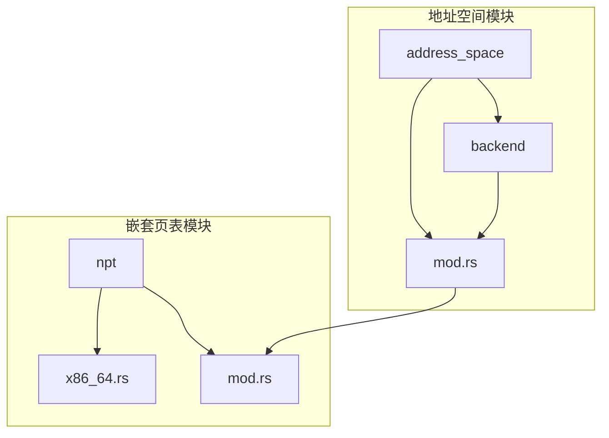
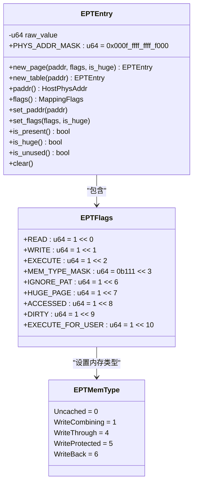
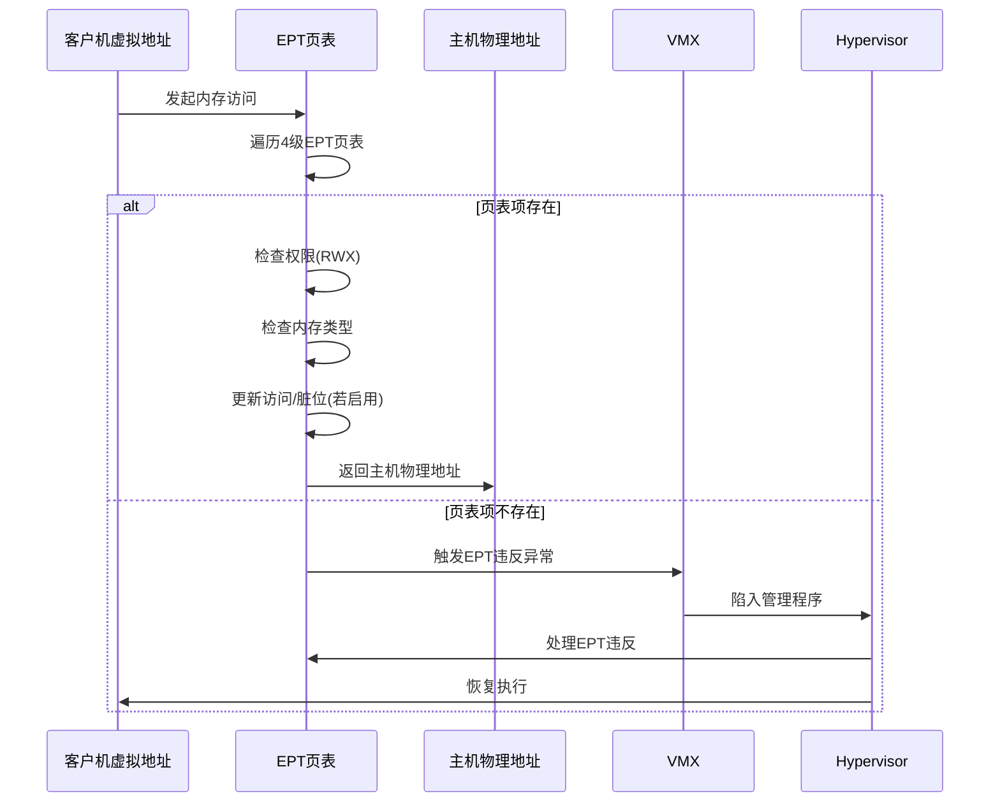
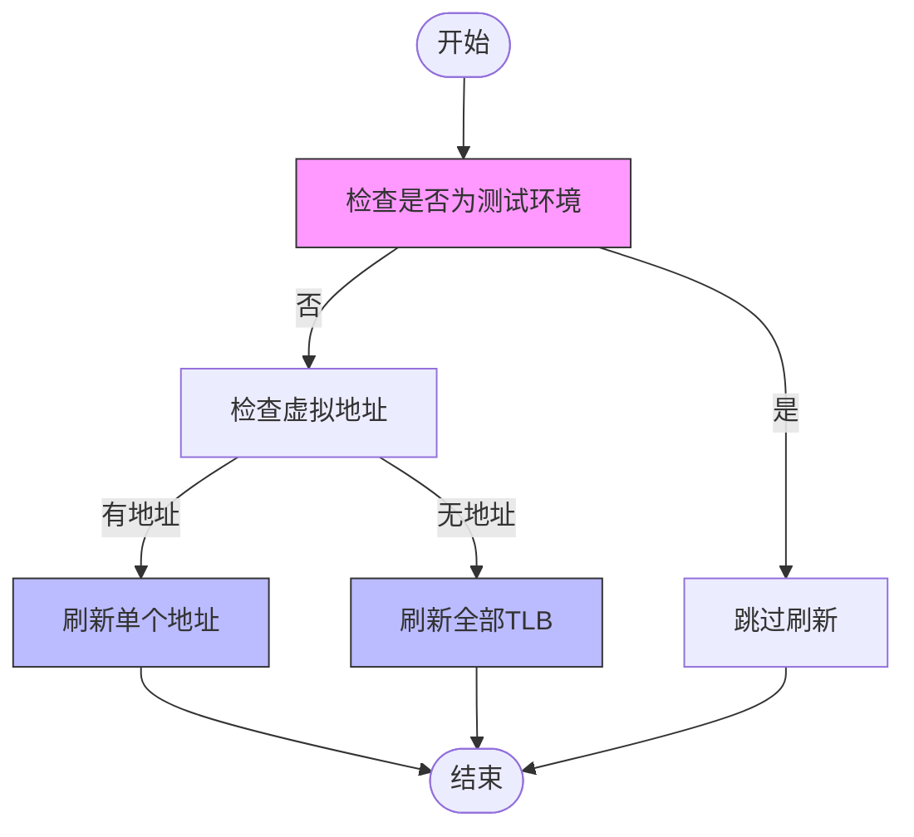
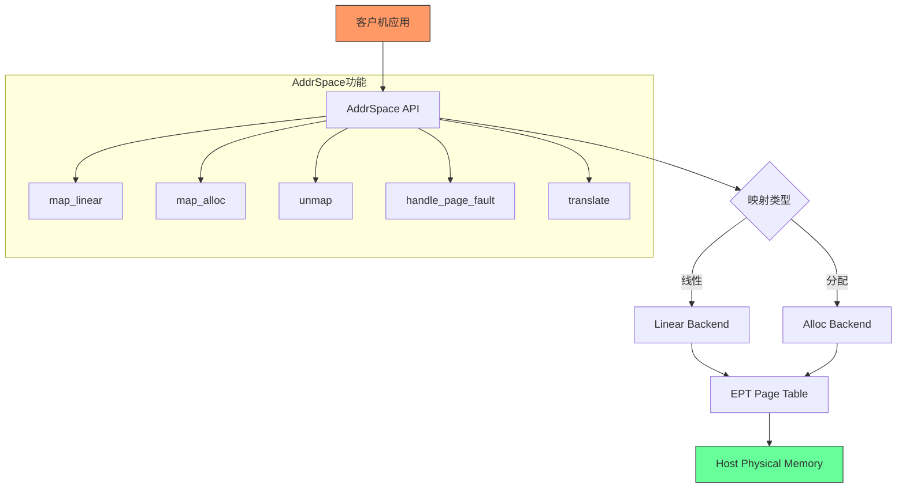

# x86_64架构下的嵌套页表实现

<cite>
**本文档引用的文件**
- [x86_64.rs](file://src/npt/arch/x86_64.rs)
- [mod.rs](file://src/npt/mod.rs)
- [mod.rs](file://src/address_space/mod.rs)
- [backend/mod.rs](file://src/address_space/backend/mod.rs)
- [alloc.rs](file://src/address_space/backend/alloc.rs)
- [linear.rs](file://src/address_space/backend/linear.rs)
</cite>

## 目录
1. [引言](#引言)
2. [项目结构](#项目结构)
3. [核心组件](#核心组件)
4. [EPT页表项与位域布局](#ept页表项与位域布局)
5. [地址转换与页表遍历](#地址转换与页表遍历)
6. [EPT与VMX操作的集成](#ept与vmx操作的集成)
7. [权限管理与内存类型映射](#权限管理与内存类型映射)
8. [映射操作与后端实现](#映射操作与后端实现)
9. [性能优化与高级特性](#性能优化与高级特性)
10. [与AddrSpace接口的协同工作](#与addrspace接口的协同工作)
11. [结论](#结论)

## 引言

本文档深入分析x86_64平台下嵌套页表（NPT）的具体实现，重点阐述Intel EPT（Extended Page Tables）机制的软件抽象。详细说明`x86_64.rs`中页表项（PTE）的位域布局、EPT违反处理、地址转换流程以及与VMX操作的集成方式。解释如何通过Rust类型系统安全封装EPT指针和权限标志。结合代码示例展示页表遍历、映射插入和权限更新的操作过程。对比标准x86_64分页机制与EPT的差异，指出性能瓶颈及优化策略，如EPT脏位和访问位支持的利用。说明该实现如何与上层`AddrSpace`接口协同工作。

## 项目结构

本项目实现了x86_64架构下的嵌套页表机制，主要包含以下模块：

- `src/npt/arch/x86_64.rs`：定义了x86_64平台特有的EPT数据结构和元数据
- `src/npt/mod.rs`：提供架构无关的嵌套页表类型别名
- `src/address_space/mod.rs`：定义了虚拟内存地址空间的核心结构`AddrSpace`
- `src/address_space/backend/`：包含线性映射和分配映射两种后端实现



**图示来源**
- [x86_64.rs](file://src/npt/arch/x86_64.rs)
- [mod.rs](file://src/npt/mod.rs)
- [mod.rs](file://src/address_space/mod.rs)
- [backend/mod.rs](file://src/address_space/backend/mod.rs)

## 核心组件

本实现的核心组件包括：
- `EPTEntry`：表示一个EPT页表项
- `ExtendedPageTableMetadata`：描述EPT的元数据
- `ExtendedPageTable<H>`：基于泛型的EPT实现
- `AddrSpace<H>`：虚拟地址空间抽象
- `Backend<H>`：内存映射后端

这些组件共同构成了一个安全、高效的嵌套页表系统。

**本节来源**
- [x86_64.rs](file://src/npt/arch/x86_64.rs#L130-L189)
- [mod.rs](file://src/npt/mod.rs#L1-L14)
- [mod.rs](file://src/address_space/mod.rs#L1-L588)

## EPT页表项与位域布局

### EPTFlags位域结构

`EPTEntry`使用64位来表示页表项，其位域布局遵循Intel SDM规范：



**图示来源**
- [x86_64.rs](file://src/npt/arch/x86_64.rs#L0-L77)

### 位域解析

- **物理地址掩码**：`PHYS_ADDR_MASK` (0x000f_ffff_ffff_f000) 覆盖位12-52，用于提取物理地址
- **访问权限位**：位0-2分别表示读、写、执行权限
- **内存类型**：位3-5表示EPT内存类型，通过`EPTMemType`枚举管理
- **大页标志**：位7的`HUGE_PAGE`标志指示是否映射大页帧
- **访问/脏位**：位8-9的`ACCESSED`和`DIRTY`标志支持性能优化

## 地址转换与页表遍历

### 地址转换流程



**图示来源**
- [x86_64.rs](file://src/npt/arch/x86_64.rs#L130-L174)
- [mod.rs](file://src/npt/mod.rs#L1-L14)

### 页表遍历实现

EPT页表遍历通过`PageTable64`泛型实现，遵循x86_64的4级分页结构：

- **LEVELS**: 4级页表
- **PA_MAX_BITS**: 支持52位物理地址
- **VA_MAX_BITS**: 支持48位虚拟地址
- **VirtAddr**: 使用`GuestPhysAddr`作为虚拟地址类型

遍历过程由底层`page_table_multiarch`库提供支持，确保了跨架构的兼容性。

**本节来源**
- [x86_64.rs](file://src/npt/arch/x86_64.rs#L174-L189)

## EPT与VMX操作的集成

### TLB刷新机制

EPT与VMX操作的集成主要体现在TLB刷新上：



**图示来源**
- [x86_64.rs](file://src/npt/arch/x86_64.rs#L174-L189)

### 集成特点

- 在非测试环境下调用`x86::tlb::flush`进行实际的TLB刷新
- 测试环境下跳过刷新以避免SIGSEGV异常
- 支持按地址刷新和全局刷新两种模式
- 通过`unsafe`块调用底层x86指令

## 权限管理与内存类型映射

### 双向转换机制

权限标志在`MappingFlags`和`EPTFlags`之间进行双向转换：

```mermaid
classDiagram
class MappingFlags {
READ
WRITE
EXECUTE
DEVICE
}
class EPTFlags {
READ
WRITE
EXECUTE
MEM_TYPE_MASK
IGNORE_PAT
HUGE_PAGE
ACCESSED
DIRTY
EXECUTE_FOR_USER
}
class EPTMemType {
Uncached
WriteCombining
WriteThrough
WriteProtected
WriteBack
}
MappingFlags --> EPTFlags : "From<MappingFlags>"
EPTFlags --> MappingFlags : "From<EPTFlags>"
EPTFlags --> EPTMemType : "set_mem_type/mem_type"
note right of MappingFlags
通用映射标志
DEVICE标志用于区分设备内存
end
note right of EPTFlags
EPT专用标志
包含内存类型和大页信息
end
```

**图示来源**
- [x86_64.rs](file://src/npt/arch/x86_64.rs#L79-L128)

### 转换规则

- **MappingFlags → EPTFlags**：
  - 普通内存默认设置为WriteBack类型
  - DEVICE标志对应的内存设置为Uncached类型
  - 根据需求设置HUGE_PAGE标志

- **EPTFlags → MappingFlags**：
  - 将EPT的RWX权限映射到通用标志
  - 检测内存类型为Uncached时设置DEVICE标志

## 映射操作与后端实现

### 后端架构

```mermaid
classDiagram
class Backend<H> {
<<enum>>
Linear{pa_va_offset}
Alloc{populate}
}
class AddrSpace<H> {
-va_range : GuestPhysAddrRange
-areas : MemorySet<Backend<H>>
-pt : PageTable<H>
+map_linear()
+map_alloc()
+unmap()
+handle_page_fault()
+translate()
}
class MappingBackend {
<<trait>>
map()
unmap()
protect()
handle_page_fault()
}
Backend<H> --> MappingBackend : "实现"
AddrSpace<H> --> Backend<H> : "包含"
AddrSpace<H> --> PageTable<H> : "包含"
note right of Backend<H>
两种后端实现：
1. Linear：线性映射
2. Alloc：分配映射
end
```

**图示来源**
- [backend/mod.rs](file://src/address_space/backend/mod.rs#L1-L110)
- [mod.rs](file://src/address_space/mod.rs#L1-L588)

### 映射类型

#### 线性映射

- 使用`new_linear(pa_va_offset)`创建
- 虚拟地址与物理地址有固定的偏移量
- 通过`map_region`进行区域映射
- 不触发页错误

#### 分配映射

- 使用`new_alloc(populate)`创建
- `populate=true`：立即分配所有物理帧
- `populate=false`：惰性分配，通过页错误处理
- 支持按需分配物理内存

**本节来源**
- [linear.rs](file://src/address_space/backend/linear.rs#L1-L51)
- [alloc.rs](file://src/address_space/backend/alloc.rs#L1-L97)

## 性能优化与高级特性

### EPT高级特性利用

| 特性 | 说明 | 优化效果 |
|------|------|----------|
| 访问位(ACCESSED) | 跟踪页的访问情况 | 支持页面回收算法 |
| 脏位(DIRTY) | 跟踪页的修改情况 | 减少不必要的复制 |
| 大页(HUGE_PAGE) | 支持2MB/1GB大页 | 减少TLB缺失 |
| 内存类型 | 支持不同缓存策略 | 提升I/O性能 |

### 性能瓶颈与策略

- **TLB刷新开销**：通过延迟刷新和批量操作优化
- **页表遍历延迟**：利用大页减少遍历层级
- **内存复制开销**：使用写时复制(COW)策略
- **页错误处理**：优化惰性分配路径

## 与AddrSpace接口的协同工作

### AddrSpace架构

`AddrSpace`作为上层接口，与EPT实现紧密协作：



**图示来源**
- [mod.rs](file://src/address_space/mod.rs#L1-L588)

### 协同工作机制

1. **映射创建**：
   - 调用`map_linear`或`map_alloc`
   - 选择相应的后端实现
   - 更新EPT页表

2. **页错误处理**：
   - `handle_page_fault`检测地址范围
   - 查找对应的内存区域
   - 调用后端的页错误处理函数

3. **地址转换**：
   - `translate`函数查询EPT页表
   - 返回主机物理地址
   - 支持调试信息输出

4. **内存保护**：
   - `protect`函数更新页表项权限
   - 管理TLB刷新策略

## 结论

本文档详细分析了x86_64平台下嵌套页表的实现机制。通过Rust的类型系统，实现了安全的EPT抽象，包括页表项的位域布局、权限管理、地址转换等核心功能。EPT实现与VMX操作紧密集成，支持访问位和脏位等性能优化特性。上层`AddrSpace`接口提供了统一的内存管理API，通过不同的后端实现支持线性映射和分配映射。整体设计既保证了安全性，又兼顾了性能需求，为虚拟化环境提供了高效的内存管理解决方案。