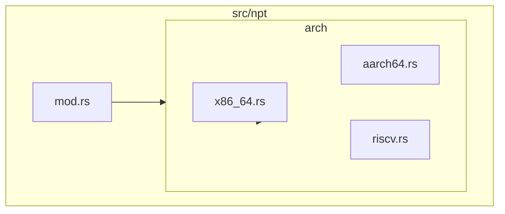
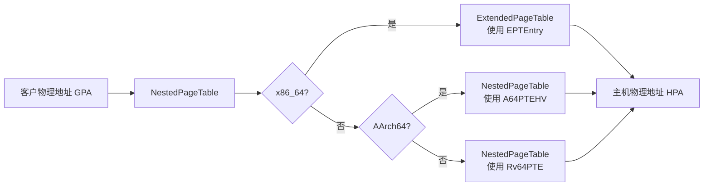
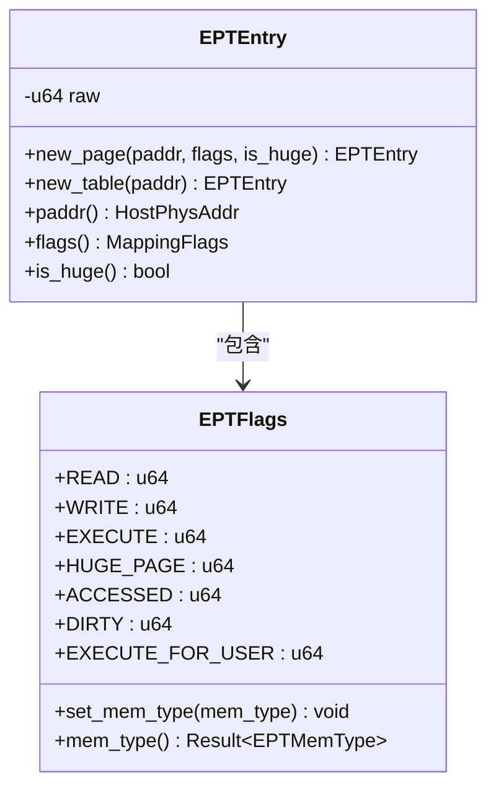
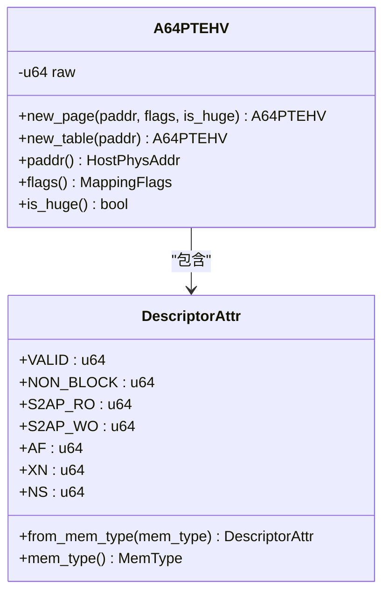
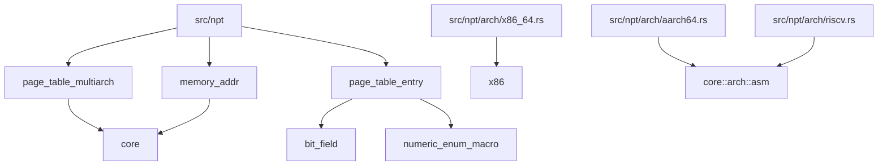

# 嵌套页表实现

<cite>
**本文档引用的文件**  
- [src/npt/mod.rs](file://src/npt/mod.rs)
- [src/npt/arch/mod.rs](file://src/npt/arch/mod.rs)
- [src/npt/arch/x86_64.rs](file://src/npt/arch/x86_64.rs)
- [src/npt/arch/aarch64.rs](file://src/npt/arch/aarch64.rs)
- [src/npt/arch/riscv.rs](file://src/npt/arch/riscv.rs)
- [src/addr.rs](file://src/addr.rs)
</cite>

## 目录
1. [简介](#简介)
2. [项目结构](#项目结构)
3. [核心组件](#核心组件)
4. [架构概述](#架构概述)
5. [详细组件分析](#详细组件分析)
6. [依赖分析](#依赖分析)
7. [性能考虑](#性能考虑)
8. [故障排除指南](#故障排除指南)
9. [结论](#结论)

## 简介
本文档详细描述了嵌套页表（NPT）模块在跨平台虚拟化中的实现机制。该模块为 x86_64、AArch64 和 RISC-V 架构提供统一的接口，同时针对各架构的硬件特性（如 Intel EPT、ARM Stage-2 翻译）进行差异化实现。重点分析两级地址转换（客户物理地址到主机物理地址）的工作机制、页表遍历逻辑以及硬件抽象层的安全暴露方式。

## 项目结构
嵌套页表模块位于 `src/npt` 目录下，采用分层架构设计，核心逻辑与架构特定实现分离。`arch` 子模块包含各目标架构的独立实现，通过条件编译选择具体类型。

**图示来源**  
- [src/npt/mod.rs](file://src/npt/mod.rs#L1-L14)
- [src/npt/arch/mod.rs](file://src/npt/arch/mod.rs#L1-L14)

**本节来源**  
- [src/npt/mod.rs](file://src/npt/mod.rs#L1-L14)
- [src/npt/arch/mod.rs](file://src/npt/arch/mod.rs#L1-L14)

## 核心组件
NPT 模块的核心是 `NestedPageTable<H>` 类型，它根据目标架构被定义为不同的具体类型。该类型封装了从客户物理地址（GPA）到主机物理地址（HPA）的两级地址转换逻辑，是虚拟机内存隔离与高效访问的基础。

**本节来源**  
- [src/npt/mod.rs](file://src/npt/mod.rs#L3-L12)

## 架构概述
NPT 模块通过统一的 `NestedPageTable<H>` 接口，为不同架构提供一致的地址转换服务。其核心是基于 `page_table_multiarch` 库的泛型页表实现，结合架构特定的元数据和页表项类型，实现对硬件特性的抽象。

**图示来源**  
- [src/npt/mod.rs](file://src/npt/mod.rs#L3-L12)
- [src/npt/arch/x86_64.rs](file://src/npt/arch/x86_64.rs#L150)
- [src/npt/arch/aarch64.rs](file://src/npt/arch/aarch64.rs#L260)
- [src/npt/arch/riscv.rs](file://src/npt/arch/riscv.rs#L5)

## 详细组件分析

### x86_64 架构实现分析
x86_64 架构通过 Intel 的扩展页表（EPT）实现嵌套虚拟化。`ExtendedPageTable` 类型利用 EPT 硬件特性，提供高效的 GPA 到 HPA 转换。

#### 页表项与标志位
`EPTEntry` 结构体封装了 EPT 页表项，其标志位（`EPTFlags`）精确映射了 SDM 文档中定义的权限和内存类型控制位。

**图示来源**  
- [src/npt/arch/x86_64.rs](file://src/npt/arch/x86_64.rs#L15-L190)

#### 地址转换与 TLB 刷新
`ExtendedPageTableMetadata` 定义了 EPT 的元数据，包括 4 级页表结构和 52 位物理地址宽度。`flush_tlb` 函数通过调用 `x86::tlb::flush` 指令刷新 TLB，确保地址映射的一致性。

**本节来源**  
- [src/npt/arch/x86_64.rs](file://src/npt/arch/x86_64.rs#L15-L190)

### AArch64 架构实现分析
AArch64 架构使用 Stage-2 翻译机制实现嵌套页表。`NestedPageTable` 类型基于 VMSAv8-64 页表格式，支持 3 级或 4 级页表（由 `4-level-ept` 特性决定）。

#### 页表项与描述符
`A64PTEHV` 结构体表示 AArch64 的 Stage-2 页表描述符，`DescriptorAttr` 位标志封装了访问权限、内存属性和执行控制等字段。

**图示来源**  
- [src/npt/arch/aarch64.rs](file://src/npt/arch/aarch64.rs#L15-L261)

#### TLB 刷新机制
`A64HVPagingMetaData` 中的 `flush_tlb` 函数使用内联汇编调用 `tlbi` 指令。根据 `arm-el2` 特性，选择 `vae2is`（EL2）或 `vaae1is`（EL1）指令来刷新 TLB，确保在不同执行状态下正确性。

**本节来源**  
- [src/npt/arch/aarch64.rs](file://src/npt/arch/aarch64.rs#L15-L261)

### RISC-V 架构实现分析
RISC-V 架构的实现最为简洁，直接复用 `page_table_multiarch` 库中的 `Sv39MetaData` 和 `Rv64PTE` 类型。`NestedPageTable` 被定义为 `PageTable64` 的一个实例。

#### 地址空间定义
`GuestPhysAddr` 实现了 `SvVirtAddr` trait，其 `flush_tlb` 方法调用 `hfence.vvma` 指令刷新 TLB。该实现假设 `hfence.vvma` 不影响主机内存地址空间，因此使用 `nomem` 编译器选项。

**本节来源**  
- [src/npt/arch/riscv.rs](file://src/npt/arch/riscv.rs#L1-L7)
- [src/addr.rs](file://src/addr.rs#L30-L36)

## 依赖分析
NPT 模块高度依赖于底层硬件抽象和内存管理库。

**图示来源**  
- [src/npt/arch/x86_64.rs](file://src/npt/arch/x86_64.rs#L1-L10)
- [src/npt/arch/aarch64.rs](file://src/npt/arch/aarch64.rs#L1-L10)
- [src/npt/arch/riscv.rs](file://src/npt/arch/riscv.rs#L1-L7)

**本节来源**  
- [src/npt/arch/x86_64.rs](file://src/npt/arch/x86_64.rs#L1-L10)
- [src/npt/arch/aarch64.rs](file://src/npt/arch/aarch64.rs#L1-L10)
- [src/npt/arch/riscv.rs](file://src/npt/arch/riscv.rs#L1-L7)

## 性能考虑
两级地址转换会引入额外的 TLB 未命中开销。各架构通过硬件特性（如 EPT、Stage-2 TLB）来缓解此问题。频繁的 TLB 刷新（`flush_tlb`）是性能瓶颈，应尽量使用针对特定虚拟地址的刷新而非全局刷新。RISC-V 的 `hfence.vvma` 指令开销相对较高，优化时需特别注意。

## 故障排除指南
- **地址转换失败**：检查页表项的 `VALID` 标志位是否正确设置，确认 GPA 到 HPA 的映射关系。
- **权限错误**：验证 `MappingFlags` 是否正确转换为架构特定的权限位（如 EPTFlags 的 RWX，A64PTEHV 的 S2AP/XN）。
- **TLB 刷新异常**：在 x86_64 上，确保在非测试环境下执行 `flush_tlb`；在 AArch64 上，确认 `arm-el2` 特性与运行环境匹配。
- **内存类型错误**：检查 `DEVICE` 标志位是否正确映射到相应的内存属性（如 EPT 的 Uncached，A64PTEHV 的 Device 类型）。

**本节来源**  
- [src/npt/arch/x86_64.rs](file://src/npt/arch/x86_64.rs#L100-L120)
- [src/npt/arch/aarch64.rs](file://src/npt/arch/aarch64.rs#L100-L120)
- [src/npt/arch/riscv.rs](file://src/npt/arch/riscv.rs#L5)

## 结论
嵌套页表模块通过精巧的抽象，为 x86_64、AArch64 和 RISC-V 提供了统一的跨平台虚拟化内存管理接口。其设计充分考虑了各架构的硬件特性，实现了高性能和高安全性。开发者在移植或优化时，应重点关注页表项标志位的映射、TLB 刷新策略以及内存属性的正确配置。