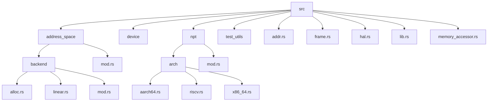
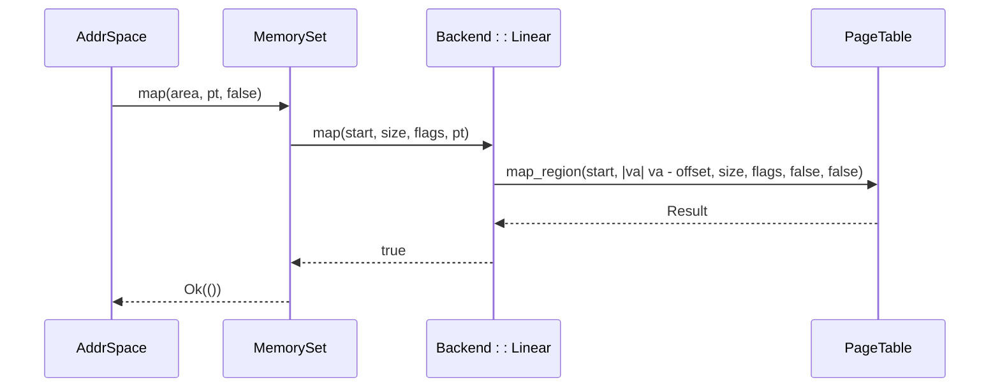
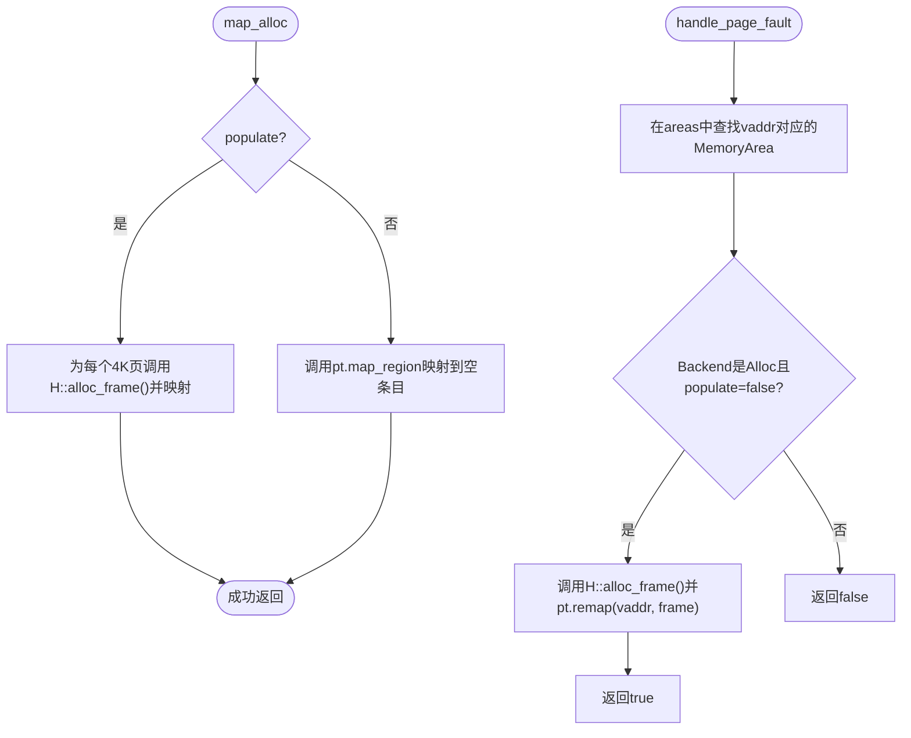
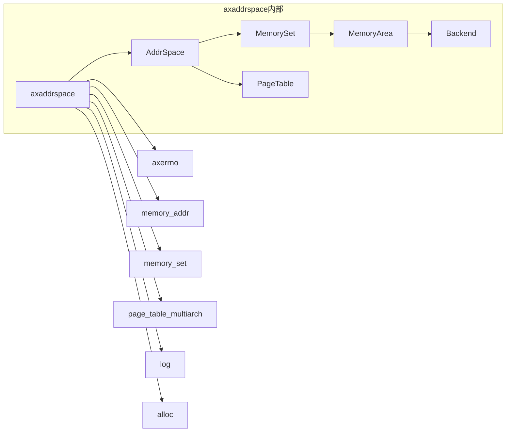

# 并发访问优化

<cite>
**本文档中引用的文件**  
- [mod.rs](file://src/address_space/mod.rs)
- [backend/mod.rs](file://src/address_space/backend/mod.rs)
- [backend/alloc.rs](file://src/address_space/backend/alloc.rs)
- [backend/linear.rs](file://src/address_space/backend/linear.rs)
- [lib.rs](file://src/lib.rs)
</cite>

## 目录
1. [引言](#引言)
2. [项目结构](#项目结构)
3. [核心组件](#核心组件)
4. [架构概述](#架构概述)
5. [详细组件分析](#详细组件分析)
6. [依赖分析](#依赖分析)
7. [性能考量](#性能考量)
8. [故障排除指南](#故障排除指南)
9. [结论](#结论)

## 引言
本文档旨在深入探讨在高并发或多虚拟机场景下，地址空间管理中的锁争用问题。基于 `AddrSpace` 及其 `backend` 模块的架构设计，分析共享资源（如页表、映射元数据）的并发访问模式。文档将提出读写分离、细粒度锁划分和无锁数据结构等优化策略，以减少线程阻塞。结合代码实例说明如何通过批量映射操作降低锁获取频率，以及使用RCU（Read-Copy-Update）机制提升读密集场景的性能。最后，提供并发压力测试的基准指标和调优参数配置建议，确保系统在多核环境下的可扩展性。

## 项目结构
`axaddrspace` 模块是 ArceOS-Hypervisor 中用于管理客户虚拟机地址空间的核心组件。其结构清晰地划分为多个子模块，以实现职责分离和模块化设计。



**Diagram sources**
- [mod.rs](file://src/address_space/mod.rs#L0-L47)
- [backend/mod.rs](file://src/address_space/backend/mod.rs#L0-L40)

**Section sources**
- [mod.rs](file://src/address_space/mod.rs#L0-L47)
- [backend/mod.rs](file://src/address_space/backend/mod.rs#L0-L40)

## 核心组件
`axaddrspace` 的核心在于 `AddrSpace` 结构体，它封装了虚拟内存地址空间的管理。该结构体包含三个主要部分：`va_range`（虚拟地址范围）、`areas`（内存区域集合）和 `pt`（嵌套页表）。`Backend` 枚举则统一了两种内存映射后端：线性映射（Linear）和分配映射（Allocation），为不同的映射需求提供了灵活的实现。

**Section sources**
- [mod.rs](file://src/address_space/mod.rs#L0-L47)
- [backend/mod.rs](file://src/address_space/backend/mod.rs#L0-L40)

## 架构概述
`AddrSpace` 模块的架构设计围绕着虚拟地址空间的创建、映射、查询和销毁等核心操作。其核心是 `AddrSpace<H: PagingHandler>` 结构体，它通过 `MemorySet<Backend<H>>` 来管理多个 `MemoryArea`，每个 `MemoryArea` 代表一个具有特定属性和后端的连续内存区域。页表操作则由 `NestedPageTable<H>` 负责，它与底层的分页处理程序 `H` 交互，实现物理地址的最终映射。

```mermaid
classDiagram
class AddrSpace~H~ {
+va_range : GuestPhysAddrRange
+areas : MemorySet~Backend~H~~
+pt : PageTable~H~
+new_empty(base, size) AxResult~Self~
+map_linear(start_vaddr, start_paddr, size, flags) AxResult
+map_alloc(start, size, flags, populate) AxResult
+unmap(start, size) AxResult
+handle_page_fault(vaddr, access_flags) bool
+translate(vaddr) Option~PhysAddr~
}
class MemorySet~Backend~H~~ {
+map(area, pt, flush_tlb) Result
+unmap(start, size, pt) Result
+find(vaddr) Option~MemoryArea~Backend~H~~~
+clear(pt) Result
}
class MemoryArea~Backend~H~~ {
+start : GuestPhysAddr
+size : usize
+flags : MappingFlags
+backend : Backend~H~
}
class Backend~H~ {
<<enumeration>>
Linear { pa_va_offset : usize }
Alloc { populate : bool, _phantom : PhantomData~H~ }
}
class PageTable~H~ {
+try_new() Result~Self~
+root_paddr() PhysAddr
+map(va, pa, page_size, flags) Result
+unmap(va) Result~(PhysAddr, PageSize, MappingFlags)~
+query(va) Result~(PhysAddr, PageSize, MappingFlags)~
+protect_region(start, size, new_flags, flush_tlb) Result~TlbFlusher~
+map_region(start, paddr_fn, size, flags, flush_tlb, map_tail) Result
+unmap_region(start, size, flush_tlb) Result
+remap(va, pa, flags) Result
}
AddrSpace~H~ --> MemorySet~Backend~H~~ : "包含"
AddrSpace~H~ --> PageTable~H~ : "使用"
MemorySet~Backend~H~~ --> MemoryArea~Backend~H~~ : "包含多个"
MemoryArea~Backend~H~~ --> Backend~H~ : "拥有"
Backend~H~ --> PageTable~H~ : "通过map/unmap操作"
```

**Diagram sources**
- [mod.rs](file://src/address_space/mod.rs#L0-L47)
- [backend/mod.rs](file://src/address_space/backend/mod.rs#L0-L40)

## 详细组件分析

### AddrSpace 结构分析
`AddrSpace` 是地址空间管理的入口。它通过 `new_empty` 方法创建一个空的地址空间，其核心操作如 `map_linear`、`map_alloc` 和 `unmap` 都会调用 `MemorySet` 的相应方法，并最终由 `Backend` 的具体实现来完成页表的修改。

#### 对象关系图
```mermaid
classDiagram
AddrSpace~H~ --> MemorySet~Backend~H~~ : "areas"
AddrSpace~H~ --> PageTable~H~ : "pt"
MemorySet~Backend~H~~ --> MemoryArea~Backend~H~~ : "包含"
MemoryArea~Backend~H~~ --> Backend~H~ : "backend"
```

**Diagram sources**
- [mod.rs](file://src/address_space/mod.rs#L0-L47)

**Section sources**
- [mod.rs](file://src/address_space/mod.rs#L0-L47)

### Backend 模块分析
`Backend` 模块是实现不同映射策略的关键。它定义了一个 `enum`，包含 `Linear` 和 `Alloc` 两种后端。

#### 线性映射 (Linear Backend)
线性映射后端用于创建虚拟地址与物理地址之间具有恒定偏移的映射。其核心是 `pa_va_offset` 字段，表示 `vaddr - paddr`。`map_linear` 方法通过 `pt.map_region` 一次性映射整个区域，效率较高。



**Diagram sources**
- [backend/linear.rs](file://src/address_space/backend/linear.rs#L0-L51)
- [mod.rs](file://src/address_space/mod.rs#L83-L118)

#### 分配映射 (Allocation Backend)
分配映射后端用于通用或延迟映射场景。其行为由 `populate` 标志决定。若 `populate` 为 `true`，则在 `map_alloc` 时立即为所有4KB页面分配物理帧；若为 `false`，则仅在页表中创建一个空条目，待发生页错误时再通过 `handle_page_fault_alloc` 懒惰地分配。



**Diagram sources**
- [backend/alloc.rs](file://src/address_space/backend/alloc.rs#L0-L97)
- [mod.rs](file://src/address_space/mod.rs#L120-L160)

**Section sources**
- [backend/alloc.rs](file://src/address_space/backend/alloc.rs#L0-L97)
- [backend/linear.rs](file://src/address_space/backend/linear.rs#L0-L51)

## 依赖分析
`axaddrspace` 模块依赖于多个外部 crate，如 `axerrno`、`memory_addr`、`memory_set` 和 `page_table_multiarch`。这些依赖提供了错误处理、地址类型、内存区域管理和多架构页表操作等基础功能。模块内部的依赖关系清晰，`AddrSpace` 依赖 `MemorySet` 和 `PageTable`，而 `MemorySet` 中的 `MemoryArea` 则依赖 `Backend`。



**Diagram sources**
- [lib.rs](file://src/lib.rs#L0-L48)
- [mod.rs](file://src/address_space/mod.rs#L0-L47)

**Section sources**
- [lib.rs](file://src/lib.rs#L0-L48)

## 性能考量
在高并发场景下，`AddrSpace` 的性能瓶颈主要在于对共享资源（如 `MemorySet` 和 `PageTable`）的访问。当前的实现中，`map`、`unmap` 和 `handle_page_fault` 等操作可能需要对整个地址空间或页表进行加锁，导致严重的锁争用。

### 优化策略
1.  **读写分离**: 将 `translate` 这类只读操作与 `map`、`unmap` 这类写操作分离。可以为 `translate` 操作设计一个无锁的读路径，例如使用 RCU 机制，允许读者在不阻塞写者的情况下进行地址翻译。
2.  **细粒度锁划分**: 避免对整个 `AddrSpace` 或 `MemorySet` 使用单一锁。可以将 `MemorySet` 划分为多个桶（bucket），每个桶有自己的锁，从而将锁的粒度从整个地址空间降低到单个内存区域或一组区域。
3.  **无锁数据结构**: 对于 `MemorySet` 的查找操作（`find`），可以考虑使用无锁的哈希表或跳表，以进一步减少读操作的开销。
4.  **批量映射操作**: 提供 `map_region` 或 `batch_map` 这样的接口，允许一次性映射一个大区域，而不是循环调用 `map`。这可以显著减少锁的获取和释放次数。
5.  **RCU 机制**: 在读密集的场景下，使用 RCU 机制。写者在修改 `MemorySet` 或 `PageTable` 时，先创建一个副本进行修改，然后原子地替换旧的指针。读者则可以在旧的快照上进行操作，无需加锁，从而极大提升读性能。

## 故障排除指南
当遇到地址空间管理相关的问题时，可以参考以下步骤进行排查：

1.  **检查地址范围**: 确保所有映射操作（`map_linear`, `map_alloc`）的起始地址和大小都在 `AddrSpace` 的 `va_range` 内。`contains_range` 方法可用于验证。
2.  **检查对齐**: 所有虚拟地址、物理地址和大小都必须是4KB对齐的。`is_aligned_4k` 函数可用于检查。
3.  **检查映射冲突**: `map` 操作会检查目标区域是否已存在映射，如果存在，会返回 `AlreadyExists` 错误。
4.  **调试页错误**: 如果 `handle_page_fault` 失败，首先检查 `vaddr` 是否在 `va_range` 内，然后检查该地址是否属于一个 `Alloc` 类型且 `populate=false` 的 `MemoryArea`。如果都不是，则可能是非法访问。
5.  **性能分析**: 在高并发下出现性能瓶颈时，应使用性能分析工具（profiler）定位热点函数，重点关注 `map`、`unmap` 和 `translate` 的调用栈和锁等待时间。

**Section sources**
- [mod.rs](file://src/address_space/mod.rs#L49-L81)
- [mod.rs](file://src/address_space/mod.rs#L120-L160)
- [mod.rs](file://src/address_space/mod.rs#L162-L190)

## 结论
`axaddrspace` 模块提供了一个功能完整的地址空间管理框架，支持线性和分配两种映射后端。然而，在高并发或多虚拟机环境下，其锁争用问题可能成为性能瓶颈。通过实施读写分离、细粒度锁划分、无锁数据结构、批量操作和RCU等优化策略，可以显著提升系统的并发性能和可扩展性。未来的开发应重点关注这些优化方向，以满足高性能虚拟化场景的需求。