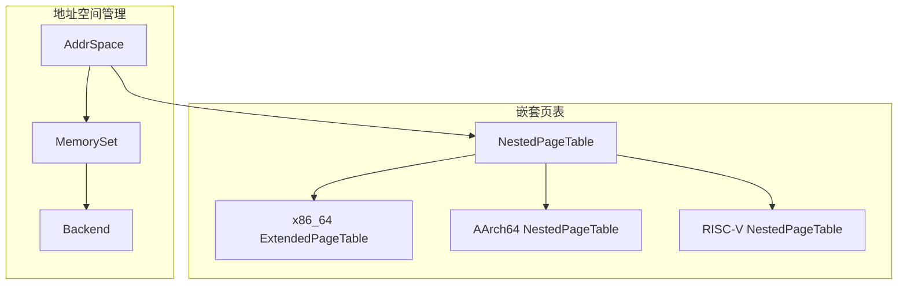
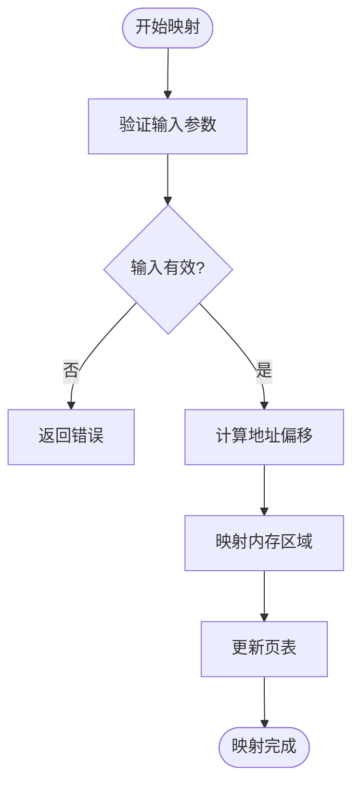
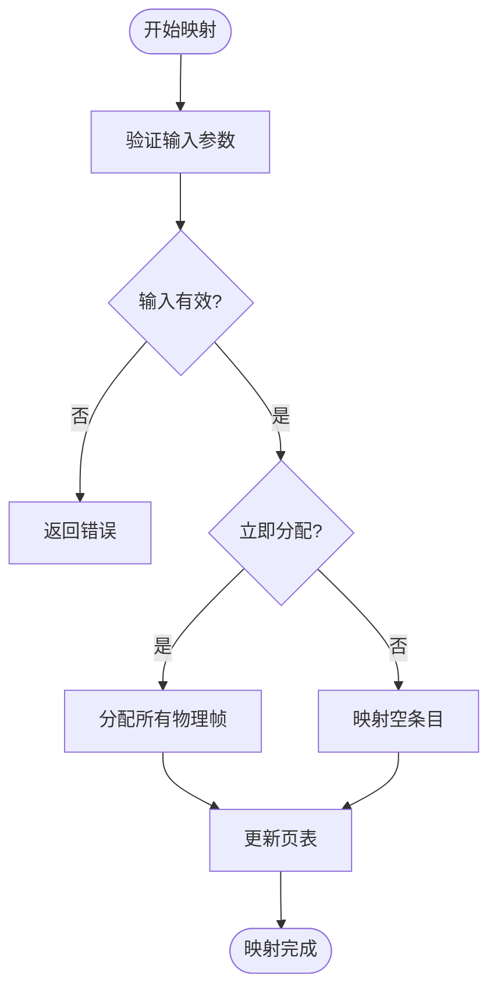
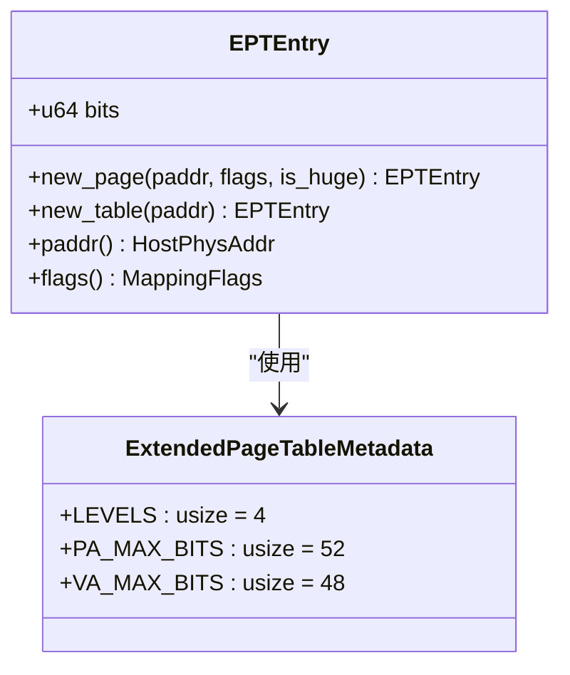
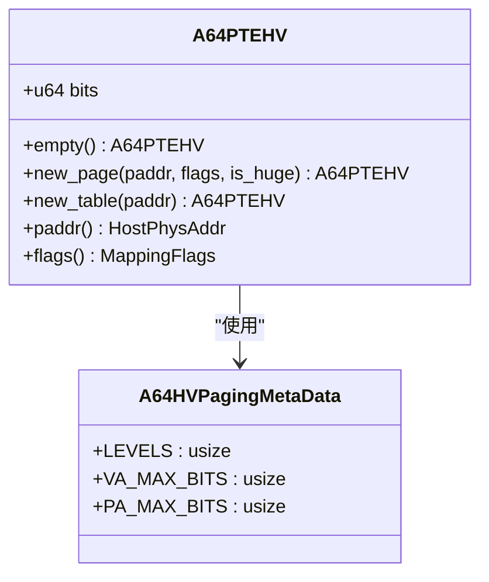
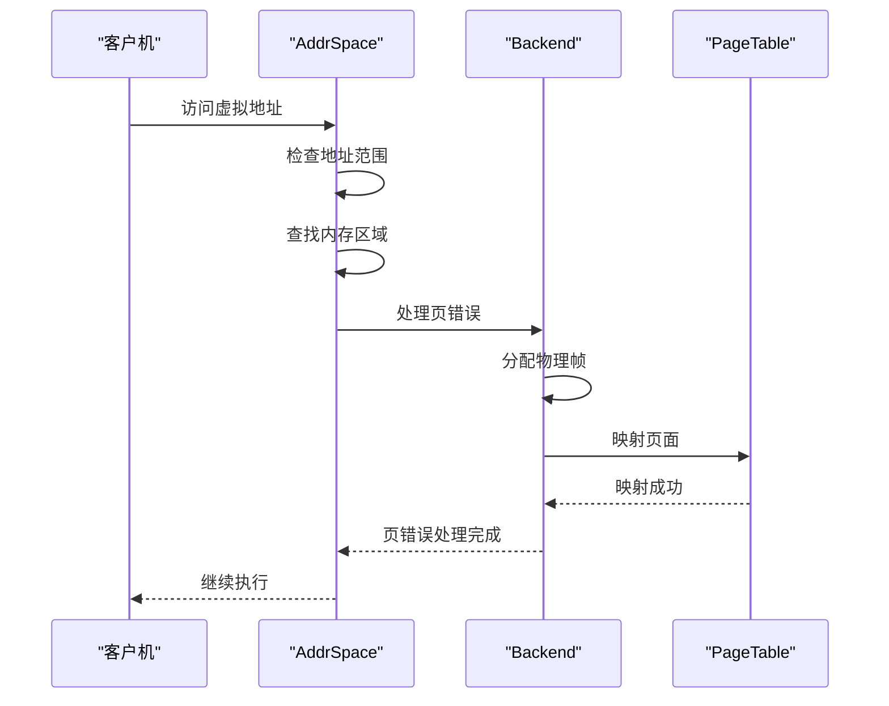

# 性能优化与最佳实践

<cite>
**本文档引用的文件**  
- [src/lib.rs](file://src/lib.rs)
- [src/address_space/mod.rs](file://src/address_space/mod.rs)
- [src/address_space/backend/mod.rs](file://src/address_space/backend/mod.rs)
- [src/address_space/backend/linear.rs](file://src/address_space/backend/linear.rs)
- [src/address_space/backend/alloc.rs](file://src/address_space/backend/alloc.rs)
- [src/npt/mod.rs](file://src/npt/mod.rs)
- [src/npt/arch/x86_64.rs](file://src/npt/arch/x86_64.rs)
- [src/npt/arch/aarch64.rs](file://src/npt/arch/aarch64.rs)
- [Cargo.toml](file://Cargo.toml)
- [README.md](file://README.md)
</cite>

## 目录
1. [引言](#引言)
2. [地址空间管理架构](#地址空间管理架构)
3. [线性映射与动态分配性能对比](#线性映射与动态分配性能对比)
4. [嵌套页表遍历与TLB性能分析](#嵌套页表遍历与tlb性能分析)
5. [页表缓存效率与内存布局优化](#页表缓存效率与内存布局优化)
6. [减少页错误频率的策略](#减少页错误频率的策略)
7. [批量映射操作优化](#批量映射操作优化)
8. [高并发与多虚拟机环境下的锁争用避免](#高并发与多虚拟机环境下的锁争用避免)
9. [性能测量方法与调优建议](#性能测量方法与调优建议)
10. [总结](#总结)

## 引言
`axaddrspace` 是 ArceOS-Hypervisor 项目中用于管理客户虚拟机地址空间的核心模块，支持 x86_64、AArch64 和 RISC-V 多种架构。该模块通过嵌套页表实现虚拟地址到物理地址的转换，提供线性映射和动态分配两种内存映射后端。本文档旨在深入分析该模块中的关键性能因素，比较不同映射策略在各种工作负载下的表现，并提供优化建议以帮助高级用户最大化系统吞吐量。

**Section sources**
- [README.md](file://README.md#L1-L140)

## 地址空间管理架构
`axaddrspace` 模块采用分层架构设计，核心组件包括 `AddrSpace` 结构体、内存映射后端和嵌套页表实现。`AddrSpace` 负责管理虚拟地址范围、页表根地址和内存区域组织，通过 `MemorySet` 管理多个内存区域，并使用 `NestedPageTable` 实现具体的页表操作。

**Diagram sources**
- [src/address_space/mod.rs](file://src/address_space/mod.rs#L1-L589)
- [src/npt/mod.rs](file://src/npt/mod.rs#L1-L15)

**Section sources**
- [src/address_space/mod.rs](file://src/address_space/mod.rs#L1-L589)
- [src/npt/mod.rs](file://src/npt/mod.rs#L1-L15)

## 线性映射与动态分配性能对比
`axaddrspace` 提供两种内存映射后端：线性映射和动态分配。线性映射适用于已知物理地址的连续内存区域，而动态分配则用于一般情况或延迟加载场景。

### 线性映射
线性映射通过固定的虚拟地址与物理地址偏移量实现直接映射，具有以下特点：
- **优点**：映射速度快，无需额外的内存分配操作
- **缺点**：要求物理地址已知且连续，灵活性较低

**Diagram sources**
- [src/address_space/backend/linear.rs](file://src/address_space/backend/linear.rs#L1-L52)

### 动态分配
动态分配支持即时分配和延迟加载两种模式：
- **即时分配**：在创建映射时立即分配所有物理帧
- **延迟加载**：在发生页错误时按需分配物理帧

**Diagram sources**
- [src/address_space/backend/alloc.rs](file://src/address_space/backend/alloc.rs#L1-L98)

**Section sources**
- [src/address_space/backend/mod.rs](file://src/address_space/backend/mod.rs#L1-L111)
- [src/address_space/backend/linear.rs](file://src/address_space/backend/linear.rs#L1-L52)
- [src/address_space/backend/alloc.rs](file://src/address_space/backend/alloc.rs#L1-L98)

## 嵌套页表遍历与TLB性能分析
嵌套页表遍历和 TLB 未命中率是影响地址转换性能的关键因素。`axaddrspace` 在不同架构上实现了相应的优化策略。

### x86_64 架构
在 x86_64 上，使用 VMX 扩展页表（EPT），支持 4 级页表结构。EPT 条目包含内存类型、访问权限等信息，通过 `flush_tlb` 操作刷新 TLB。

**Diagram sources**
- [src/npt/arch/x86_64.rs](file://src/npt/arch/x86_64.rs#L1-L191)

### AArch64 架构
在 AArch64 上，使用 VMSAv8-64 第2阶段页表，支持 3 或 4 级页表结构。通过 `tlbi` 指令刷新 TLB，支持按地址或全局刷新。

**Diagram sources**
- [src/npt/arch/aarch64.rs](file://src/npt/arch/aarch64.rs#L1-L262)

**Section sources**
- [src/npt/arch/x86_64.rs](file://src/npt/arch/x86_64.rs#L1-L191)
- [src/npt/arch/aarch64.rs](file://src/npt/arch/aarch64.rs#L1-L262)

## 页表缓存效率与内存布局优化
优化页表缓存效率和内存布局可以显著提高系统性能。建议采取以下措施：
- **对齐内存分配**：确保虚拟地址、物理地址和大小都按 4KB 对齐
- **合理规划地址空间**：避免地址空间碎片化
- **预分配常用内存区域**：减少运行时分配开销

**Section sources**
- [src/address_space/mod.rs](file://src/address_space/mod.rs#L1-L589)

## 减少页错误频率的策略
页错误会显著影响性能，特别是在延迟加载场景下。建议采取以下策略减少页错误频率：
- **预热内存区域**：在系统启动时预先访问关键内存区域
- **合理设置映射标志**：根据实际需求设置读、写、执行权限
- **监控页错误统计**：及时发现和解决频繁发生页错误的区域

**Diagram sources**
- [src/address_space/mod.rs](file://src/address_space/mod.rs#L1-L589)
- [src/address_space/backend/alloc.rs](file://src/address_space/backend/alloc.rs#L1-L98)

## 批量映射操作优化
对于需要映射大量内存的场景，建议使用批量映射操作以减少系统调用开销。可以通过以下方式优化：
- **合并相邻映射请求**：减少页表更新次数
- **使用大页映射**：减少页表层级和 TLB 未命中率
- **并行处理映射请求**：充分利用多核处理器性能

**Section sources**
- [src/address_space/mod.rs](file://src/address_space/mod.rs#L1-L589)

## 高并发与多虚拟机环境下的锁争用避免
在高并发或多虚拟机环境下，锁争用可能成为性能瓶颈。建议采取以下设计模式避免锁争用：
- **无锁数据结构**：使用原子操作和无锁队列
- **细粒度锁**：将大锁拆分为多个小锁
- **读写分离**：使用读写锁提高并发性能

**Section sources**
- [src/lib.rs](file://src/lib.rs#L1-L49)

## 性能测量方法与调优建议
为了有效优化性能，建议采用以下测量方法和调优策略：
- **性能计数器**：使用硬件性能计数器监测 TLB 未命中率、缓存命中率等指标
- **基准测试**：针对不同工作负载进行基准测试，评估优化效果
- **动态调优**：根据运行时性能数据动态调整映射策略

**Section sources**
- [README.md](file://README.md#L1-L140)

## 总结
`axaddrspace` 模块提供了灵活的地址空间管理功能，支持多种架构和映射策略。通过合理选择映射策略、优化内存布局、减少页错误频率和避免锁争用，可以显著提高系统性能。建议根据具体应用场景选择合适的优化策略，并持续监测和调优系统性能。