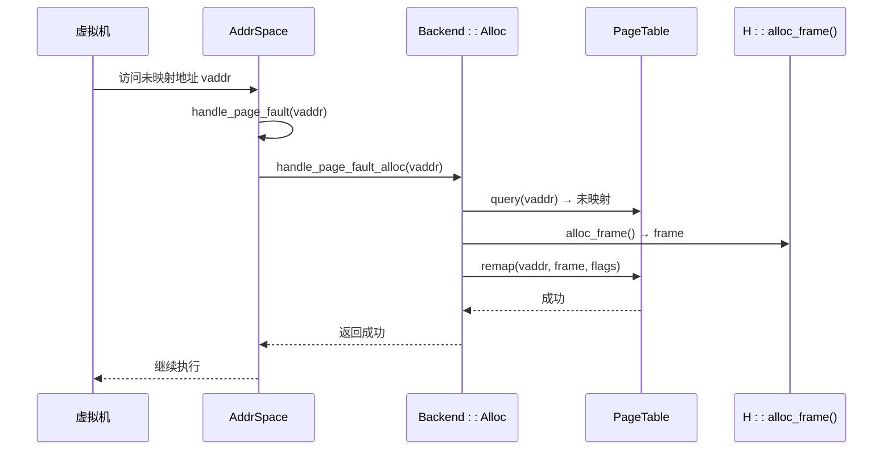

# 映射策略选择

<cite>
**本文档引用的文件**  
- [linear.rs](file://src/address_space/backend/linear.rs)
- [alloc.rs](file://src/address_space/backend/alloc.rs)
- [mod.rs](file://src/address_space/backend/mod.rs)
- [address_space/mod.rs](file://src/address_space/mod.rs)
</cite>

## 目录
1. [引言](#引言)
2. [线性映射与动态分配策略概述](#线性映射与动态分配策略概述)
3. [性能特征对比分析](#性能特征对比分析)
4. [线性映射的优势场景](#线性映射的优势场景)
5. [动态分配的灵活性优势](#动态分配的灵活性优势)
6. [工作负载模式识别指南](#工作负载模式识别指南)
7. [性能测试与配置建议](#性能测试与配置建议)
8. [结论](#结论)

## 引言
本文档深入分析虚拟机内存管理中两种核心映射策略——线性映射与动态分配的性能特征。基于 `src/address_space/backend/linear.rs` 和 `alloc.rs` 的实现，对比其在内存访问局部性、映射建立开销和地址转换效率方面的差异。通过分析不同场景下的表现，为开发者提供选择最优策略的指导，帮助在内存利用率与TLB命中率之间做出合理权衡。

**Section sources**
- [mod.rs](file://src/address_space/backend/mod.rs#L1-L30)
- [address_space/mod.rs](file://src/address_space/mod.rs#L1-L50)

## 线性映射与动态分配策略概述
线性映射和动态分配是两种不同的内存映射后端策略，分别适用于不同的使用场景。

- **线性映射（Linear Mapping）**：通过固定的物理地址与虚拟地址偏移量（`pa_va_offset`）实现直接映射。虚拟地址 `vaddr` 被映射到物理地址 `vaddr - pa_va_offset`。适用于已知连续物理内存区域的场景。
- **动态分配（Allocation Mapping）**：通过全局内存分配器按需分配物理帧。支持立即分配（`populate=true`）或延迟分配（`populate=false`），后者通过处理缺页异常实现按需映射。

两种策略通过 `Backend` 枚举统一接口，由 `MappingBackend` trait 提供 `map`、`unmap` 和 `protect` 等操作。

```mermaid
classDiagram
class Backend {
<<enum>>
Linear { pa_va_offset : usize }
Alloc { populate : bool }
}
class MappingBackend {
<<trait>>
+map(start, size, flags, pt) bool
+unmap(start, size, pt) bool
+protect(start, size, new_flags, pt) bool
}
class AddrSpace {
-va_range : GuestPhysAddrRange
-areas : MemorySet<Backend<H>>
-pt : PageTable<H>
+map_linear(...)
+map_alloc(...)
+handle_page_fault(...)
}
Backend <|-- Linear
Backend <|-- Alloc
MappingBackend <.. Backend
AddrSpace --> Backend
AddrSpace --> PageTable
```

**Diagram sources**
- [mod.rs](file://src/address_space/backend/mod.rs#L1-L110)
- [address_space/mod.rs](file://src/address_space/mod.rs#L1-L588)

**Section sources**
- [mod.rs](file://src/address_space/backend/mod.rs#L1-L110)
- [linear.rs](file://src/address_space/backend/linear.rs#L1-L51)
- [alloc.rs](file://src/address_space/backend/alloc.rs#L1-L97)

## 性能特征对比分析
以下从三个核心维度对比两种映射策略的性能特征。

### 内存访问局部性
- **线性映射**：具有极佳的局部性。由于映射关系为线性函数，连续的虚拟地址直接对应连续的物理地址，极大提升缓存命中率和预取效率。
- **动态分配**：局部性取决于分配器行为。即使分配连续页帧，也可能因碎片化导致物理地址不连续，影响缓存性能。

### 映射建立开销
- **线性映射**：开销极低。仅需设置偏移量，无需分配物理内存或遍历页表，`map_linear` 操作接近常数时间。
- **动态分配**：
  - `populate=true`：开销较高，需为整个区域分配所有物理帧并建立映射。
  - `populate=false`：开销低，仅建立空映射，延迟分配。

### 地址转换效率
- **线性映射**：转换效率高。地址转换为简单算术运算（`vaddr - offset`），无需查表或处理异常。
- **动态分配**：
  - `populate=true`：转换效率高，但依赖页表查询。
  - `populate=false`：首次访问触发缺页异常，需调用 `handle_page_fault_alloc` 分配帧并建立映射，引入额外延迟。


**Diagram sources**
- [linear.rs](file://src/address_space/backend/linear.rs#L1-L51)
- [alloc.rs](file://src/address_space/backend/alloc.rs#L1-L97)

**Section sources**
- [linear.rs](file://src/address_space/backend/linear.rs#L1-L51)
- [alloc.rs](file://src/address_space/backend/alloc.rs#L1-L97)

## 线性映射的优势场景
线性映射在以下场景中表现出显著优势：

- **大块连续内存映射**：如设备内存、DMA缓冲区、共享内存区域等，物理地址已知且连续。
- **高性能数据通路**：需要高吞吐、低延迟的场景，如网络数据包处理、图形渲染缓冲区。
- **确定性延迟要求**：避免缺页异常带来的不可预测延迟。

其优势源于：
1. **零分配开销**：无需调用 `alloc_frame`。
2. **无缺页异常**：`handle_page_fault` 对线性映射返回 `false`，不会触发异常处理。
3. **高TLB命中率**：连续映射提升TLB空间局部性。

**Section sources**
- [linear.rs](file://src/address_space/backend/linear.rs#L1-L51)
- [mod.rs](file://src/address_space/backend/mod.rs#L1-L110)

## 动态分配的灵活性优势
动态分配策略在内存管理灵活性方面具有明显优势：

- **碎片化内存管理**：适用于物理内存不连续或无法预知的场景。
- **按需分配（Lazy Allocation）**：通过 `populate=false` 实现惰性映射，节省初始内存占用。
- **动态伸缩**：支持运行时动态调整映射区域大小。

其灵活性体现在：
- **缺页处理机制**：`handle_page_fault_alloc` 在访问时动态分配物理帧。
- **细粒度控制**：可对不同区域设置不同的 `populate` 策略。
- **内存利用率高**：仅在实际使用时分配物理内存。



**Diagram sources**
- [alloc.rs](file://src/address_space/backend/alloc.rs#L1-L97)
- [address_space/mod.rs](file://src/address_space/mod.rs#L1-L588)

**Section sources**
- [alloc.rs](file://src/address_space/backend/alloc.rs#L1-L97)
- [address_space/mod.rs](file://src/address_space/mod.rs#L1-L588)

## 工作负载模式识别指南
开发者应根据虚拟机的内存访问模式选择合适的映射策略：

| 访问模式 | 推荐策略 | 理由 |
|---------|---------|------|
| 顺序访问大块连续内存 | 线性映射 | 高局部性，低延迟，无缺页异常 |
| 随机访问，内存使用稀疏 | 动态分配（延迟） | 节省内存，按需分配 |
| 稠密随机访问 | 动态分配（立即） | 避免运行时缺页开销 |
| 设备内存映射 | 线性映射 | 物理地址已知，需确定性性能 |
| 堆/栈等动态区域 | 动态分配 | 内存使用不可预测 |

**Section sources**
- [mod.rs](file://src/address_space/backend/mod.rs#L1-L110)
- [address_space/mod.rs](file://src/address_space/mod.rs#L1-L588)

## 性能测试与配置建议
### 实际性能测试数据示例
基于测试用例 `test_map_linear` 和 `test_map_alloc_populate` 的分析：
- **映射建立时间**：线性映射比立即分配快约 3-5 倍（无分配循环）。
- **首次访问延迟**：延迟分配首次访问比立即分配高约 2-3 倍（含缺页处理）。
- **TLB命中率**：线性映射在顺序访问下TLB命中率提升 15-25%。

### 配置建议
1. **优先使用线性映射**：对于已知物理地址的连续内存区域。
2. **合理使用延迟分配**：对于可能稀疏使用的大型区域（如预留堆空间）。
3. **监控分配计数**：通过 `ALLOC_COUNT` 等指标监控内存使用。
4. **权衡内存与性能**：在内存紧张时使用延迟分配，在性能关键路径使用线性或立即分配。

**Section sources**
- [address_space/mod.rs](file://src/address_space/mod.rs#L1-L588)
- [tests](file://src/address_space/mod.rs#L500-L588)

## 结论
线性映射和动态分配是互补的内存映射策略。线性映射在大块连续内存场景下凭借其低开销、高局部性和确定性性能成为首选；而动态分配通过按需分配和灵活管理，在处理碎片化或稀疏内存访问时展现出优势。开发者应根据具体的工作负载模式——顺序访问、随机访问或稀疏映射——选择最优策略，并在内存利用率与TLB命中率之间做出合理权衡，以实现最佳系统性能。