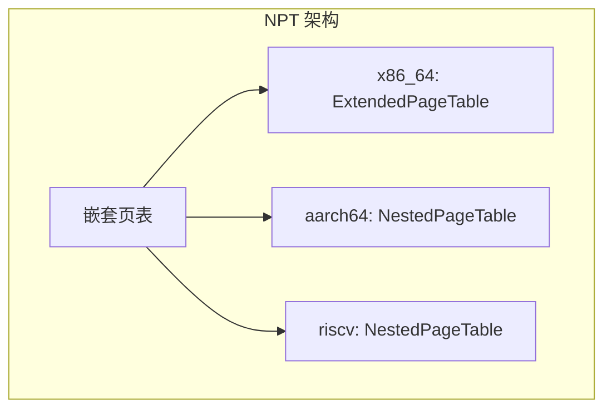
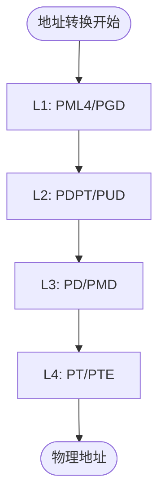
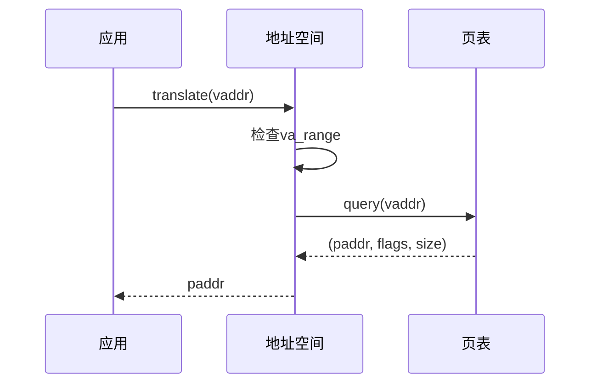

# 页表性能调优

<cite>
**本文档中引用的文件**  
- [mod.rs](file://src/npt/mod.rs)
- [arch/mod.rs](file://src/npt/arch/mod.rs)
- [arch/x86_64.rs](file://src/npt/arch/x86_64.rs)
- [arch/aarch64.rs](file://src/npt/arch/aarch64.rs)
- [arch/riscv.rs](file://src/npt/arch/riscv.rs)
- [backend/mod.rs](file://src/address_space/backend/mod.rs)
- [backend/alloc.rs](file://src/address_space/backend/alloc.rs)
- [backend/linear.rs](file://src/address_space/backend/linear.rs)
- [mod.rs](file://src/address_space/mod.rs)
</cite>

## 目录
1. [引言](#引言)
2. [嵌套页表架构分析](#嵌套页表架构分析)
3. [多级地址转换开销](#多级地址转换开销)
4. [TLB未命中对虚拟化性能的影响](#tlb未命中对虚拟化性能的影响)
5. [页表缓存机制与查询效率](#页表缓存机制与查询效率)
6. [大页映射的启用条件与性能收益](#大页映射的启用条件与性能收益)
7. [页表预加载与减少嵌套深度策略](#页表预加载与减少嵌套深度策略)
8. [性能测量方法](#性能测量方法)
9. [最佳实践总结](#最佳实践总结)

## 引言
本文档深入分析嵌套页表（NPT）在虚拟化环境中的性能瓶颈，重点围绕`src/npt/mod.rs`及其架构相关实现。通过剖析多级地址转换过程、TLB未命中影响、页表缓存设计等关键机制，提出优化建议并提供性能测量方法，旨在提升虚拟化系统的内存访问效率。

## 嵌套页表架构分析



**图示来源**  
- [mod.rs](file://src/npt/mod.rs#L1-L14)
- [arch/mod.rs](file://src/npt/arch/mod.rs#L1-L14)

**本节来源**  
- [mod.rs](file://src/npt/mod.rs#L1-L14)
- [arch/mod.rs](file://src/npt/arch/mod.rs#L1-L14)

## 多级地址转换开销

嵌套页表在x86_64、AArch64和RISC-V架构下分别实现为`ExtendedPageTable`、`NestedPageTable`等类型，均基于`PageTable64`模板构建。每级页表遍历需访问内存一次，形成多级地址转换链路：

- **x86_64**: 4级页表（PML4 → PDPT → PD → PT），支持52位物理地址
- **AArch64**: 可配置为3级或4级页表，支持48位物理地址
- **RISC-V**: 使用Sv39元数据，3级页表结构

这种多级结构导致每次地址转换可能引发多次内存访问，显著增加延迟。



**图示来源**  
- [x86_64.rs](file://src/npt/arch/x86_64.rs#L176-L189)
- [aarch64.rs](file://src/npt/arch/aarch64.rs#L200-L260)
- [riscv.rs](file://src/npt/arch/riscv.rs#L1-L5)

**本节来源**  
- [x86_64.rs](file://src/npt/arch/x86_64.rs#L176-L189)
- [aarch64.rs](file://src/npt/arch/aarch64.rs#L200-L260)
- [riscv.rs](file://src/npt/arch/riscv.rs#L1-L5)

## TLB未命中对虚拟化性能的影响

当TLB未命中时，硬件需执行完整的页表遍历流程。在虚拟化场景中，这涉及**两阶段地址转换**（GVA → GPA → HPA），进一步加剧延迟。TLB刷新操作通过架构特定指令完成：

- **x86_64**: `x86::tlb::flush()` 或 `flush_all()`
- **AArch64**: `tlbi vaae1is` / `tlbi vae2is` 或 `tlbi vmalle1` / `tlbi alle2is`
- **RISC-V**: `hfence.vvma`

频繁的TLB刷新会阻塞流水线，影响整体性能。

**本节来源**  
- [x86_64.rs](file://src/npt/arch/x86_64.rs#L180-L189)
- [aarch64.rs](file://src/npt/arch/aarch64.rs#L230-L259)
- [addr.rs](file://src/addr.rs#L29-L35)

## 页表缓存机制与查询效率

系统通过`query()`接口实现页表查询，支持返回物理地址、标志位及页面大小。查询过程中利用了页表项的`is_huge()`判断来识别大页映射，减少遍历层级。此外，`translate()`和`translate_and_get_limit()`等高层接口封装了查询逻辑，提升调用效率。



**图示来源**  
- [mod.rs](file://src/address_space/mod.rs#L162-L168)
- [mod.rs](file://src/address_space/mod.rs#L209-L246)

**本节来源**  
- [mod.rs](file://src/address_space/mod.rs#L162-L207)
- [mod.rs](file://src/address_space/mod.rs#L209-L246)

## 大页映射的启用条件与性能收益

大页映射通过设置页表项中的`HUGE_PAGE`（x86_64）或清除`NON_BLOCK`（AArch64）标志启用。其优势包括：

- 减少页表层级，降低遍历开销
- 提高TLB覆盖率，减少未命中率
- 降低页表内存占用

启用条件：
- 映射区域大小需对齐且足够大（如2MB或1GB）
- 硬件支持对应的大页模式
- 操作系统/虚拟机监控器配置允许使用大页

**本节来源**  
- [x86_64.rs](file://src/npt/arch/x86_64.rs#L13-L20)
- [aarch64.rs](file://src/npt/arch/aarch64.rs#L156-L199)
- [x86_64.rs](file://src/npt/arch/x86_64.rs#L130-L174)

## 页表预加载与减少嵌套深度策略

### 页表预加载
通过`map_alloc()`接口可选择是否立即分配物理帧（`populate=true`），实现页表预加载，避免运行时因缺页异常导致延迟。

### 减少嵌套深度
- 使用线性映射（`Backend::Linear`）替代嵌套映射，直接计算物理地址
- 合理规划内存布局，尽量使用大页映射
- 在支持的架构上启用4级EPT（通过`4-level-ept`特性）

```mermaid
classDiagram
class Backend {
<<enum>>
+Linear{pa_va_offset}
+Alloc{populate}
}
class AddrSpace {
-va_range
-pt : PageTable
-areas
+map_alloc()
+handle_page_fault()
}
class PageTable {
+query()
+map_region()
+unmap_region()
}
Backend --> AddrSpace : 使用
AddrSpace --> PageTable : 包含
```

**图示来源**  
- [backend/mod.rs](file://src/address_space/backend/mod.rs#L0-L40)
- [mod.rs](file://src/address_space/mod.rs#L83-L118)
- [alloc.rs](file://src/address_space/backend/alloc.rs#L0-L53)

**本节来源**  
- [backend/mod.rs](file://src/address_space/backend/mod.rs#L0-L40)
- [mod.rs](file://src/address_space/mod.rs#L83-L160)
- [alloc.rs](file://src/address_space/backend/alloc.rs#L55-L96)

## 性能测量方法

### 页错误计数监控
通过统计`handle_page_fault()`调用次数评估缺页频率。测试中可通过原子计数器（如`ALLOC_COUNT`）跟踪页面分配行为。

### 地址转换延迟采样
- 使用高精度计时器测量`translate()`调用耗时
- 对比启用/禁用大页时的平均延迟
- 监控TLB刷新频率与上下文切换关系

### 内存占用分析
- 统计各级页表所占物理帧数量
- 比较线性映射与动态分配的内存开销差异

**本节来源**  
- [mod.rs](file://src/address_space/mod.rs#L120-L160)
- [mod.rs](file://src/address_space/mod.rs#L382-L416)
- [mod.rs](file://src/address_space/mod.rs#L561-L587)

## 最佳实践总结

| 实践建议 | 描述 | 推荐场景 |
|--------|------|---------|
| 启用大页映射 | 使用2MB/1GB页面减少TLB压力 | 大内存应用、数据库 |
| 预加载页表 | 创建映射时立即分配物理帧 | 实时性要求高的服务 |
| 使用线性映射 | 固定偏移直接转换地址 | 设备内存、共享缓冲区 |
| 控制TLB刷新粒度 | 批量刷新或延迟刷新 | 高频内存操作场景 |
| 优化页表布局 | 对齐大页边界，减少碎片 | 启动阶段内存规划 |

**本节来源**  
- [mod.rs](file://src/address_space/mod.rs#L83-L118)
- [backend/linear.rs](file://src/address_space/backend/linear.rs#L0-L50)
- [backend/alloc.rs](file://src/address_space/backend/alloc.rs#L0-L53)