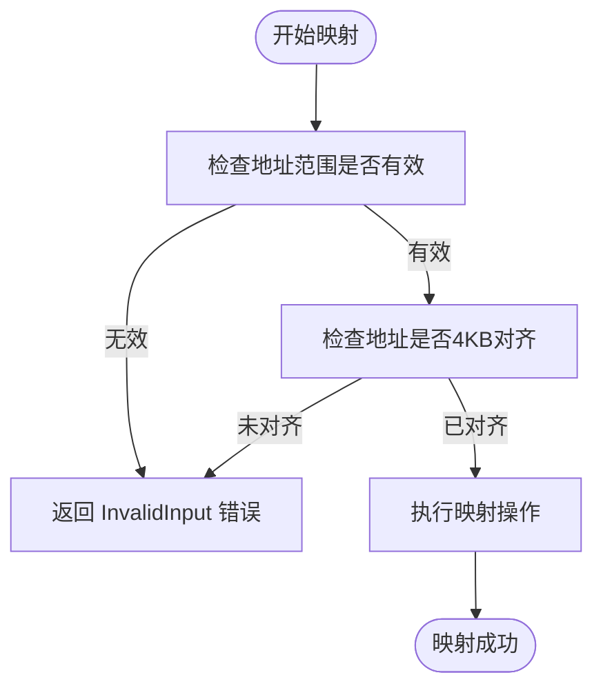
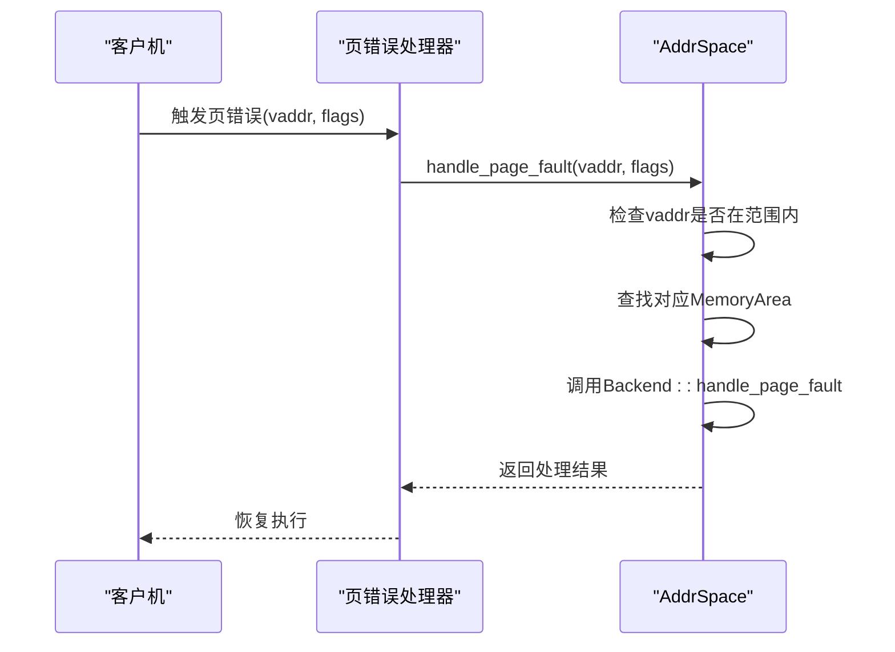
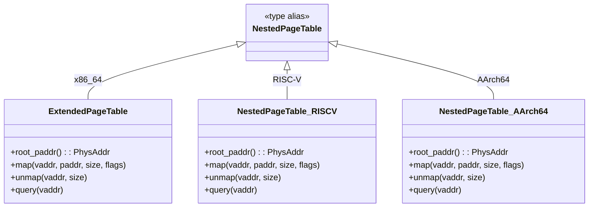
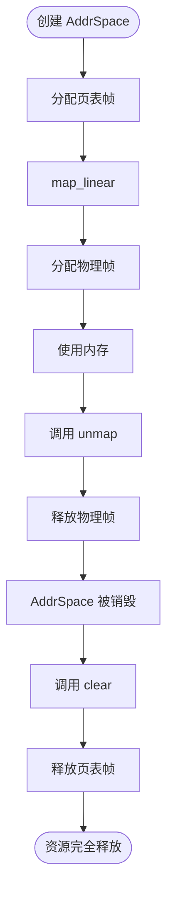

# 故障排除与常见问题

<cite>
**本文档引用的文件**  
- [src/address_space/mod.rs](file://src/address_space/mod.rs)
- [src/address_space/backend/mod.rs](file://src/address_space/backend/mod.rs)
- [src/address_space/backend/alloc.rs](file://src/address_space/backend/alloc.rs)
- [src/address_space/backend/linear.rs](file://src/address_space/backend/linear.rs)
- [src/npt/mod.rs](file://src/npt/mod.rs)
- [src/memory_accessor.rs](file://src/memory_accessor.rs)
- [README.md](file://README.md)
- [Cargo.toml](file://Cargo.toml)
</cite>

## 目录
1. [简介](#简介)
2. [地址映射失败](#地址映射失败)
3. [页错误处理异常](#页错误处理异常)
4. [跨架构兼容性问题](#跨架构兼容性问题)
5. [内存泄漏问题](#内存泄漏问题)
6. [日志分析与状态检查](#日志分析与状态检查)
7. [调试技巧](#调试技巧)
8. [关键错误类型解析](#关键错误类型解析)
9. [实际疑难案例](#实际疑难案例)
10. [结论](#结论)

## 简介
`axaddrspace` 是 ArceOS-Hypervisor 项目中用于管理客户虚拟机地址空间的核心模块，支持 x86_64、AArch64 和 RISC-V 等多种架构。该模块实现了嵌套页表和地址转换功能，适用于裸机虚拟化环境。本文档旨在系统性地列出使用 `axaddrspace` 时可能遇到的常见问题及其解决方案，帮助开发者快速定位和解决集成过程中遇到的问题。

**Section sources**
- [README.md](file://README.md#L0-L37)

## 地址映射失败
地址映射失败是使用 `axaddrspace` 时最常见的问题之一。通常发生在调用 `map_linear` 或 `map_alloc` 方法时，返回 `AxError::InvalidInput` 错误。

### 常见原因
1. **地址超出范围**：尝试映射的虚拟地址范围超出了地址空间的定义范围。
2. **地址未对齐**：虚拟地址、物理地址或大小未按 4KB 对齐。
3. **映射重叠**：新映射与现有映射区域发生重叠。

### 解决方案
- 确保调用 `new_empty` 时指定的基地址和大小正确。
- 使用 `contains_range` 方法检查地址范围是否在有效范围内。
- 确保所有地址和大小都按 4KB 对齐。
- 在创建新映射前，检查是否存在重叠区域。



**Diagram sources**
- [src/address_space/mod.rs](file://src/address_space/mod.rs#L49-L81)

**Section sources**
- [src/address_space/mod.rs](file://src/address_space/mod.rs#L49-L81)

## 页错误处理异常
页错误处理异常通常发生在调用 `handle_page_fault` 方法时未能正确处理页面故障。

### 常见原因
1. **线性映射触发页错误**：线性映射不应触发页错误，若发生说明配置错误。
2. **懒加载映射未启用**：在 `map_alloc` 中设置 `populate=false` 时，未正确处理后续页错误。
3. **访问权限不足**：页错误的访问标志与原始映射权限不匹配。

### 解决方案
- 确认线性映射的物理地址已正确分配且连续。
- 对于懒加载映射，确保在访问未映射页面时调用 `handle_page_fault`。
- 检查 `access_flags` 是否包含在原始映射的 `flags` 中。



**Diagram sources**
- [src/address_space/mod.rs](file://src/address_space/mod.rs#L185-L205)

**Section sources**
- [src/address_space/mod.rs](file://src/address_space/mod.rs#L185-L205)

## 跨架构兼容性问题
`axaddrspace` 支持多种架构，但在跨架构使用时可能出现兼容性问题。

### x86_64 架构
- **EPT 配置错误**：未正确配置扩展页表（Extended Page Table）。
- **内存类型不匹配**：WriteBack、Uncached 等内存类型配置不当。

### AArch64 架构
- **MAIR_EL2 配置错误**：内存属性索引寄存器配置不当。
- **EL2 特权级问题**：未正确处理 EL2 特权级访问。

### RISC-V 架构
- **Sv39 元数据问题**：Sv39 地址转换模式下的元数据处理错误。
- **hfence.vvma 指令缺失**：未正确执行虚拟机虚拟地址内存屏障。

### 解决方案
- 使用条件编译确保架构特定代码正确加载。
- 参考各架构的 `arch` 模块实现，确保正确初始化页表类型。
- 在跨架构测试中验证地址转换的正确性。



**Diagram sources**
- [src/npt/mod.rs](file://src/npt/mod.rs#L1-L14)

**Section sources**
- [README.md](file://README.md#L75-L95)

## 内存泄漏问题
内存泄漏问题主要表现为物理帧未正确释放，导致系统内存耗尽。

### 常见原因
1. **未调用 unmap**：映射后未调用 `unmap` 或 `clear` 方法。
2. **Drop 实现问题**：`AddrSpace` 的 `Drop` trait 未正确清理资源。
3. **分配计数错误**：HAL 层的 `alloc_frame` 和 `dealloc_frame` 调用不匹配。

### 解决方案
- 确保在不再需要映射时调用 `unmap` 方法。
- 利用 Rust 的所有权机制，确保 `AddrSpace` 被销毁时自动调用 `clear`。
- 使用测试工具验证分配和释放计数的平衡。



**Diagram sources**
- [src/address_space/mod.rs](file://src/address_space/mod.rs#L165-L175)

**Section sources**
- [src/address_space/mod.rs](file://src/address_space/mod.rs#L165-L175)

## 日志分析与状态检查
有效的日志分析和状态检查是诊断问题的关键。

### 日志级别建议
- **debug**：启用地址转换、映射操作的详细日志。
- **warn**：记录潜在问题，如缓冲区越界。
- **error**：记录严重错误，如内存分配失败。

### 状态检查方法
- 使用 `translate` 方法检查虚拟地址是否可正确转换。
- 使用 `contains_range` 验证地址范围的有效性。
- 检查 `page_table_root` 是否为有效物理地址。

**Section sources**
- [src/address_space/mod.rs](file://src/address_space/mod.rs#L215-L235)
- [src/memory_accessor.rs](file://src/memory_accessor.rs#L18-L46)

## 调试技巧
### 启用测试模式
使用 `MockHal` 进行单元测试，验证基本功能：
```rust
#[test]
#[axin(decorator(mock_hal_test))]
fn test_map_linear() {
    // 测试线性映射功能
}
```

### 使用原子计数器
通过 `ALLOC_COUNT` 和 `DEALLOC_COUNT` 验证内存分配平衡：
```rust
assert_eq!(ALLOC_COUNT.load(Ordering::SeqCst), 1);
```

### 检查返回值
始终检查 `AxResult` 类型的返回值，避免忽略错误。

**Section sources**
- [src/address_space/mod.rs](file://src/address_space/mod.rs#L282-L312)

## 关键错误类型解析
### InvalidAddress
- **成因**：地址超出地址空间范围或未对齐。
- **修复方法**：确保地址在 `va_range` 内且按 4KB 对齐。

### MappingOverlap
- **成因**：新映射与现有映射区域重叠。
- **修复方法**：在映射前检查是否存在重叠区域。

### NoMemory
- **成因**：无法分配页表帧。
- **修复方法**：确保有足够的物理内存用于页表。

**Section sources**
- [src/address_space/mod.rs](file://src/address_space/mod.rs#L60-L81)

## 实际疑难案例
### 案例一：线性映射地址偏移错误
**问题描述**：线性映射后地址转换结果错误。
**根本原因**：`pa_va_offset` 计算错误。
**解决方案**：确认 `start_vaddr - start_paddr` 计算正确。

### 案例二：懒加载映射未触发页错误处理
**问题描述**：访问未映射页面时未正确分配物理帧。
**根本原因**：`handle_page_fault` 调用时机不当。
**解决方案**：确保在页错误异常处理流程中调用该方法。

### 案例三：跨架构页表初始化失败
**问题描述**：在 RISC-V 架构下无法创建地址空间。
**根本原因**：`NestedPageTable` 类型别名未正确解析。
**解决方案**：检查 `cfg_if` 条件编译配置。

**Section sources**
- [src/address_space/backend/linear.rs](file://src/address_space/backend/linear.rs#L1-L51)
- [src/address_space/backend/alloc.rs](file://src/address_space/backend/alloc.rs#L1-L97)

## 结论
本文档系统性地列出了使用 `axaddrspace` 模块时可能遇到的常见问题及其解决方案。通过理解地址映射机制、正确处理页错误、注意跨架构差异和防止内存泄漏，开发者可以有效降低集成难度和支持成本。建议在开发过程中充分利用日志、测试和调试工具，建立完善的错误处理机制。