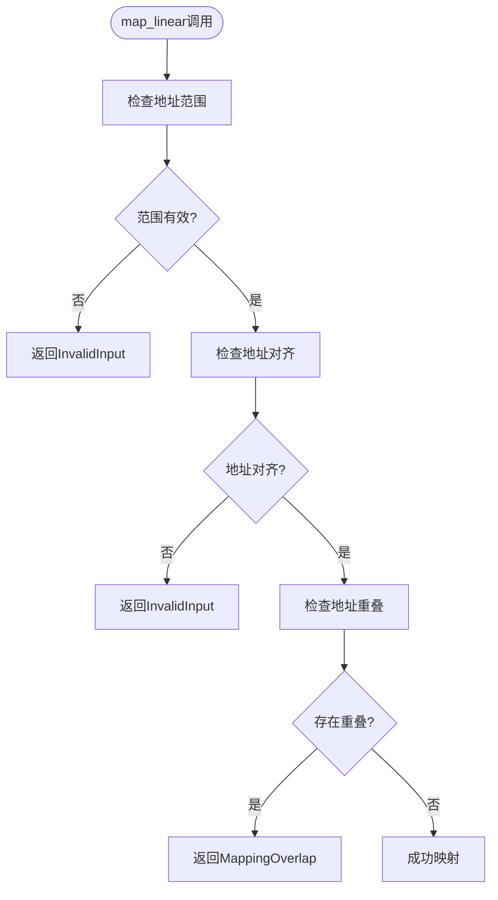
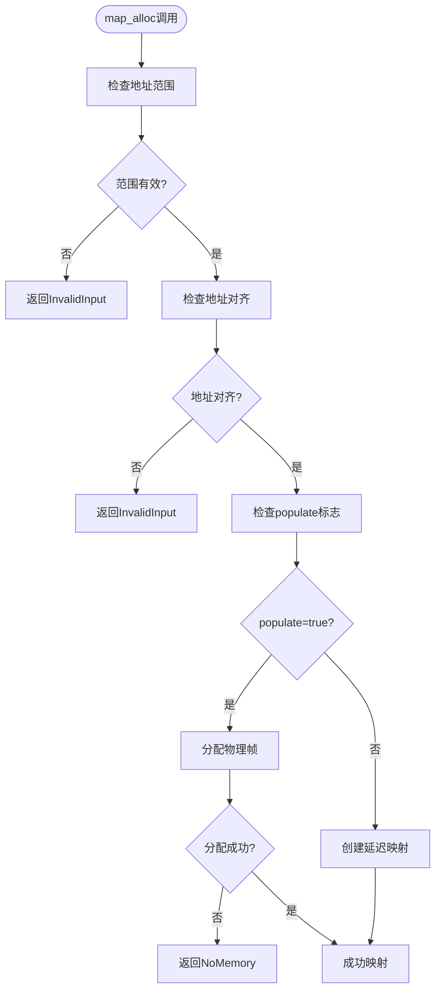

# 映射错误

<cite>
**本文档引用的文件**
- [mod.rs](file://src/address_space/mod.rs)
- [backend/alloc.rs](file://src/address_space/backend/alloc.rs)
- [backend/linear.rs](file://src/address_space/backend/linear.rs)
- [backend/mod.rs](file://src/address_space/backend/mod.rs)
- [npt/arch/aarch64.rs](file://src/npt/arch/aarch64.rs)
- [npt/arch/x86_64.rs](file://src/npt/arch/x86_64.rs)
</cite>

## 目录
1. [简介](#简介)
2. [常见映射错误类型](#常见映射错误类型)
3. [触发条件分析](#触发条件分析)
4. [错误预防机制](#错误预防机制)
5. [调试与日志定位](#调试与日志定位)
6. [Backend trait错误处理](#backend-trait错误处理)
7. [修复建议](#修复建议)

## 简介
在使用axaddrspace进行内存映射时，开发者可能会遇到多种错误情况。本文档详细分析了地址重叠（MappingOverlap）、无效地址（InvalidAddress）、权限冲突等常见错误的成因、触发条件和解决方案。通过深入分析`map_linear`和`map_alloc`等核心函数的实现，结合日志输出和调试断点，为开发者提供完整的错误排查和修复指南。

## 常见映射错误类型

### 地址重叠错误
当尝试映射的地址范围与已存在的映射区域发生重叠时，系统会拒绝新的映射请求。这种错误通常发生在多个模块试图映射相同内存区域时。

### 无效地址错误
无效地址错误主要包含两种情况：地址超出地址空间范围和地址未对齐。系统要求所有映射操作必须在预定义的地址空间范围内进行，并且虚拟地址、物理地址和大小都必须是4KB对齐的。

### 权限冲突错误
权限冲突发生在尝试以不兼容的权限标志映射同一地址区域时。例如，先以只读权限映射，然后尝试以读写权限重新映射同一区域。

**节来源**
- [mod.rs](file://src/address_space/mod.rs#L49-L118)

## 调用条件分析

### map_linear调用失败条件
`map_linear`函数在以下情况下会返回错误：

1. **地址范围超出**：当指定的虚拟地址范围不在地址空间的有效范围内时
2. **地址未对齐**：虚拟地址、物理地址或大小不是4KB对齐时
3. **地址重叠**：新映射与现有映射区域发生重叠时



**图来源**
- [mod.rs](file://src/address_space/mod.rs#L65-L81)

### map_alloc调用失败条件
`map_alloc`函数的失败条件与`map_linear`类似，但增加了对分配参数的检查：

1. **地址范围检查**：确保起始地址和大小在地址空间范围内
2. **对齐检查**：起始地址和大小必须是4KB对齐
3. **资源检查**：在`populate=true`时，确保有足够的物理帧可供分配



**图来源**
- [mod.rs](file://src/address_space/mod.rs#L95-L118)
- [backend/alloc.rs](file://src/address_space/backend/alloc.rs#L15-L53)

## 错误预防机制

### 边界检查
系统在每次映射操作前都会执行严格的边界检查，确保映射范围完全包含在地址空间内：

```rust
[SPEC SYMBOL](file://src/address_space/mod.rs#L49-L53)
```

### 地址对齐验证
所有映射操作都要求地址和大小必须是4KB对齐，系统通过以下方式验证：

```rust
[SPEC SYMBOL](file://src/address_space/mod.rs#L77-L81)
[SPEC SYMBOL](file://src/address_space/mod.rs#L114-L118)
```

### 标志位设置规范
映射标志位的设置需要遵循特定规则，特别是在不同架构下的转换：

#### AArch64架构下的标志转换
```rust
[SPEC SYMBOL](file://src/npt/arch/aarch64.rs#L117-L154)
```

#### x86_64架构下的标志转换
```rust
[SPEC SYMBOL](file://src/npt/arch/x86_64.rs#L33-L77)
```

**节来源**
- [mod.rs](file://src/address_space/mod.rs#L49-L118)
- [npt/arch/aarch64.rs](file://src/npt/arch/aarch64.rs#L117-L154)
- [npt/arch/x86_64.rs](file://src/npt/arch/x86_64.rs#L33-L77)

## 调试与日志定位

### 日志输出分析
系统在映射操作时会输出详细的调试日志，帮助定位问题：

#### 线性映射日志
```rust
[SPEC SYMBOL](file://src/address_space/backend/linear.rs#L15-L25)
```

#### 分配映射日志
```rust
[SPEC SYMBOL](file://src/address_space/backend/alloc.rs#L15-L25)
```

### 调试断点设置
建议在以下关键位置设置断点进行调试：

1. `map_linear`和`map_alloc`函数的入口
2. 边界检查和对齐验证代码段
3. 实际映射操作执行前
4. 错误处理路径


**图来源**
- [backend/linear.rs](file://src/address_space/backend/linear.rs#L15-L25)
- [backend/alloc.rs](file://src/address_space/backend/alloc.rs#L15-L25)

## Backend trait错误处理

### Backend枚举结构
系统通过Backend枚举统一管理不同类型的映射后端：

```rust
[SPEC SYMBOL](file://src/address_space/backend/mod.rs#L25-L60)
```

### 错误处理实现
Backend trait的实现包含了完整的错误处理机制：

#### 映射操作错误处理
```rust
[SPEC SYMBOL](file://src/address_space/backend/mod.rs#L62-L80)
```

#### 解映射操作错误处理
```rust
[SPEC SYMBOL](file://src/address_space/backend/mod.rs#L82-L90)
```

#### 页错误处理
```rust
[SPEC SYMBOL](file://src/address_space/backend/alloc.rs#L75-L97)
```

**节来源**
- [backend/mod.rs](file://src/address_space/backend/mod.rs#L25-L110)
- [backend/alloc.rs](file://src/address_space/backend/alloc.rs#L75-L97)

## 修复建议

### 通用修复策略
1. **验证地址范围**：确保映射地址在有效范围内
2. **检查对齐要求**：确保所有地址和大小都是4KB对齐
3. **避免重叠**：在映射前检查是否存在冲突的映射区域
4. **合理设置标志**：根据实际需求设置正确的权限标志

### 特定场景修复
#### 线性映射修复
- 确保虚拟地址和物理地址的偏移量计算正确
- 验证线性映射的连续性要求

#### 分配映射修复
- 在`populate=true`时确保有足够的内存资源
- 处理延迟分配时的页错误

### 最佳实践
1. **预检查**：在调用映射函数前进行参数验证
2. **错误处理**：妥善处理映射函数返回的错误
3. **资源管理**：及时释放不再需要的映射
4. **日志记录**：利用系统日志进行问题排查

**节来源**
- [mod.rs](file://src/address_space/mod.rs#L49-L160)
- [backend/mod.rs](file://src/address_space/backend/mod.rs#L62-L110)