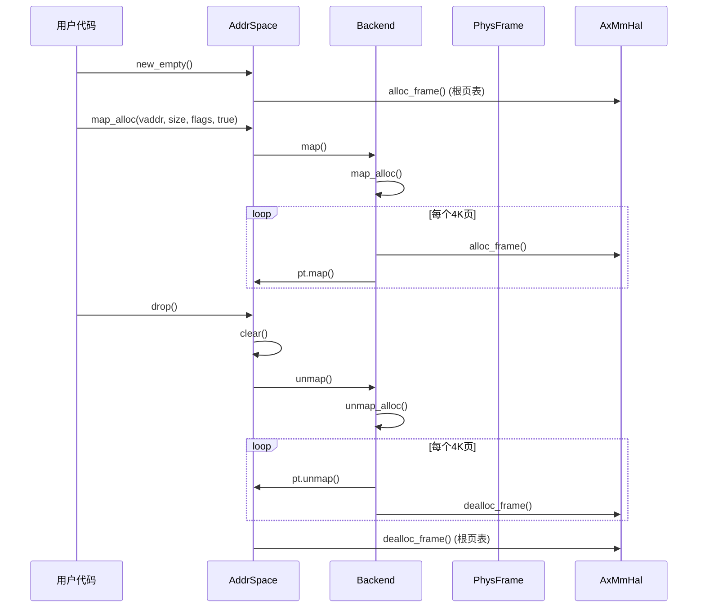

# 资源管理问题

<cite>
**本文档中引用的文件**  
- [src/address_space/mod.rs](file://src/address_space/mod.rs)
- [src/address_space/backend/alloc.rs](file://src/address_space/backend/alloc.rs)
- [src/frame.rs](file://src/frame.rs)
- [src/test_utils/mod.rs](file://src/test_utils/mod.rs)
</cite>

## 目录
1. [引言](#引言)
2. [地址空间与资源泄漏风险](#地址空间与资源泄漏风险)
3. [FrameTracker 与 AllocatingBackend 的职责](#frametracker-与-allocatingbackend-的职责)
4. [RAII 机制在资源安全释放中的应用](#raii-机制在资源安全释放中的应用)
5. [内存泄漏检测工具建议](#内存泄漏检测工具建议)
6. [AddrSpace 销毁时的资源清理后果](#addrspace-销毁时的资源清理后果)
7. [确保资源完全释放的最佳实践](#确保资源完全释放的最佳实践)
8. [结论](#结论)

## 引言

在虚拟化系统中，地址空间（AddrSpace）管理是核心功能之一，负责虚拟地址到物理地址的映射。然而，在复杂的内存管理场景下，若未能正确管理映射区域、物理帧（Frame）和页表内存，极易引发资源泄漏问题。本文系统性地分析 `axaddrspace` 模块中的资源泄漏风险，重点探讨 `FrameTracker`（即 `PhysFrame`）和 `AllocatingBackend` 在资源生命周期管理中的职责，以及如何通过 RAII（Resource Acquisition Is Initialization）机制确保资源的安全释放。同时，提供检测内存泄漏的工具建议，并说明 AddrSpace 销毁时未能正确清理后端资源的潜在后果，最后给出确保资源完全释放的最佳实践。

**Section sources**
- [src/address_space/mod.rs](file://src/address_space/mod.rs#L1-L588)
- [src/frame.rs](file://src/frame.rs#L1-L163)

## 地址空间与资源泄漏风险

### 未释放的映射区域

地址空间通过 `MemorySet` 管理多个 `MemoryArea`，每个区域代表一段虚拟地址范围的映射。当调用 `map_linear` 或 `map_alloc` 创建映射时，会向 `MemorySet` 添加一个 `MemoryArea`。如果未调用 `unmap` 或 `clear`，这些区域将一直存在于 `MemorySet` 中，导致逻辑上的映射信息泄漏。

### 未回收的物理帧（Frame）

物理帧的分配和回收是资源泄漏的核心。在 `map_alloc` 操作中，若 `populate` 参数为 `true`，则会立即为整个映射区域分配物理帧。这些帧通过 `H::alloc_frame()` 获取。如果映射被移除但未正确调用 `H::dealloc_frame()`，物理帧将无法被回收，造成严重的内存泄漏。

### 页表内存堆积

每个 `AddrSpace` 拥有一个 `PageTable`，在创建时会分配一个物理帧作为根页表。随着映射的增加，可能需要分配更多的页表帧来构建多级页表结构。如果 `AddrSpace` 被销毁但其 `PageTable` 未被清理，这些页表帧将无法被释放。

```mermaid
flowchart TD
A[创建 AddrSpace] --> B[分配根页表帧]
C[调用 map_alloc(populate=true)] --> D[为每个页分配物理帧]
E[调用 map_alloc(populate=false)] --> F[仅创建页表项，不分配帧]
G[发生页错误] --> H[按需分配物理帧]
I[调用 unmap 或 clear] --> J[释放物理帧]
K[AddrSpace 被 drop] --> L[调用 clear 释放所有资源]
```

**Diagram sources**
- [src/address_space/mod.rs](file://src/address_space/mod.rs#L248-L280)
- [src/address_space/backend/alloc.rs](file://src/address_space/backend/alloc.rs#L54-L97)

## FrameTracker 与 AllocatingBackend 的职责

### FrameTracker (PhysFrame) 的职责

`PhysFrame` 结构体是 `FrameTracker` 的具体实现，它封装了一个物理帧的生命周期管理。

- **资源获取**：通过 `PhysFrame::alloc()` 静态方法调用 `H::alloc_frame()` 从全局分配器获取一个物理帧。
- **资源持有**：使用 `Option<HostPhysAddr>` 持有帧的物理地址，并通过 `PhantomData<H>` 绑定到特定的 `AxMmHal` 实现。
- **资源释放**：实现 `Drop` trait，在 `PhysFrame` 实例被销毁时自动调用 `H::dealloc_frame()` 释放物理帧。

`PhysFrame` 是 RAII 机制的典型应用，确保了“获取即初始化，销毁即释放”的原则。

### AllocatingBackend 的职责

`AllocatingBackend` 是 `Backend` 枚举中的 `Alloc` 变体，负责处理需要动态分配物理帧的映射。

- **映射创建**：`map_alloc` 方法根据 `populate` 参数决定映射策略。若为 `true`，则立即为所有页分配物理帧并建立映射；若为 `false`，则仅创建页表项，等待页错误时再分配。
- **映射移除**：`unmap_alloc` 方法在移除映射时，会遍历该区域的所有虚拟页，调用 `pt.unmap()` 获取物理帧地址，并立即调用 `H::dealloc_frame()` 进行释放。
- **页错误处理**：`handle_page_fault_alloc` 方法在 `populate=false` 的映射发生页错误时，负责按需分配物理帧并完成映射。

`AllocatingBackend` 的核心职责是协调页表操作与物理帧分配器，确保在映射生命周期的各个阶段都能正确地管理物理帧资源。

```mermaid
classDiagram
class PhysFrame~H~ {
+start_paddr : Option~HostPhysAddr~
+_marker : PhantomData~H~
+alloc() AxResult~Self~
+start_paddr() HostPhysAddr
}
class Backend~H~ {
<<enumeration>>
+Linear
+Alloc
}
class AddrSpace~H~ {
-va_range : GuestPhysAddrRange
-areas : MemorySet~Backend~H~~
-pt : PageTable~H~
+map_alloc()
+unmap()
+clear()
}
PhysFrame~H~ --> "uses" AxMmHal : H : : alloc_frame/dealloc_frame
Backend~H~ --> "implements" MappingBackend
AddrSpace~H~ --> "contains" MemorySet~Backend~H~~
AddrSpace~H~ --> "owns" PageTable~H~
AddrSpace~H~ --> "uses" Backend~H~
```

**Diagram sources**
- [src/frame.rs](file://src/frame.rs#L1-L163)
- [src/address_space/backend/mod.rs](file://src/address_space/backend/mod.rs#L1-L77)
- [src/address_space/mod.rs](file://src/address_space/mod.rs#L1-L588)

**Section sources**
- [src/frame.rs](file://src/frame.rs#L1-L163)
- [src/address_space/backend/alloc.rs](file://src/address_space/backend/alloc.rs#L54-L97)

## RAII 机制在资源安全释放中的应用

RAII（资源获取即初始化）是 Rust 语言中确保资源安全的核心机制。在 `axaddrspace` 模块中，RAII 被广泛应用于物理帧和地址空间的管理。

### PhysFrame 的 RAII 实现

`PhysFrame` 完美体现了 RAII 原则：
1.  **初始化即获取**：`PhysFrame::alloc()` 方法在成功返回一个 `PhysFrame` 实例的同时，已经完成了物理帧的分配。
2.  **析构即释放**：`impl Drop for PhysFrame<H>` 的实现确保了无论 `PhysFrame` 实例在何处被销毁（正常作用域结束、发生 panic 等），其持有的物理帧都会被自动释放。

这种设计消除了手动调用释放函数的需要，从根本上防止了因忘记释放而导致的资源泄漏。

### AddrSpace 的 RAII 实现

`AddrSpace` 本身也是一个 RAII 管理的资源：
1.  **初始化**：`AddrSpace::new_empty()` 在创建实例时，会分配根页表帧。
2.  **析构**：`impl Drop for AddrSpace<H>` 的实现调用了 `self.clear()` 方法。`clear()` 会遍历所有 `MemoryArea` 并调用 `unmap`，最终触发 `AllocatingBackend` 的 `unmap_alloc`，释放所有已分配的物理帧和页表结构。

通过这种嵌套的 RAII 设计，`AddrSpace` 及其管理的所有资源（包括物理帧）都能在实例销毁时得到安全、彻底的清理。



**Diagram sources**
- [src/address_space/mod.rs](file://src/address_space/mod.rs#L248-L280)
- [src/address_space/backend/alloc.rs](file://src/address_space/backend/alloc.rs#L54-L97)
- [src/frame.rs](file://src/frame.rs#L1-L163)

## 内存泄漏检测工具建议

为了有效检测和预防资源泄漏，可以结合以下工具和方法：

### 引用计数与调试钩子

如 `test_utils/mod.rs` 所示，可以通过全局原子计数器来监控资源的分配和释放情况。

- **ALLOC_COUNT**：统计 `alloc_frame` 的调用次数。
- **DEALLOC_COUNT**：统计 `dealloc_frame` 的调用次数。

通过在测试前后检查这两个计数器的差值，可以验证资源是否被正确释放。例如，在 `test_addrspace_creation` 测试中，创建 `AddrSpace` 会增加 `ALLOC_COUNT`，而在测试结束时，`drop` 会触发 `clear`，最终 `DEALLOC_COUNT` 也应增加相同的次数。

### 单元测试与 MockHal

使用 `MockHal` 模拟内存管理接口，可以精确控制和验证资源管理行为。
- **隔离测试**：`MockHal` 的 `reset_state()` 方法确保每个测试在干净的环境中运行。
- **错误注入**：`set_alloc_fail()` 方法可以模拟内存不足的情况，测试代码的错误处理能力。
- **行为验证**：通过 `test_dealloc_count()` 断言，可以验证在特定操作后，预期的释放次数是否发生。

### 静态分析与运行时检查

- **Rust 编译器**：利用 Rust 的所有权和借用检查器，可以在编译期捕获大部分资源管理错误。
- **AddressSanitizer (ASan)**：在运行时检测内存泄漏和越界访问。
- **自定义调试宏**：在 `PhysFrame` 的 `Drop` 实现中加入 `debug!` 日志，可以追踪每个帧的释放情况。

**Section sources**
- [src/test_utils/mod.rs](file://src/test_utils/mod.rs#L1-L170)

## AddrSpace 销毁时的资源清理后果

如果 `AddrSpace` 在销毁时未能正确清理后端资源，将导致一系列严重后果：

### 物理内存耗尽

未释放的物理帧会持续占用系统内存。在虚拟化环境中，这可能导致宿主机（Host）内存耗尽，进而影响其他虚拟机或宿主机自身服务的正常运行。

### 页表内存泄漏

未清理的页表结构会占用宝贵的物理内存。由于页表本身也是由物理帧构成，这种泄漏会形成恶性循环，消耗更多内存来管理泄漏的内存。

### 系统稳定性下降

资源泄漏会逐渐消耗系统资源，导致内存碎片化、分配延迟增加，最终可能引发系统性能急剧下降或崩溃。

### 安全风险

泄漏的物理帧可能包含敏感数据（如其他虚拟机的内存内容），如果这些帧被后续的分配操作重用，可能导致信息泄露。

**Section sources**
- [src/address_space/mod.rs](file://src/address_space/mod.rs#L248-L280)
- [src/frame.rs](file://src/frame.rs#L1-L163)

## 确保资源完全释放的最佳实践

为了确保 `AddrSpace` 及其管理的资源能够被完全释放，应遵循以下最佳实践：

### 严格依赖 RAII

- **避免手动管理**：不要在代码中显式调用 `alloc_frame` 或 `dealloc_frame`，而是通过 `PhysFrame` 和 `AddrSpace` 等 RAII 类型来管理。
- **确保所有权转移**：当需要传递物理帧时，应传递 `PhysFrame` 的所有权，而不是裸的物理地址。

### 正确实现 Drop

- **全面清理**：`AddrSpace` 的 `Drop` 实现必须调用 `clear()`，以确保所有映射区域和物理帧都被释放。
- **处理 panic**：`Drop` 实现应尽可能简单，避免在其中进行可能 panic 的操作，以防止资源泄漏。

### 充分的单元测试

- **覆盖所有路径**：编写测试用例，覆盖 `map_alloc`、`map_linear`、`unmap`、`clear` 以及 `AddrSpace` 的 `drop` 等所有资源管理路径。
- **验证计数器**：在测试中使用 `ALLOC_COUNT` 和 `DEALLOC_COUNT` 来验证资源的分配和释放是平衡的。
- **模拟失败**：使用 `MockHal` 模拟内存分配失败，确保错误处理路径不会导致资源泄漏。

### 代码审查与静态分析

- **审查资源管理**：在代码审查中，重点关注任何涉及 `alloc_frame` 或 `dealloc_frame` 的直接调用。
- **启用检查工具**：在 CI/CD 流程中集成 ASan 等内存检查工具，定期运行以发现潜在的泄漏。

**Section sources**
- [src/address_space/mod.rs](file://src/address_space/mod.rs#L248-L280)
- [src/frame.rs](file://src/frame.rs#L1-L163)
- [src/test_utils/mod.rs](file://src/test_utils/mod.rs#L1-L170)

## 结论

在 `axaddrspace` 模块中，通过 `PhysFrame` 和 `AddrSpace` 的 RAII 设计，结合 `AllocatingBackend` 的精细化管理，能够有效防止地址空间管理中的资源泄漏。`PhysFrame` 确保了单个物理帧的获取与释放成对出现，而 `AddrSpace` 的 `Drop` 实现则保证了整个地址空间及其所有子资源的彻底清理。通过使用 `MockHal` 和全局计数器进行充分的单元测试，可以验证资源管理逻辑的正确性。遵循 RAII 原则、正确实现 `Drop` 并进行严格的测试，是确保系统资源安全、稳定运行的最佳实践。任何破坏这一机制的行为都可能导致严重的内存泄漏，影响系统整体的可靠性和安全性。