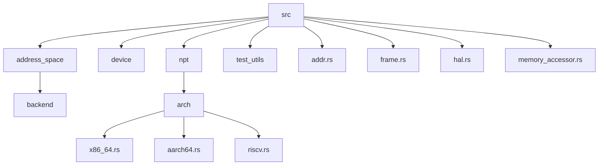
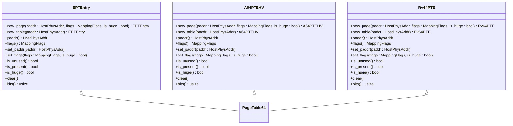
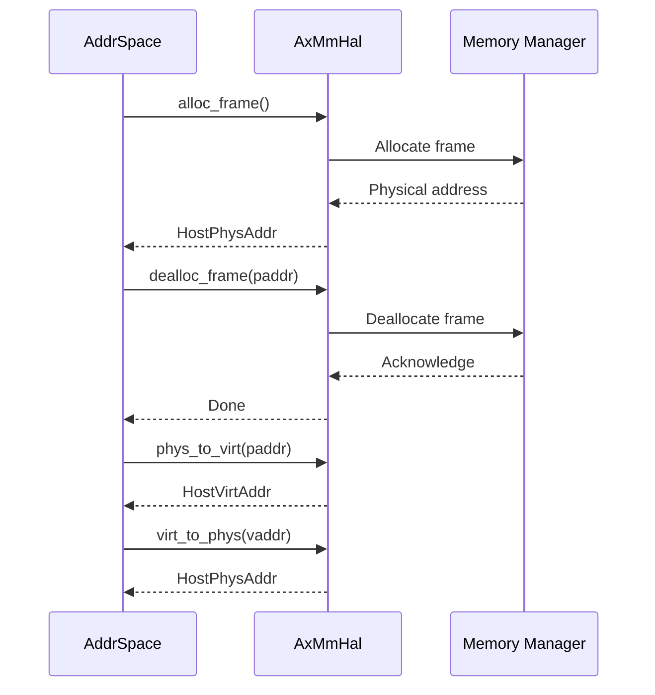

# 跨平台兼容性问题

<cite>
**本文档中引用的文件**  
- [lib.rs](file://src/lib.rs)
- [hal.rs](file://src/hal.rs)
- [mod.rs](file://src/npt/arch/mod.rs)
- [x86_64.rs](file://src/npt/arch/x86_64.rs)
- [aarch64.rs](file://src/npt/arch/aarch64.rs)
- [riscv.rs](file://src/npt/arch/riscv.rs)
- [address_space/mod.rs](file://src/address_space/mod.rs)
- [backend/mod.rs](file://src/address_space/backend/mod.rs)
- [Cargo.toml](file://Cargo.toml)
- [README.md](file://README.md)
</cite>

## 目录
1. [简介](#简介)
2. [项目结构](#项目结构)
3. [核心组件](#核心组件)
4. [架构适配层分析](#架构适配层分析)
5. [HAL接口的作用](#hal接口的作用)
6. [no-std环境下的初始化配置](#no-std环境下的初始化配置)
7. [CFG宏配置错误示例](#cfg宏配置错误示例)
8. [统一构建与测试策略](#统一构建与测试策略)
9. [结论](#结论)

## 简介
`axaddrspace` 是 ArceOS-Hypervisor 项目中的核心模块，负责管理客户虚拟机的地址空间。该模块支持多种架构（x86_64、AArch64、RISC-V），通过嵌套页表实现地址转换。本文档详细描述在不同目标架构上使用 `axaddrspace` 时可能遇到的兼容性问题，包括页大小差异、地址空间布局不同、内存属性标记不一致等，并提供相应的解决方案和最佳实践。

**Section sources**
- [README.md](file://README.md#L1-L140)

## 项目结构
`axaddrspace` 的项目结构清晰，主要分为以下几个部分：
- `src/address_space`：地址空间管理相关代码
- `src/device`：设备地址管理
- `src/npt`：嵌套页表实现
- `src/test_utils`：测试工具
- `src/addr.rs`、`src/frame.rs`、`src/hal.rs`、`src/memory_accessor.rs`：基础组件



**Diagram sources**
- [src/lib.rs](file://src/lib.rs#L1-L49)
- [src/npt/arch/mod.rs](file://src/npt/arch/mod.rs#L1-L15)

**Section sources**
- [src/lib.rs](file://src/lib.rs#L1-L49)
- [src/npt/arch/mod.rs](file://src/npt/arch/mod.rs#L1-L15)

## 核心组件
`axaddrspace` 的核心组件包括：
- `AddrSpace`：地址空间管理
- `NestedPageTable`：嵌套页表实现
- `AxMmHal`：硬件抽象层

这些组件共同协作，实现了跨平台的地址空间管理功能。

**Section sources**
- [src/lib.rs](file://src/lib.rs#L1-L49)
- [src/address_space/mod.rs](file://src/address_space/mod.rs#L1-L589)

## 架构适配层分析
`axaddrspace` 通过 `npt::arch` 模块抽象不同架构之间的差异。该模块根据目标架构选择合适的实现文件（`x86_64.rs`、`aarch64.rs` 或 `riscv.rs`），并提供统一的接口。

### x86_64 架构
- 使用 VMX 扩展页表（EPT）
- 支持多种内存类型配置（WriteBack、Uncached 等）
- 支持用户模式地址的执行权限

### AArch64 架构
- 使用 VMSAv8-64 第二阶段页表
- 可配置 MAIR_EL2 内存属性
- 支持 EL2 特权级别

### RISC-V 架构
- 实现嵌套页表
- 使用 `hfence.vvma` 指令
- 支持 Sv39 元数据



**Diagram sources**
- [src/npt/arch/x86_64.rs](file://src/npt/arch/x86_64.rs#L1-L191)
- [src/npt/arch/aarch64.rs](file://src/npt/arch/aarch64.rs#L1-L262)
- [src/npt/arch/riscv.rs](file://src/npt/arch/riscv.rs#L1-L7)

**Section sources**
- [src/npt/arch/x86_64.rs](file://src/npt/arch/x86_64.rs#L1-L191)
- [src/npt/arch/aarch64.rs](file://src/npt/arch/aarch64.rs#L1-L262)
- [src/npt/arch/riscv.rs](file://src/npt/arch/riscv.rs#L1-L7)

## HAL接口的作用
`AxMmHal` 接口为内存管理操作提供了硬件抽象层。通过实现该接口，可以在不同平台上统一处理内存分配、释放和地址转换等操作。



**Diagram sources**
- [src/hal.rs](file://src/hal.rs#L1-L41)

**Section sources**
- [src/hal.rs](file://src/hal.rs#L1-L41)

## no-std环境下的初始化配置
在 no-std 环境下，正确初始化架构特定组件至关重要。需要确保以下几点：
- 正确设置 `CFG` 宏
- 实现 `AxMmHal` 接口
- 配置适当的特征标志

### 配置建议
1. 在 `Cargo.toml` 中启用必要的特征标志
2. 实现 `AxMmHal` 接口以适配具体平台
3. 确保所有依赖项都支持 no-std 环境

**Section sources**
- [Cargo.toml](file://Cargo.toml#L1-L45)
- [src/hal.rs](file://src/hal.rs#L1-L41)

## CFG宏配置错误示例
未正确配置 `CFG` 宏可能导致功能缺失。例如，在 AArch64 平台上未启用 `arm-el2` 特征标志，将导致无法使用 EL2 特权级别的功能。

### 错误示例
```toml
[features]
default = []
```

### 正确配置
```toml
[features]
arm-el2 = ["page_table_entry/arm-el2"]
default = ["arm-el2"]
```

**Section sources**
- [Cargo.toml](file://Cargo.toml#L1-L45)

## 统一构建和测试策略
为了提前发现平台相关缺陷，建议采用统一的构建和测试策略：
1. 使用 CI/CD 工具自动化构建和测试过程
2. 在多个目标架构上运行测试
3. 使用 `#[cfg]` 属性编写条件编译代码

### 构建命令示例
```bash
cargo build --target x86_64-unknown-none
cargo build --target aarch64-unknown-none
cargo build --target riscv64gc-unknown-none-elf
```

### 测试命令示例
```bash
cargo test --target x86_64-unknown-none
cargo test --target aarch64-unknown-none
cargo test --target riscv64gc-unknown-none-elf
```

**Section sources**
- [README.md](file://README.md#L1-L140)

## 结论
`axaddrspace` 模块通过 `npt::arch` 模块成功抽象了不同架构之间的差异，并通过 `AxMmHal` 接口提供了统一的硬件抽象层。在 no-std 环境下，正确配置 `CFG` 宏和特征标志是确保功能完整性的关键。通过统一的构建和测试策略，可以有效发现和解决平台相关缺陷，提高代码的可移植性和稳定性。