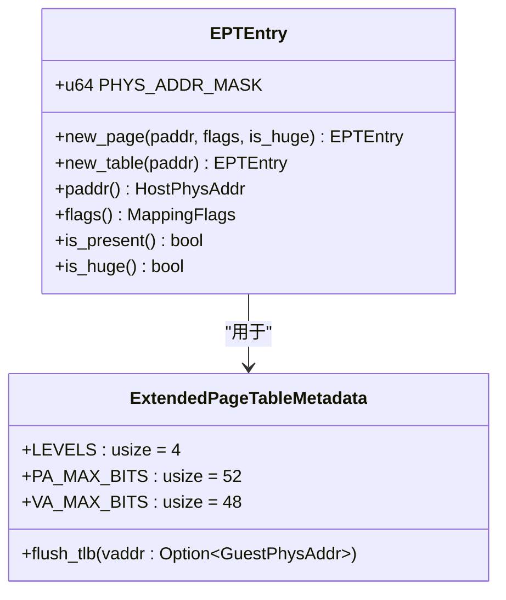
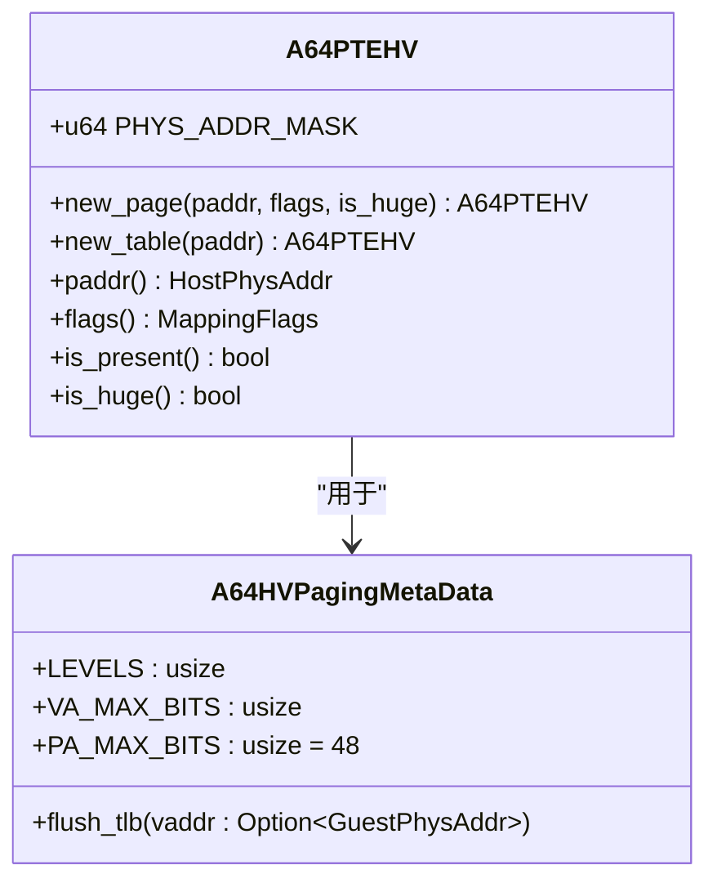
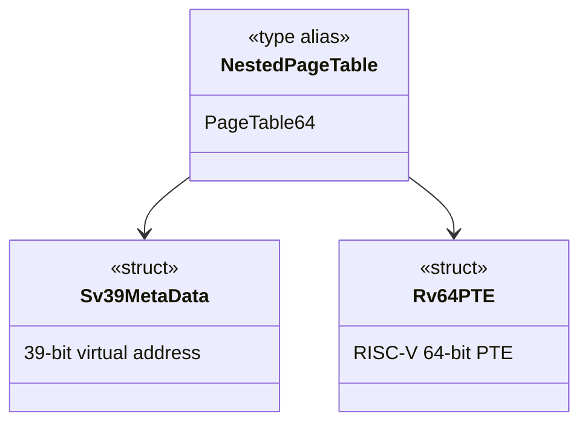
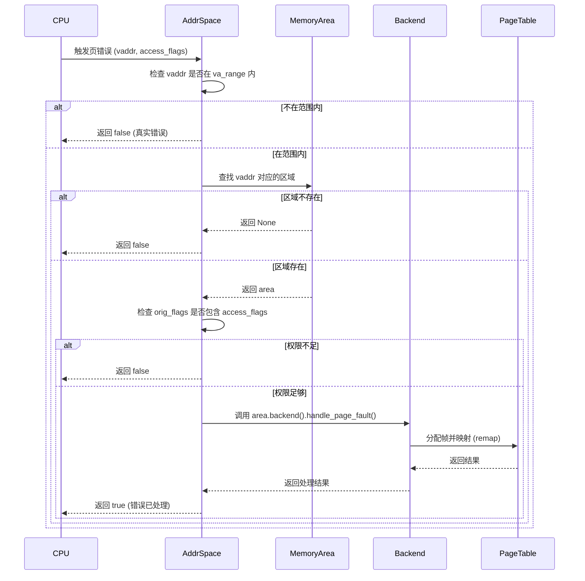

# 页表异常

<cite>
**本文档中引用的文件**   
- [mod.rs](file://src/npt/mod.rs)
- [arch/mod.rs](file://src/npt/arch/mod.rs)
- [x86_64.rs](file://src/npt/arch/x86_64.rs)
- [aarch64.rs](file://src/npt/arch/aarch64.rs)
- [riscv.rs](file://src/npt/arch/riscv.rs)
- [mod.rs](file://src/address_space/mod.rs)
- [backend/alloc.rs](file://src/address_space/backend/alloc.rs)
- [backend/linear.rs](file://src/address_space/backend/linear.rs)
- [backend/mod.rs](file://src/address_space/backend/mod.rs)
</cite>

## 目录
1. [引言](#引言)
2. [嵌套页表异常类型分析](#嵌套页表异常类型分析)
3. [多架构页表结构差异](#多架构页表结构差异)
4. [页错误处理流程与错误传播](#页错误处理流程与错误传播)
5. [页表调试技巧](#页表调试技巧)
6. [页表内存分配安全性](#页表内存分配安全性)
7. [结论](#结论)

## 引言
嵌套页表（Nested Page Table, NPT）是虚拟化环境中实现客户机物理地址（GPA）到宿主机物理地址（HPA）转换的核心机制。在x86_64、RISC-V和AArch64等不同架构下，NPT的实现存在显著差异，这些差异可能导致在页表项损坏、TLB刷新、多级转换等过程中出现不一致的行为。本文深入分析NPT运行中可能出现的各类异常，探讨其在不同架构下的表现，并提供相应的调试与安全防护策略。

## 嵌套页表异常类型分析

### 页表项损坏
页表项（PTE）损坏是NPT中最严重的异常之一，可能导致地址转换失败或系统崩溃。在x86_64架构中，`EPTEntry`（扩展页表项）的`PHYS_ADDR_MASK`定义了物理地址的有效位（bits 12..52），任何超出此范围的写入都可能导致地址错误。在AArch64中，`A64PTEHV`使用`PHYS_ADDR_MASK`（bits 12..48）进行地址掩码，若页表项的物理地址字段被非法修改，将导致转换到错误的物理内存区域。

### TLB刷新不及时
TLB（Translation Lookaside Buffer）缓存了页表转换结果，若在页表更新后未能及时刷新TLB，将导致使用过时的转换结果。在x86_64中，`ExtendedPageTableMetadata`的`flush_tlb`函数通过调用`x86::tlb::flush`指令刷新TLB，但在测试模式下此操作被禁用，可能导致测试与生产环境行为不一致。在AArch64中，`A64HVPagingMetaData`的`flush_tlb`函数使用`tlbi`指令（如`vaae1is`或`vmalle1`）刷新TLB，其行为受`arm-el2`编译特征影响。

### 多级转换失败
NPT采用多级页表结构进行地址转换。x86_64的`ExtendedPageTableMetadata`定义了4级页表（`LEVELS = 4`），而AArch64的`A64HVPagingMetaData`默认为3级（`LEVELS = 3`），可通过`4-level-ept`特征启用4级。RISC-V的`Sv39MetaData`则固定为3级。若在遍历过程中某一级页表项无效（`is_unused`或`!is_present`），转换将失败。例如，`EPTEntry::is_present`检查RWX权限位是否非零，而`A64PTEHV::is_present`检查`VALID`标志位。

### 页表遍历超时
虽然代码中未直接体现超时机制，但在实际硬件中，复杂的多级页表遍历可能因缓存未命中或内存延迟导致性能下降。若遍历过程耗时过长，可能被系统视为异常。确保页表结构紧凑、减少不必要的层级是避免此问题的关键。

**Section sources**
- [x86_64.rs](file://src/npt/arch/x86_64.rs#L130-L174)
- [aarch64.rs](file://src/npt/arch/aarch64.rs#L156-L199)
- [riscv.rs](file://src/npt/arch/riscv.rs#L0-L5)

## 多架构页表结构差异

### x86_64 架构
x86_64使用EPT（Extended Page Table）机制，其页表项`EPTEntry`包含`READ`、`WRITE`、`EXECUTE`、`HUGE_PAGE`等标志位。内存类型通过`EPTMemType`枚举（如`WriteBack`、`Uncached`）定义，并通过`MEM_TYPE_MASK`设置。`ExtendedPageTableMetadata`定义了48位虚拟地址和52位物理地址空间。

**Diagram sources**
- [x86_64.rs](file://src/npt/arch/x86_64.rs#L0-L190)

### AArch64 架构
AArch64使用VMSAv8-64转换表格式，其页表项`A64PTEHV`包含`VALID`、`NON_BLOCK`、`AF`（访问标志）、`XN`（执行禁止）等属性。内存类型通过`DescriptorAttr`的`ATTR`字段和`MemType`枚举定义。`A64HVPagingMetaData`的页表级数可配置（3或4级），虚拟地址空间为40或48位。

**Diagram sources**
- [aarch64.rs](file://src/npt/arch/aarch64.rs#L0-L261)

### RISC-V 架构
RISC-V使用Sv39或Sv48分页模式，代码中通过`Sv39MetaData`定义了39位虚拟地址空间。`NestedPageTable<H>`类型直接使用`PageTable64`模板，结合`Rv64PTE`页表项。其结构相对简单，依赖外部库`page_table_entry::riscv`实现具体功能。

**Diagram sources**
- [riscv.rs](file://src/npt/arch/riscv.rs#L0-L6)

## 页错误处理流程与错误传播

### handle_page_fault处理流程
`handle_page_fault`是处理页错误的核心函数。当客户机访问未映射或权限不足的地址时，该函数被调用。其流程如下：
1. 检查虚拟地址是否在地址空间范围内。
2. 在`areas`中查找对应的内存区域（`MemoryArea`）。
3. 若区域存在且原始权限包含访问权限，则调用后端的`handle_page_fault`方法。

**Diagram sources**
- [mod.rs](file://src/address_space/mod.rs#L120-L160)
- [backend/mod.rs](file://src/address_space/backend/mod.rs#L79-L109)
- [alloc.rs](file://src/address_space/backend/alloc.rs#L55-L96)

### 错误传播路径
错误传播主要发生在`handle_page_fault_alloc`函数中。若`populate`为`true`，则返回`false`，表示预分配的映射不应触发页错误。若为`false`（惰性分配），则尝试分配物理帧并调用`pt.remap`。若`H::alloc_frame()`失败或`pt.remap`失败，整个链式调用返回`None`，最终`handle_page_fault`返回`false`，表示页错误未被处理，可能引发客户机异常。

**Section sources**
- [mod.rs](file://src/address_space/mod.rs#L120-L160)
- [backend/alloc.rs](file://src/address_space/backend/alloc.rs#L55-L96)

## 页表调试技巧

### 使用dump_page_table查看状态
虽然代码中未直接提供`dump_page_table`函数，但可通过`AddrSpace`的`Debug`实现获取页表状态。`fmt::Debug` for `AddrSpace`会输出`va_range`、`page_table_root`（根页表物理地址）和`areas`信息，有助于快速定位页表结构问题。

### 结合硬件特性分析转换错误
- **x86_64**: 检查EPT异常（EPT Violation）的退出原因，结合`EPTEntry`的`flags`和`mem_type`分析权限或内存类型错误。
- **AArch64**: 分析`ESR_EL2`寄存器中的FSC（Fault Status Code），结合`DescriptorAttr`的`VALID`、`AF`、`XN`等标志位诊断问题。
- **RISC-V**: 检查`stval`寄存器中的错误地址和`scause`中的异常代码。

**Section sources**
- [mod.rs](file://src/address_space/mod.rs#L248-L280)

## 页表内存分配安全性

### 防止空指针解引用
在`map_alloc`和`unmap_alloc`等函数中，对`start`和`size`参数进行边界检查（`contains_range`）和对齐检查（`is_aligned_4k`），防止访问非法地址。`pt.remap`和`pt.unmap`等底层操作会验证页表项的有效性，避免对空指针操作。

### 防止越界访问
`AddrSpace`的`va_range`字段定义了虚拟地址的有效范围。所有地址转换操作（如`translate`、`handle_page_fault`）首先检查`vaddr`是否在`va_range`内，确保不会访问超出分配范围的地址。`translated_byte_buffer`函数还检查请求长度是否超过内存区域大小。

**Section sources**
- [mod.rs](file://src/address_space/mod.rs#L83-L118)
- [mod.rs](file://src/address_space/mod.rs#L120-L160)
- [mod.rs](file://src/address_space/mod.rs#L162-L207)

## 结论
嵌套页表的异常处理是虚拟化系统稳定性的关键。不同架构（x86_64、AArch64、RISC-V）在页表结构、TLB刷新和错误处理上存在显著差异，需针对性地进行调试和优化。通过严格的边界检查、及时的TLB刷新和清晰的错误处理流程，可以有效确保页表操作的安全性。开发者应充分利用各架构的硬件特性进行调试，以快速定位和解决页表相关问题。