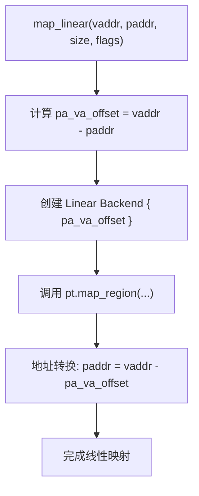
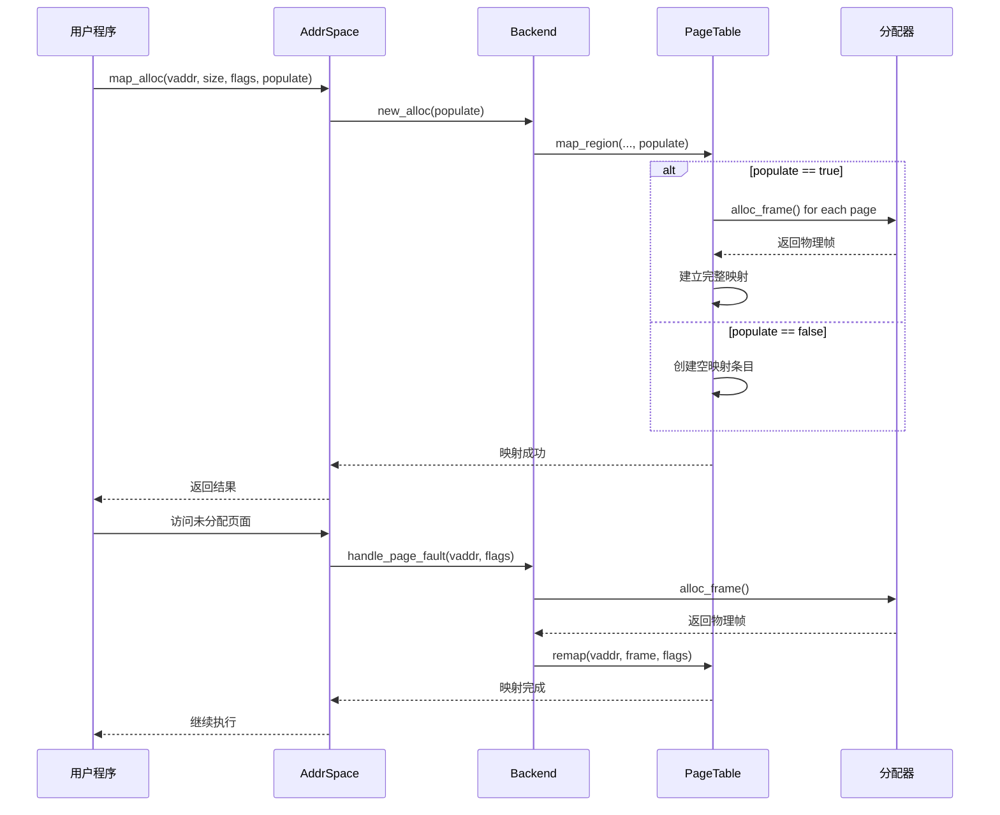

# 内存映射机制

<cite>
**本文档引用的文件**  
- [backend/mod.rs](file://src/address_space/backend/mod.rs)
- [backend/linear.rs](file://src/address_space/backend/linear.rs)
- [backend/alloc.rs](file://src/address_space/backend/alloc.rs)
- [mod.rs](file://src/address_space/mod.rs)
</cite>

## 目录
1. [引言](#引言)
2. [线性映射机制](#线性映射机制)
3. [动态分配映射机制](#动态分配映射机制)
4. [Backend抽象接口设计](#backend抽象接口设计)
5. [映射标志与访问控制](#映射标志与访问控制)
6. [映射冲突与地址重叠处理](#映射冲突与地址重叠处理)
7. [使用示例与调用流程](#使用示例与调用流程)
8. [性能与灵活性对比](#性能与灵活性对比)
9. [总结](#总结)

## 引言
`axaddrspace`模块提供了虚拟地址空间的管理功能，支持两种核心内存映射机制：**线性映射**（Linear Mapping）和**动态分配映射**（Allocation Mapping）。这两种机制分别适用于不同的应用场景，通过统一的`Backend`抽象接口进行封装，实现了策略的可插拔性与运行时选择能力。本文将深入解析其设计原理、实现细节及使用方式。

## 线性映射机制

线性映射机制通过`linear.rs`文件中的`Backend::Linear`实现，适用于设备内存或大块连续物理内存的固定区间映射。其核心原理是建立虚拟地址（VA）与物理地址（PA）之间的恒定偏移关系。

在创建线性映射时，指定一个`pa_va_offset`值，表示`vaddr - paddr`的差值。此后，任意虚拟地址`vaddr`均可通过公式`paddr = vaddr - pa_va_offset`直接计算出对应的物理地址。这种映射方式无需在页表中存储每个页的物理帧信息，仅需一次计算即可完成地址转换，具有极高的性能优势。

该机制适用于以下场景：
- 设备内存映射（如MMIO区域）
- 大块连续物理内存的直接映射
- 需要确定性地址映射关系的系统区域



**图示来源**  
- [linear.rs](file://src/address_space/backend/linear.rs#L15-L30)
- [mod.rs](file://src/address_space/mod.rs#L120-L140)

**本节来源**  
- [linear.rs](file://src/address_space/backend/linear.rs#L1-L52)
- [mod.rs](file://src/address_space/mod.rs#L120-L140)

## 动态分配映射机制

动态分配映射机制由`alloc.rs`文件中的`Backend::Alloc`实现，适用于按需分配的虚拟内存区域。其核心基于全局页帧分配器（`H::alloc_frame()`），支持两种分配模式：预分配（populate = true）和惰性分配（populate = false）。

当`populate`为`true`时，在调用`map_alloc`时立即为整个区域分配所有物理页帧并建立映射，避免后续访问触发页错误。而当`populate`为`false`时，仅在页表中预留映射条目，实际物理页帧在发生页错误时由`handle_page_fault_alloc`函数动态分配。

该机制适用于以下场景：
- 堆、栈等动态内存区域
- 大型但稀疏使用的内存区域
- 需要节省物理内存的延迟分配场景



**图示来源**  
- [alloc.rs](file://src/address_space/backend/alloc.rs#L15-L97)
- [mod.rs](file://src/address_space/mod.rs#L145-L165)

**本节来源**  
- [alloc.rs](file://src/address_space/backend/alloc.rs#L1-L97)
- [mod.rs](file://src/address_space/mod.rs#L145-L165)

## Backend抽象接口设计

`backend/mod.rs`中定义的`Backend`枚举类型统一了两种映射策略的接口，实现了策略的抽象化与运行时选择。该设计基于`MappingBackend` trait，提供了`map`、`unmap`、`protect`和`handle_page_fault`等统一操作。

`Backend<H>`泛型参数约束了分页处理器类型，确保与底层架构的兼容性。通过`match`语句，`map`和`unmap`等方法能够根据当前后端类型自动分发到`map_linear`或`map_alloc`等具体实现。这种设计使得上层代码无需关心具体映射策略，只需操作统一的`Backend`接口即可。

此外，`handle_page_fault`方法的实现也体现了策略差异：线性映射不应触发页错误（返回`false`），而分配映射则根据`populate`标志决定是否处理页错误。这种统一接口下的差异化行为，是策略模式的典型应用。

```mermaid
classDiagram
class MappingBackend~H~ {
<<trait>>
+map(start, size, flags, pt) bool
+unmap(start, size, pt) bool
+protect(start, size, new_flags, pt) bool
+handle_page_fault(vaddr, orig_flags, pt) bool
}
class Backend~H~ {
<<enum>>
+Linear{pa_va_offset}
+Alloc{populate, _phantom}
}
class AddrSpace~H~ {
-va_range
-areas : MemorySet~Backend~H~~
-pt : PageTable~H~
+map_linear(...)
+map_alloc(...)
+handle_page_fault(...)
}
MappingBackend <|-- Backend
AddrSpace --> Backend : 使用
AddrSpace --> PageTable : 操作
```

**图示来源**  
- [backend/mod.rs](file://src/address_space/backend/mod.rs#L1-L110)
- [mod.rs](file://src/address_space/mod.rs#L1-L588)

**本节来源**  
- [backend/mod.rs](file://src/address_space/backend/mod.rs#L1-L110)

## 映射标志与访问控制

`MappingFlags`用于控制内存映射的访问权限与属性，定义于`page_table_entry::MappingFlags`并通过`pub use`导出。主要标志包括：
- `READ`: 允许读取访问
- `WRITE`: 允许写入访问
- `EXECUTE`: 允许执行访问
- `DEVICE`: 标记为设备内存，影响缓存策略

在映射创建时，`flags`参数被传递至页表操作函数，最终写入页表项的权限位。例如，在x86_64架构下，这些标志会被转换为EPT（Extended Page Table）中的R/W/X位；在AArch64下，则映射为相应的内存属性索引。

页错误处理时，系统会检查访问类型（`access_flags`）是否被原始映射权限（`orig_flags`）所允许。若访问越权（如写入只读页面），则返回`false`，表示真实页错误，可能触发异常或终止进程。

**本节来源**  
- [backend/mod.rs](file://src/address_space/backend/mod.rs#L56-L63)
- [mod.rs](file://src/address_space/mod.rs#L146-L149)
- [x86_64.rs](file://src/npt/arch/x86_64.rs#L33-L77)
- [aarch64.rs](file://src/npt/arch/aarch64.rs#L74-L115)

## 映射冲突与地址重叠处理

系统通过`MemorySet`结构管理多个`MemoryArea`，并在映射操作时进行冲突检测。当调用`map_linear`或`map_alloc`时，内部会调用`MemorySet::map`方法，该方法会检查新映射区域是否与已有区域重叠。

若检测到地址重叠，`map`操作将返回错误，上层函数将其转换为`AxError::InvalidInput`并返回。此外，系统还检查虚拟地址是否在地址空间范围内（`contains_range`）、地址是否4KB对齐等约束条件。

在解除映射（`unmap`）时，系统会遍历指定区域内的每个页面，调用`pt.unmap`并释放对应的物理帧（通过`H::dealloc_frame`）。对于线性映射，解除操作仅需从页表中删除条目；对于分配映射，则还需回收物理内存资源。

**本节来源**  
- [mod.rs](file://src/address_space/mod.rs#L120-L165)
- [backend/linear.rs](file://src/address_space/backend/linear.rs#L35-L50)
- [backend/alloc.rs](file://src/address_space/backend/alloc.rs#L50-L75)

## 使用示例与调用流程

以下为两种映射方式的典型使用示例：

### 线性映射使用
```rust
let mut addr_space = AddrSpace::new_empty(base, size)?;
let vaddr = GuestPhysAddr::from_usize(0x18000);
let paddr = PhysAddr::from_usize(0x10000);
let size = 0x8000;
let flags = MappingFlags::READ | MappingFlags::WRITE;

addr_space.map_linear(vaddr, paddr, size, flags)?; // 建立线性映射
```

### 动态分配映射使用
```rust
// 预分配模式
addr_space.map_alloc(vaddr, size, flags, true)?; // 立即分配所有页帧

// 惰性分配模式
addr_space.map_alloc(vaddr, size, flags, false)?; // 延迟分配
// 第一次访问时触发页错误，自动分配物理页
```

映射成功后，可通过`translate`方法进行地址转换，或通过`translated_byte_buffer`获取可操作的内存缓冲区。

**本节来源**  
- [mod.rs](file://src/address_space/mod.rs#L300-L580)
- [tests](file://src/address_space/mod.rs#L300-L580)

## 性能与灵活性对比

| 特性 | 线性映射 | 动态分配映射 |
|------|----------|--------------|
| **性能** | 极高，地址转换无查表开销 | 中等，预分配模式较快，惰性模式有页错误开销 |
| **灵活性** | 低，需预先知道物理地址 | 高，按需分配，支持大范围虚拟内存 |
| **内存利用率** | 高，无元数据开销 | 中等，需维护页表条目，惰性模式节省初始内存 |
| **适用场景** | 设备内存、固定区域 | 堆栈、动态内存、稀疏内存 |
| **页错误处理** | 不应发生 | 支持惰性分配 |
| **解除映射开销** | 低 | 中等，需逐页回收物理帧 |

**本节来源**  
- [linear.rs](file://src/address_space/backend/linear.rs#L1-L52)
- [alloc.rs](file://src/address_space/backend/alloc.rs#L1-L97)
- [mod.rs](file://src/address_space/mod.rs#L1-L588)

## 总结

`axaddrspace`通过`Backend`抽象统一了线性映射与动态分配映射两种机制，分别适用于设备内存和按需分配场景。线性映射基于固定偏移实现高性能确定性映射，而动态分配映射则通过页帧分配器支持灵活的内存管理。`MappingFlags`提供了细粒度的访问控制，而`MemorySet`确保了映射区域的完整性与无重叠。该设计在性能、灵活性与安全性之间取得了良好平衡，适用于虚拟化环境中的复杂内存管理需求。

**本节来源**  
- [backend/mod.rs](file://src/address_space/backend/mod.rs#L1-L110)
- [linear.rs](file://src/address_space/backend/linear.rs#L1-L52)
- [alloc.rs](file://src/address_space/backend/alloc.rs#L1-L97)
- [mod.rs](file://src/address_space/mod.rs#L1-L588)