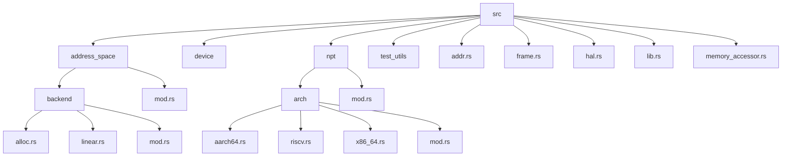
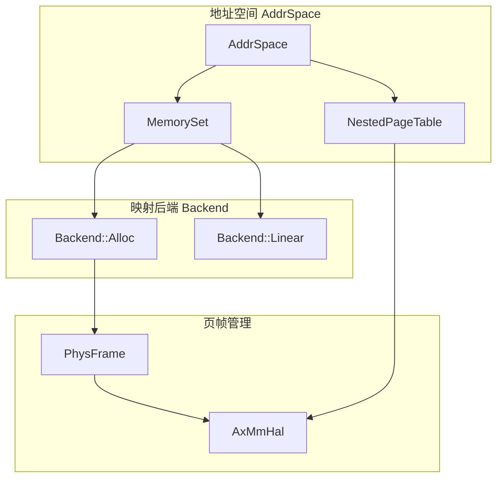
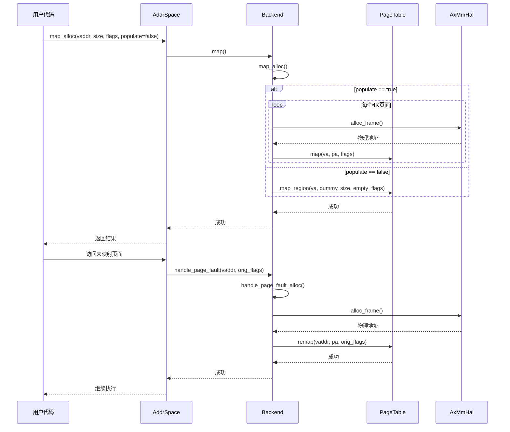
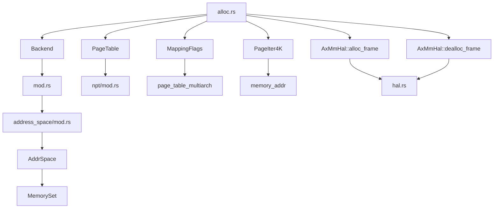
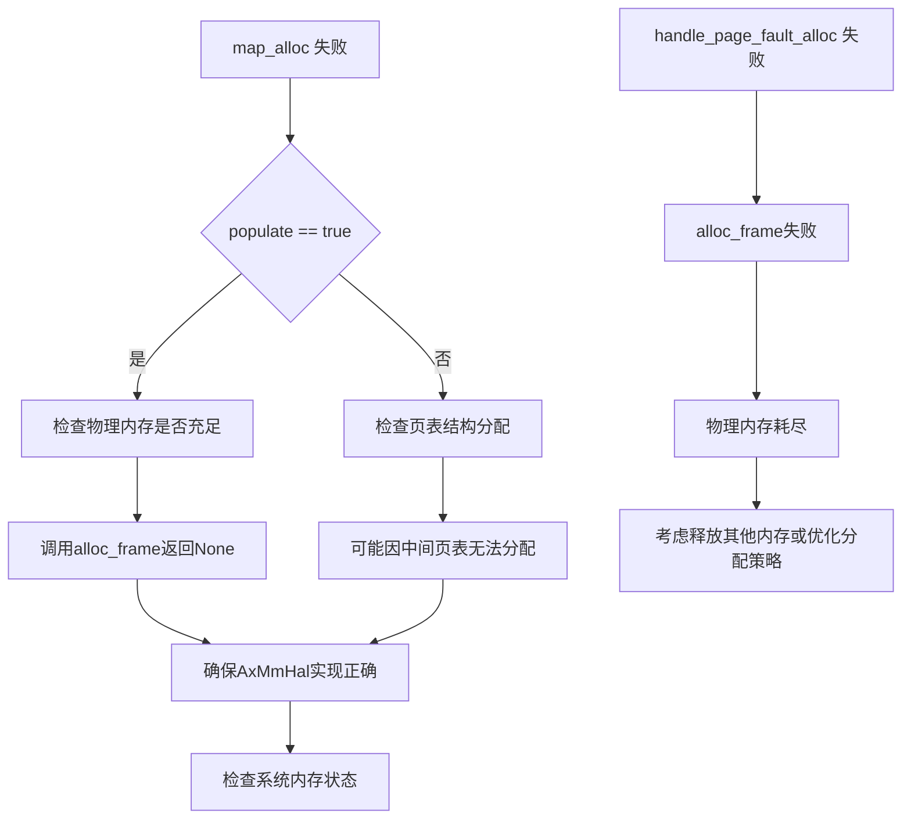

# 动态分配映射

<cite>
**本文档引用的文件**  
- [alloc.rs](file://src/address_space/backend/alloc.rs)
- [mod.rs](file://src/address_space/backend/mod.rs)
- [address_space/mod.rs](file://src/address_space/mod.rs)
- [frame.rs](file://src/frame.rs)
- [hal.rs](file://src/hal.rs)
- [addr.rs](file://src/addr.rs)
- [npt/mod.rs](file://src/npt/mod.rs)
- [npt/arch/x86_64.rs](file://src/npt/arch/x86_64.rs)
- [npt/arch/riscv.rs](file://src/npt/arch/riscv.rs)
</cite>

## 目录
1. [引言](#引言)
2. [项目结构](#项目结构)
3. [核心组件](#核心组件)
4. [架构概述](#架构概述)
5. [详细组件分析](#详细组件分析)
6. [依赖分析](#依赖分析)
7. [性能考虑](#性能考虑)
8. [故障排除指南](#故障排除指南)
9. [结论](#结论)

## 引言
本文档详细说明基于页帧分配器的动态内存映射机制，重点分析 `alloc.rs` 中如何实现按需分配物理页帧并建立页表映射。该机制适用于堆、栈等需要动态扩展的虚拟内存区域，具有高灵活性和内存利用率。通过 `Backend` trait 接口，展示 `map_alloc` 的调用流程，包括虚拟地址分配、物理页帧获取、页表更新等步骤。同时解释映射标志（`MappingFlags`）在访问权限控制中的作用，以及缺页异常触发后的按需分配流程。与线性映射进行对比，讨论其在性能开销和碎片管理方面的权衡，并提供典型使用场景及异常处理策略。

## 项目结构

**图示来源**  
- [alloc.rs](file://src/address_space/backend/alloc.rs#L1-L97)
- [mod.rs](file://src/address_space/backend/mod.rs#L1-L110)
- [address_space/mod.rs](file://src/address_space/mod.rs#L1-L588)
- [npt/mod.rs](file://src/npt/mod.rs#L1-L14)
- [npt/arch/x86_64.rs](file://src/npt/arch/x86_64.rs#L1-L190)
- [npt/arch/riscv.rs](file://src/npt/arch/riscv.rs#L1-L6)

**本节来源**  
- [src](file://src)
- [src/address_space](file://src/address_space)
- [src/npt](file://src/npt)

## 核心组件

文档的核心组件包括：
- `Backend` 枚举：统一管理线性映射和分配映射两种后端。
- `map_alloc` 方法：实现动态页帧分配与页表映射。
- `handle_page_fault_alloc`：处理缺页异常并按需分配物理页帧。
- `MappingFlags`：控制内存访问权限。
- `NestedPageTable`：架构相关的嵌套页表实现。

这些组件共同构成了动态内存映射机制的基础，支持堆、栈等区域的弹性扩展。

**本节来源**  
- [alloc.rs](file://src/address_space/backend/alloc.rs#L1-L97)
- [mod.rs](file://src/address_space/backend/mod.rs#L1-L110)
- [address_space/mod.rs](file://src/address_space/mod.rs#L1-L588)

## 架构概述

**图示来源**  
- [address_space/mod.rs](file://src/address_space/mod.rs#L1-L588)
- [backend/mod.rs](file://src/address_space/backend/mod.rs#L1-L110)
- [frame.rs](file://src/frame.rs#L1-L163)
- [hal.rs](file://src/hal.rs#L1-L40)

## 详细组件分析

### 动态映射机制分析

#### 动态映射流程

**图示来源**  
- [alloc.rs](file://src/address_space/backend/alloc.rs#L15-L97)
- [address_space/mod.rs](file://src/address_space/mod.rs#L100-L200)

#### 映射标志作用分析

**图示来源**  
- [npt/arch/x86_64.rs](file://src/npt/arch/x86_64.rs#L1-L190)
- [page_table_entry](external)

#### 缺页异常处理流程

**图示来源**  
- [address_space/mod.rs](file://src/address_space/mod.rs#L300-L350)
- [alloc.rs](file://src/address_space/backend/alloc.rs#L60-L97)

**本节来源**  
- [alloc.rs](file://src/address_space/backend/alloc.rs#L1-L97)
- [address_space/mod.rs](file://src/address_space/mod.rs#L1-L588)
- [npt/arch/x86_64.rs](file://src/npt/arch/x86_64.rs#L1-L190)

### 线性映射对比分析

#### 映射方式对比

**图示来源**  
- [backend/mod.rs](file://src/address_space/backend/mod.rs#L1-L110)
- [linear.rs](file://src/address_space/backend/linear.rs)

#### 性能与碎片权衡

**图示来源**  
- [alloc.rs](file://src/address_space/backend/alloc.rs)
- [linear.rs](file://src/address_space/backend/linear.rs)

**本节来源**  
- [backend/mod.rs](file://src/address_space/backend/mod.rs#L1-L110)
- [alloc.rs](file://src/address_space/backend/alloc.rs#L1-L97)
- [linear.rs](file://src/address_space/backend/linear.rs)

## 依赖分析

**图示来源**  
- [alloc.rs](file://src/address_space/backend/alloc.rs#L1-L97)
- [backend/mod.rs](file://src/address_space/backend/mod.rs#L1-L110)
- [address_space/mod.rs](file://src/address_space/mod.rs#L1-L588)
- [npt/mod.rs](file://src/npt/mod.rs#L1-L14)
- [hal.rs](file://src/hal.rs#L1-L40)

**本节来源**  
- [alloc.rs](file://src/address_space/backend/alloc.rs#L1-L97)
- [backend/mod.rs](file://src/address_space/backend/mod.rs#L1-L110)
- [address_space/mod.rs](file://src/address_space/mod.rs#L1-L588)
- [hal.rs](file://src/hal.rs#L1-L40)

## 性能考虑

动态分配映射机制在性能上存在以下特点：

- **优点**：
  - 内存利用率高，仅在需要时分配物理页帧。
  - 支持大范围虚拟地址空间的稀疏映射。
  - 适用于堆、栈等动态增长的内存区域。

- **缺点**：
  - 首次访问触发缺页异常，有一定性能开销。
  - 页表层级查询带来额外延迟。
  - 频繁分配/释放可能导致内存碎片。

建议在内存紧张或地址空间稀疏的场景下使用动态映射，而在性能敏感且内存需求固定的场景下使用线性映射。

[本节无具体文件来源，为通用性能分析]

## 故障排除指南

### 内存分配失败处理

### 常见异常情况
- **分配失败**：`H::alloc_frame()` 返回 `None`，通常表示物理内存不足。
- **对齐错误**：虚拟地址、物理地址或大小未按4K对齐。
- **越界访问**：访问超出地址空间范围的地址。
- **权限错误**：访问标志不匹配，如写入只读页面。

**本节来源**  
- [alloc.rs](file://src/address_space/backend/alloc.rs#L15-L97)
- [frame.rs](file://src/frame.rs#L1-L163)
- [address_space/mod.rs](file://src/address_space/mod.rs#L1-L588)

## 结论

本文档详细分析了基于页帧分配器的动态内存映射机制。该机制通过 `Backend::Alloc` 后端实现了按需分配物理页帧的能力，支持 `populate=false` 时的延迟分配和缺页异常触发分配。相比线性映射，它在内存利用率上具有显著优势，特别适合堆、栈等动态内存区域。通过 `MappingFlags` 可精确控制访问权限，并与底层架构（如x86_64 EPT）良好集成。尽管存在缺页异常开销和碎片风险，但在大多数虚拟化场景下仍是更优选择。建议结合具体应用场景权衡性能与内存效率。

[本节无具体文件来源，为总结性内容]