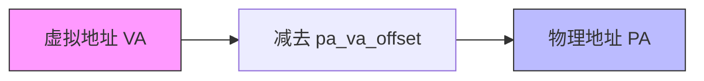
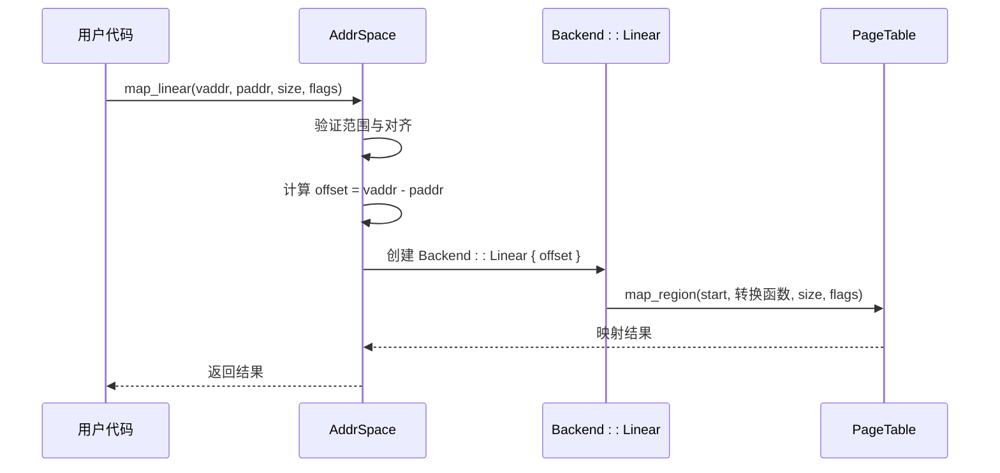

# 线性映射

<cite>
**本文档引用的文件**  
- [linear.rs](file://src/address_space/backend/linear.rs)
- [mod.rs](file://src/address_space/backend/mod.rs)
- [mod.rs](file://src/address_space/mod.rs)
- [addr.rs](file://src/addr.rs)
- [lib.rs](file://src/lib.rs)
</cite>

## 目录
1. [引言](#引言)
2. [线性映射机制概述](#线性映射机制概述)
3. [核心实现原理](#核心实现原理)
4. [映射接口与调用流程](#映射接口与调用流程)
5. [地址对齐与合法性检查](#地址对齐与合法性检查)
6. [权限标志处理](#权限标志处理)
7. [性能优势与典型应用场景](#性能优势与典型应用场景)
8. [局限性与内存管理问题](#局限性与内存管理问题)
9. [错误检测与冲突处理](#错误检测与冲突处理)
10. [使用模式与优化建议](#使用模式与优化建议)
11. [结论](#结论)

## 引言
线性映射是一种高效的虚拟地址到物理地址的直接映射机制，广泛应用于设备内存（MMIO）或大块连续内存的映射场景。本文深入解析 `linear.rs` 模块中线性映射的实现原理，阐述其高性能、低开销的设计思想，并结合代码结构说明其在地址空间管理中的作用与限制。

## 线性映射机制概述
线性映射通过一个固定的偏移量（`pa_va_offset`）将虚拟地址（VA）直接转换为物理地址（PA），即满足关系：  
**PA = VA - pa_va_offset**  

该机制适用于目标物理帧连续且映射时已知其地址的场景，如设备寄存器映射或大块内存区域的静态映射。由于无需动态分配物理页帧，映射过程无需触发页错误，具有确定性高、延迟低的优点。



**Diagram sources**  
- [linear.rs](file://src/address_space/backend/linear.rs#L8-L12)
- [mod.rs](file://src/address_space/backend/mod.rs#L22-L26)

**Section sources**  
- [linear.rs](file://src/address_space/backend/linear.rs#L1-L51)
- [mod.rs](file://src/address_space/backend/mod.rs#L1-L110)

## 核心实现原理
线性映射的核心由 `Backend<H>` 枚举中的 `Linear` 变体实现，其携带一个 `pa_va_offset` 字段，表示虚拟地址与物理地址之间的固定差值。当调用 `map_linear` 接口时，系统使用该偏移量构建一个恒定的地址转换函数。

在 `linear.rs` 中，`map_linear` 方法通过 `PageTable::map_region` 接口完成区域映射，传入一个闭包：
```rust
|va| PhysAddr::from(va.as_usize() - pa_va_offset)
```
此闭包对每个虚拟地址页执行线性转换，确保整个区间连续、直接地映射到目标物理地址空间。

**Section sources**  
- [linear.rs](file://src/address_space/backend/linear.rs#L12-L31)

## 映射接口与调用流程
用户通过 `AddrSpace::map_linear` 接口发起线性映射请求，其参数包括起始虚拟地址、起始物理地址、大小和权限标志。该接口首先验证地址范围是否在地址空间内，并检查对齐性，随后计算 `pa_va_offset` 并创建 `MemoryArea` 对象，最终交由 `MemorySet` 完成映射。

调用流程如下：


**Diagram sources**  
- [mod.rs](file://src/address_space/mod.rs#L69-L98)
- [linear.rs](file://src/address_space/backend/linear.rs#L12-L31)

**Section sources**  
- [mod.rs](file://src/address_space/mod.rs#L69-L98)

## 地址对齐与合法性检查
为确保页表映射的正确性，系统在 `map_linear` 中强制要求：
- 起始虚拟地址必须 4KB 对齐
- 起始物理地址必须 4KB 对齐
- 映射大小必须 4KB 对齐

这些检查通过 `GuestPhysAddr::is_aligned_4k()` 和 `memory_addr::is_aligned_4k()` 实现。若任一条件不满足，函数立即返回 `InvalidInput` 错误。

此外，系统还验证映射范围是否完全包含在地址空间的 `va_range` 内，防止越界映射。

**Section sources**  
- [mod.rs](file://src/address_space/mod.rs#L75-L82)

## 权限标志处理
映射过程中，`MappingFlags` 用于指定内存区域的访问权限（如读、写、执行）和属性（如缓存策略）。这些标志直接传递给底层页表实现（`NestedPageTable`），在页表项中设置相应的位。

在 `map_linear` 调用链中，`flags` 参数从 `AddrSpace::map_linear` 一路传递至 `PageTable::map_region`，确保权限信息完整保留。运行时访问若违反权限（如向只读页写入），将触发页错误并由系统处理。

**Section sources**  
- [mod.rs](file://src/address_space/mod.rs#L74-L75)
- [linear.rs](file://src/address_space/backend/linear.rs#L16-L17)

## 性能优势与典型应用场景
线性映射的主要优势包括：
- **高性能**：映射过程无须分配物理页，无需处理页错误，开销极低。
- **确定性**：地址转换为简单算术运算，延迟固定。
- **简化管理**：适用于已知物理布局的设备内存，避免动态分配复杂性。

典型应用场景：
- **设备MMIO映射**：将设备寄存器区域映射到虚拟地址空间，供驱动直接访问。
- **大块连续内存映射**：如DMA缓冲区、共享内存区域等。
- **固件或引导内存映射**：静态映射已知的物理内存区域。

## 局限性与内存管理问题
尽管线性映射高效，但也存在明显局限：
- **无法按需扩展**：必须预先知道物理地址，不支持延迟分配。
- **易造成内存浪费**：必须映射整个连续区间，即使部分区域未使用。
- **灵活性差**：不适用于动态内存分配场景，如堆或栈。

因此，线性映射通常与“分配式映射”（Allocation Mapping）结合使用，后者支持按需分配物理页，更适合通用内存管理。

## 错误检测与冲突处理
系统通过以下机制检测映射冲突：
- **范围检查**：确保映射区域在地址空间边界内。
- **重复映射检测**：底层 `MemorySet` 在插入新 `MemoryArea` 时会检查重叠，若存在冲突则返回 `AlreadyExists` 错误。
- **页表反馈**：`PageTable::map_region` 返回 `Result` 类型，映射失败（如页表项已存在且不可覆盖）时返回错误。

此外，线性映射的 `handle_page_fault` 实现返回 `false`，表明此类映射不应触发页错误，若发生则视为异常访问。

**Section sources**  
- [mod.rs](file://src/address_space/backend/mod.rs#L97-L103)
- [mod.rs](file://src/address_space/mod.rs#L146-L158)

## 使用模式与优化建议
### 推荐使用模式
1. **设备驱动初始化时映射MMIO区域**
2. **静态配置大块共享内存**
3. **与分配式映射混合使用，区分设备与通用内存**

### 优化建议
- **预计算偏移量**：在初始化阶段计算 `pa_va_offset`，避免重复运算。
- **批量映射**：对多个相邻区域，尽量合并为一次大映射，减少元数据开销。
- **权限最小化**：按需设置 `MappingFlags`，避免过度授权。

## 结论
线性映射机制通过简单的地址偏移实现了虚拟地址到物理地址的高效、直接映射，特别适用于设备内存和大块连续内存的场景。其核心在于 `pa_va_offset` 的设计与 `map_linear` 接口的实现，兼顾性能与简洁性。然而，其静态特性也带来了灵活性不足和内存浪费的问题，需结合其他映射机制共同构建完整的地址空间管理体系。