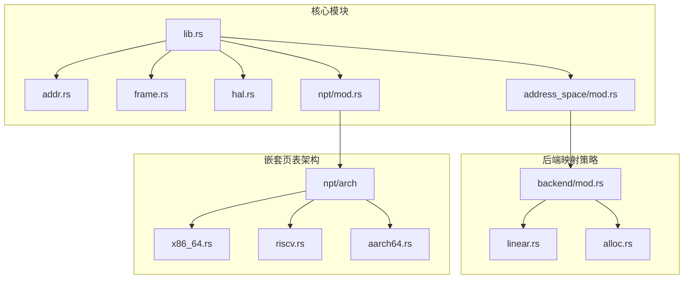
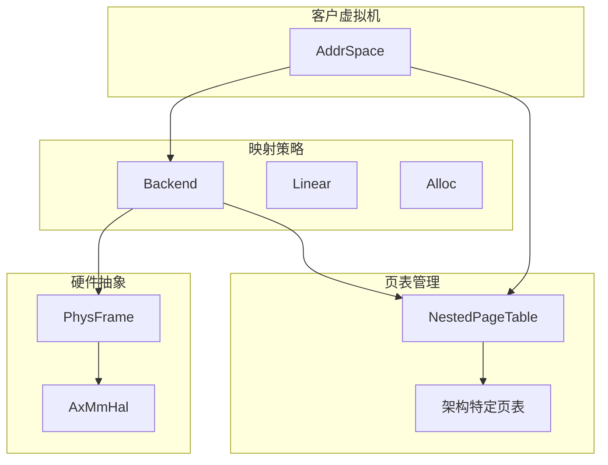
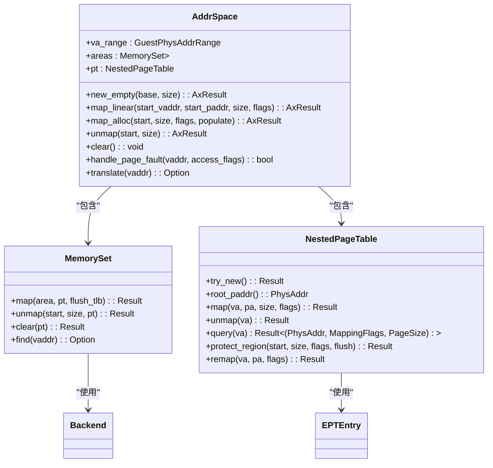
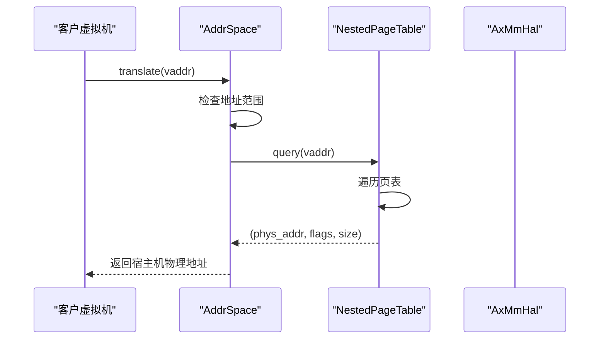
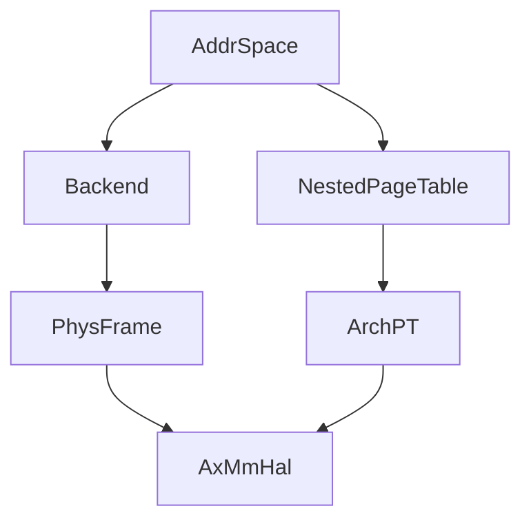

# 地址空间模型

<cite>
**本文档中引用的文件**  
- [lib.rs](file://src/lib.rs)
- [address_space/mod.rs](file://src/address_space/mod.rs)
- [address_space/backend/mod.rs](file://src/address_space/backend/mod.rs)
- [address_space/backend/alloc.rs](file://src/address_space/backend/alloc.rs)
- [address_space/backend/linear.rs](file://src/address_space/backend/linear.rs)
- [npt/mod.rs](file://src/npt/mod.rs)
- [addr.rs](file://src/addr.rs)
- [frame.rs](file://src/frame.rs)
- [hal.rs](file://src/hal.rs)
- [npt/arch/x86_64.rs](file://src/npt/arch/x86_64.rs)
</cite>

## 目录
1. [简介](#简介)
2. [项目结构](#项目结构)
3. [核心组件](#核心组件)
4. [架构概述](#架构概述)
5. [详细组件分析](#详细组件分析)
6. [依赖关系分析](#依赖关系分析)
7. [性能考虑](#性能考虑)
8. [故障排查指南](#故障排查指南)
9. [结论](#结论)

## 简介
`axaddrspace` 是 ArceOS-Hypervisor 项目中用于管理客户虚拟机地址空间的核心模块。该模块通过封装虚拟地址空间的创建、销毁与查询功能，实现了客户虚拟机内存的隔离与安全访问。本文档深入分析 `AddrSpace` 的设计模型，阐述其如何利用 Rust 的类型系统保障内存安全，并结合 `src/lib.rs` 中的公共接口，解析其与后端映射策略（`Backend`）和嵌套页表（`NestedPageTable`）之间的依赖关系。同时，文档将解释 `GuestPhysAddr` 与 `PhysAddr` 的区别及其在虚拟化环境中的转换逻辑，帮助开发者理解其生命周期管理机制。

## 项目结构
`axaddrspace` 模块采用分层设计，将地址空间管理、后端映射策略、嵌套页表实现和硬件抽象层分离，确保代码的可维护性和可扩展性。

**Diagram sources**
- [lib.rs](file://src/lib.rs#L1-L48)
- [address_space/mod.rs](file://src/address_space/mod.rs#L1-L589)
- [npt/mod.rs](file://src/npt/mod.rs#L1-L15)

**Section sources**
- [lib.rs](file://src/lib.rs#L1-L48)
- [address_space/mod.rs](file://src/address_space/mod.rs#L1-L589)

## 核心组件
`AddrSpace` 是地址空间管理的核心结构，封装了虚拟地址空间的生命周期管理。它通过 `MemorySet` 管理内存区域，并通过 `NestedPageTable` 实现地址转换。`Backend` 枚举定义了两种映射策略：线性映射和分配映射，分别适用于不同的内存管理场景。

**Section sources**
- [address_space/mod.rs](file://src/address_space/mod.rs#L10-L589)
- [address_space/backend/mod.rs](file://src/address_space/backend/mod.rs#L1-L111)

## 架构概述
`axaddrspace` 的架构设计围绕 `AddrSpace` 展开，通过分层抽象实现跨平台的内存管理。`AddrSpace` 依赖于 `Backend` 提供映射策略，`Backend` 依赖于 `NestedPageTable` 实现底层页表操作，而 `NestedPageTable` 又依赖于架构特定的页表实现（如 `ExtendedPageTable`）和硬件抽象层（`AxMmHal`）。

**Diagram sources**
- [address_space/mod.rs](file://src/address_space/mod.rs#L10-L589)
- [address_space/backend/mod.rs](file://src/address_space/backend/mod.rs#L1-L111)
- [npt/mod.rs](file://src/npt/mod.rs#L1-L15)
- [hal.rs](file://src/hal.rs#L1-L41)

## 详细组件分析

### AddrSpace 分析
`AddrSpace` 结构体是客户虚拟机地址空间的抽象，包含虚拟地址范围、内存区域集合和嵌套页表实例。它通过 Rust 的类型系统确保内存安全，所有操作均在编译时进行类型检查。

#### 类图

**Diagram sources**
- [address_space/mod.rs](file://src/address_space/mod.rs#L10-L589)
- [npt/mod.rs](file://src/npt/mod.rs#L1-L15)

**Section sources**
- [address_space/mod.rs](file://src/address_space/mod.rs#L10-L589)

### Backend 分析
`Backend` 枚举定义了两种内存映射策略：`Linear` 用于线性映射，`Alloc` 用于动态分配映射。`Linear` 映射通过固定的地址偏移实现虚拟地址到物理地址的转换，而 `Alloc` 映射则通过物理帧分配器按需分配物理内存。

#### 后端映射流程图

**Diagram sources**
- [address_space/backend/mod.rs](file://src/address_space/backend/mod.rs#L1-L111)
- [address_space/backend/alloc.rs](file://src/address_space/backend/alloc.rs#L1-L98)
- [address_space/backend/linear.rs](file://src/address_space/backend/linear.rs#L1-L52)

**Section sources**
- [address_space/backend/mod.rs](file://src/address_space/backend/mod.rs#L1-L111)

### 地址转换分析
`GuestPhysAddr` 表示客户虚拟机的物理地址，而 `PhysAddr` 表示宿主机的物理地址。在虚拟化环境中，客户虚拟机的物理地址需要通过嵌套页表转换为宿主机的物理地址。

#### 地址转换序列图

**Diagram sources**
- [addr.rs](file://src/addr.rs#L1-L37)
- [address_space/mod.rs](file://src/address_space/mod.rs#L10-L589)
- [npt/mod.rs](file://src/npt/mod.rs#L1-L15)
- [hal.rs](file://src/hal.rs#L1-L41)

**Section sources**
- [addr.rs](file://src/addr.rs#L1-L37)

## 依赖关系分析
`axaddrspace` 模块的组件之间存在清晰的依赖关系。`AddrSpace` 依赖于 `Backend` 和 `NestedPageTable`，`Backend` 依赖于 `PhysFrame` 进行物理内存分配，而 `PhysFrame` 又依赖于 `AxMmHal` 提供硬件抽象。

**Diagram sources**
- [lib.rs](file://src/lib.rs#L1-L48)
- [address_space/mod.rs](file://src/address_space/mod.rs#L10-L589)
- [frame.rs](file://src/frame.rs#L1-L164)
- [hal.rs](file://src/hal.rs#L1-L41)

**Section sources**
- [lib.rs](file://src/lib.rs#L1-L48)
- [frame.rs](file://src/frame.rs#L1-L164)

## 性能考虑
`axaddrspace` 的性能主要受页表操作和物理内存分配的影响。`map_alloc` 的 `populate` 参数允许开发者选择立即分配或按需分配，从而在内存使用和性能之间进行权衡。按需分配可以减少初始内存占用，但可能在运行时引入页错误处理的开销。

## 故障排查指南
常见误用场景包括：
- 尝试映射超出地址空间范围的地址：应确保 `start` 和 `size` 在 `va_range` 内。
- 映射未对齐的地址：所有地址和大小必须按 4KB 对齐。
- 重复映射同一区域：可能导致 `AlreadyExists` 错误。

调试建议：
- 启用日志输出以跟踪映射和页错误处理。
- 使用 `translate` 函数验证地址映射是否正确。
- 检查 `ALLOC_COUNT` 和 `DEALLOC_COUNT` 以确保物理帧的分配和释放平衡。

**Section sources**
- [address_space/mod.rs](file://src/address_space/mod.rs#L10-L589)
- [frame.rs](file://src/frame.rs#L1-L164)

## 结论
`axaddrspace` 模块通过精心设计的 `AddrSpace` 模型，实现了客户虚拟机内存的高效、安全隔离。其利用 Rust 的类型系统和分层架构，确保了内存管理的安全性和可扩展性。开发者可以通过 `new_empty`、`map_linear` 和 `map_alloc` 等接口轻松管理虚拟地址空间，并通过 `translate` 和 `handle_page_fault` 实现高效的地址转换和错误处理。