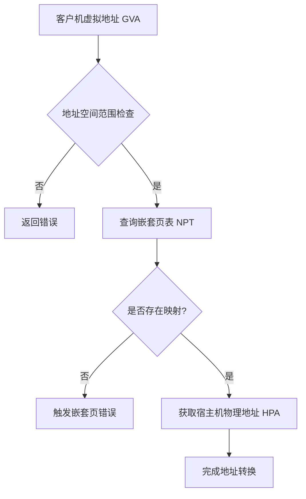
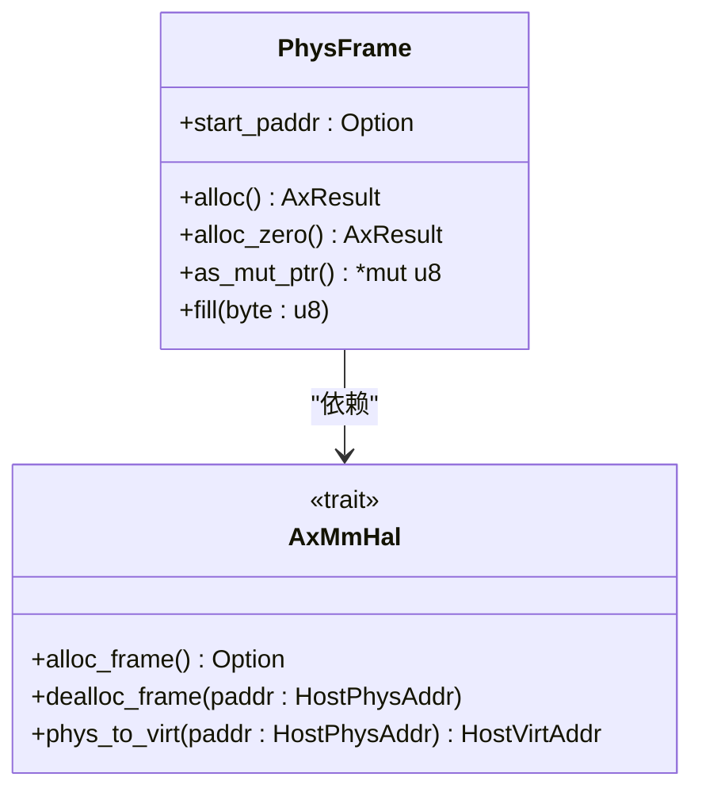
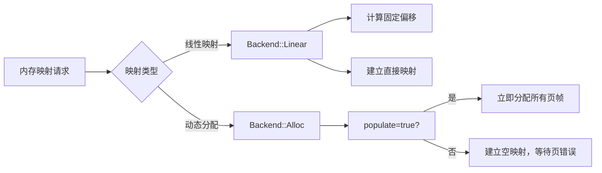

# 核心概念

<cite>
**本文档中引用的文件**  
- [lib.rs](file://src/lib.rs)
- [addr.rs](file://src/addr.rs)
- [frame.rs](file://src/frame.rs)
- [npt/mod.rs](file://src/npt/mod.rs)
- [address_space/mod.rs](file://src/address_space/mod.rs)
- [address_space/backend/mod.rs](file://src/address_space/backend/mod.rs)
- [address_space/backend/alloc.rs](file://src/address_space/backend/alloc.rs)
- [address_space/backend/linear.rs](file://src/address_space/backend/linear.rs)
- [hal.rs](file://src/hal.rs)
- [device/device_addr.rs](file://src/device/device_addr.rs)
</cite>

## 目录
1. [引言](#引言)
2. [地址空间与虚拟地址转换](#地址空间与虚拟地址转换)
3. [物理页帧管理](#物理页帧管理)
4. [嵌套页表机制](#嵌套页表机制)
5. [内存映射模式](#内存映射模式)
6. [按需内存分配与页错误处理](#按需内存分配与页错误处理)
7. [Rust类型系统中的安全抽象](#rust类型系统中的安全抽象)
8. [设备地址抽象](#设备地址抽象)
9. [总结](#总结)

## 引言

`axaddrspace` 模块是 ArceOS-Hypervisor 中用于管理客户虚拟机（Guest VM）地址空间的核心组件。它提供了一套安全、高效的内存管理机制，支持虚拟地址到物理地址的转换、内存隔离、按需分配等功能。本文档旨在深入解析其核心概念，包括地址空间（AddrSpace）、虚拟地址与物理地址转换、页帧（Frame）、嵌套页表（NPT）等关键术语，并结合Rust类型系统说明这些概念如何被安全地表达和实现。

**Section sources**
- [lib.rs](file://src/lib.rs#L1-L48)

## 地址空间与虚拟地址转换

`AddrSpace` 是虚拟内存地址空间的核心表示，封装了客户机的虚拟地址范围、内存区域集合以及嵌套页表。它通过 `GuestPhysAddr` 类型表示客户机的物理地址（即宿主机视角下的虚拟地址），并提供 `translate` 方法实现从客户机虚拟地址到宿主机物理地址的查询。

地址空间的创建通过 `new_empty` 方法完成，指定基地址和大小。内存映射通过 `map_linear` 和 `map_alloc` 方法实现，分别对应线性映射和动态分配映射。所有操作均需满足4KB对齐要求，确保与页表机制兼容。

**Diagram sources**
- [address_space/mod.rs](file://src/address_space/mod.rs#L50-L150)

**Section sources**
- [address_space/mod.rs](file://src/address_space/mod.rs#L1-L589)
- [addr.rs](file://src/addr.rs#L1-L36)

## 物理页帧管理

`PhysFrame` 结构体表示一个可自动释放的物理页帧，其生命周期由Rust的所有权系统管理。它通过 `AxMmHal` trait 与底层硬件抽象层交互，实现物理帧的分配与回收。

`PhysFrame` 的核心特性包括：
- **自动析构**：在 `Drop` 时自动调用 `H::dealloc_frame` 回收物理内存。
- **安全访问**：通过 `as_mut_ptr` 提供对物理内存的安全可变指针访问。
- **初始化支持**：`alloc_zero` 方法分配并清零页帧，`fill` 方法填充指定字节。

该设计确保了物理内存资源的RAII（资源获取即初始化）管理，防止内存泄漏。

**Diagram sources**
- [frame.rs](file://src/frame.rs#L1-L163)
- [hal.rs](file://src/hal.rs#L1-L40)

**Section sources**
- [frame.rs](file://src/frame.rs#L1-L163)
- [hal.rs](file://src/hal.rs#L1-L40)

## 嵌套页表机制

嵌套页表（Nested Page Table, NPT）是实现虚拟机内存虚拟化的关键机制。`axaddrspace` 通过 `npt::NestedPageTable<H>` 类型提供架构无关的嵌套页表抽象，其具体实现由目标架构（x86_64, RISC-V, AArch64）决定。

`NestedPageTable` 负责管理客户机虚拟地址（GVA）到宿主机物理地址（HPA）的两阶段转换：
1. **第一阶段**：客户机操作系统管理的页表，将 GVA 转换为 客户机物理地址（GPA）。
2. **第二阶段**：VMM 管理的嵌套页表，将 GPA 转换为 HPA。

`NestedPageFaultInfo` 结构体用于记录嵌套页错误的详细信息，包括访问类型和触发错误的客户机物理地址，为按需内存分配提供依据。

**Section sources**
- [npt/mod.rs](file://src/npt/mod.rs#L1-L14)
- [lib.rs](file://src/lib.rs#L30-L38)

## 内存映射模式

`axaddrspace` 支持两种主要的内存映射后端，通过 `Backend` 枚举统一管理：

### 线性映射（Linear Mapping）
线性映射通过 `Backend::Linear` 实现，适用于已知物理地址的连续内存区域（如设备内存或预分配内存池）。其核心是 `pa_va_offset`，表示虚拟地址与物理地址之间的固定偏移量。映射时，虚拟地址 `vaddr` 被直接转换为 `vaddr - pa_va_offset` 的物理地址。

### 动态分配映射（Allocation Mapping）
动态分配映射通过 `Backend::Alloc` 实现，适用于通用内存分配。其核心特性是支持**按需分配**（lazy allocation）。当 `populate` 参数为 `false` 时，仅建立页表项而不立即分配物理页帧，真正的分配在后续访问触发页错误时完成。

**Diagram sources**
- [address_space/backend/mod.rs](file://src/address_space/backend/mod.rs#L1-L110)
- [address_space/backend/linear.rs](file://src/address_space/backend/linear.rs#L1-L51)
- [address_space/backend/alloc.rs](file://src/address_space/backend/alloc.rs#L1-L97)

**Section sources**
- [address_space/backend/mod.rs](file://src/address_space/backend/mod.rs#L1-L110)
- [address_space/backend/linear.rs](file://src/address_space/backend/linear.rs#L1-L51)
- [address_space/backend/alloc.rs](file://src/address_space/backend/alloc.rs#L1-L97)

## 按需内存分配与页错误处理

按需内存分配是虚拟内存管理的核心优化技术，`axaddrspace` 通过 `handle_page_fault` 机制实现。当客户机访问一个已映射但未分配物理页的虚拟地址时，会触发嵌套页错误。

`AddrSpace::handle_page_fault` 方法的处理流程如下：
1. 检查访问地址是否在地址空间范围内。
2. 查找该地址所属的 `MemoryArea`。
3. 验证访问权限是否符合原始映射标志。
4. 调用 `Backend::handle_page_fault` 进行具体处理。

对于 `Backend::Alloc` 且 `populate=false` 的映射，`handle_page_fault_alloc` 会：
- 调用 `H::alloc_frame` 分配一个物理页帧。
- 调用 `pt.remap` 将故障地址映射到新分配的物理帧。
- 返回 `true` 表示页错误已成功处理。

此机制显著降低了内存占用，仅在实际使用时才消耗物理资源。

**Section sources**
- [address_space/mod.rs](file://src/address_space/mod.rs#L200-L250)
- [address_space/backend/alloc.rs](file://src/address_space/backend/alloc.rs#L80-L97)

## Rust类型系统中的安全抽象

`axaddrspace` 充分利用了Rust的类型系统来保证内存安全：
- **类型区分**：`GuestVirtAddr`, `GuestPhysAddr`, `HostPhysAddr`, `HostVirtAddr` 等类型明确区分了不同地址空间的地址，防止混淆。
- **格式化输出**：通过 `def_usize_addr_formatter!` 宏为地址类型定义了专用的格式化字符串（如 "GVA:{}"），便于调试。
- **泛型约束**：`AddrSpace<H: PagingHandler>` 和 `PhysFrame<H: AxMmHal>` 使用泛型参数约束，确保所有操作都通过安全的trait接口进行。
- **RAII**：`PhysFrame` 的 `Drop` 实现确保了物理内存的自动回收，避免了手动管理的错误。

这些设计共同构建了一个类型安全、内存安全且易于推理的内存管理框架。

**Section sources**
- [addr.rs](file://src/addr.rs#L1-L36)
- [frame.rs](file://src/frame.rs#L1-L163)
- [address_space/mod.rs](file://src/address_space/mod.rs#L1-L589)

## 设备地址抽象

`device_addr.rs` 模块提供了对设备地址的统一抽象。`DeviceAddr` trait 标记了可用于访问设备的地址类型，目前 `GuestPhysAddr`, `SysRegAddr`, `Port` 均实现了该trait。

`DeviceAddrRange` trait 定义了地址范围的包含性检查。对于系统寄存器和端口，使用了包含两端的范围（`..=`），这与内存地址的半开区间不同，更符合设备访问的语义。

**Section sources**
- [device/device_addr.rs](file://src/device/device_addr.rs#L1-L97)

## 总结

`axaddrspace` 模块通过清晰的分层设计和Rust类型系统的强大支持，实现了高效、安全的客户机地址空间管理。其核心概念——地址空间、页帧、嵌套页表、线性/动态映射以及按需分配——共同构成了一个完整的虚拟内存解决方案。理解这些概念是掌握后续模块（如内存隔离、设备直通）的基础。