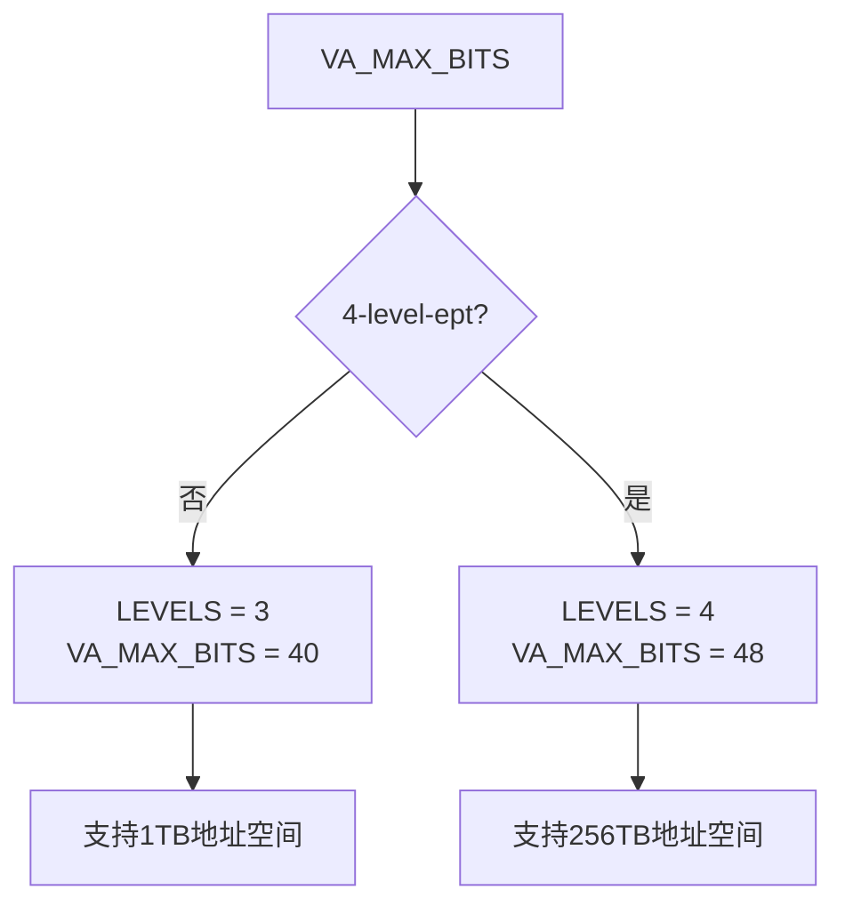
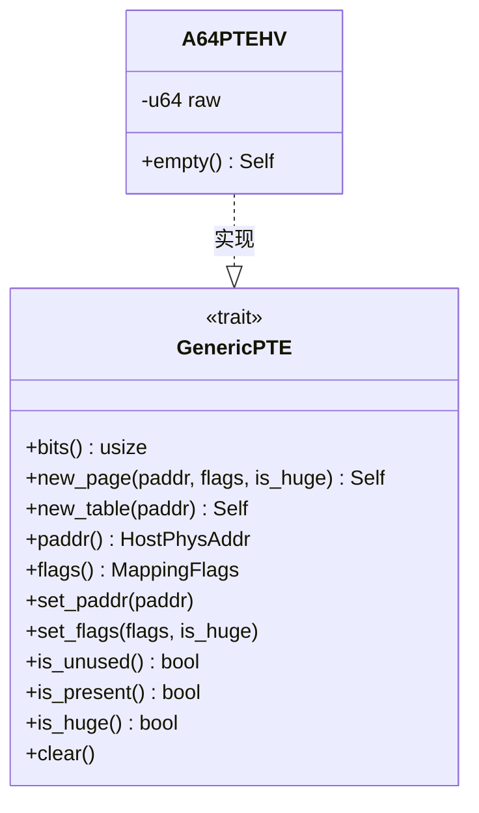
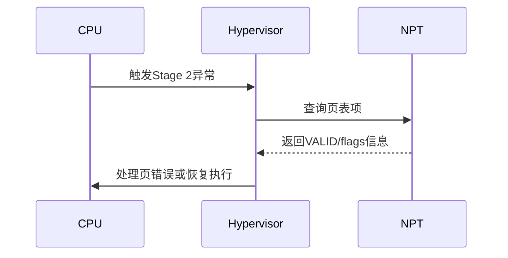
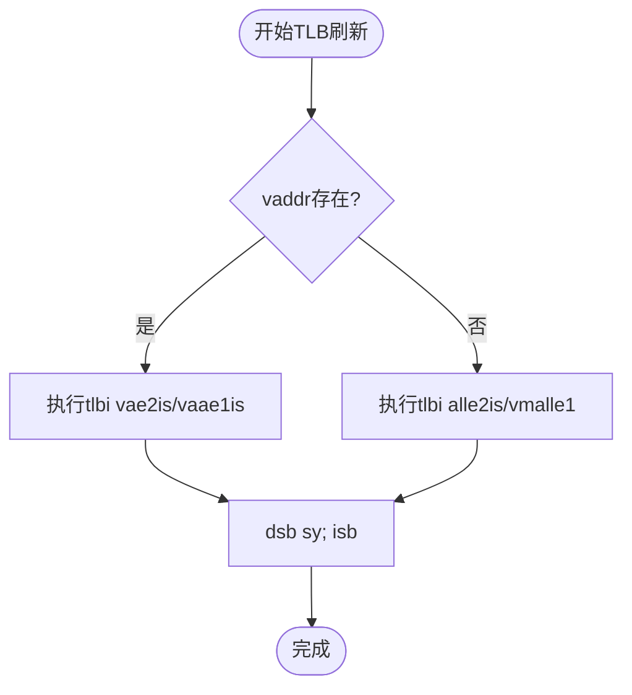

# AArch64架构下的嵌套页表实现

<cite>
**本文档引用的文件**
- [aarch64.rs](file://src/npt/arch/aarch64.rs)
- [mod.rs](file://src/npt/mod.rs)
</cite>

## 目录
1. [引言](#引言)
2. [AArch64嵌套页表架构概述](#aarch64嵌套页表架构概述)
3. [页表层级与地址空间配置](#页表层级与地址空间配置)
4. [页表项结构与内存属性编码](#页表项结构与内存属性编码)
5. [PageTable Trait实现分析](#pagetable-trait实现分析)
6. [Stage 2地址转换与虚拟化集成](#stage-2地址转换与虚拟化集成)
7. [TLB刷新与内存屏障机制](#tlb刷新与内存屏障机制)
8. [典型调用流程与并发控制](#典型调用流程与并发控制)
9. [结论](#结论)

## 引言
本文系统阐述AArch64架构中嵌套页表的实现机制，重点分析`aarch64.rs`文件中`PageTable` trait的具体实现。内容涵盖页表层级结构、内存属性字段编码、Stage 2转换表集成方式以及虚拟化扩展的使用。通过代码级分析，帮助开发者理解地址翻译流程、权限管理及并发访问控制机制。

## AArch64嵌套页表架构概述
AArch64架构采用VMSAv8-64虚拟内存系统，支持两级地址转换（Stage 1和Stage 2）。在虚拟化场景中，嵌套页表用于实现客户机物理地址（GPA）到宿主物理地址（HPA）的映射。系统通过`NestedPageTable<H>`类型封装该机制，基于`PageTable64`通用框架实现。

**Section sources**
- [aarch64.rs](file://src/npt/arch/aarch64.rs#L258-L261)
- [mod.rs](file://src/npt/mod.rs#L10-L13)

## 页表层级与地址空间配置
AArch64嵌套页表的层级结构由编译时特征（feature）决定：
- 当未启用`4-level-ept`特征时，使用3级页表，支持40位客户机物理地址空间（VA_MAX_BITS = 40）
- 当启用`4-level-ept`特征时，使用4级页表，支持48位客户机物理地址空间（VA_MAX_BITS = 48）

物理地址最大支持48位（PA_MAX_BITS = 48），符合Armv8.0-A规范。虚拟地址类型定义为`GuestPhysAddr`，表示客户机物理地址空间。



**Diagram sources**
- [aarch64.rs](file://src/npt/arch/aarch64.rs#L218-L227)

## 页表项结构与内存属性编码
页表项由`A64PTEHV`结构表示，封装64位VMSAv8-64转换表描述符。其主要字段包括：

### 页表项字段定义
```mermaid
erDiagram
A64PTEHV {
u64 raw_value
u64 paddr 12..48
bool VALID 0
bool NON_BLOCK 1
u3 bits ATTR 2..4
bool S2AP_RO 6
bool S2AP_WO 7
bool INNER 8
bool SHAREABLE 9
bool AF 10
bool NG 11
bool CONTIGUOUS 52
bool XN 54
bool NS 55
bool PXN_TABLE 59
bool XN_TABLE 60
bool AP_NO_EL0_TABLE 61
bool AP_NO_WRITE_TABLE 62
bool NS_TABLE 63
}
```

**Diagram sources**
- [aarch64.rs](file://src/npt/arch/aarch64.rs#L12-L55)

### 内存属性编码机制
内存类型通过`MemType`枚举定义，并映射到描述符的AttrIndx字段：
- `Device`：设备内存，AttrIndx = 0
- `Normal`：普通内存，写回缓存，AttrIndx = 1
- `NormalNonCache`：普通非缓存内存，AttrIndx = 1（外层无缓存）

系统需配置MAIR_ELx寄存器以匹配这些属性索引。访问权限由S2AP_RO和S2AP_WO位控制，执行权限由XN位控制。

**Section sources**
- [aarch64.rs](file://src/npt/arch/aarch64.rs#L57-L78)

## PageTable Trait实现分析
`A64PTEHV`实现了`GenericPTE` trait，提供页表操作接口：

### 核心方法实现


**Diagram sources**
- [aarch64.rs](file://src/npt/arch/aarch64.rs#L156-L199)

### 地址翻译流程
1. **页表项创建**：`new_page`方法将物理地址和映射标志转换为页表项，设置访问标志（AF）和非块标志（NON_BLOCK）
2. **权限转换**：`MappingFlags`与`DescriptorAttr`相互转换，处理读写执行权限及设备内存属性
3. **地址提取**：`paddr`方法从页表项中提取物理地址，屏蔽属性位

**Section sources**
- [aarch64.rs](file://src/npt/arch/aarch64.rs#L117-L154)

## Stage 2地址转换与虚拟化集成
系统利用ARM虚拟化扩展实现Stage 2地址转换：

### VTTBR_EL2寄存器集成
虽然代码中未直接操作VTTBR_EL2，但`NestedPageTable`结构设计支持将其作为页表基址寄存器。页表根地址通过`set_paddr`等方法管理，最终可加载到VTTBR_EL2。

### Stage 2页错误处理
当发生转换错误时，硬件会触发异常，软件可通过检查页表项的有效性（VALID位）和权限位诊断问题。`is_present`和`is_unused`方法用于检测页表项状态。



**Diagram sources**
- [aarch64.rs](file://src/npt/arch/aarch64.rs#L170-L174)

## TLB刷新与内存屏障机制
地址转换修改后必须刷新TLB以保证一致性：

### TLB刷新策略


**Diagram sources**
- [aarch64.rs](file://src/npt/arch/aarch64.rs#L229-L255)

### 内存屏障使用
所有TLB操作后都跟随`dsb sy`（数据同步屏障）和`isb`（指令同步屏障），确保：
- 所有先前的内存访问完成
- 指令流水线刷新，后续指令使用新的地址映射

根据运行模式（EL1或EL2），使用不同的TLB失效指令：
- EL1：`tlbi vaae1is`（单个虚拟地址）或`tlbi vmalle1`
- EL2：`tlbi vae2is`（单个虚拟地址）或`tlbi alle2is`（全部）

**Section sources**
- [aarch64.rs](file://src/npt/arch/aarch64.rs#L230-L255)

## 典型调用流程与并发控制
### 地址映射典型流程
1. 分配物理内存帧
2. 创建页表项：`A64PTEHV::new_page(paddr, flags, is_huge)`
3. 更新页表：通过`PageTable64`接口写入页表项
4. 刷新TLB：`A64HVPagingMetaData::flush_tlb(Some(vaddr))`

### 并发访问控制
虽然代码中未显式展示锁机制，但在多核环境中：
- 页表更新必须使用原子操作或锁保护
- TLB刷新操作本身是同步的，`dsb sy; isb`确保操作全局可见

**Section sources**
- [aarch64.rs](file://src/npt/arch/aarch64.rs#L156-L199)

## 结论
本文详细分析了AArch64架构下嵌套页表的实现机制。系统通过`A64PTEHV`结构和`A64HVPagingMetaData`元数据实现了灵活的Stage 2地址转换，支持3级或4级页表配置。内存属性编码遵循VMSAv8-64规范，权限管理通过S2AP和XN位实现。TLB刷新机制确保地址转换的一致性，为虚拟化环境提供了可靠的内存管理基础。