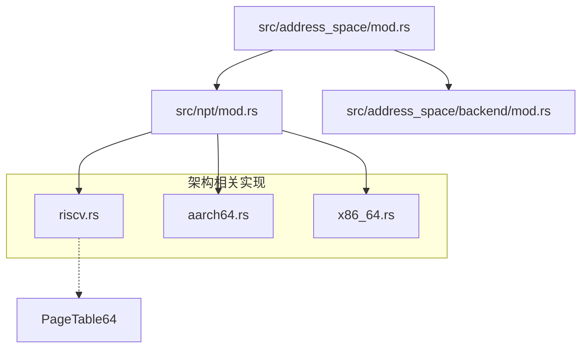
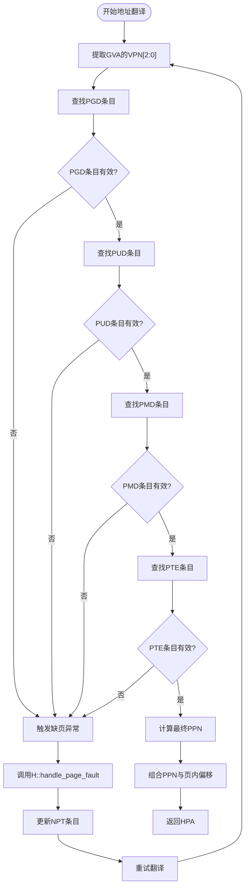
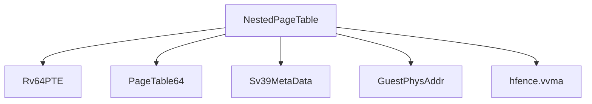

# RISC-V架构下的嵌套页表实现

<cite>
**本文档引用文件**  
- [riscv.rs](file://src/npt/arch/riscv.rs)
- [mod.rs](file://src/npt/mod.rs)
- [addr.rs](file://src/addr.rs)
- [arch/mod.rs](file://src/npt/arch/mod.rs)
</cite>

## 目录
1. [引言](#引言)
2. [项目结构](#项目结构)
3. [核心组件](#核心组件)
4. [嵌套页表架构概述](#嵌套页表架构概述)
5. [详细组件分析](#详细组件分析)
6. [依赖关系分析](#依赖关系分析)
7. [性能考量](#性能考量)
8. [故障排查指南](#故障排查指南)
9. [结论](#结论)

## 引言
本文档全面介绍RISC-V架构下嵌套页表（Nested Page Table, NPT）的设计与实现机制，重点分析SV39页表格式在客户机地址转换中的应用。文档将深入探讨页全局目录（PGD）、页上层目录（PUD）、页中间目录（PMD）和页表项（PTE）的层级结构，并说明`riscv.rs`中如何通过`Sv39MetaData`与`Rv64PTE`实现`PageTable64` trait。同时，文档还将阐述RISC-V特有的SATP寄存器在嵌套虚拟化中的角色，以及HS-level与VS-level页表协同工作的原理。

## 项目结构
本项目`axaddrspace`主要实现地址空间管理与嵌套页表机制，其核心模块包括`npt`（嵌套页表）、`address_space`（地址空间管理）、`device`（设备地址映射）等。其中，`npt/arch`目录下按架构分别实现了x86_64、aarch64和riscv的嵌套页表逻辑，RISC-V部分位于`src/npt/arch/riscv.rs`。



**图示来源**  
- [riscv.rs](file://src/npt/arch/riscv.rs#L0-L5)
- [mod.rs](file://src/npt/mod.rs#L0-L14)
- [arch/mod.rs](file://src/npt/arch/mod.rs#L0-L14)

**本节来源**  
- [riscv.rs](file://src/npt/arch/riscv.rs#L0-L5)
- [mod.rs](file://src/npt/mod.rs#L0-L14)

## 核心组件
本模块的核心是`NestedPageTable<H>`类型，其在RISC-V架构下被定义为`PageTable64<Sv39MetaData<GuestPhysAddr>, Rv64PTE, H>`，封装了SV39格式的三级页表结构。该结构体实现了通用的`PageTable64` trait，支持地址查询、映射建立与页错误处理。

`Sv39MetaData`提供了SV39页表的元数据定义，包括虚拟地址划分、页表层级、页大小等。`Rv64PTE`则定义了RISC-V 64位页表项的位域结构，包含有效位、读写执行权限、用户访问位等。

**本节来源**  
- [riscv.rs](file://src/npt/arch/riscv.rs#L0-L5)
- [addr.rs](file://src/addr.rs#L29-L33)

## 嵌套页表架构概述
在RISC-V嵌套虚拟化中，存在两级地址转换：第一级由HS-level页表完成HVA到HPA的转换，第二级由VS-level页表完成GVA到GPA的转换。嵌套页表（NPT）机制将这两级映射融合，通过`NestedPageTable`结构直接管理GPA到HPA的映射。

SATP寄存器在HS模式下控制HS-level页表基址，在VS模式下控制VS-level页表基址。当启用嵌套页表时，HS-level的页表项指向的物理地址实际上是客户机的页表结构，从而实现两级转换的协同。

```mermaid
graph LR
GVA[客户机虚拟地址 GVA] --> NPT[NestedPageTable]
NPT --> GPA[客户机物理地址 GPA]
GPA --> HVA[宿主机虚拟地址 HVA]
HVA --> HPA[宿主机物理地址 HPA]
SATP[SATP寄存器] --> NPT
NPT -.-> "hfence.vvma" --> TLB[清空TLB]
```

**图示来源**  
- [riscv.rs](file://src/npt/arch/riscv.rs#L0-L5)
- [addr.rs](file://src/addr.rs#L29-L33)

## 详细组件分析

### 嵌套页表结构分析
`NestedPageTable<H>`基于`PageTable64`模板实现，其模板参数包括：
- `Sv39MetaData<GuestPhysAddr>`：定义SV39页表的地址解析规则
- `Rv64PTE`：定义页表项的格式
- `H`：分页处理句柄，用于处理缺页异常等事件

该结构支持`query`、`map`、`unmap`等核心操作，其中`query`用于地址翻译，`map`用于建立映射，`unmap`用于解除映射。

#### 地址翻译流程


**图示来源**  
- [riscv.rs](file://src/npt/arch/riscv.rs#L0-L5)
- [addr.rs](file://src/addr.rs#L29-L33)

**本节来源**  
- [riscv.rs](file://src/npt/arch/riscv.rs#L0-L5)
- [addr.rs](file://src/addr.rs#L29-L33)

### 缺页异常处理机制
当`query`操作未能找到有效映射时，将调用分页处理句柄`H`的`handle_page_fault`方法。该方法负责分配物理页帧、更新NPT条目，并设置相应的访问权限。处理完成后，返回并重试地址翻译。

**本节来源**  
- [riscv.rs](file://src/npt/arch/riscv.rs#L0-L5)
- [addr.rs](file://src/addr.rs#L29-L33)

## 依赖关系分析
`NestedPageTable`依赖于多个外部模块：
- `page_table_entry::riscv::Rv64PTE`：提供RISC-V页表项定义
- `page_table_multiarch::PageTable64`：提供通用64位页表实现
- `page_table_multiarch::riscv::Sv39MetaData`：提供SV39元数据
- `crate::GuestPhysAddr`：客户机物理地址类型
- `core::arch::asm!("hfence.vvma")`：用于TLB刷新



**图示来源**  
- [riscv.rs](file://src/npt/arch/riscv.rs#L0-L5)
- [addr.rs](file://src/addr.rs#L29-L33)

**本节来源**  
- [riscv.rs](file://src/npt/arch/riscv.rs#L0-L5)
- [addr.rs](file://src/addr.rs#L29-L33)

## 性能考量
- **TLB刷新开销**：`hfence.vvma`指令用于刷新TLB，当前实现为全刷新，不支持按页刷新，可能影响性能。
- **两级映射延迟**：嵌套页表需进行两次地址转换，增加内存访问延迟。
- **页表遍历开销**：SV39三级页表需三次内存访问，可通过大页（Huge Page）优化减少层级。

## 故障排查指南
- **缺页异常频繁**：检查客户机内存映射是否正确建立，确认`H::handle_page_fault`是否正确分配页帧。
- **地址翻译失败**：验证SATP寄存器设置是否正确，确认页表基址与模式匹配。
- **TLB不一致**：在页表更新后调用`flush_tlb`确保TLB同步。

**本节来源**  
- [addr.rs](file://src/addr.rs#L29-L33)
- [riscv.rs](file://src/npt/arch/riscv.rs#L0-L5)

## 结论
本文档详细分析了RISC-V架构下嵌套页表的实现机制，展示了`axaddrspace`项目如何通过`PageTable64`与`Sv39MetaData`构建高效的两级地址转换系统。该设计充分利用RISC-V的SV39页表格式与SATP寄存器特性，实现了客户机虚拟地址到宿主机物理地址的直接映射，为嵌套虚拟化提供了坚实的基础。