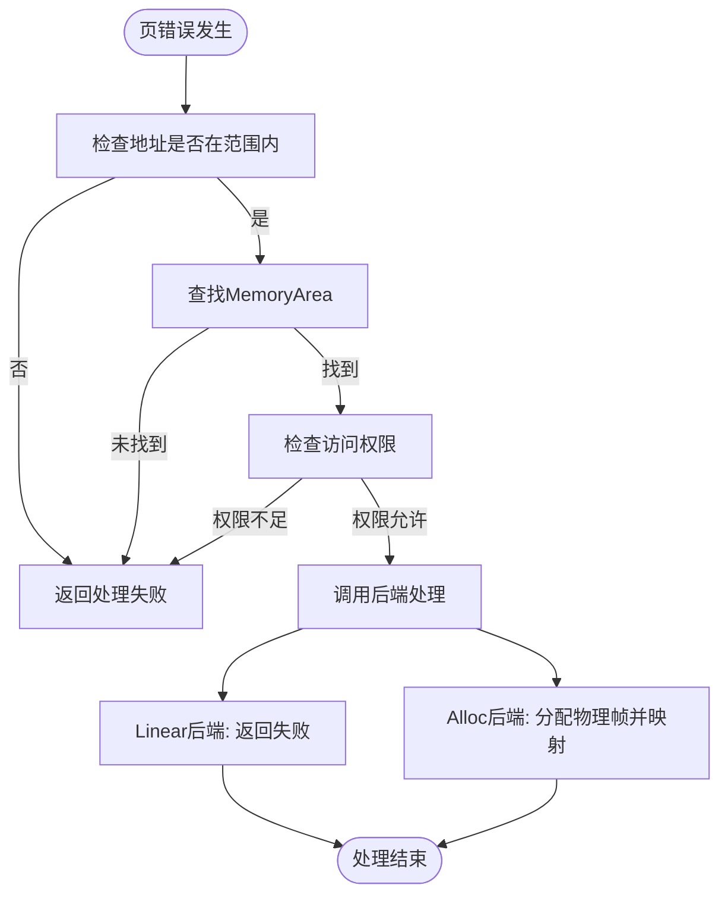
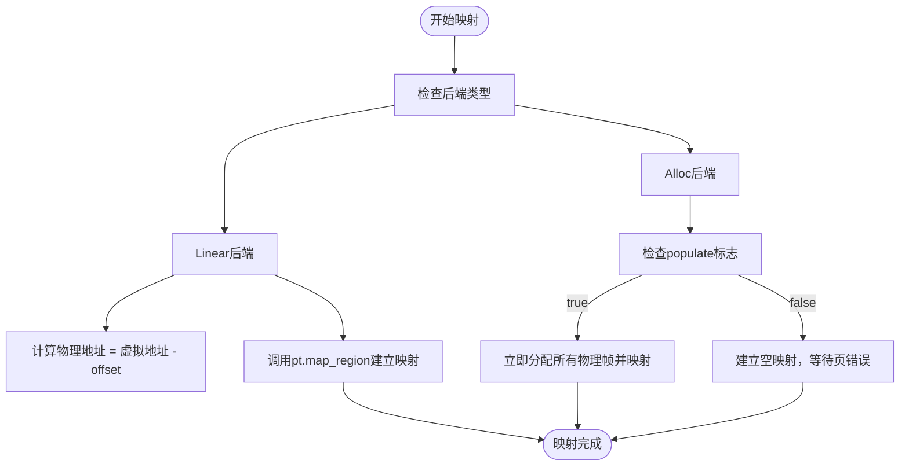

# 页表架构

<cite>
**本文档中引用的文件**  
- [mod.rs](file://src/npt/mod.rs)
- [arch/mod.rs](file://src/npt/arch/mod.rs)
- [arch/x86_64.rs](file://src/npt/arch/x86_64.rs)
- [arch/riscv.rs](file://src/npt/arch/riscv.rs)
- [arch/aarch64.rs](file://src/npt/arch/aarch64.rs)
- [address_space/mod.rs](file://src/address_space/mod.rs)
- [backend/linear.rs](file://src/address_space/backend/linear.rs)
- [backend/alloc.rs](file://src/address_space/backend/alloc.rs)
- [backend/mod.rs](file://src/address_space/backend/mod.rs)
</cite>

## 目录
1. [引言](#引言)
2. [嵌套页表架构概述](#嵌套页表架构概述)
3. [核心数据结构与跨架构接口](#核心数据结构与跨架构接口)
4. [多架构实现差异分析](#多架构实现差异分析)
5. [页错误处理流程](#页错误处理流程)
6. [页表遍历与映射插入路径](#页表遍历与映射插入路径)
7. [内存映射后端机制](#内存映射后端机制)
8. [结论](#结论)

## 引言

嵌套页表（Nested Page Table, NPT）是虚拟化环境中实现内存虚拟化的关键技术。在 `axaddrspace` 模块中，NPT 支持从客户虚拟地址（GVA）到客户物理地址（GPA），再到宿主物理地址（HPA）的两级地址转换，为虚拟机提供透明的内存访问能力。本文系统性地介绍 NPT 在 `axaddrspace` 中的架构实现，分析其跨架构适配机制、页错误处理流程以及核心操作的代码路径，帮助开发者深入理解底层性能特征与同步要求。

## 嵌套页表架构概述

嵌套页表通过两级页表结构实现虚拟机内存的完全虚拟化。第一级页表由客户操作系统管理，完成 GVA 到 GPA 的转换；第二级页表由虚拟机监控器（VMM）管理，完成 GPA 到 HPA 的转换。硬件（如 Intel EPT、AMD NPT、ARM S2PT）直接参与地址转换过程，提升性能并减少软件干预。

在 `axaddrspace` 中，`npt` 模块通过条件编译和泛型设计，统一支持 x86_64、RISC-V 和 AArch64 三大架构。其核心是 `NestedPageTable<H>` 类型，根据目标架构选择不同的具体实现，从而屏蔽底层差异，提供一致的接口。

**Section sources**  
- [mod.rs](file://src/npt/mod.rs#L1-L13)

## 核心数据结构与跨架构接口

`npt/mod.rs` 定义了 `NestedPageTable<H>` 类型别名，利用 `cfg_if` 宏根据目标架构选择不同的页表实现：

- **x86_64**：使用 `arch::ExtendedPageTable<H>`，对应 Intel 的扩展页表（EPT）
- **RISC-V**：使用 `arch::NestedPageTable<H>`，基于 RISC-V 的 Sv39 分页机制
- **AArch64**：使用 `arch::NestedPageTable<H>`，基于 ARM 的第二阶段转换（S2PT）

该设计通过泛型 `H`（实现 `PagingHandler` trait）解耦页表操作与物理内存管理，支持灵活的内存分配策略。

**Section sources**  
- [mod.rs](file://src/npt/mod.rs#L1-L13)

## 多架构实现差异分析

### x86_64 架构实现

x86_64 平台在 `arch/x86_64.rs` 中定义了 `EPTEntry` 和 `ExtendedPageTableMetadata`：

- **页表层级**：4 级页表（PML4 → PDPT → PD → PT）
- **标志位布局**：使用 `EPTFlags` 位域定义读、写、执行权限，以及内存类型（WriteBack、Uncached 等）
- **大页支持**：通过 `HUGE_PAGE` 标志位支持 2MB 大页
- **TLB 刷新**：调用 `x86::tlb::flush` 指令刷新 TLB，非测试环境下直接执行 Ring 0 指令

`EPTEntry` 实现了 `GenericPTE` trait，将通用的 `MappingFlags` 与架构特定的 `EPTFlags` 相互转换。

**Section sources**  
- [arch/x86_64.rs](file://src/npt/arch/x86_64.rs#L0-L190)

### RISC-V 架构实现

RISC-V 平台在 `arch/riscv.rs` 中通过类型别名直接复用 `page_table_multiarch` 库的通用实现：

- **页表层级**：3 级页表（Sv39）
- **页表项**：使用 `Rv64PTE` 结构
- **元数据**：使用 `Sv39MetaData<GuestPhysAddr>` 定义地址空间参数

该实现简洁高效，依赖外部库完成大部分功能，体现了模块化设计思想。

**Section sources**  
- [arch/riscv.rs](file://src/npt/arch/riscv.rs#L0-L6)

### AArch64 架构实现

AArch64 平台在 `arch/aarch64.rs` 中定义了 `A64PTEHV` 和 `A64HVPagingMetaData`：

- **页表层级**：支持 3 层或 4 层（通过 `4-level-ept` feature 控制）
- **标志位布局**：使用 `DescriptorAttr` 位域定义有效位、访问权限、执行权限、内存属性等
- **内存类型**：通过 `MemType` 枚举区分设备内存、普通内存和非缓存内存
- **TLB 刷新**：使用内联汇编调用 `tlbi` 指令，根据运行模式（EL1/EL2）选择不同指令

与 x86_64 类似，`A64PTEHV` 实现了 `GenericPTE` trait，完成通用标志与架构特定属性的转换。

**Section sources**  
- [arch/aarch64.rs](file://src/npt/arch/aarch64.rs#L0-L261)

## 页错误处理流程

当客户机访问未映射或权限不足的内存时，硬件触发页错误（page fault），VMM 通过 `AddrSpace::handle_page_fault` 方法介入处理：

1. 检查故障地址是否在地址空间范围内
2. 查找对应的 `MemoryArea` 区域
3. 验证访问权限是否符合区域原始权限
4. 调用后端的 `handle_page_fault` 方法进行具体处理

对于 **Allocation 后端**，若为惰性映射（`populate = false`），则在此时分配物理帧并建立映射；对于 **Linear 后端**，线性映射不应触发页错误，因此直接返回失败。

该机制支持按需分页（demand paging），优化内存使用效率。

**Diagram sources**  
- [address_space/mod.rs](file://src/address_space/mod.rs#L120-L160)
- [backend/alloc.rs](file://src/address_space/backend/alloc.rs#L55-L96)
- [backend/mod.rs](file://src/address_space/backend/mod.rs#L79-L109)

**Section sources**  
- [address_space/mod.rs](file://src/address_space/mod.rs#L120-L160)
- [backend/alloc.rs](file://src/address_space/backend/alloc.rs#L55-L96)
- [backend/mod.rs](file://src/address_space/backend/mod.rs#L79-L109)

## 页表遍历与映射插入路径

### 页表遍历

`AddrSpace::translate` 方法通过 `pt.query(vaddr)` 查询 GPA 对应的 HPA。该操作涉及多级页表遍历，最终返回物理地址。遍历过程由 `PageTable64` 实现，具有良好的缓存局部性。

**Section sources**  
- [address_space/mod.rs](file://src/address_space/mod.rs#L162-L207)

### 映射插入

映射插入分为两种模式：

- **线性映射**：通过 `map_linear`，使用固定的 `pa_va_offset` 计算物理地址，调用 `pt.map_region` 建立连续映射。
- **分配映射**：通过 `map_alloc`，若 `populate = true`，则立即为每个页面分配物理帧并映射；否则建立空映射，等待页错误时按需分配。

两种映射均通过 `MemorySet::map` 将区域注册到地址空间，并调用后端的 `map` 方法完成页表更新。

**Diagram sources**  
- [address_space/mod.rs](file://src/address_space/mod.rs#L83-L118)
- [backend/linear.rs](file://src/address_space/backend/linear.rs#L0-L50)
- [backend/alloc.rs](file://src/address_space/backend/alloc.rs#L0-L53)

**Section sources**  
- [address_space/mod.rs](file://src/address_space/mod.rs#L83-L118)
- [backend/linear.rs](file://src/address_space/backend/linear.rs#L0-L50)
- [backend/alloc.rs](file://src/address_space/backend/alloc.rs#L0-L53)

## 内存映射后端机制

`axaddrspace` 通过 `Backend<H>` 枚举统一管理不同类型的内存映射：

- **Linear**：适用于已知物理地址的线性映射，如设备内存或固定映射区域。
- **Alloc**：适用于通用内存分配，支持立即分配或惰性分配。

`Backend` 实现了 `MappingBackend` trait，提供 `map`、`unmap`、`protect` 和 `handle_page_fault` 接口，使 `AddrSpace` 能以统一方式操作不同后端。

**Section sources**  
- [backend/mod.rs](file://src/address_space/backend/mod.rs#L0-L40)

## 结论

`axaddrspace` 中的嵌套页表实现通过精巧的抽象和条件编译，成功地在 x86_64、RISC-V 和 AArch64 三大架构上提供了统一的内存虚拟化接口。其核心设计包括：

- 使用 `cfg_if` 和类型别名实现跨架构适配
- 通过 `GenericPTE` 和 `PagingMetaData` 抽象页表项和元数据
- 利用 `Backend` 模式支持多种内存映射策略
- 集成页错误处理实现按需分页

该架构兼具灵活性与高性能，为构建高效虚拟机监控器奠定了坚实基础。