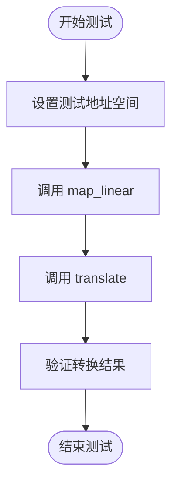

# 测试框架与工具

<cite>
**本文档引用的文件**  
- [mod.rs](file://src/test_utils/mod.rs)
- [mod.rs](file://src/address_space/mod.rs)
- [lib.rs](file://src/lib.rs)
- [hal.rs](file://src/hal.rs)
- [frame.rs](file://src/frame.rs)
</cite>

## 目录
1. [简介](#简介)
2. [测试工具模块概述](#测试工具模块概述)
3. [模拟硬件环境的构建](#模拟硬件环境的构建)
4. [核心测试工具详解](#核心测试工具详解)
5. [单元测试与集成测试实践](#单元测试与集成测试实践)
6. [内存映射与页表更新验证](#内存映射与页表更新验证)
7. [页错误处理逻辑测试](#页错误处理逻辑测试)
8. [最佳实践与边界条件覆盖](#最佳实践与边界条件覆盖)
9. [结论](#结论)

## 简介
本文档全面介绍 `test_utils` 模块提供的测试工具和设施，旨在帮助开发者构建地址空间管理功能的单元测试和集成测试。通过模拟硬件状态和内存布局，开发者可以验证内存映射正确性、页表更新一致性和页错误处理逻辑。文档还提供编写高效、可维护测试用例的最佳实践，强调边界条件和异常路径的覆盖。

## 测试工具模块概述
`test_utils` 模块为地址空间管理功能的测试提供了必要的工具和模拟环境。该模块通过 `MockHal` 结构体模拟硬件抽象层（HAL），允许在无实际硬件交互的情况下进行内存分配和释放操作。此外，模块还提供了全局状态重置机制，确保测试之间的隔离性。

**Section sources**
- [mod.rs](file://src/test_utils/mod.rs#L1-L170)

## 模拟硬件环境的构建
### 模拟内存布局
`test_utils` 模块通过 `MEMORY` 静态变量模拟物理内存块。该变量是一个对齐到 4KB 的数组，用于存储测试数据。`BASE_PADDR` 常量定义了模拟内存区域的起始物理地址，而 `MEMORY_LEN` 定义了模拟内存的总长度（64KB）。

**Diagram sources**
- [mod.rs](file://src/test_utils/mod.rs#L15-L30)

### 模拟硬件抽象层
`MockHal` 结构体实现了 `AxMmHal` 和 `PagingHandler` 特性，提供了以下方法：
- `alloc_frame`: 模拟物理帧的分配。
- `dealloc_frame`: 模拟物理帧的释放。
- `phys_to_virt`: 将物理地址转换为虚拟地址。
- `virt_to_phys`: 将虚拟地址转换为物理地址。

这些方法通过静态变量（如 `NEXT_PADDR`、`ALLOC_COUNT`、`DEALLOC_COUNT`）跟踪分配和释放操作的状态，确保测试的可预测性和一致性。

**Section sources**
- [mod.rs](file://src/test_utils/mod.rs#L50-L150)
- [hal.rs](file://src/hal.rs#L1-L40)

## 核心测试工具详解
### MockHal 实现
`MockHal` 是一个用于测试的模拟硬件抽象层实现。它通过静态变量模拟全局内存分配器的状态，并提供以下功能：
- **分配计数**：`ALLOC_COUNT` 和 `DEALLOC_COUNT` 分别跟踪分配和释放的帧数。
- **分配失败模拟**：`ALLOC_SHOULD_FAIL` 标志用于模拟内存分配失败的情况，以测试错误处理逻辑。
- **状态重置**：`reset_state` 方法将所有静态状态重置为初始值，确保测试隔离。

**Diagram sources**
- [mod.rs](file://src/test_utils/mod.rs#L50-L150)
- [hal.rs](file://src/hal.rs#L1-L40)

### 测试装饰器
`mock_hal_test` 是一个用于测试函数的装饰器，确保在执行测试前重置 `MockHal` 的状态。该装饰器通过 `TEST_MUTEX` 全局互斥锁强制测试的串行执行，防止测试之间的竞争条件。

**Diagram sources**
- [mod.rs](file://src/test_utils/mod.rs#L155-L160)

## 单元测试与集成测试实践
### 地址空间创建测试
`test_addrspace_creation` 测试验证了地址空间的创建是否正确。当创建新的地址空间时，会为页表分配一个帧，从而触发 `alloc_frame` 操作。测试通过检查 `ALLOC_COUNT` 的值来验证分配是否成功。

**Section sources**
- [mod.rs](file://src/address_space/mod.rs#L282-L312)

### 内存映射测试
`test_map_linear` 和 `test_map_alloc` 测试验证了线性映射和分配映射的正确性。测试通过调用 `map_linear` 和 `map_alloc` 方法创建映射，并使用 `translate` 方法验证虚拟地址到物理地址的转换是否正确。

**Diagram sources**
- [mod.rs](file://src/address_space/mod.rs#L314-L330)

## 内存映射与页表更新验证
### 翻译与区域大小获取
`test_translate_and_get_limit` 测试验证了 `translate_and_get_limit` 方法的正确性。该方法不仅翻译虚拟地址，还返回对应内存区域的大小。测试通过创建映射并调用该方法，验证返回的物理地址和区域大小是否符合预期。

**Section sources**
- [mod.rs](file://src/address_space/mod.rs#L561-L587)

### 页表更新一致性
`test_unmap` 和 `test_clear` 测试验证了取消映射和清除所有映射操作的正确性。测试通过创建映射、取消映射或清除映射，然后检查 `translate` 方法的返回值，确保映射已被正确移除。

**Diagram sources**
- [mod.rs](file://src/address_space/mod.rs#L450-L470)

## 页错误处理逻辑测试
### 页面故障处理
`test_page_fault_handling` 测试验证了页面故障处理逻辑的正确性。测试通过创建延迟分配映射，然后模拟页面故障，检查 `handle_page_fault` 方法是否能够正确处理故障并分配物理帧。

**Section sources**
- [mod.rs](file://src/address_space/mod.rs#L430-L448)

## 最佳实践与边界条件覆盖
### 边界条件测试
`test_contains_range` 测试验证了 `contains_range` 方法的正确性。测试通过检查地址范围是否在地址空间内，覆盖了边界条件和部分超出范围的情况。

**Diagram sources**
- [mod.rs](file://src/address_space/mod.rs#L332-L350)

### 异常路径覆盖
`test_alloc_no_memory` 测试验证了内存分配失败时的错误处理逻辑。测试通过设置 `ALLOC_SHOULD_FAIL` 标志，模拟内存分配失败的情况，并检查 `alloc` 方法是否返回正确的错误类型。

**Section sources**
- [frame.rs](file://src/frame.rs#L150-L160)

## 结论
本文档详细介绍了 `test_utils` 模块提供的测试工具和设施，展示了如何使用这些工具构建地址空间管理功能的单元测试和集成测试。通过模拟硬件状态和内存布局，开发者可以验证内存映射正确性、页表更新一致性和页错误处理逻辑。文档还提供了编写高效、可维护测试用例的最佳实践，强调了边界条件和异常路径的覆盖。希望这些内容能帮助开发者更好地理解和扩展测试套件，确保代码的健壮性和可靠性。