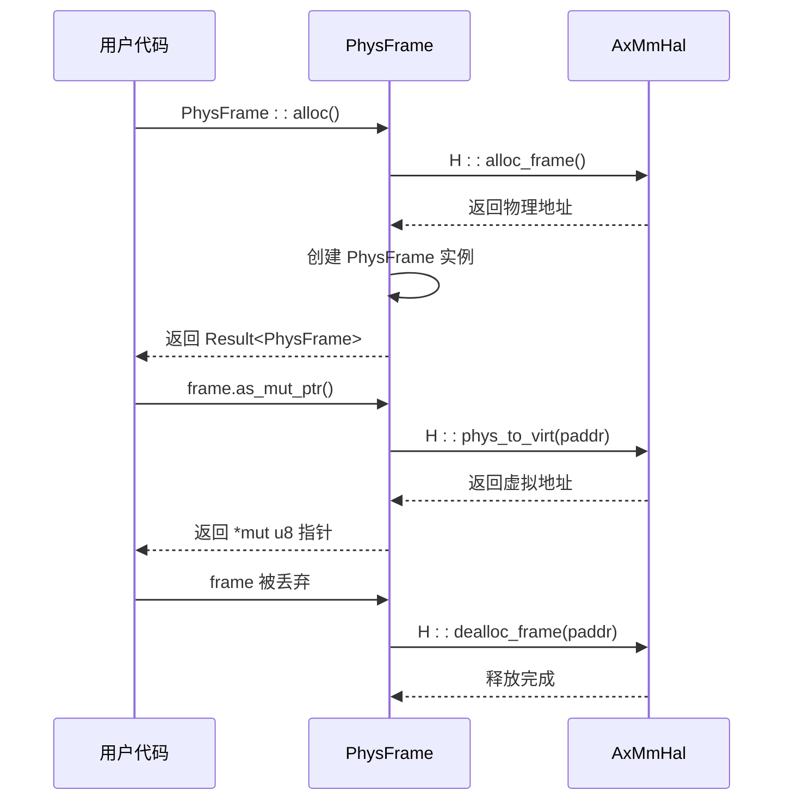
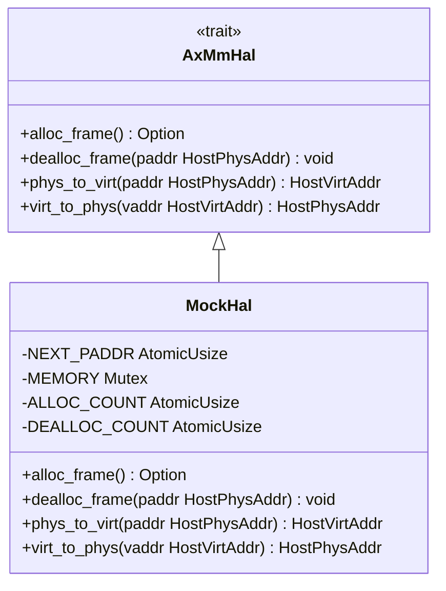

# AxMmHal接口规范

<cite>
**Referenced Files in This Document**   
- [hal.rs](file://src/hal.rs)
- [addr.rs](file://src/addr.rs)
- [frame.rs](file://src/frame.rs)
- [test_utils/mod.rs](file://src/test_utils/mod.rs)
</cite>

## 目录
1. [接口概述](#接口概述)
2. [核心方法详解](#核心方法详解)
3. [调用上下文与代码示例](#调用上下文与代码示例)
4. [实现规范与约束](#实现规范与约束)
5. [模拟实现示例](#模拟实现示例)
6. [结论](#结论)

## 接口概述

`AxMmHal` 是一个为内存管理提供硬件抽象层（Hardware Abstraction Layer）的核心 trait。它定义了一组与硬件平台无关的内存操作接口，使上层的地址空间管理模块能够以统一的方式进行物理内存的分配、释放和地址转换。该接口是实现跨平台内存管理功能的关键，将底层硬件的内存操作细节与上层逻辑解耦。

**Section sources**
- [hal.rs](file://src/hal.rs#L1-L39)

## 核心方法详解

### alloc_frame 方法

`alloc_frame` 方法用于分配一个物理内存帧。

**参数语义**：无输入参数。

**返回值含义**：返回一个 `Option<HostPhysAddr>` 类型的值。如果分配成功，返回 `Some(HostPhysAddr)`，其中包含所分配帧的物理地址；如果分配失败（例如内存不足），则返回 `None`。

**异常处理机制**：该方法通过返回 `Option` 类型来处理错误，不使用 panic 或异常抛出。调用者必须检查返回值以确定操作是否成功。

**Section sources**
- [hal.rs](file://src/hal.rs#L8-L14)

### dealloc_frame 方法

`dealloc_frame` 方法用于释放一个已分配的物理内存帧。

**参数语义**：接收一个 `HostPhysAddr` 类型的参数 `paddr`，表示需要被释放的内存帧的起始物理地址。

**返回值含义**：该方法不返回任何值（返回类型为 `()`）。

**异常处理机制**：此方法假定传入的物理地址是有效的且之前已成功分配。在当前实现中，没有显式的错误处理，但实现者应确保不会对同一地址重复释放或释放无效地址。

**Section sources**
- [hal.rs](file://src/hal.rs#L16-L21)

### phys_to_virt 方法

`phys_to_virt` 方法用于将主机物理地址转换为主机虚拟地址。

**参数语义**：接收一个 `HostPhysAddr` 类型的参数 `paddr`，表示待转换的物理地址。

**返回值含义**：返回一个 `HostVirtAddr` 类型的值，表示与输入物理地址相对应的虚拟地址。

**异常处理机制**：该方法假定输入的物理地址是有效的。在模拟实现中，会通过 `assert!` 宏检查地址是否在有效范围内，如果无效则触发 panic。在生产实现中，应确保地址的有效性。

**Section sources**
- [hal.rs](file://src/hal.rs#L23-L30)

### virt_to_phys 方法

`virt_to_phys` 方法用于将主机虚拟地址转换为主机物理地址。

**参数语义**：接收一个 `HostVirtAddr` 类型的参数 `vaddr`，表示待转换的虚拟地址。

**返回值含义**：返回一个 `HostPhysAddr` 类型的值，表示与输入虚拟地址相对应的物理地址。

**异常处理机制**：与 `phys_to_virt` 类似，该方法假定输入的虚拟地址是有效的。在模拟实现中，会通过 `assert!` 宏进行边界检查。

**Section sources**
- [hal.rs](file://src/hal.rs#L32-L39)

## 调用上下文与代码示例

`AxMmHal` 接口主要被 `PhysFrame` 结构体所使用，以实现物理内存帧的安全管理。`PhysFrame` 利用 `alloc_frame` 和 `dealloc_frame` 来进行内存的分配和自动释放，并通过 `phys_to_virt` 和 `virt_to_phys` 在物理地址和虚拟地址之间进行转换，从而允许对内存帧进行读写操作。

**Diagram sources**
- [frame.rs](file://src/frame.rs#L20-L30)
- [frame.rs](file://src/frame.rs#L57-L60)
- [frame.rs](file://src/frame.rs#L150-L155)

**Section sources**
- [frame.rs](file://src/frame.rs#L1-L163)

## 实现规范与约束

实现 `AxMmHal` trait 时，必须遵守以下规范和约束：

**线程安全要求**：由于内存分配和地址转换操作可能在多线程环境中被并发调用，因此 `AxMmHal` 的所有方法都必须是线程安全的。这通常意味着内部的内存管理数据结构（如空闲列表、位图等）需要使用适当的同步原语（如自旋锁）进行保护。

**内存对齐约束**：分配的物理内存帧必须与系统页面大小对齐（通常为 4KB）。`PAGE_SIZE_4K` 常量在 `memory_addr` crate 中定义，实现时应确保分配的地址满足此对齐要求。

**性能考量**：`alloc_frame` 和 `dealloc_frame` 是频繁调用的操作，其实现应尽可能高效。应避免使用过于复杂的分配算法，优先考虑速度和确定性。地址转换方法 `phys_to_virt` 和 `virt_to_phys` 应为纯函数或具有极低的开销，因为它们可能在性能关键路径上被调用。

**Section sources**
- [addr.rs](file://src/addr.rs#L3-L6)
- [frame.rs](file://src/frame.rs#L10-L11)

## 模拟实现示例

`test_utils` 模块中的 `MockHal` 提供了一个符合 `AxMmHal` 规范的模拟实现，可用于单元测试。

**Diagram sources**
- [test_utils/mod.rs](file://src/test_utils/mod.rs#L38-L80)

**Section sources**
- [test_utils/mod.rs](file://src/test_utils/mod.rs#L1-L170)

## 结论

`AxMmHal` 接口为地址空间管理系统提供了一个清晰、安全且高效的硬件抽象层。通过定义 `alloc_frame`、`dealloc_frame`、`phys_to_virt` 和 `virt_to_phys` 这四个核心方法，它成功地将物理内存管理的复杂性封装起来，使得上层模块可以专注于地址空间的逻辑管理。开发者在为特定硬件平台实现此 trait 时，应严格遵守线程安全、内存对齐和性能优化的要求，以确保整个系统的稳定性和高效性。