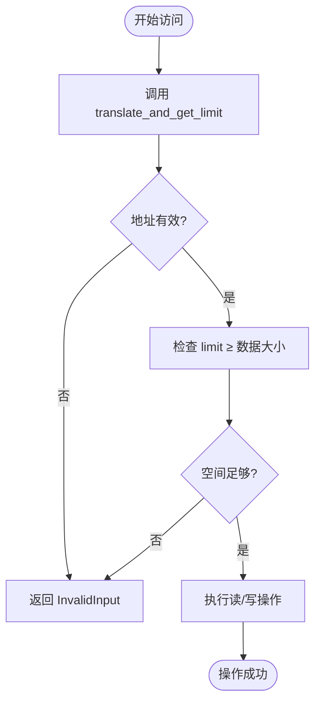
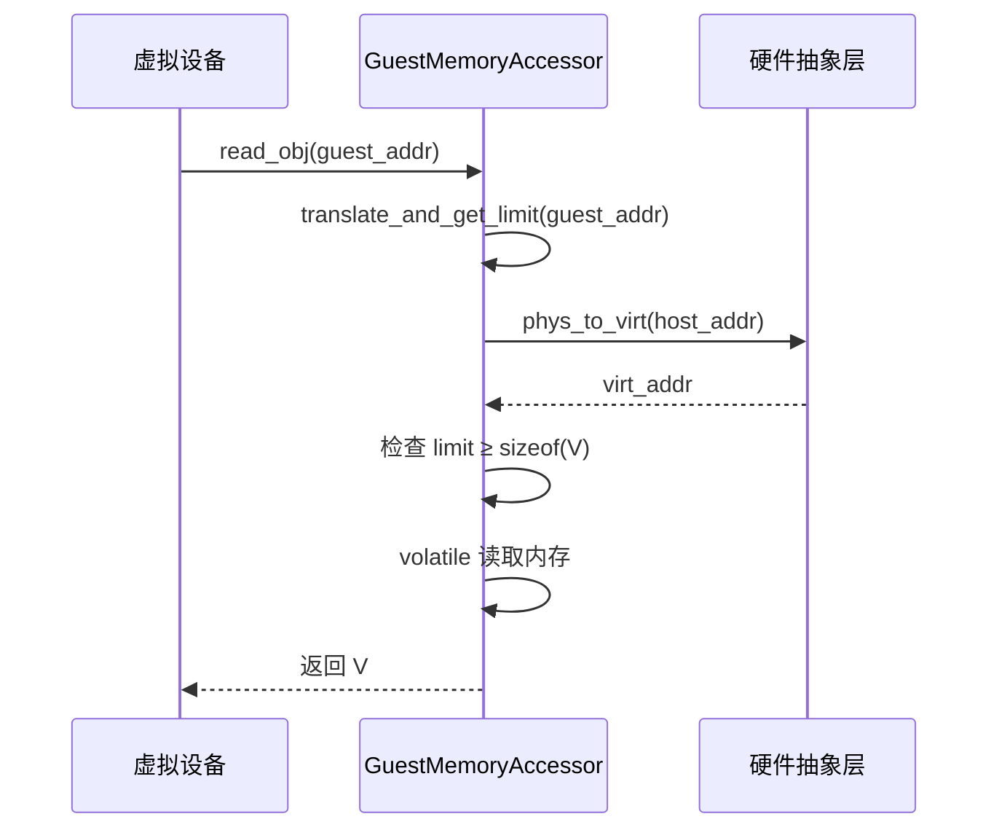
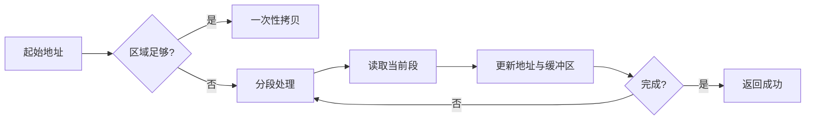
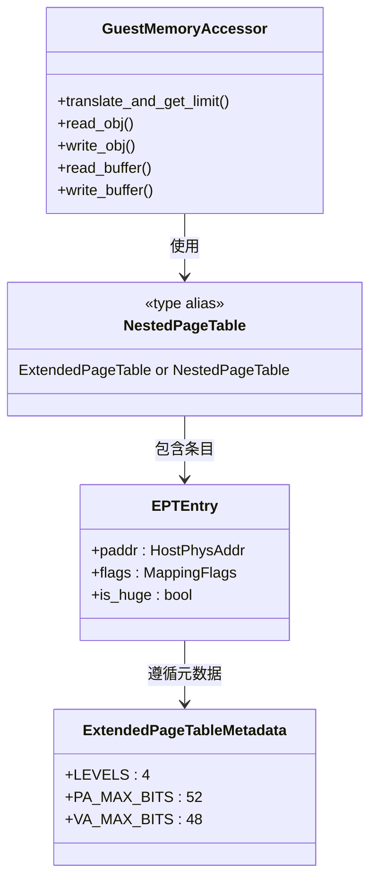

# MemoryAccessor机制

<cite>
**本文档引用的文件**  
- [memory_accessor.rs](file://src/memory_accessor.rs)
- [addr.rs](file://src/addr.rs)
- [npt/mod.rs](file://src/npt/mod.rs)
- [npt/arch/x86_64.rs](file://src/npt/arch/x86_64.rs)
- [hal.rs](file://src/hal.rs)
</cite>

## 目录
1. [引言](#引言)
2. [核心组件](#核心组件)
3. [地址转换与内存安全](#地址转换与内存安全)
4. [数据读写操作实现](#数据读写操作实现)
5. [跨区域内存访问处理](#跨区域内存访问处理)
6. [嵌套页表协同机制](#嵌套页表协同机制)
7. [性能优化建议](#性能优化建议)
8. [测试与隔离验证](#测试与隔离验证)
9. [结论](#结论)

## 引言
MemoryAccessor机制是客户虚拟机内存安全访问的核心抽象，提供统一的接口用于安全地读写客户物理内存。该机制通过封装地址翻译、边界检查和权限控制，确保虚拟设备在访问客户内存时不会越界或引发权限违规。本文深入解析`GuestMemoryAccessor` trait的设计与实现，阐明其在虚拟化环境中的关键作用。

## 核心组件

`GuestMemoryAccessor` trait定义了客户内存访问的核心接口，包括对象读写、缓冲区操作和地址翻译功能。其实现依赖于地址空间管理、硬件抽象层（HAL）以及架构相关的嵌套页表机制，共同构建了一个安全、高效的内存访问框架。

**本节来源**  
- [memory_accessor.rs](file://src/memory_accessor.rs#L18-L449)

## 地址转换与内存安全

`GuestMemoryAccessor`通过`translate_and_get_limit`方法实现客户物理地址到主机物理地址的翻译，并返回可访问的内存大小。此机制防止越界访问：在执行任何读写操作前，系统会验证目标地址是否映射有效，且剩余可访问字节数不少于待操作数据类型的大小。

该机制结合`GuestPhysAddr`类型和硬件抽象层提供的物理-虚拟地址转换能力，确保所有内存访问均在授权范围内进行。地址翻译失败或空间不足时，操作将返回`AxError::InvalidInput`错误。

**图示来源**  
- [memory_accessor.rs](file://src/memory_accessor.rs#L25-L45)
- [addr.rs](file://src/addr.rs#L1-L37)

**本节来源**  
- [memory_accessor.rs](file://src/memory_accessor.rs#L25-L70)

## 数据读写操作实现

`read_obj`和`write_obj`方法用于读写任意`Copy`类型的值（如`u8`、`u32`、`u64`）。这些方法使用`core::ptr::read_volatile`和`write_volatile`确保内存操作不会被编译器优化，适用于设备寄存器和共享内存场景。

对于多字节数据类型，系统依赖底层架构的字节序（endianness），通常与客户机架构保持一致。所有访问均需满足对齐要求，未对齐访问可能导致性能下降或硬件异常，但本接口本身不强制对齐检查，由底层硬件和页表机制保障。

**图示来源**  
- [memory_accessor.rs](file://src/memory_accessor.rs#L45-L70)
- [hal.rs](file://src/hal.rs#L1-L41)

**本节来源**  
- [memory_accessor.rs](file://src/memory_accessor.rs#L45-L85)

## 跨区域内存访问处理

当缓冲区跨越多个内存区域时，`read_buffer`和`write_buffer`方法采用分段处理策略。若单次翻译的可访问区域不足以容纳整个缓冲区，系统将循环调用`translate_and_get_limit`，逐段完成数据传输。

此机制支持跨页或跨内存段的访问，确保即使在非连续内存布局下也能正确读写数据。每次迭代更新当前客户地址和剩余缓冲区，直到全部数据处理完毕。

**图示来源**  
- [memory_accessor.rs](file://src/memory_accessor.rs#L72-L147)

**本节来源**  
- [memory_accessor.rs](file://src/memory_accessor.rs#L72-L147)

## 嵌套页表协同机制

`GuestMemoryAccessor`与嵌套页表（Nested Page Table, NPT）协同工作，实现两阶段地址翻译。在x86_64架构下，使用扩展页表（EPT）条目（`EPTEntry`）管理客户物理地址到主机物理地址的映射，并设置访问权限（读、写、执行）和内存类型（如WriteBack、Uncached）。

`NestedPageTable<H>`类型根据目标架构选择具体实现，确保跨平台兼容性。页表条目中的标志位（如`READ`、`WRITE`、`EXECUTE`）由`MappingFlags`转换而来，实现细粒度的访问控制。

**图示来源**  
- [npt/mod.rs](file://src/npt/mod.rs#L1-L15)
- [npt/arch/x86_64.rs](file://src/npt/arch/x86_64.rs#L1-L191)

**本节来源**  
- [npt/mod.rs](file://src/npt/mod.rs#L1-L15)
- [npt/arch/x86_64.rs](file://src/npt/arch/x86_64.rs#L1-L191)

## 性能优化建议

为提升性能，建议采用以下策略：
- **批量访问**：优先使用`read_buffer`和`write_buffer`进行大块数据传输，减少地址翻译开销。
- **缓存友好型设计**：确保访问模式具有良好的空间和时间局部性，提高TLB和CPU缓存命中率。
- **避免频繁小对象访问**：合并小规模读写操作，降低函数调用和边界检查的相对开销。
- **利用huge page**：在支持的架构上使用大页映射，减少页表层级和TLB压力。

## 测试与隔离验证

通过`MockTranslator`模拟不同虚拟机的内存映射，验证了内存隔离的正确性。测试用例表明，两个虚拟机即使访问相同的客户物理地址，也会映射到不同的主机内存区域，确保数据隔离。同时，越界访问和跨VM非法访问均能被正确检测并拒绝。

跨页访问测试验证了分段处理机制的可靠性，即使缓冲区跨越页边界，数据仍能完整读写。边界情况（如零长度缓冲区、单字节访问）也得到充分覆盖，确保接口健壮性。

**本节来源**  
- [memory_accessor.rs](file://src/memory_accessor.rs#L186-L449)

## 结论

`GuestMemoryAccessor` trait为虚拟机环境下的安全内存访问提供了坚实基础。通过统一的接口封装地址翻译、边界检查和权限控制，有效防止了越界和权限违规问题。其与嵌套页表的协同工作机制，结合分段访问策略，确保了在复杂内存布局下的可靠性和性能。该机制是构建安全、高效虚拟化设备的关键组件。