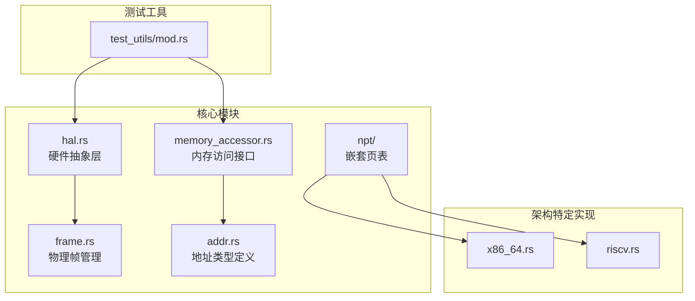
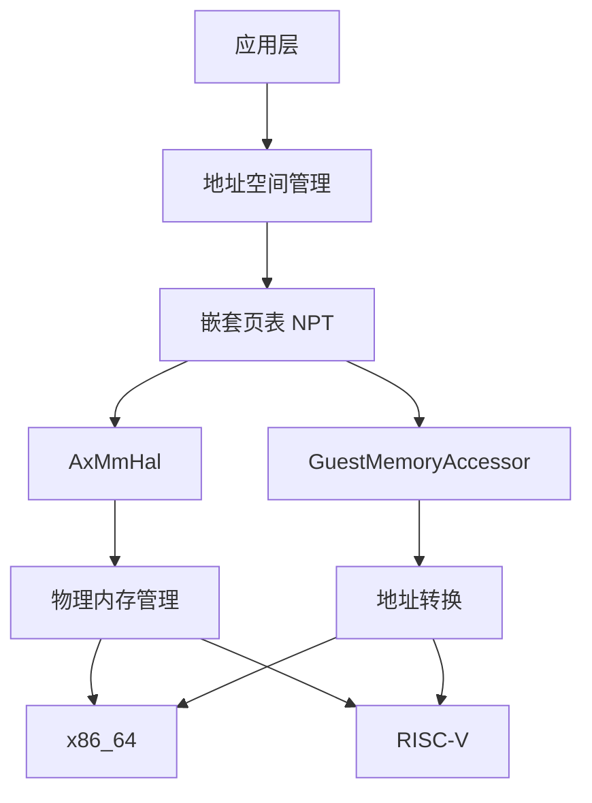
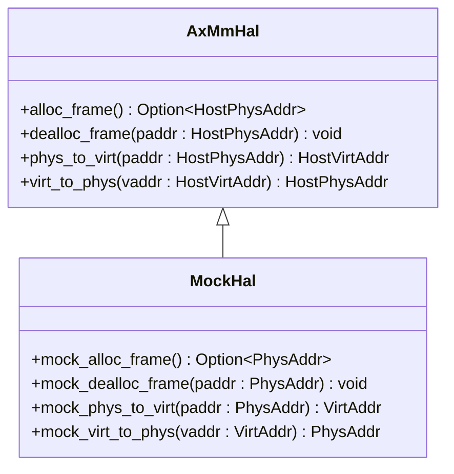
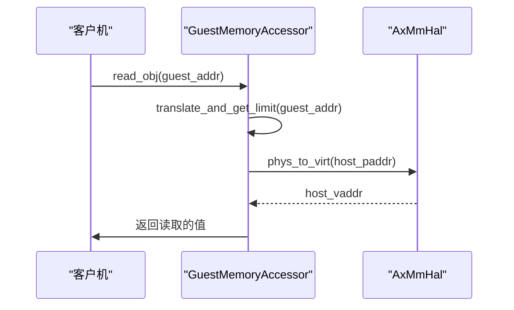
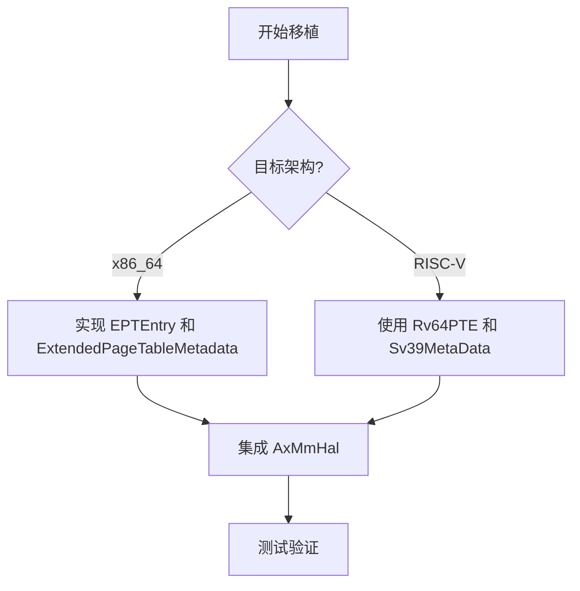
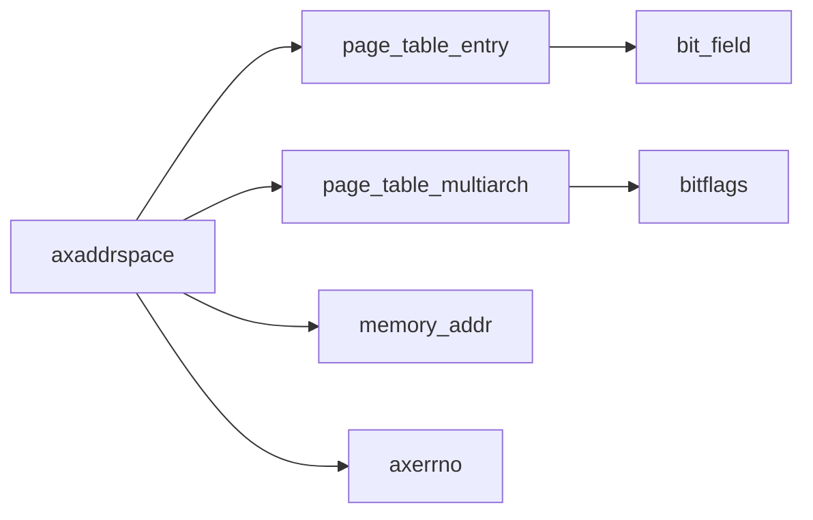

# 平台适配指南

<cite>
**本文档引用的文件**  
- [hal.rs](file://src/hal.rs)
- [memory_accessor.rs](file://src/memory_accessor.rs)
- [npt/arch/x86_64.rs](file://src/npt/arch/x86_64.rs)
- [npt/arch/riscv.rs](file://src/npt/arch/riscv.rs)
- [addr.rs](file://src/addr.rs)
- [frame.rs](file://src/frame.rs)
- [test_utils/mod.rs](file://src/test_utils/mod.rs)
- [lib.rs](file://src/lib.rs)
</cite>

## 目录
1. [简介](#简介)
2. [项目结构](#项目结构)
3. [核心组件](#核心组件)
4. [架构概述](#架构概述)
5. [详细组件分析](#详细组件分析)
6. [依赖分析](#依赖分析)
7. [性能考虑](#性能考虑)
8. [故障排除指南](#故障排除指南)
9. [结论](#结论)

## 简介
本指南旨在为开发者提供将 `axaddrspace` 库移植到新硬件架构或平台的完整说明。重点涵盖 `AxMmHal` trait 的实现步骤、`MemoryAccessor` 的定制化策略、从 x86_64 到 RISC-V 的移植案例，以及常见集成错误和测试验证方法。

## 项目结构
`axaddrspace` 库的结构清晰，主要分为地址空间管理、设备地址处理、嵌套页表（NPT）实现、硬件抽象层（HAL）和内存访问器等模块。核心功能集中在 `src` 目录下，各模块职责分明。

**Diagram sources**
- [src/hal.rs](file://src/hal.rs#L1-L40)
- [src/memory_accessor.rs](file://src/memory_accessor.rs#L1-L450)
- [src/npt/arch/x86_64.rs](file://src/npt/arch/x86_64.rs#L1-L191)
- [src/npt/arch/riscv.rs](file://src/npt/arch/riscv.rs#L1-L7)
- [src/addr.rs](file://src/addr.rs#L1-L37)
- [src/frame.rs](file://src/frame.rs#L1-L164)
- [src/test_utils/mod.rs](file://src/test_utils/mod.rs#L1-L171)

**Section sources**
- [src/hal.rs](file://src/hal.rs#L1-L40)
- [src/memory_accessor.rs](file://src/memory_accessor.rs#L1-L450)
- [src/npt/arch/x86_64.rs](file://src/npt/arch/x86_64.rs#L1-L191)
- [src/npt/arch/riscv.rs](file://src/npt/arch/riscv.rs#L1-L7)
- [src/addr.rs](file://src/addr.rs#L1-L37)
- [src/frame.rs](file://src/frame.rs#L1-L164)
- [src/test_utils/mod.rs](file://src/test_utils/mod.rs#L1-L171)

## 核心组件
`axaddrspace` 的核心在于其硬件抽象层（HAL）和内存访问接口，它们共同实现了跨平台的地址空间管理。

**Section sources**
- [src/hal.rs](file://src/hal.rs#L1-L40)
- [src/memory_accessor.rs](file://src/memory_accessor.rs#L1-L450)

## 架构概述
该库采用分层架构，上层为通用逻辑，下层通过 `AxMmHal` 和 `GuestMemoryAccessor` 与具体平台交互。嵌套页表（NPT）模块负责虚拟机的地址转换，支持 x86_64 和 RISC-V 架构。

**Diagram sources**
- [src/hal.rs](file://src/hal.rs#L1-L40)
- [src/memory_accessor.rs](file://src/memory_accessor.rs#L1-L450)
- [src/npt/arch/x86_64.rs](file://src/npt/arch/x86_64.rs#L1-L191)
- [src/npt/arch/riscv.rs](file://src/npt/arch/riscv.rs#L1-L7)

## 详细组件分析

### AxMmHal 特性实现
`AxMmHal` 是平台移植的核心，开发者必须为其目标平台实现该 trait。

#### 实现步骤
1. **物理内存管理器对接**：实现 `alloc_frame` 和 `dealloc_frame` 方法，对接平台的物理内存分配器。
2. **地址转换**：实现 `phys_to_virt` 和 `virt_to_phys` 方法，提供物理地址与虚拟地址之间的转换。
3. **虚拟地址空间布局**：规划宿主机的虚拟地址空间，确保分配的帧有连续的虚拟映射。
4. **TLB 刷新机制**：在地址映射变更时，调用平台特定的 TLB 刷新指令。

**Diagram sources**
- [src/hal.rs](file://src/hal.rs#L1-L40)
- [src/test_utils/mod.rs](file://src/test_utils/mod.rs#L38-L80)

**Section sources**
- [src/hal.rs](file://src/hal.rs#L1-L40)
- [src/test_utils/mod.rs](file://src/test_utils/mod.rs#L38-L80)

### MemoryAccessor 定制化实现
`GuestMemoryAccessor` 提供了访问客户机内存的统一接口。

#### 实现策略
- **地址翻译**：`translate_and_get_limit` 方法需根据平台的页表结构实现地址翻译。
- **内存安全**：`read_obj` 和 `write_obj` 使用 `volatile` 操作确保内存访问不被优化。
- **缓冲区操作**：`read_buffer` 和 `write_buffer` 支持跨区域的内存访问。

**Diagram sources**
- [src/memory_accessor.rs](file://src/memory_accessor.rs#L1-L450)
- [src/hal.rs](file://src/hal.rs#L1-L40)

**Section sources**
- [src/memory_accessor.rs](file://src/memory_accessor.rs#L1-L450)

### 移植案例：x86_64 到 RISC-V
从 x86_64 移植到 RISC-V 的主要挑战在于页表结构和 TLB 刷新指令的差异。

#### 挑战与解决方案
| 挑战 | x86_64 | RISC-V | 解决方案 |
| :--- | :--- | :--- | :--- |
| 页表条目 | EPTEntry | Rv64PTE | 使用 `page_table_entry` 库的架构特定类型 |
| TLB 刷新 | `x86::tlb::flush` | `hfence.vvma` | 在 `addr.rs` 中为 `GuestPhysAddr` 实现 `flush_tlb` |
| 页表元数据 | ExtendedPageTableMetadata | Sv39MetaData | 使用 `page_table_multiarch` 的元数据类型 |

**Diagram sources**
- [src/npt/arch/x86_64.rs](file://src/npt/arch/x86_64.rs#L1-L191)
- [src/npt/arch/riscv.rs](file://src/npt/arch/riscv.rs#L1-L7)
- [src/addr.rs](file://src/addr.rs#L1-L37)

**Section sources**
- [src/npt/arch/x86_64.rs](file://src/npt/arch/x86_64.rs#L1-L191)
- [src/npt/arch/riscv.rs](file://src/npt/arch/riscv.rs#L1-L7)
- [src/addr.rs](file://src/addr.rs#L1-L37)

## 依赖分析
`axaddrspace` 依赖于多个外部库，如 `page_table_entry`、`page_table_multiarch` 和 `memory_addr`，这些库提供了跨架构的页表和地址操作支持。

**Diagram sources**
- [Cargo.toml](file://Cargo.toml#L1-L10)
- [src/lib.rs](file://src/lib.rs#L1-L49)

**Section sources**
- [Cargo.toml](file://Cargo.toml#L1-L10)
- [src/lib.rs](file://src/lib.rs#L1-L49)

## 性能考虑
- **地址转换开销**：频繁的地址转换可能成为性能瓶颈，应尽量缓存转换结果。
- **TLB 刷新频率**：避免不必要的 TLB 刷新，以减少性能损失。
- **内存分配效率**：`AxMmHal` 的 `alloc_frame` 实现应高效，避免成为系统瓶颈。

## 故障排除指南
### 常见集成错误
- **地址转换失败**：检查 `phys_to_virt` 和 `virt_to_phys` 的实现是否正确。
- **内存泄漏**：确保 `PhysFrame` 的 `Drop` 实现正确调用 `dealloc_frame`。
- **TLB 刷新失败**：确认 `flush_tlb` 调用了正确的架构指令。

**Section sources**
- [src/frame.rs](file://src/frame.rs#L50-L90)
- [src/addr.rs](file://src/addr.rs#L30-L37)

## 结论
成功移植 `axaddrspace` 库需要精确实现 `AxMmHal` 和 `GuestMemoryAccessor`，并充分理解目标架构的内存管理机制。通过遵循本指南，开发者可以有效地将库适配到新的硬件平台。