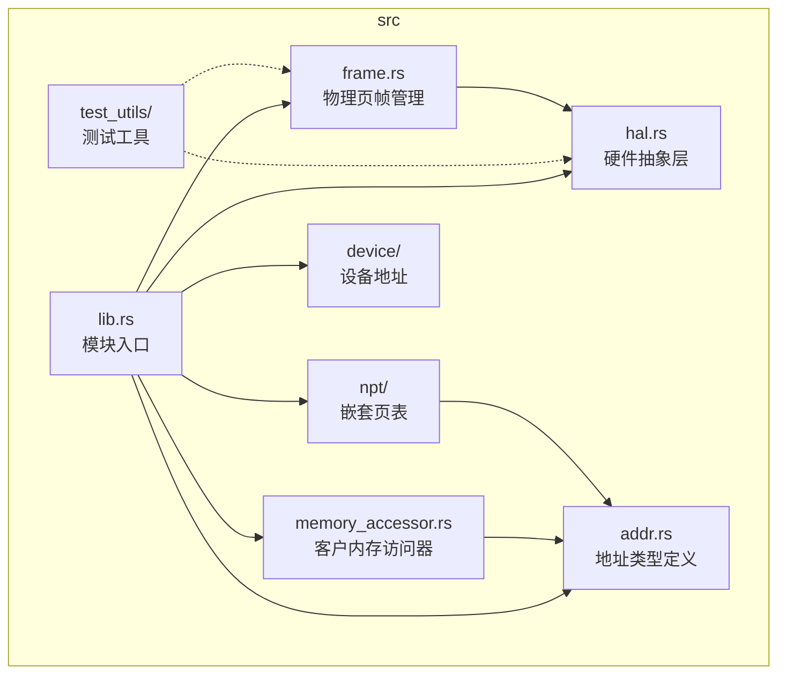
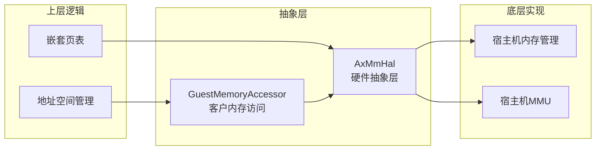
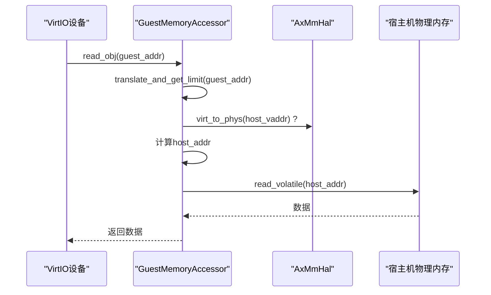
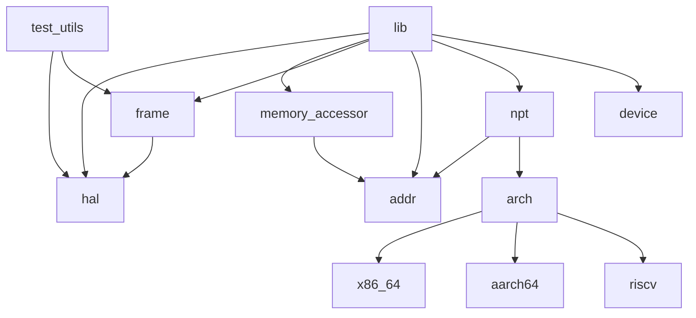

# 硬件抽象层集成

<cite>
**本文档引用的文件**  
- [hal.rs](file://src/hal.rs)
- [memory_accessor.rs](file://src/memory_accessor.rs)
- [frame.rs](file://src/frame.rs)
- [lib.rs](file://src/lib.rs)
- [test_utils/mod.rs](file://src/test_utils/mod.rs)
</cite>

## 目录
1. [简介](#简介)
2. [项目结构](#项目结构)
3. [核心组件](#核心组件)
4. [架构概述](#架构概述)
5. [详细组件分析](#详细组件分析)
6. [依赖分析](#依赖分析)
7. [性能考虑](#性能考虑)
8. [故障排除指南](#故障排除指南)
9. [结论](#结论)

## 简介
本文档旨在深入解析 `axaddrspace` 模块中的硬件抽象层（HAL）设计与实现，重点阐述 `AxMmHal` trait 的设计目标、实现要求及其在系统可移植性中的关键作用。该模块为 ArceOS-Hypervisor 提供了虚拟机地址空间管理功能，通过 `AxMmHal` 和 `GuestMemoryAccessor` 两个核心 trait，实现了底层硬件操作与上层地址空间管理逻辑的解耦。文档将详细说明物理内存分配、地址转换、页表管理等底层操作的抽象方式，并提供实现自定义 HAL 的指导原则。

## 项目结构
`axaddrspace` 模块采用清晰的分层结构，将地址空间管理、设备地址、嵌套页表（NPT）和硬件抽象层等功能模块化。



**Diagram sources**
- [lib.rs](file://src/lib.rs#L1-L48)
- [hal.rs](file://src/hal.rs#L1-L39)
- [memory_accessor.rs](file://src/memory_accessor.rs#L1-L449)
- [frame.rs](file://src/frame.rs#L1-L163)

**Section sources**
- [lib.rs](file://src/lib.rs#L1-L48)
- [hal.rs](file://src/hal.rs#L1-L39)

## 核心组件
本模块的核心在于 `AxMmHal` 和 `GuestMemoryAccessor` 两个 trait。`AxMmHal` 定义了与具体硬件平台相关的内存管理操作，如物理页帧的分配与释放、物理地址与虚拟地址的相互转换。`GuestMemoryAccessor` 则提供了一个安全、统一的接口，用于访问客户机（Guest）的内存空间，处理地址转换和内存安全问题。`PhysFrame` 结构体利用 `AxMmHal` 实现了物理页帧的自动分配和释放（RAII），确保了内存安全。

**Section sources**
- [hal.rs](file://src/hal.rs#L1-L39)
- [memory_accessor.rs](file://src/memory_accessor.rs#L1-L449)
- [frame.rs](file://src/frame.rs#L1-L163)

## 架构概述
该模块的架构设计遵循了清晰的职责分离原则。上层的地址空间管理逻辑（如 `address_space` 模块）和嵌套页表（`npt`）不直接与硬件交互，而是通过 `AxMmHal` trait 间接调用底层硬件操作。这使得上层逻辑可以独立于具体的硬件平台进行开发和测试。`GuestMemoryAccessor` 作为客户机内存访问的统一入口，封装了复杂的地址转换逻辑，为 VirtIO 设备等组件提供了安全、便捷的内存访问方式。



**Diagram sources**
- [hal.rs](file://src/hal.rs#L1-L39)
- [memory_accessor.rs](file://src/memory_accessor.rs#L1-L449)
- [lib.rs](file://src/lib.rs#L1-L48)

## 详细组件分析

### AxMmHal 特性分析
`AxMmHal` 是硬件抽象层的核心，它定义了四个静态方法，将底层硬件相关的内存操作抽象为一个统一的接口。

```mermaid
classDiagram
class AxMmHal {
<<trait>>
+alloc_frame() Option~HostPhysAddr~
+dealloc_frame(paddr : HostPhysAddr) void
+phys_to_virt(paddr : HostPhysAddr) HostVirtAddr
+virt_to_phys(vaddr : HostVirtAddr) HostPhysAddr
}
class PhysFrame~H~ {
-start_paddr : Option~HostPhysAddr~
-_marker : PhantomData~H~
+alloc() AxResult~Self~
+alloc_zero() AxResult~Self~
+start_paddr() HostPhysAddr
+as_mut_ptr() *mut u8
+fill(byte : u8) void
}
class MockHal {
+mock_alloc_frame() Option~PhysAddr~
+mock_dealloc_frame(paddr : PhysAddr) void
+mock_phys_to_virt(paddr : PhysAddr) VirtAddr
+mock_virt_to_phys(vaddr : VirtAddr) PhysAddr
}
PhysFrame~H~ --> AxMmHal : "H : AxMmHal"
MockHal --> AxMmHal : "实现"
```

**Diagram sources**
- [hal.rs](file://src/hal.rs#L1-L39)
- [frame.rs](file://src/frame.rs#L1-L163)
- [test_utils/mod.rs](file://src/test_utils/mod.rs#L1-L170)

#### 设计目的与实现要求
`AxMmHal` 的设计目的是实现地址空间管理与具体硬件操作的解耦。通过定义这个 trait，上层代码（如 `PhysFrame::alloc()`）可以编写为泛型代码，不依赖于任何特定的硬件平台。当需要为新平台（如 x86_64, aarch64, riscv）移植时，开发者只需为该平台提供 `AxMmHal` 的具体实现，而无需修改上层的地址空间管理逻辑，极大地提高了代码的可移植性。

**Section sources**
- [hal.rs](file://src/hal.rs#L1-L39)
- [frame.rs](file://src/frame.rs#L1-L163)

#### 物理内存分配与管理
`AxMmHal` 抽象了物理内存的基本操作：
- `alloc_frame()`：分配一个物理页帧，返回其物理地址。返回 `Option` 类型以处理内存不足的情况。
- `dealloc_frame(paddr)`：释放一个物理页帧。
- `phys_to_virt(paddr)` 和 `virt_to_phys(vaddr)`：实现物理地址与虚拟地址之间的相互转换，这是访问物理内存内容所必需的。

`PhysFrame<H>` 结构体是 `AxMmHal` 的典型应用。它在 `alloc()` 方法中调用 `H::alloc_frame()` 来获取物理地址，并在其实现的 `Drop` trait 中自动调用 `H::dealloc_frame()` 进行释放，完美地利用了 Rust 的所有权机制来防止内存泄漏。

**Section sources**
- [hal.rs](file://src/hal.rs#L1-L39)
- [frame.rs](file://src/frame.rs#L1-L163)

### GuestMemoryAccessor 特性分析
`GuestMemoryAccessor` trait 为安全访问客户机内存提供了统一的接口。



**Diagram sources**
- [memory_accessor.rs](file://src/memory_accessor.rs#L1-L449)
- [hal.rs](file://src/hal.rs#L1-L39)

#### 作用机制
该 trait 的核心是 `translate_and_get_limit()` 方法，它负责将客户机物理地址（GPA）转换为宿主机物理地址（HPA），并返回该地址起始的可访问内存大小。其他所有读写方法（如 `read_obj`, `write_buffer`）都基于此方法构建。

其作用机制如下：
1.  **地址转换**：`translate_and_get_limit()` 执行从 GPA 到 HPA 的映射。这个映射逻辑由具体的 `GuestMemoryAccessor` 实现决定，通常涉及查询嵌套页表（NPT）或直接映射。
2.  **边界检查**：返回的 `accessible_size` 至关重要。在执行任何读写操作前，`read_obj` 和 `write_obj` 会检查待操作的数据大小是否小于 `accessible_size`，从而防止越界访问。
3.  **安全访问**：实际的内存读写通过 `core::ptr::read_volatile` 和 `core::ptr::write_volatile` 进行，确保操作不会被编译器优化，并能正确处理设备寄存器等特殊内存。

**Section sources**
- [memory_accessor.rs](file://src/memory_accessor.rs#L1-L449)

#### 复杂内存访问处理
`GuestMemoryAccessor` 的设计考虑了复杂的内存访问场景：
- **跨区域访问**：`read_buffer` 和 `write_buffer` 方法能够处理跨越多个可访问区域的缓冲区。它们通过循环调用 `translate_and_get_limit()`，分段地完成读写操作，确保了即使数据跨越了内存映射的边界，也能被正确处理。
- **零大小缓冲区**：对空缓冲区的读写操作被明确处理，直接返回成功，避免了不必要的错误。

**Section sources**
- [memory_accessor.rs](file://src/memory_accessor.rs#L1-L449)

## 依赖分析
该模块的依赖关系清晰，体现了良好的模块化设计。



**Diagram sources**
- [lib.rs](file://src/lib.rs#L1-L48)
- [npt/mod.rs](file://src/npt/mod.rs#L1-L14)

`axaddrspace` 模块本身依赖于 `axerrno`、`memory_addr` 和 `page_table_multiarch` 等外部 crate。模块内部，`frame` 模块依赖 `hal` 模块，`npt` 和 `memory_accessor` 模块依赖 `addr` 模块。`test_utils` 模块为 `hal` 和 `frame` 提供了 `MockHal` 等测试工具，实现了对硬件依赖的模拟。

**Section sources**
- [lib.rs](file://src/lib.rs#L1-L48)
- [npt/mod.rs](file://src/npt/mod.rs#L1-L14)
- [test_utils/mod.rs](file://src/test_utils/mod.rs#L1-L170)

## 性能考虑
虽然文档未直接讨论性能，但从代码设计中可以推断出一些性能考量：
- **零成本抽象**：`AxMmHal` 和 `GuestMemoryAccessor` 是 trait，其方法在编译时通常会被内联，避免了动态分发的开销，实现了零成本抽象。
- **批量操作优化**：`read_buffer` 和 `write_buffer` 使用 `core::ptr::copy_nonoverlapping` 进行内存拷贝，这是经过高度优化的函数，比逐字节操作效率更高。
- **TLB 刷新**：在 `addr.rs` 中，为 RISC-V 架构实现了 `flush_tlb` 方法，通过内联汇编直接调用 `hfence.vvma` 指令刷新 TLB，这是对性能敏感操作的直接控制。

## 故障排除指南
`test_utils` 模块提供了强大的测试支持，是故障排除的重要工具。
- **MockHal**：`MockHal` 提供了一个可预测的、无硬件依赖的 `AxMmHal` 实现，用于单元测试。它通过静态变量（如 `NEXT_PADDR`, `ALLOC_COUNT`）模拟内存分配状态。
- **错误注入**：`ALLOC_SHOULD_FAIL` 标志允许测试内存分配失败的场景，验证上层逻辑（如 `PhysFrame::alloc()`）是否能正确处理 `NoMemory` 错误。
- **状态隔离**：`TEST_MUTEX` 和 `reset_state()` 确保了每个测试用例都在一个干净的环境中运行，避免了测试间的相互干扰。

**Section sources**
- [test_utils/mod.rs](file://src/test_utils/mod.rs#L1-L170)
- [frame.rs](file://src/frame.rs#L1-L163)

## 结论
`axaddrspace` 模块通过精心设计的 `AxMmHal` 和 `GuestMemoryAccessor` trait，成功地将地址空间管理的通用逻辑与特定硬件平台的操作解耦。这种设计不仅保证了代码的可移植性，使其能够轻松适配 x86_64、aarch64 和 riscv 等不同架构，还通过 RAII 和边界检查等机制确保了内存安全。`PhysFrame` 对 `Drop` trait 的实现和 `GuestMemoryAccessor` 对跨区域访问的支持，都体现了代码的健壮性和实用性。该模块为构建一个安全、高效、可移植的虚拟机监控器（Hypervisor）奠定了坚实的基础。