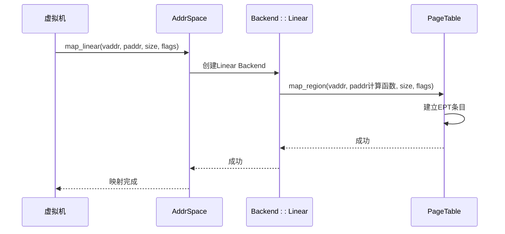
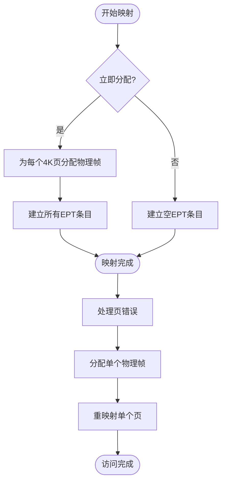

# 设备地址管理

<cite>
**本文档引用的文件**  
- [device_addr.rs](file://src/device/device_addr.rs)
- [mod.rs](file://src/device/mod.rs)
- [address_space/mod.rs](file://src/address_space/mod.rs)
- [backend/mod.rs](file://src/address_space/backend/mod.rs)
- [backend/alloc.rs](file://src/address_space/backend/alloc.rs)
- [backend/linear.rs](file://src/address_space/backend/linear.rs)
- [addr.rs](file://src/addr.rs)
- [npt/arch/x86_64.rs](file://src/npt/arch/x86_64.rs)
</cite>

## 目录
1. [引言](#引言)
2. [设备地址类型设计](#设备地址类型设计)
3. [设备内存映射特性](#设备内存映射特性)
4. [地址分配与映射流程](#地址分配与映射流程)
5. [PCI设备内存映射示例](#pci设备内存映射示例)
6. [与地址空间主模块的协同](#与地址空间主模块的协同)
7. [安全性保障机制](#安全性保障机制)
8. [总结](#总结)

## 引言

在虚拟化环境中，客户虚拟机需要访问物理设备的内存区域，这些区域通常具有特殊的访问属性和映射需求。本模块旨在为设备内存提供安全、高效的地址管理机制，支持I/O内存、系统寄存器和端口地址等多种设备访问方式。通过抽象化的`DeviceAddr`和`DeviceAddrRange`接口，系统能够统一处理不同类型的设备地址空间。

**Section sources**
- [device_addr.rs](file://src/device/device_addr.rs#L1-L97)
- [mod.rs](file://src/device/mod.rs#L1-L132)

## 设备地址类型设计

### DeviceAddr 特质

`DeviceAddr`是一个标记特质（trait），用于标识可作为设备访问地址的类型。它要求实现`Copy`、`Eq`、`Ord`和`Debug`，确保地址可以被安全复制、比较和调试输出。该特质本身不包含方法，仅作为类型约束使用。

### DeviceAddrRange 特质

`DeviceAddrRange`定义了设备地址范围的行为，核心方法是`contains`，用于判断某个地址是否落在该范围内。不同设备类型实现了各自的范围结构体：

- `AddrRange<GuestPhysAddr>`：基于通用地址范围，适用于连续的设备内存区域。
- `SysRegAddrRange`：用于系统寄存器地址范围，区间为闭区间（包含端点）。
- `PortRange`：用于I/O端口地址范围，同样为闭区间。

### 具体地址类型

#### GuestPhysAddr
客户机物理地址，通过`impl DeviceAddr for GuestPhysAddr`成为设备地址的一种。常用于映射设备内存区域到客户机地址空间。

#### SysRegAddr
系统寄存器地址，封装`usize`类型，支持跨架构通用性。其范围`SysRegAddrRange`支持包含性比较。

#### Port
I/O端口地址，封装`u16`类型，符合x86架构的端口寻址规范。`PortRange`用于表示端口区间的包含关系。

**Section sources**
- [device_addr.rs](file://src/device/device_addr.rs#L1-L97)
- [mod.rs](file://src/device/mod.rs#L50-L132)

## 设备内存映射特性

### I/O内存特性

设备内存与普通内存的关键区别在于其访问语义。I/O内存通常具有以下特性：

- **非缓存性**：访问必须绕过CPU缓存，确保每次读写都直达设备。
- **副作用访问**：读写操作可能触发设备状态变化，不能被优化或重排。
- **特定内存类型**：在x86 EPT中通过`EPTMemType::Uncached`标记为设备内存。

### 访问权限控制

设备内存的访问权限由`MappingFlags`控制，包括：
- `READ`：允许读取
- `WRITE`：允许写入
- `EXECUTE`：允许执行（通常设备内存不可执行）
- `DEVICE`：标记为设备内存，影响缓存策略

在x86架构中，`DEVICE`标志映射为EPT条目的内存类型为Uncached，确保强序访问。

### 缓存策略

设备内存采用非缓存（Uncached）策略，通过EPT条目的内存类型字段设置。这保证了：
- 所有访问都直达物理设备
- 写操作立即生效，无延迟
- 读操作获取最新设备状态
- 避免缓存一致性问题

```mermaid
erDiagram
EPTEntry {
u64 raw
HostPhysAddr hpaddr
MappingFlags flags
Result<EPTMemType> mem_type
}
EPTFlags {
bool READ
bool WRITE
bool EXECUTE
EPTMemType MEM_TYPE
bool HUGE_PAGE
bool ACCESSED
bool DIRTY
}
EPTMemType {
Uncached
WriteCombining
WriteThrough
WriteProtected
WriteBack
}
EPTEntry }o--|| EPTFlags : "flags"
EPTFlags }o--|| EPTMemType : "mem_type"
```

**Diagram sources**
- [npt/arch/x86_64.rs](file://src/npt/arch/x86_64.rs#L1-L190)

**Section sources**
- [npt/arch/x86_64.rs](file://src/npt/arch/x86_64.rs#L1-L190)
- [device_addr.rs](file://src/device/device_addr.rs#L1-L97)

## 地址分配与映射流程

### 映射流程

设备地址的映射通过`AddrSpace`模块完成，主要流程如下：

1. **创建地址空间**：调用`AddrSpace::new_empty`初始化客户机地址空间。
2. **准备映射参数**：确定虚拟地址`start_vaddr`、物理地址`start_paddr`、大小`size`和权限`flags`。
3. **执行映射**：调用`map_linear`或`map_alloc`方法建立映射关系。

### 线性映射 (Linear Mapping)

线性映射用于已知物理地址的设备内存，如PCI BAR映射。其特点是虚拟地址与物理地址保持固定偏移。



**Diagram sources**
- [address_space/mod.rs](file://src/address_space/mod.rs#L1-L588)
- [backend/linear.rs](file://src/address_space/backend/linear.rs#L1-L51)

### 分配映射 (Allocation Mapping)

分配映射用于动态分配的设备内存，支持立即分配（populate=true）或延迟分配（populate=false）。



**Diagram sources**
- [backend/alloc.rs](file://src/address_space/backend/alloc.rs#L1-L97)
- [address_space/mod.rs](file://src/address_space/mod.rs#L1-L588)

### 释放流程

调用`unmap`方法可释放设备内存映射：
- 线性映射：直接解除EPT条目
- 分配映射：解除EPT条目并释放物理帧

**Section sources**
- [address_space/mod.rs](file://src/address_space/mod.rs#L1-L588)
- [backend/mod.rs](file://src/address_space/backend/mod.rs#L1-L110)

## PCI设备内存映射示例

### 映射PCI BAR

PCI设备通过基地址寄存器（BAR）暴露内存区域。映射流程如下：

1. 读取PCI配置空间获取BAR物理地址
2. 在客户机地址空间选择合适的虚拟地址
3. 调用`map_linear`建立映射
4. 设置`DEVICE`标志确保非缓存访问

```rust
// 示例代码路径
[SPEC SYMBOL](file://src/address_space/mod.rs#L150-L170)
```

### 访问设备寄存器

通过映射后的虚拟地址访问设备寄存器：

```rust
// 示例代码路径
[SPEC SYMBOL](file://src/device/device_addr.rs#L1-L97)
```

**Section sources**
- [address_space/mod.rs](file://src/address_space/mod.rs#L150-L170)
- [device_addr.rs](file://src/device/device_addr.rs#L1-L97)

## 与地址空间主模块的协同

### AddrSpace 结构

`AddrSpace`是地址管理的核心结构，包含：
- `va_range`：虚拟地址范围
- `areas`：内存区域集合
- `pt`：嵌套页表（NPT）

```mermaid
classDiagram
class AddrSpace {
+va_range : GuestPhysAddrRange
+areas : MemorySet~Backend~
+pt : PageTable~H~
+map_linear()
+map_alloc()
+unmap()
+translate()
}
class Backend {
<<enum>>
+Linear{pa_va_offset}
+Alloc{populate}
}
class MemorySet {
+map()
+unmap()
+find()
}
class PageTable {
+map_region()
+unmap_region()
+query()
+protect_region()
}
AddrSpace --> Backend : 使用
AddrSpace --> MemorySet : 包含
AddrSpace --> PageTable : 包含
MemorySet --> Backend : 映射后端
```

**Diagram sources**
- [address_space/mod.rs](file://src/address_space/mod.rs#L1-L588)
- [backend/mod.rs](file://src/address_space/backend/mod.rs#L1-L110)

### 后端抽象

`Backend`枚举统一了线性映射和分配映射，通过`MappingBackend` trait与`MemorySet`交互，实现了映射策略的解耦。

**Section sources**
- [address_space/mod.rs](file://src/address_space/mod.rs#L1-L588)
- [backend/mod.rs](file://src/address_space/backend/mod.rs#L1-L110)

## 安全性保障机制

### 越界访问防护

- **地址范围检查**：`contains_range`验证映射是否在地址空间内
- **对齐检查**：确保4K对齐，防止跨页错误
- **权限验证**：`handle_page_fault`检查访问权限

### 冲突避免

- **唯一映射**：页表确保同一地址不被重复映射
- **状态检查**：`MappingError::AlreadyExists`防止覆盖
- **资源释放**：`Drop`实现确保地址空间销毁时清理所有映射

### 错误处理

通过`AxResult`和`AxError`统一错误处理：
- `InvalidInput`：参数无效
- `NoMemory`：内存不足
- `BadState`：状态错误

**Section sources**
- [address_space/mod.rs](file://src/address_space/mod.rs#L1-L588)
- [lib.rs](file://src/lib.rs#L1-L48)

## 总结

本模块通过`DeviceAddr`系列类型和`AddrSpace`管理机制，为虚拟机提供了安全、灵活的设备内存访问能力。线性映射适用于已知物理地址的设备，分配映射支持动态内存需求。通过EPT的设备内存类型标记，确保了I/O内存的正确访问语义。完整的映射、访问和释放流程，配合严格的边界检查和错误处理，有效防止了越界和冲突问题，为设备虚拟化提供了坚实的基础。