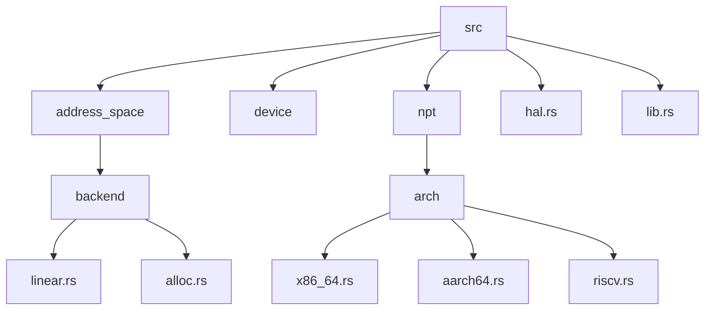
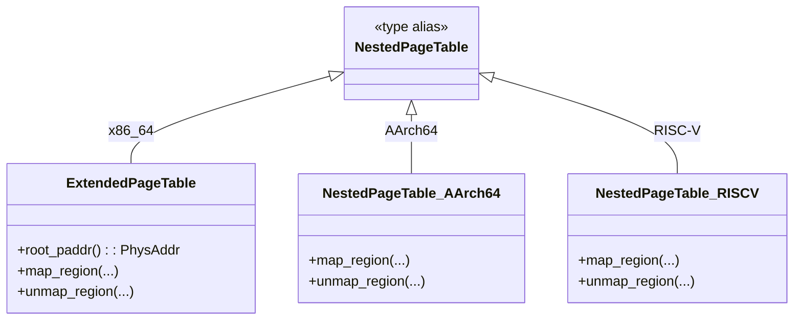

# 项目概述

<cite>
**本文档引用的文件**
- [README.md](file://README.md)
- [Cargo.toml](file://Cargo.toml)
- [src/lib.rs](file://src/lib.rs)
- [src/address_space/mod.rs](file://src/address_space/mod.rs)
- [src/address_space/backend/mod.rs](file://src/address_space/backend/mod.rs)
- [src/address_space/backend/linear.rs](file://src/address_space/backend/linear.rs)
- [src/address_space/backend/alloc.rs](file://src/address_space/backend/alloc.rs)
- [src/npt/mod.rs](file://src/npt/mod.rs)
- [src/npt/arch/mod.rs](file://src/npt/arch/mod.rs)
- [src/hal.rs](file://src/hal.rs)
</cite>

## 目录
1. [简介](#简介)
2. [项目结构](#项目结构)
3. [核心功能与设计目标](#核心功能与设计目标)
4. [系统架构与多架构支持](#系统架构与多架构支持)
5. [主要组件分析](#主要组件分析)
6. [内存映射后端机制](#内存映射后端机制)
7. [硬件抽象层集成](#硬件抽象层集成)
8. [典型应用场景](#典型应用场景)
9. [技术优势与使用价值](#技术优势与使用价值)

## 简介

`axaddrspace` 是 ArceOS-Hypervisor 项目中的核心模块，专为虚拟机客户机提供地址空间管理能力。该项目实现了嵌套页表机制和地址转换功能，适用于多种处理器架构（包括 x86_64、AArch64 和 RISC-V），并可在 no-std 环境下运行，适合裸机 Hypervisor 场景。

该库通过统一接口管理客户机虚拟地址空间，支持线性映射和动态分配两种内存映射模式，具备完整的页错误处理机制，并通过 `AxMmHal` trait 与硬件抽象层无缝集成。作为 ArceOS 生态系统的一部分，`axaddrspace` 在虚拟化内存管理中扮演关键角色，为构建安全、高效的虚拟化环境提供了基础支持。

**Section sources**
- [README.md](file://README.md#L1-L20)
- [src/lib.rs](file://src/lib.rs#L1-L10)

## 项目结构

`axaddrspace` 的目录结构清晰地反映了其模块化设计：

```
src/
├── address_space/       # 地址空间核心管理逻辑
│   ├── backend/         # 内存映射后端实现
│   └── mod.rs           # AddrSpace 主结构定义
├── device/              # 设备地址管理
├── npt/                 # 嵌套页表（Nested Page Tables）
│   └── arch/            # 架构特定实现
├── hal.rs               # 硬件抽象层接口定义
├── lib.rs               # 库入口与公共接口导出
└── ...
```

这种分层结构将地址空间管理、页表操作、硬件交互等职责分离，提升了代码可维护性和扩展性。



**Diagram sources**
- [src/address_space/mod.rs](file://src/address_space/mod.rs#L1-L50)
- [src/npt/arch/mod.rs](file://src/npt/arch/mod.rs#L1-L15)

**Section sources**
- [src/address_space/mod.rs](file://src/address_space/mod.rs#L1-L50)
- [src/npt/arch/mod.rs](file://src/npt/arch/mod.rs#L1-L15)

## 核心功能与设计目标

`axaddrspace` 的设计目标是为 Hypervisor 环境提供一个高效、灵活且可移植的客户机地址空间管理方案。其核心功能包括：

- **多架构支持**：兼容 x86_64（VMX EPT）、AArch64（Stage 2 页表）和 RISC-V（嵌套页表）。
- **灵活的内存映射**：支持线性映射（适用于已知物理地址的连续内存）和动态分配映射（支持延迟加载）。
- **嵌套页错误处理**：能够捕获并处理客户机引发的页错误，实现按需内存分配。
- **硬件抽象层解耦**：通过 `AxMmHal` trait 实现与底层硬件操作的解耦，便于跨平台移植。
- **no-std 兼容性**：不依赖标准库，适用于资源受限的裸机 Hypervisor 环境。

这些设计使得 `axaddrspace` 能够在不同硬件平台上提供一致的地址空间管理接口，同时保持高性能和低开销。

**Section sources**
- [README.md](file://README.md#L25-L60)
- [Cargo.toml](file://Cargo.toml#L1-L10)

## 系统架构与多架构支持

`axaddrspace` 采用条件编译机制实现对多种架构的支持。其核心是 `NestedPageTable` 类型，根据目标架构的不同，实际类型会指向相应的架构特定实现：

```rust
cfg_if::cfg_if! {
    if #[cfg(target_arch = "x86_64")] {
        pub type NestedPageTable<H> = arch::ExtendedPageTable<H>;
    } else if #[cfg(any(target_arch = "riscv32", target_arch = "riscv64"))] {
        pub type NestedPageTable<H> = arch::NestedPageTable<H>;
    } else if #[cfg(target_arch = "aarch64")] {
        pub type NestedPageTable<H> = arch::NestedPageTable<H>;
    }
}
```

各架构支持特性如下：

| 架构 | 关键技术 | 特性支持 |
|------|--------|---------|
| x86_64 | VMX 扩展页表 (EPT) | 写回/非缓存内存类型、用户态执行权限 |
| AArch64 | VMSAv8-64 Stage 2 页表 | MAIR_EL2 属性配置、EL2 特权级支持 |
| RISC-V | 嵌套页表 (Sv39) | `hfence.vvma` 指令、元数据支持 |

这种架构抽象机制确保了上层逻辑的统一性，同时允许底层实现充分利用各架构的硬件特性。



**Diagram sources**
- [src/npt/mod.rs](file://src/npt/mod.rs#L1-L15)
- [src/npt/arch/mod.rs](file://src/npt/arch/mod.rs#L1-L15)

**Section sources**
- [src/npt/mod.rs](file://src/npt/mod.rs#L1-L15)
- [src/npt/arch/mod.rs](file://src/npt/arch/mod.rs#L1-L15)

## 主要组件分析

### AddrSpace 结构

`AddrSpace` 是地址空间管理的核心结构，封装了虚拟地址范围、内存区域集合和页表实例：

```rust
pub struct AddrSpace<H: PagingHandler> {
    va_range: GuestPhysAddrRange,
    areas: MemorySet<Backend<H>>,
    pt: PageTable<H>,
}
```

它提供了以下关键方法：
- `new_empty()`：创建空地址空间
- `map_linear()`：建立线性映射
- `map_alloc()`：建立动态分配映射
- `handle_page_fault()`：处理嵌套页错误
- `translate()`：虚拟地址到物理地址的查询

该结构通过泛型参数 `H: PagingHandler` 绑定具体的页表操作实现，实现了与硬件操作的解耦。

**Section sources**
- [src/address_space/mod.rs](file://src/address_space/mod.rs#L15-L50)

### 内存区域管理

`AddrSpace` 使用 `MemorySet<Backend<H>>` 来组织多个内存区域（`MemoryArea`），每个区域关联一个后端策略（线性或分配）。这种设计支持在同一地址空间内混合使用不同类型的映射。

## 内存映射后端机制

`axaddrspace` 提供两种内存映射后端，通过 `Backend` 枚举统一管理：

```mermaid
classDiagram
class Backend {
<<enum>>
+Linear{pa_va_offset}
+Alloc{populate}
}
class MappingBackend {
<<trait>>
+map()
+unmap()
+protect()
}
Backend ..|> MappingBackend : 实现
class AddrSpace {
-areas : MemorySet<Backend<H>>
}
AddrSpace --> Backend : 使用
```

**Diagram sources**
- [src/address_space/backend/mod.rs](file://src/address_space/backend/mod.rs#L1-L30)

### 线性映射后端

线性映射适用于物理地址已知的连续内存区域，如设备内存或预分配的 RAM 区域。其核心是恒定的虚实地址偏移量：

```rust
pub const fn new_linear(pa_va_offset: usize) -> Self {
    Self::Linear { pa_va_offset }
}
```

映射时，虚拟地址 `vaddr` 被直接转换为 `vaddr - pa_va_offset` 的物理地址。此类映射不会触发页错误。

**Section sources**
- [src/address_space/backend/linear.rs](file://src/address_space/backend/linear.rs#L1-L10)

### 动态分配后端

动态分配后端支持两种模式：
- **立即分配**（`populate = true`）：创建映射时即分配所有物理页帧。
- **延迟分配**（`populate = false`）：仅建立页表项，物理页帧在发生页错误时按需分配。

该机制通过 `handle_page_fault_alloc` 实现懒加载，显著提升内存使用效率。

**Section sources**
- [src/address_space/backend/alloc.rs](file://src/address_space/backend/alloc.rs#L1-L20)

## 硬件抽象层集成

`axaddrspace` 通过 `AxMmHal` trait 与硬件抽象层交互，定义了四个核心操作：

```rust
pub trait AxMmHal {
    fn alloc_frame() -> Option<HostPhysAddr>;
    fn dealloc_frame(paddr: HostPhysAddr);
    fn phys_to_virt(paddr: HostPhysAddr) -> HostVirtAddr;
    fn virt_to_phys(vaddr: HostVirtAddr) -> HostPhysAddr;
}
```

此设计实现了内存管理逻辑与平台相关操作的完全解耦。开发者只需为特定平台实现该 trait，即可使 `axaddrspace` 在该平台上运行，极大增强了库的可移植性。

**Section sources**
- [src/hal.rs](file://src/hal.rs#L1-L40)

## 典型应用场景

### 创建客户机地址空间

```rust
let mut addr_space = AddrSpace::<YourHal>::new_empty(
    GuestPhysAddr::from(0x1000_0000),
    0x1000_0000,
)?;
```

### 建立线性映射（如设备内存）

```rust
addr_space.map_linear(
    GuestPhysAddr::from(0x1000_0000),
    PhysAddr::from(0x8000_0000),
    0x10_0000,
    MappingFlags::READ | MappingFlags::WRITE,
)?;
```

### 动态内存分配（支持延迟加载）

```rust
addr_space.map_alloc(
    GuestPhysAddr::from(0x2000_0000),
    0x20_0000,
    MappingFlags::READ | MappingFlags::WRITE,
    false, // 延迟分配
)?;
```

### 处理嵌套页错误

```rust
let fault_handled = addr_space.handle_page_fault(
    fault_addr,
    access_flags,
);
```

这些操作构成了虚拟机内存管理的基本流程。

**Section sources**
- [README.md](file://README.md#L100-L130)

## 技术优势与使用价值

`axaddrspace` 在虚拟化内存管理中具有显著优势：

1. **跨平台一致性**：统一 API 支持多架构，降低开发复杂度。
2. **高性能**：直接操作硬件页表，避免中间层开销。
3. **内存效率**：支持延迟分配，减少初始内存占用。
4. **模块化设计**：清晰的职责划分，易于维护和扩展。
5. **生态集成**：作为 ArceOS-Hypervisor 的核心组件，与整个生态系统无缝协作。

对于初学者，`axaddrspace` 提供了直观的地址空间管理接口；对于高级开发者，其灵活的后端机制和硬件抽象层支持为深度定制提供了可能。该项目不仅是一个功能库，更是构建现代虚拟化系统的重要基石。

**Section sources**
- [README.md](file://README.md#L1-L140)
- [Cargo.toml](file://Cargo.toml#L1-L45)